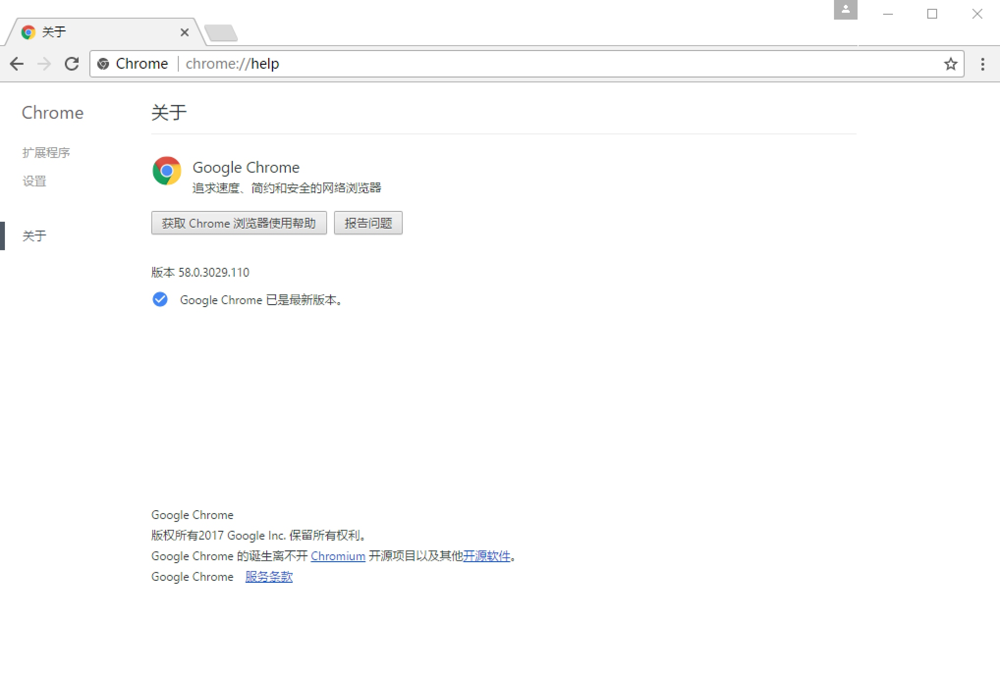

## 1.2.3 ChromeDriver的安装

在上节我们成功安装好了Selenium库，但是它是一个自动化测试工具，需要浏览器来配合它使用，那么本节我们就介绍一下Chrome浏览器及ChromeDriver驱动的配置。

首先需要下载一个Chrome浏览器，方法多样，在此不再赘述。

随后我们需要安装一个ChromeDriver才能驱动Chrome浏览器完成相应的操作，下面我们来介绍下怎样安装ChromeDriver。

### 1. 相关链接

* 官方网站：[https://sites.google.com/a/chromium.org/chromedriver](https://sites.google.com/a/chromium.org/chromedriver)
* 下载地址：[https://chromedriver.storage.googleapis.com/index.html](https://chromedriver.storage.googleapis.com/index.html)

### 2. 准备工作

在这之前请确保已经正确安装好了Chrome浏览器并可以正常运行，安装过程不再赘述。

### 3. 查看版本

点击Chrome的菜单，帮助->关于Chrome，即可查看Chrome的版本号，如图所示：



在这里我的版本是58.0。

请记住Chrome版本号，在后面选择ChromeDriver版本时需要用到。

### 4. 下载ChromeDriver

打开ChromeDriver的官方网站，链接为：[https://sites.google.com/a/chromium.org/chromedriver/downloads](https://sites.google.com/a/chromium.org/chromedriver/downloads)。可以看到到目前为止最新版本为2.31，其支持的Chrome浏览器版本为58-60，最新版本以官网为准。


如果你的Chrome版本号是58-60，那么可以选择此版本下载。

如果版本不在此范围，那可以继续查看之前的ChromeDriver版本，每个版本都有相应的支持Chrome版本介绍，请找好自己的Chrome浏览器版本对应的ChromeDriver版本再下载，否则可能导致无法正常工作。

找好对应的版本号后随后到ChromeDriver镜像站下载对应的安装包即可：[https://chromedriver.storage.googleapis.com/index.html](https://chromedriver.storage.googleapis.com/index.html)，不同平台可以下载不同的安装包。

### 5. 环境变量配置

下载完成后将ChromeDriver的可执行文件配置到环境变量下。

在Windows下，建议直接将chromedriver.exe文件拖到Python的Scripts目录下，如图所示：


也可以单独将其所在路径配置到环境变量，环境变量的配置方法请参见Python3的安装一节。

在Linux、Mac下，需要将可执行文件配置到环境变量或将文件移动到属于环境变量的目录里。

例如移动文件到/usr/bin目录，首先命令行进入其所在路径，然后将其移动到/usr/bin：

```
sudo mv chromedriver /usr/bin
```

当然也可以将ChromeDriver配置到$PATH，首先可以将可执行文件放到某一目录，目录可以任意选择，例如将当前可执行文件放在/usr/local/chromedriver目录下，接下来可以修改~/.profile文件，命令如下：

```
export PATH="$PATH:/usr/local/chromedriver"
```

保存然后执行：

```
source ~/.profile
```

即可完成环境变量的添加。

### 6. 验证安装

配置完成之后，就可以在命令行下直接执行chromedriver命令了。

命令行下输入：

```
chromedriver
```

输入控制台有类似输出：


如果有类似输出则证明ChromeDriver的环境变量配置好了。

随后再在程序中测试，执行如下Python代码：

```python
from selenium import webdriver
browser = webdriver.Chrome()
```

运行之后会弹出一个空白的Chrome浏览器，证明所有的配置都没有问题，如果没有弹出，请检查之前的每一步的配置。

如果弹出之后闪退，则可能是ChromeDriver版本和Chrome版本不简容，请更换ChromeDriver版本。

如果没有问题，接下来我们就可以利用Chrome来做网页抓取了。

### 7. 结语

既然Chrome可以通过Selenium驱动，Firefox也可以，如果想要实现Selenium驱动Firefox浏览器可以参考下一节GeckoDriver的安装。
