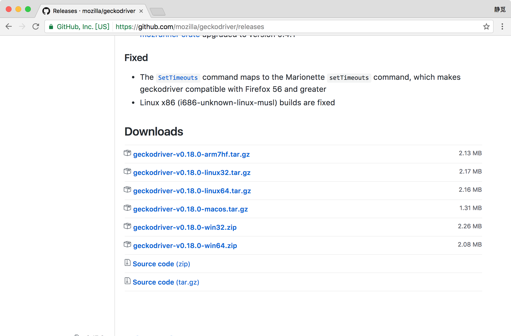
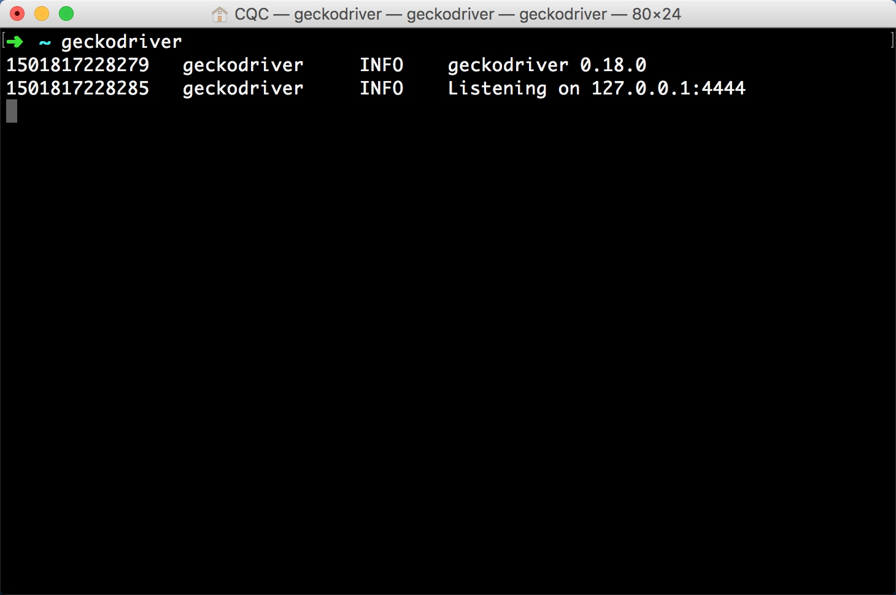

## 1.2.4 GeckoDriver的安装

在上一节我们了解了 ChromeDriver 的配置方法，配置完成之后我们便可以用 Selenium 来驱动 Chrome 浏览器来做相应网页的抓取。

那么对于 Firefox 来说，也可以使用同样的方式完成 Selenium 的对接，这时需要安装另一个驱动 GeckoDriver。

本节来介绍一下 GeckoDriver 的安装过程。

### 1. 相关链接

* GitHub：[https://github.com/mozilla/geckodriver](https://github.com/mozilla/geckodriver)
* 下载地址：[https://github.com/mozilla/geckodriver/releases](https://github.com/mozilla/geckodriver/releases)

### 2. 准备工作

在这之前请确保已经正确安装好了 Firefox 浏览器并可以正常运行，安装过程不再赘述。

### 3. 下载GeckoDriver

我们可以在 GitHub 上找到 GeckoDriver 的发行版本，当前最新版本为 0.18，当然版本可能会有更新，下载链接为：[https://github.com/mozilla/geckodriver/releases](https://github.com/mozilla/geckodriver/releases)。



在这里有不同平台的下载，如 Windows、Mac、Linux、Arm 等平台，我们可以根据自己的系统和位数选择对应的驱动下载，如 Windows64 位就下载 geckodriver-v0.18.0-win64.zip。

### 4. 环境变量配置

在 Windows 下，可以直接将 geckodriver.exe 文件拖到 Python 的 Scripts 目录下，如图所示：


也可以单独将其所在路径配置到环境变量，环境变量的配置方法请参见 Python3 的安装一节。

在 Linux、Mac 下，需要将可执行文件配置到环境变量或将文件移动到属于环境变量的目录里。

例如移动文件到 /usr/bin 目录，首先命令行进入其所在路径，然后将其移动到 /usr/bin：

```
sudo mv geckodriver /usr/bin
```

当然也可以将 GeckoDriver 配置到 $PATH，首先可以将可执行文件放到某一目录，目录可以任意选择，例如将当前可执行文件放在 /usr/local/geckodriver 目录下，接下来可以修改 ~/.profile 文件，命令如下：

```
vi ~/.profile
```

添加如下一句配置：

```
export PATH="$PATH:/usr/local/geckodriver"
```

保存然后执行如下命令即可完成配置：

```
source ~/.profile
```

### 5. 验证安装

配置完成之后，就可以在命令行下直接执行 geckodriver 命令测试。

命令行下输入：

```
geckodriver
```

这时控制台应该有类似输出：



如果有类似输出则证明 GeckoDriver 的环境变量配置好了。

随后再在程序中测试，执行如下 Python 代码：

```python
from selenium import webdriver
browser = webdriver.Firefox()
```

运行之后会弹出一个空白的 Firefox 浏览器，证明所有的配置都没有问题，如果没有弹出，请检查之前的每一步的配置。

如果没有问题，接下来我们就可以利用 Firefox 配合 Selenium 来做网页抓取了。

### 6. 结语

到现在位置我们就可以使用 Chrome 或 Firefox 进行网页抓取了，但是这样可能有个不方便之处，因为程序运行过程中需要一直开着浏览器，在爬取网页的过程中浏览器可能一直动来动去，着实不方便。目前最新的 Chrome 浏览器版本已经支持了无界面模式，但如果版本较旧就不支持。所以在这里还有另一种方便的选择就是安装一个无界面浏览器 PhantomJS，抓取过程会在后台运行，不会再有窗口出现，这样就方便了很多，所以在下一节我们再了解一下 PhantomJS 的相关安装方法。