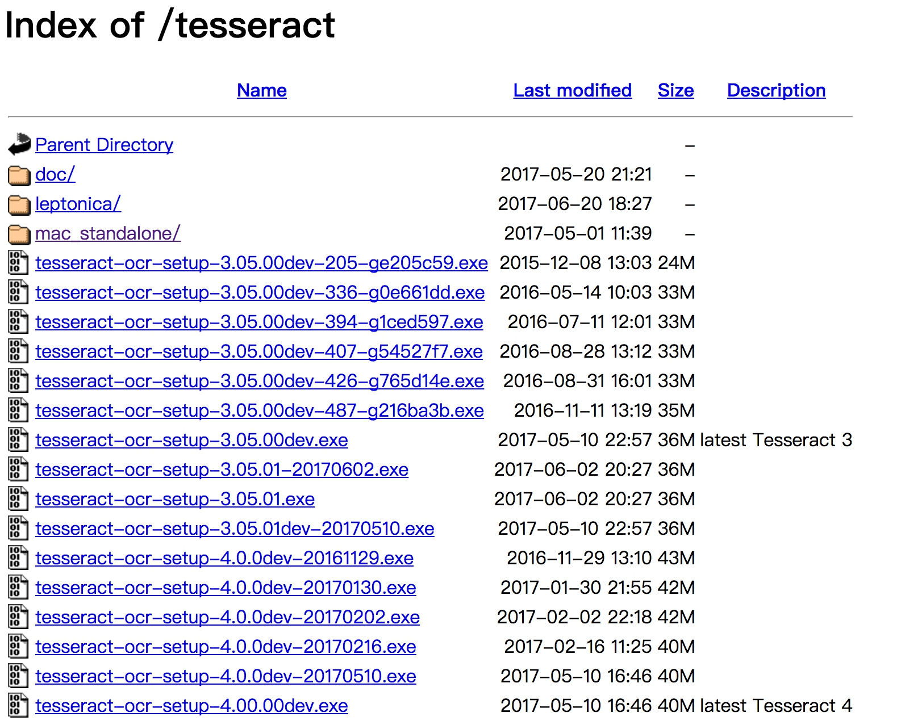

## 1.3.4 Tesserocr的安装

爬虫过程中难免会遇到各种各样的验证码，而大多数验证码还是图形验证码，这时候我们可以直接用 OCR 来识别。

### 1. OCR

OCR，即 Optical Character Recognition，光学字符识别。是指通过扫描字符，然后通过其形状将其翻译成电子文本的过程。那么对于图形验证码来说，它都是一些不规则的字符，但是这些字符确实是由字符稍加扭曲变换得到的内容。

例如这样的验证码：


对于这种验证码，我们便可以使用 OCR 技术来将其转化为电子文本，然后爬虫将识别结果提交给服务器，便可以达到自动识别验证码的过程。

Tesserocr 是 Python 的一个 OCR 识别库，但其实是对 Tesseract 做的一层 Python API 封装，所以它的核心是 Tesseract，所以在安装 Tesserocr 之前我们需要先安装 Tesseract，本节我们来了解下它们的安装方式。

### 2. 相关链接

* Tesserocr GitHub：[https://github.com/sirfz/tesserocr](https://github.com/sirfz/tesserocr)
* Tesserocr PyPi：[https://pypi.python.org/pypi/tesserocr](https://pypi.python.org/pypi/tesserocr)
* Tesseract下载地址：[http://digi.bib.uni-mannheim.de/tesseract](http://digi.bib.uni-mannheim.de/tesseract)
* Tesseract GitHub：[https://github.com/tesseract-ocr/tesseract](https://github.com/tesseract-ocr/tesseract)
* Tesseract 语言包：[https://github.com/tesseract-ocr/tessdata](https://github.com/tesseract-ocr/tessdata)
* Tesseract 文档：[https://github.com/tesseract-ocr/tesseract/wiki/Documentation](https://github.com/tesseract-ocr/tesseract/wiki/Documentation)

### 3. Windows下的安装

在 Windows 下，首先需要下载 Tesseract，它为 Tesserocr 提供了支持，下载链接为：[http://digi.bib.uni-mannheim.de/tesseract/](http://digi.bib.uni-mannheim.de/tesseract/)。

点击进入之后可以看到有各种 exe 的下载列表，在这里可以选择下载 3.0 版本，如图所示为 3.05 版本。



其中文件名中带有 dev 的为开发版本，不带 dev 的为稳定版本，可以选择下载不带 dev 的最新版本，例如可以选择下载 tesseract-ocr-setup-3.05.01.exe。

下载完成之后双击安装即可。


在安装过程中可以勾选上 Additional language data 选项，安装 OCR 识别支持的语言包，这样 OCR 便可以识别多国语言。

接下来再安装 Tesserocr 即可，直接使用 Pip 安装：

```
pip3 install tesserocr pillow
```

### 4. Linux下的安装

对于 Linux 来说，不同系统已经有了不同的发行包了，它可能叫做 tesseract-ocr 或者 tesseract，直接用对应的命令安装即可。

#### Ubuntu、Debian、Deepin

安装命令如下：

```
sudo apt-get install -y tesseract-ocr libtesseract-dev libleptonica-dev
```

#### CentOS、RedHat

安装命令如下：

```
yum install -y tesseract 
```

不同发行版本运行如上命令即可完成 Tesseract 的安装。

安装完成之后便可以调用 tesseract 命令了。

我们查看一下其支持的语言：

```
tesseract --list-langs
```

运行结果示例：

```
List of available languages (3):
eng
osd
equ
```

结果显示其只支持几种语言，如果我们想要安装多国语言还需要安装语言包，官方叫做 tessdata。

tessdata 的下载链接为：[https://github.com/tesseract-ocr/tessdata](https://github.com/tesseract-ocr/tessdata)。

利用 Git 命令将其下载下来并迁移到相关目录即可，不同的版本迁移命令如下：

#### Ubuntu、Debian、Deepin

```
git clone https://github.com/tesseract-ocr/tessdata.git
sudo mv tessdata/* /usr/share/tesseract-ocr/tessdata
```

#### CentOS、RedHat

```
git clone https://github.com/tesseract-ocr/tessdata.git
sudo mv tessdata/* /usr/share/tesseract/tessdata
```

这样就可以将下载下来的语言包全部安装了。

这时我们重新运行列出所有语言的命令：

```
tesseract --list-langs
```

结果如下：

```
List of available languages (107):
afr
amh
ara
asm
aze
aze_cyrl
bel
ben
bod
bos
bul
cat
ceb
ces
chi_sim
chi_tra
...
```

即可发现其列出的语言就多了非常多，比如 chi_sim 就代表简体中文，这就证明语言包安装成功了。

接下来再安装 Tesserocr 即可，直接使用 Pip 安装：

```
pip3 install tesserocr pillow
```

### 5. Mac下的安装

Mac 下首先使用 Homebrew 安装 Imagemagick 和 Tesseract 库：

```
brew install imagemagick 
brew install tesseract --all-languages
```

接下来再安装 Tesserocr 即可：

```
pip3 install tesserocr pillow
```

这样我们便完成了 Tesserocr 的安装。

### 6. 验证安装

接下来我们可以使用 Tesseract 和 Tesserocr 来分别进行测试。

下面我们以如下的图片为样例进行测试：


图片链接为：[https://raw.githubusercontent.com/Python3WebSpider/TestTess/master/image.png](https://raw.githubusercontent.com/Python3WebSpider/TestTess/master/image.png)，可以直接保存或下载。

我们首先用命令行进行测试，将图片下载保存为 image.png，然后用 Tesseract 命令行测试，命令如下：

```
tesseract image.png result -l eng && cat result.txt 
```

运行结果：

```
Tesseract Open Source OCR Engine v3.05.01 with Leptonica
Python3WebSpider
```

我们调用了 tesseract 命令，第一个参数为图片名称，第二个参数 result 为结果保存的目标文件名称，-l 指定使用的语言包，在此使用 eng 英文，然后再用 cat 命令将结果输出。

第二行的运行结果便是图片的识别结果，Python3WebSpider。

我们可以看到这时已经成功将图片文字转为电子文本了。

然后我们还可以利用 Python 代码来测试，这里就需要借助于 Tesserocr 库了，测试代码如下：

```python
import tesserocr
from PIL import Image
image = Image.open('image.png')
print(tesserocr.image_to_text(image))
```

在这里我们首先利用 Image 读取了图片文件，然后调用了 tesserocr 的 image_to_text() 方法，再将将其识别结果输出。

运行结果：

```
Python3WebSpider
```

另外我们还可以直接调用 file_to_text() 方法，也可以达到同样的效果：

```python
import tesserocr
print(tesserocr.file_to_text('image.png'))
```

运行结果：

```
Python3WebSpider
```

如果成功输出结果，则证明 Tesseract 和 Tesserocr 都已经安装成功。
