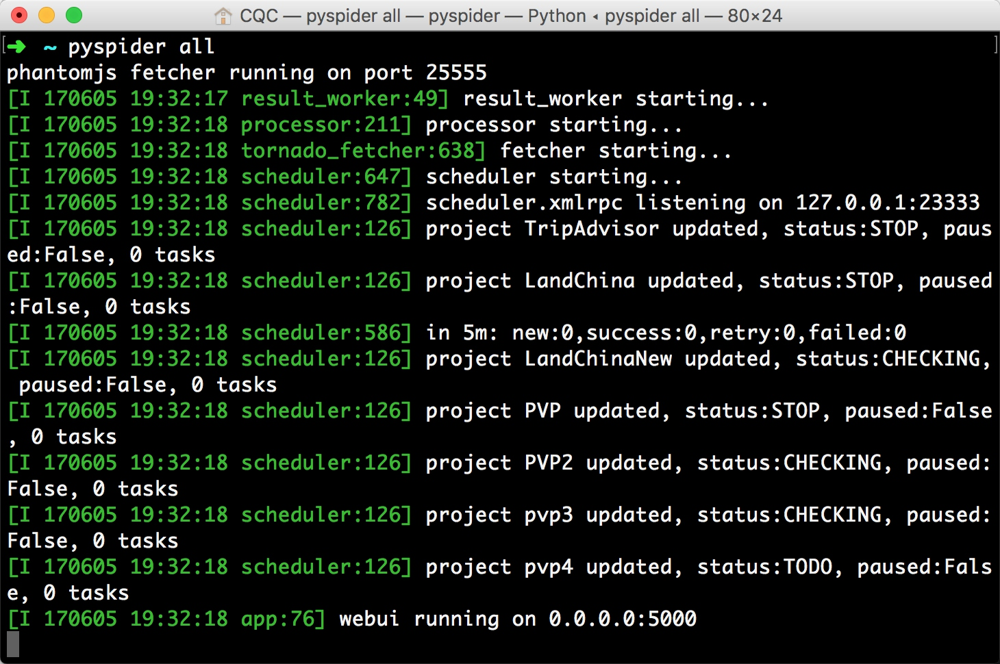
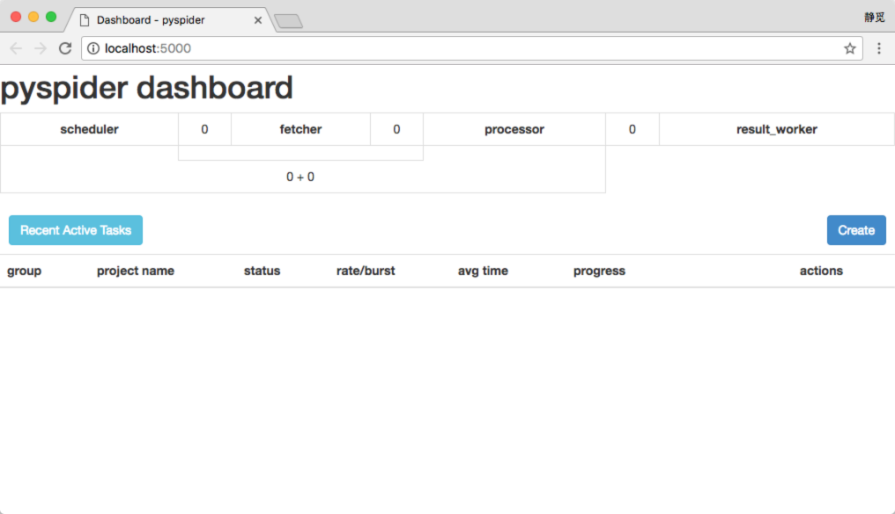

### PySpider安装

PySpider是国人写的，功能强大，而且带有WebUI管理页面，如果想要快速完成一个爬虫推荐使用PySpider。

本节介绍一下它的安装过程。

## Pip安装

直接运行如下pip命令即可：

```
pip3 install pyspider
```

另外PySpider是支持JavaScript渲染的，在这里它是依赖于PhantomJS的，所以还需要安装PhantomJS。

如果没有安装，请参见前文PhantomJS安装一节。

## 验证安装

安装完成之后，可以直接在命令行下启动PySpider：

```
pyspider all
```

控制台会有类似如下输出：



这市PySpider的Web服务就会在本地5000端口运行，直接在浏览器打开[http://localhost:5000/](http://localhost:5000/)即可进入PySpider的WebUI管理页面。




如果出现类似页面那证明PySpider已经安装成功了。

在后文我们会一起了解PySpider的相关用法。

##  常见错误

###     Command "python setup.py egg_info" failed with error code 1 in /tmp/pip-build-vXo1W3/pycurl

PyCurl安装错误，一般会出现在Windows下，到[http://www.lfd.uci.edu/~gohlke/pythonlibs/#pycurl](http://www.lfd.uci.edu/~gohlke/pythonlibs/#pycurl)下载相应的Wheel文件。

如64位，Python3.6则下载pycurl‑7.43.0‑cp36‑cp36m‑win_amd64.whl，随后用Pip安装即可。

```
pip3 install pycurl‑7.43.0‑cp36‑cp36m‑win_amd64.whl
```

