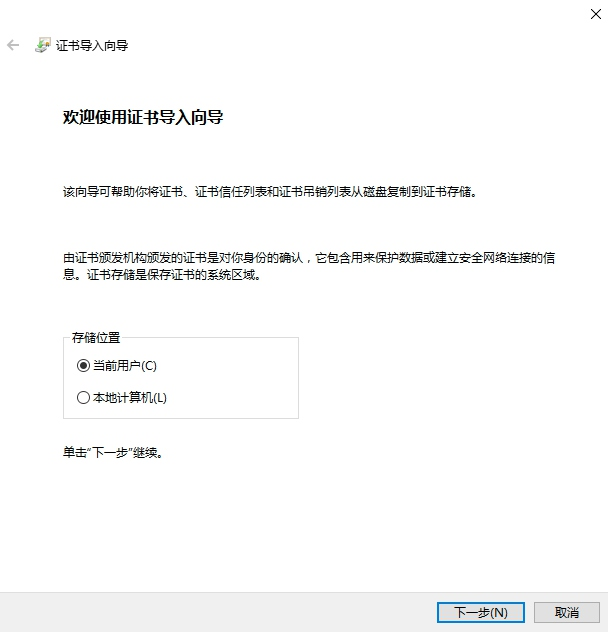
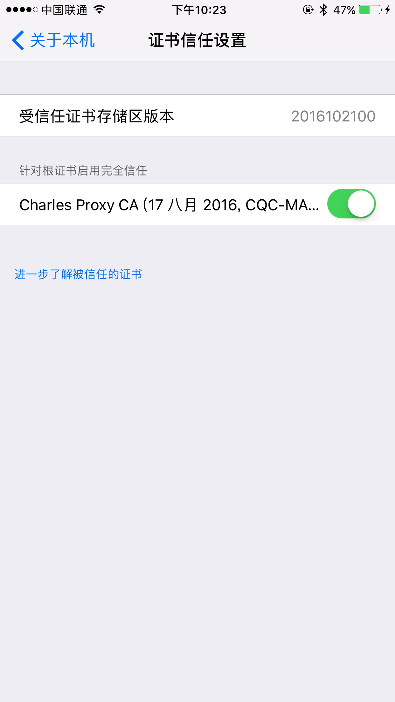
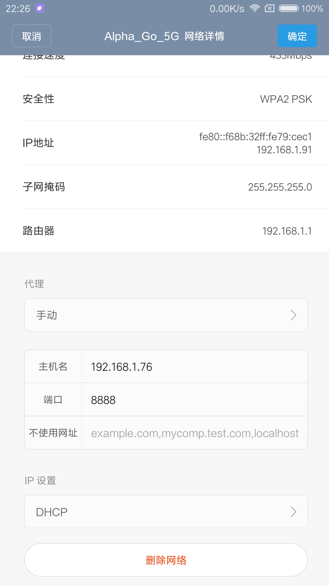
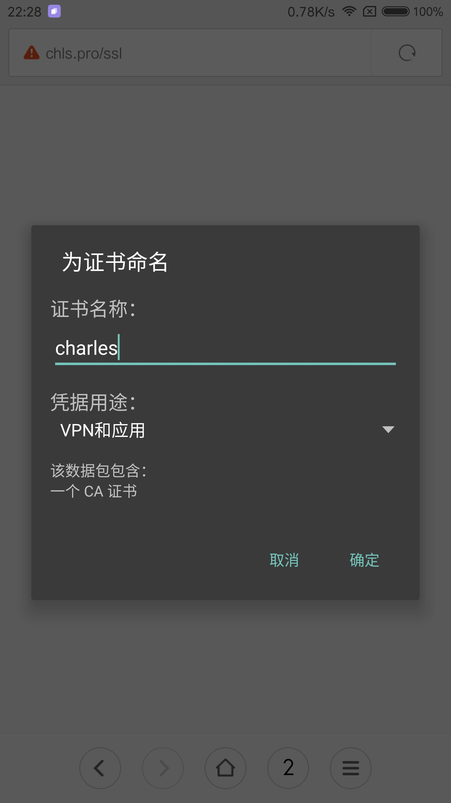

## 1.7.1 Charles的安装

Charles是一个网络抓包工具，在做APP抓包的时候会用到，相比Fiddler来说，Charles的功能更为强大，而且跨平台支持更好，所以在这里我们选用Charles来作为主要的移动端抓包工具，用于分析移动APP的数据包，辅助完成APP数据抓取工作。

### 1. 相关链接

* 官方网站：[https://www.charlesproxy.com](https://www.charlesproxy.com)
* 下载链接：[https://www.charlesproxy.com/download](https://www.charlesproxy.com/download)

### 2. 下载Charles

Charles的官网是：[https://www.charlesproxy.com](https://www.charlesproxy.com)，我们可以在官网下载最新稳定版本，链接为：[https://www.charlesproxy.com/download](https://www.charlesproxy.com/download)，它支持Windows、Linux、Mac三大平台，如图所示：

可以直接点击对应的安装包进行下载，具体的安装过程不再赘述。

Charles是收费的软件，不过可以免费试用30天。如果试用期过了其实还是可以试用的，不过每次试用不会超过30分钟，启动有10秒的延时，但是完整的软件功能还是可以使用的，所以还是比较友好的。

### 3. 证书配置

现在很多页面都在向HTTPS方向发展，HTTPS通信协议应用越来越广泛，如果一个APP通信应用了HTTPS协议，那它通信的数据都会是被加密的，常规的截包方法是无法识别请求内部的数据的。

安装完成之后如果我们想要做HTTPS抓包的话还需要配置一下相关SSL证书，如果不配置的话无法抓取HTTPS请求，接下来我们再看下各个平台下的证书配置过程。

Charles是运行在PC端的，我们要抓取的是APP端的数据，我们要在PC和手机端都安装证书。

#### Windows

如果你的PC是Windows系统，可以按照下面的操作进行证书配置。

首先我们先打开Charles，点击Help->SSL Proxying->Install Charles Root Certificate，即可进入证书的安装页面。

接下来会弹出一个安装证书的按钮，点击安装证书。

接下来就会打开证书导入向导，直接点击下一步。

接下来需要选择证书的存储区域，点击第二个选项“将所有证书放入下列存储”，然后点击浏览，再选择证书存储位置为“受信任的根证书颁发机构”，确定，点击下一步。

再继续点击下一步完成导入即可，这样。

#### Mac

如果你的PC是Mac系统，可以按照下面的操作进行证书配置。

同样是点击Help->SSL Proxying->Install Charles Root Certificate，即可进入证书的安装页面。

接下来找到Charles的证书双击，将信任设置为始终信任即可。

这样就成功安装了证书。

#### iOS

如果你的手机是iOS系统，可以按照下面的操作进行证书配置。

首先查看一下电脑的Charles代理是是否开启的，点击Proxy->Proxy Settings即可打开当前代理设置页面，确保当前的HTTP代理是开启的，如图所示：

例如这里的代理端口为8888，也可以自行修改。

接下来将手机和电脑连在同一个局域网下，例如当前电脑的IP为192.168.1.76，那么首先设置手机的代理为192.168.1.76:8888，设置如下：

设置完毕之后电脑上就会出现一个提示窗口，询问是否信任此设备，如图所示：

点击Allow即可，这样手机就和PC连在了同一个局域网内了，而且设置了Charles的代理，这样Charles即可抓取到流经APP的数据包了。

接下来我们再安装Charles的HTTPS证书。

在电脑上打开Help->SSL Proxying->Install Charles Root Certificate on a Mobile Device or Remote Browser。

即可看到如下提示：

它提示我们在手机上设置好Charles的代理，我们刚才已经设置好了，然后在手机的浏览器中打开chls.pro/ssl下载证书，我们在手机上打开这个链接。

打开之后便会弹出证书的安装页面：

我们点击安装，然后输入密码即可完成安装：

如果你的iOS版本是10.3以下的话，此处信任CA证书的流程就已经完成了。

如果你的iOS版本是10.3及以上，还需要在设置->通用->关于本机->证书信任设置将证书添加完全信任。

在这里将Charles的证书的完全信任开关打开即可。

这样iOS上配置信任CA证书的流程就结束了。

#### Android

如果你的手机是Android系统，可以按照下面的操作进行证书配置。

Android同样需要设置代理为Charles的代理，如图所示：

设置完毕之后电脑上就会出现一个提示窗口，询问是否信任此设备，如图所示：

点击Allow即可。

接下来像iOS设备一样，在手机浏览器上打开 chls.pro/ssl，这时会出现一个提示框，如图所示：

我们为证书添加一个名称，然后点击确定即可完成证书的安装。

### 4. 结语

本文介绍了Charles的安装及证书配置过程，后文我们会介绍Charles的基本使用方法。
