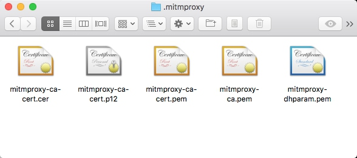
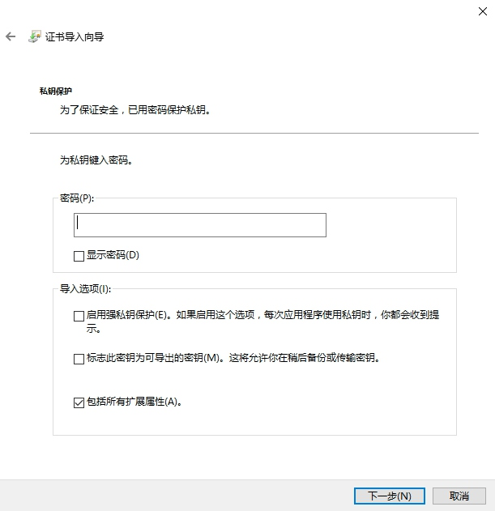
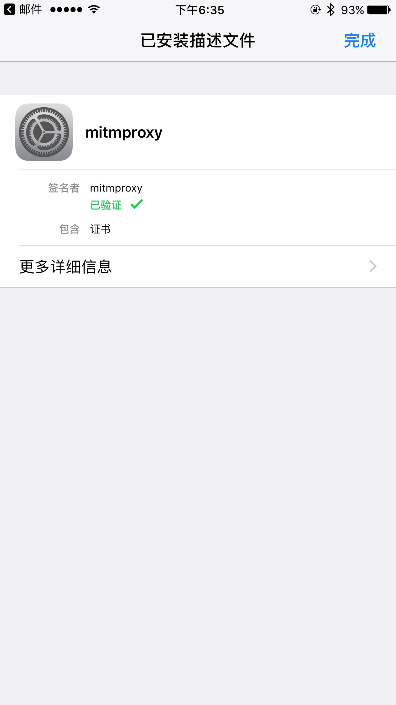
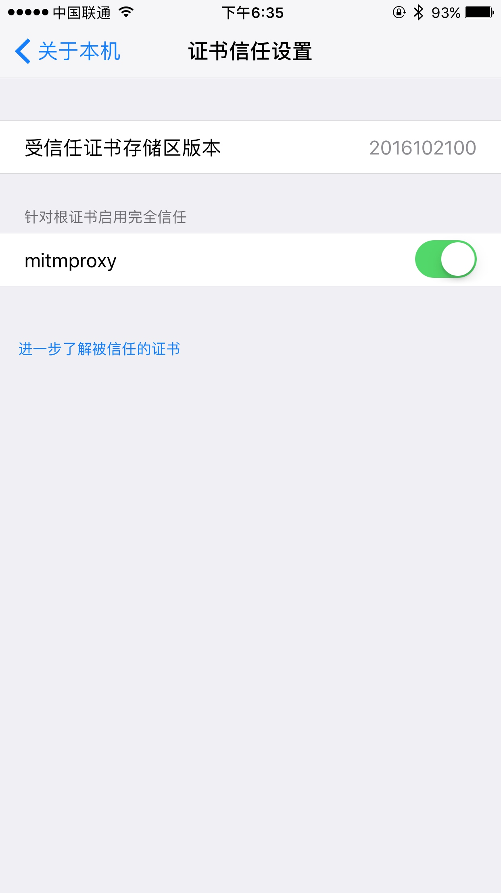
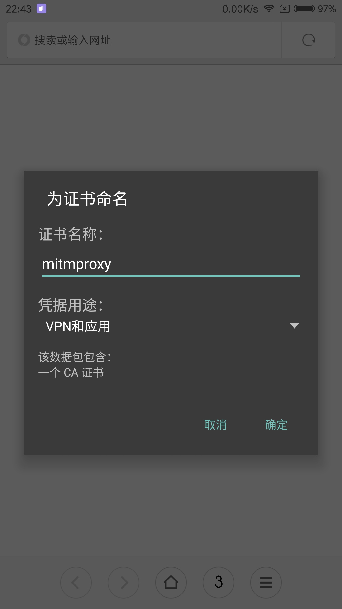

# MitmProxy的安装和配置

## 安装

首先安装一下MitmProxy。

### Pip安装

最简单的安装方式还是使用Pip，直接执行如下命令即可安装：

```
pip3 install mitmproxy
```

这是最简单和通用的安装方式，也可以选择下文列出的专门针对各个平台的安装方式。

### Windows

可以到GitHub上的Releases页面获取安装包，链接为[https://github.com/mitmproxy/mitmproxy/releases/](https://github.com/mitmproxy/mitmproxy/releases/)。


如当前最新版本为2.0.2，所以可以选择下载Windows下的exe安装包mitmproxy-2.0.2-windows-installer.exe。

下载之后直接双击安装包即可安装。

注意：在Windows上不支持MitmProxy的控制台接口，但是可以使用MitmDump和MitmWeb。

### Mac OS

Mac的安装非常简单，使用HomeBrew即可，命令如下：

```
brew install mitmproxy
```

执行命令后即可完成MitmProxy的安装。

### Linux

Linux可以下载编译好的二进制包，此发行包一般是最新版本，它包含了最新版本的MitmProxy和内置的Python3环境还有最新的OpenSSL环境。

如果你的环境里没有Python3和OpenSSL环境，建议使用此种方式安装。

二进制包的下载地址还是[https://github.com/mitmproxy/mitmproxy/releases/](https://github.com/mitmproxy/mitmproxy/releases/)。


例如当前最新版本为2.0.2，下载mitmproxy-2.0.2-linux.tar.gz即可。

下载之后需要解压然后将其配置到环境变量。

```
tar -zxvf mitmproxy-2.0.2-linux.tar.gz
sudo mv mitmproxy mitmdump mitmweb /usr/bin
```

这样就可以将三个可执行文件移动到了/usr/bin目录，而一般/usr/bin目录都已经配置在了环境变量下，所以接下来我们就可以直接调用这三个工具了。

## Docker

MitmProxy也支持Docker，其DockerHub的地址为[https://hub.docker.com/r/mitmproxy/mitmproxy/](https://hub.docker.com/r/mitmproxy/mitmproxy/)

Docker下MitmProxy的安装命令为：

```
docker run --rm -it -p 8080:8080 mitmproxy/mitmproxy mitmdump
```

这样就在8080端口上启动了MitmProxy和MitmDump。

如果想要获取CA证书，可以选择挂载磁盘选项，命令如下：

```
docker run --rm -it -v ~/.mitmproxy:/home/mitmproxy/.mitmproxy -p 8080:8080 mitmproxy/mitmproxy mitmdump
```

这样可以在~/.mitmproxy目录找到CA证书。

另外还可以在8081端口上启动MitmWeb，命令如下：

```
docker run --rm -it -p 8080:8080 -p 127.0.0.1:8081:8081 mitmproxy/mitmproxy mitmweb
```

更多启动方式可以参考DockerHub的安装说明。


## CA证书配置

现在很多页面都在向HTTPS方向发展，HTTPS通信协议应用越来越广泛，如果一个APP通信应用了HTTPS协议，那它通信的数据都会是被加密的，常规的截包方法是无法识别请求内部的数据的。

对于MitmProxy来说，如果想要截获HTTPS请求，我们就需要设置CA证书，MitmProxy在安装后会提供一套CA证书，只要客户端信任了MitmProxy提供的证书，我们就可以通过MitmProxy获取HTTPS请求的具体内容，否则MitmProxy是无法解析HTTPS请求的。

首先运行一下命令产生CA证书，启动MitmDump即可：

```
mitmdump
```

这样即可启动MitmDump，接下来我们就可以在用户目录下的.mitmproxy目录里面找到CA证书。




证书一共五个，下面是对这五个证书的说明：

| 名称 | 描述 |
| --- | --- |
| mitmproxy-ca.pem | PEM格式的证书私钥 |
| mitmproxy-ca-cert.pem | PEM格式证书，适用于大多数非Windows平台 |
| mitmproxy-ca-cert.p12 | PKCS12格式的证书，适用于Windows平台 |
| mitmproxy-ca-cert.cer | 与mitmproxy-ca-cert.pem相同，只是改变了后缀，适用于部分Android平台 |
| mitmproxy-dhparam.pem | PEM格式的秘钥文件，用于增强SSL安全性 |

### Windows

双击mitmproxy-ca.p12，就会出现导入证书的引导页。


直接点击下一步即可，不需要设置密码，直接点击下一步即可。




接下来需要选择证书的存储区域，点击第二个选项“将所有证书放入下列存储”，然后点击浏览，再选择证书存储位置为“受信任的根证书颁发机构”，确定，点击下一步。


最后如果有安全警告均点击“是”即可。


这样就配置完成Windows下信任CA证书了。

### Mac OS

Mac OS下双击mitmproxy-ca-cert.pem即可弹出钥匙串管理页面，然后找到mitmproxy证书，点击打开其设置选项，选择始终信任即可。


这样就配置完成Mac OS下信任CA证书了。

### iOS

将mitmproxy-ca-cert.pem文件发送到iPhone上，推荐使用邮件的方式发送，iPhone上可以直接点击附件并识别安装。


点击之后会跳到安装描述文件的页面，点击右上角的安装按钮即可安装。


此处会有警告提示，继续点击右上角的安装即可。




安装成功之后会有已安装的提示。

如果你的iOS版本是10.3以下的话，此处信任CA证书的流程就已经完成了。

如果你的iOS版本是10.3及以上，还需要在设置->通用->关于本机->证书信任设置将证书添加完全信任。




在这里将MitmProxy的完全信任开关打开即可。

这样iOS上配置信任CA证书的流程就结束了。

### Android

Android手机同样需要将证书mitmproxy-ca-cert.pem文件发送到手机上，例如直接拷贝文件。

接下来点击证书便会出现一个提示窗口：



这时输入证书的名称，然后点击确定即可完成安装。


