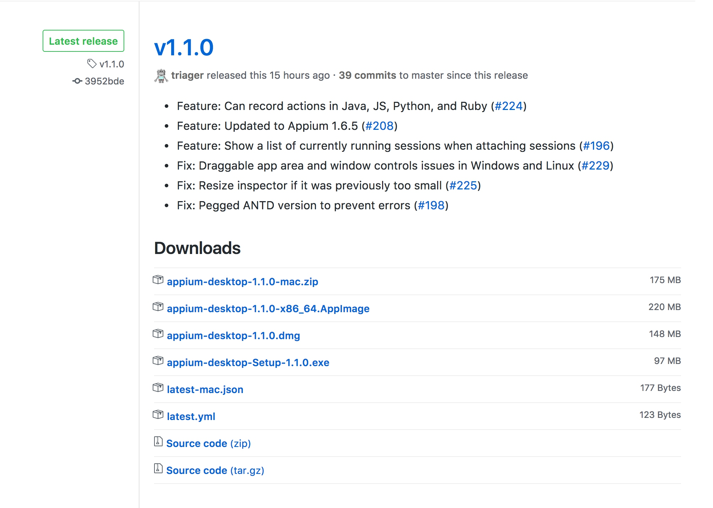
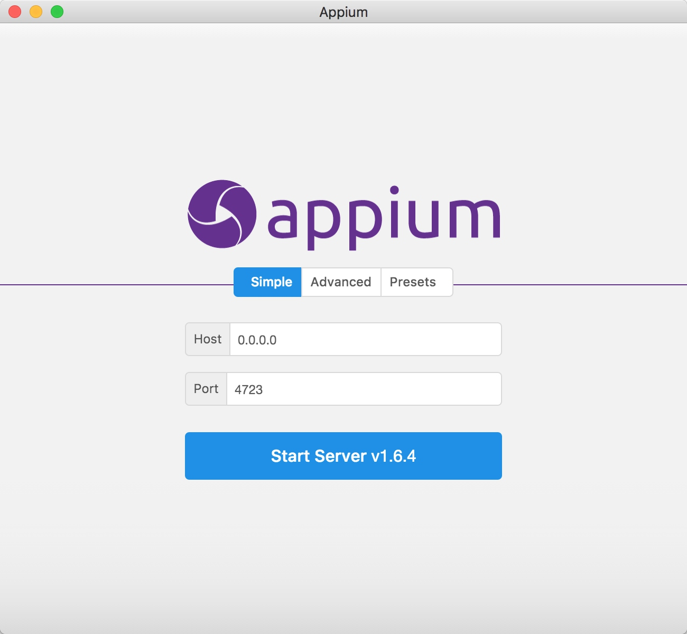
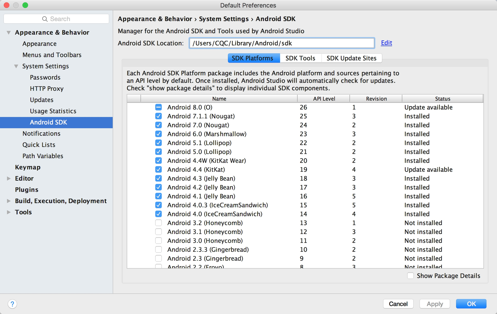

# Appium的安装

Appium是移动端的自动化测试工具，类似于前面所说的Selenium，利用它我们可以驱动Android、iOS等设备完成自动化测试，比如模拟点击、滑动、输入等操作，其官方网站为[http://appium.io/](http://appium.io/)，本节来介绍一下Appium的安装。

## 安装Appium

首先我们需要安装Appium，Appium负责驱动移动端来完成一系列操作，对iOS设备来说，它使用苹果的UIAutomation来实现驱动，对于Android来说，它使用UiAutomator和Selendroid来实现驱动。

同时Appium也相当于一个服务器，我们可以向Appium发送一些操作指令，Appium就会根据不同的指令对移动设备进行驱动，完成不同的动作。

安装Appium有两种方式，一种是直接下载安装包Appium Desktop来安装，另外一种是通过Node.js来安装，下面我们各自介绍一下两种安装方式。

### Appium Desktop

Appium Desktop支持全平台的安装，我们直接从GitHub的Releases里面安装即可，链接为[https://github.com/appium/appium-desktop/releases](https://github.com/appium/appium-desktop/releases)，目前的最新版本是1.1。




Windows平台可以下载exe安装包如appium-desktop-Setup-1.1.0.exe，Mac OS平台可以下载dmg安装包如appium-desktop-1.1.0.dmg，Linux平台可以选择下载源码，但是更推荐用下文的Node.js安装方式。

安装完成之后运行之后页面如图所示：




### Node.js

首先需要安装Node.js，具体的安装方式可以参见[http://www.runoob.com/nodejs/nodejs-install-setup.html](http://www.runoob.com/nodejs/nodejs-install-setup.html)，安装完成之后就可以使用npm命令了。

接下来使用npm命令全局安装Appium即可，命令如下：

```
npm install -g appium
```

等待命令执行执行完成即可，这样就成功安装了Appium。


## Android开发环境

如果我们要使用Android设备做App抓取的话，还需要下载和配置Android SDK，在这里推荐直接安装Android Studio，其下载地址为[https://developer.android.com/studio/index.html?hl=zh-cn](https://developer.android.com/studio/index.html?hl=zh-cn)，下载之后直接安装即可。

完成之后我们还需要下载Android SDK，直接打开首选项里面的Android SDK设置页面，勾选要安装的SDK版本，点击确定即可开始下载和安装勾选的SDK版本。



另外还需要配置一下环境变量，添加ANDROID_HOME为Android SDK所在路径，然后再添加SDK文件夹下的tools和platform-tools文件夹到PATH中。

更详细的配置可以参考Android Studio的官方文档，[https://developer.android.com/studio/intro/index.html](https://developer.android.com/studio/intro/index.html)

## iOS开发环境

首先需要声明的是，Appium是一个做自动化测试的工具，用它来测试我们自己开发的App是完全没问题的，它携带的是开发者证书（Development Certificate）。如果我们想拿iOS设备来做数据爬取的话又是另外一回事了，一般我们做数据爬取都是使用现有的APP，在iOS上一般都是通过App Store下载的，它携带的是分发证书（Distribution Certificate），而携带这种证书的应用都是禁止被测试的，所以只有获取ipa安装包再重新签名之后才可以被Appium测试，具体的方法不再展开阐述，如感兴趣可以搜索相关资料。

因此在这里推荐直接使用Android来进行测试，如果你已经完成了上述操作，那么可以参考如下内容配置iOS开发环境。

Appium驱动iOS设备必须要在Mac下进行，Windows和Linux是平台是无法完成的，下面只介绍一下Mac平台的相关配置。

Mac平台需要的配置如下：

* Mac OS X 10.12及更高版本
* XCode 8及更高版本

配置满足要求之后执行如下命令即可配置开发依赖的一些库和工具：

```
xcode-select --install
```

这样iOS部分开发环境就配置完成了，我们就可以用iOS模拟器来进行测试和数据抓取了。

如果想要用真机进行测试和数据抓取，还需要额外配置一下其他的环境，可以参考[https://github.com/appium/appium/blob/master/docs/en/appium-setup/real-devices-ios.md](https://github.com/appium/appium/blob/master/docs/en/appium-setup/real-devices-ios.md)。


