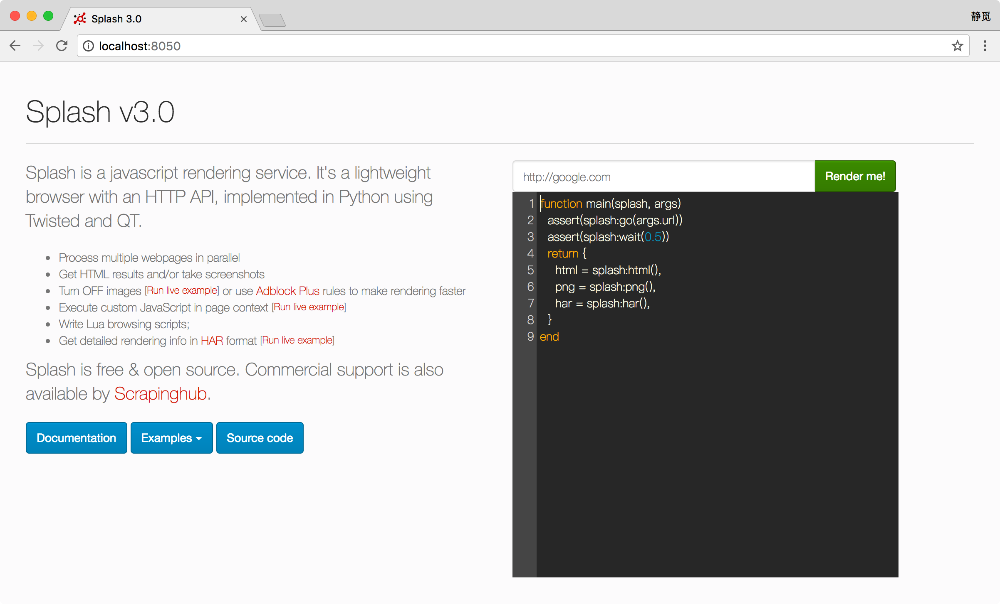

## 1.8.3 ScrapySplash的安装

ScrapySplash是一个Scrapy中支持JavaScript渲染的工具，本节来介绍一下它的安装方式。

ScrapySplash的安装分为两部分，一个是是Splash服务的安装，安装方式是通过Docker，安装之后会启动一个Splash服务，我们可以通过它的接口来实现JavaScript页面的加载。另外一个是ScrapySplash的Python库的安装，安装之后即可在Scrapy中使用Splash服务。

### 1. 相关链接

* GitHub：[https://github.com/scrapy-plugins/scrapy-splash](https://github.com/scrapy-plugins/scrapy-splash)
* PyPi：[https://pypi.python.org/pypi/scrapy-splash](https://pypi.python.org/pypi/scrapy-splash)
* 使用说明：[https://github.com/scrapy-plugins/scrapy-splash#configuration](https://github.com/scrapy-plugins/scrapy-splash#configuration)
* Splash 官方文档：[http://splash.readthedocs.io](http://splash.readthedocs.io)

### 2. 安装Splash

ScrapySplash会使用Splash的HTTP API进行页面渲染，所以我们需要安装Splash来提供渲染服务，安装是通过Docker安装，在这之前请确保已经正确安装好了Docker，如果没有安装可以参考前文所介绍的安装方式。

安装命令如下：

```
docker run -p 8050:8050 scrapinghub/splash
```

安装完成之后会有类似的输出结果：

```
2017-07-03 08:53:28+0000 [-] Log opened.
2017-07-03 08:53:28.447291 [-] Splash version: 3.0
2017-07-03 08:53:28.452698 [-] Qt 5.9.1, PyQt 5.9, WebKit 602.1, sip 4.19.3, Twisted 16.1.1, Lua 5.2
2017-07-03 08:53:28.453120 [-] Python 3.5.2 (default, Nov 17 2016, 17:05:23) [GCC 5.4.0 20160609]
2017-07-03 08:53:28.453676 [-] Open files limit: 1048576
2017-07-03 08:53:28.454258 [-] Can't bump open files limit
2017-07-03 08:53:28.571306 [-] Xvfb is started: ['Xvfb', ':1599197258', '-screen', '0', '1024x768x24', '-nolisten', 'tcp']
QStandardPaths: XDG_RUNTIME_DIR not set, defaulting to '/tmp/runtime-root'
2017-07-03 08:53:29.041973 [-] proxy profiles support is enabled, proxy profiles path: /etc/splash/proxy-profiles
2017-07-03 08:53:29.315445 [-] verbosity=1
2017-07-03 08:53:29.315629 [-] slots=50
2017-07-03 08:53:29.315712 [-] argument_cache_max_entries=500
2017-07-03 08:53:29.316564 [-] Web UI: enabled, Lua: enabled (sandbox: enabled)
2017-07-03 08:53:29.317614 [-] Site starting on 8050
2017-07-03 08:53:29.317801 [-] Starting factory <twisted.web.server.Site object at 0x7ffaa4a98cf8>
```

这样就证明Splash已经在8050端口上运行了。

这时我们打开[http://localhost:8050](http://localhost:8050)即可看到Splash的主页。



当然Splash也可以直接安装在远程服务器上，我们在服务器上运行以守护态运行Splash即可，命令如下：

```
docker run -d -p 8050:8050 scrapinghub/splash
```

在这里多了一个-d参数，它代表将Docker容器以守护态运行，这样在中断远程服务器连接后不会终止Splash服务的运行。

### 3. ScrapySplash的安装

成功安装了Splash之后，我们接下来再来安装一下其Python库，安装命令如下：

```
pip3 install scrapy-splash
```

命令运行完毕后就会成功安装好此库，后文我们会介绍它的详细用法。