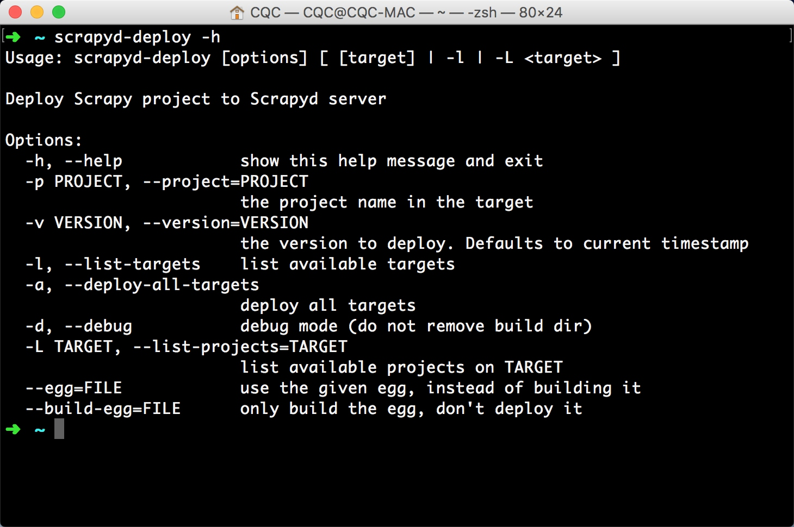

## 1.9.3 ScrapydClient的安装

在将Scrapy代码部署到远程Scrapyd的时候，其第一步就是要将代码打包为Egg文件，其次需要将Egg文件上传到远程主机，这个过程如果我们用程序来实现是完全可以的，但是我们并不需要做这些工作，因为ScrapydClient已经为我们实现了这些功能。

下面我们就来来一下ScrapydClient的安装过程。

### 1. 相关链接

* GitHub：[https://github.com/scrapy/scrapyd-client](https://github.com/scrapy/scrapyd-client)
* PyPi：[https://pypi.python.org/pypi/scrapyd-client](https://pypi.python.org/pypi/scrapyd-client)
* 使用说明：[https://github.com/scrapy/scrapyd-client#scrapyd-deploy](https://github.com/scrapy/scrapyd-client#scrapyd-deploy)

### 2. Pip安装

推荐使用Pip安装，执行如下命令即可：

```
pip3 install scrapyd-client
```

### 3. 验证安装

安装成功后会有一个可用命令，叫做scrapyd-deploy，即部署命令。

我们可以输入如下测试命令测试ScrapydClient是否安装成功：

```
scrapyd-deploy -h
```

如果出现如下类似输出则证明ScrapydClient已经成功安装:



在后文我们会详细介绍它的用法。

