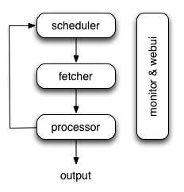

# PySpider框架介绍

PySpider是国人binux编写的强大的网络爬虫系统，其GitHub地址为：[https://github.com/binux/pyspider](https://github.com/binux/pyspider)，官方文档地址为：[http://docs.pyspider.org/](http://docs.pyspider.org/)。

它带有强大的WebUI、脚本编辑器、任务监控器、项目管理器以及结果处理器，同时它支持多种数据库后端、多种消息队列，另外它还支持JavaScript渲染页面的爬取，使用起来非常方便。

本章我们来了解一下它的相关用法。

# PySpider基本功能

在前面我们编写爬虫基本都是完全把爬虫的流程实现一遍，将不同的功能定义成不同的方法，甚至抽象出模块的概念，如在前文中的微信公众号爬虫我们已经基本有了爬虫框架的雏形，如调度器、队列、请求对象等等，但是很明显它的架构和模块还是太简单了，还远远不能达到一个框架的要求。但如果我们写的多了，在写的过程中慢慢地将各个组件独立出来，定义成不同的模块，也就慢慢形成了一个框架。有了框架之后，我们就不用再去特地关心爬虫的全部流程了，如异常处理、任务调度等等都会在框架中集成好了，我们只需要去关心爬虫的核心逻辑部分即可，如页面信息的提取、下一步请求的生成等等。这样以来，不仅我们的开发效率会提高很多，而且爬虫的健壮性也更强。

所以在项目实战过程中，我们往往会采用爬虫框架来实现抓取，提升开发效率，节省开发时间。PySpider就是一个非常优秀的爬虫框架，利用它我们可以快速方便地完成爬虫的开发，操作便捷，功能强大。

那么它具体有什么功能呢？我们在这里总结如下：
* 提供方便易用的WebUI系统，可以可视化地编写和调试爬虫。
* 提供爬取进度监控、爬取结果查看、爬虫项目管理等功能。
* 支持多种后端数据库，如MySQL、MongoDB、Redis、SQLite、Elasticsearch、PostgreSQL。
* 支持多种消息队列，如RabbitMQ、Beanstalk、Redis、Kombu。
* 提供优先级控制、失败重试、定时抓取等功能。
* 对接了PhantomJS，可以抓取JavaScript渲染的页面。
* 支持单机和分布式部署，支持Docker部署。

如果我们想要快速方便地实现一个页面的抓取的话，使用PySpider不失为一个好的选择。

在后文我们还会介绍另外一个爬虫框架Scrapy，下面大致列一下PySpider与Scrapy相比有什么不同：
* PySpider提供了WebUI，爬虫的编写、调试都是在WebUI中进行的，而Scrapy原生是不具备这个功能的，采用的是代码和命令行操作，但可以通过对接Portia实现可视化配置。
* PySpider调试非常方便，WebUI操作便捷直观，在Scrapy中则是使用parse命令进行调试，论方便程度不及PySpider。
* PySpider支持PhantomJS来进行JavaScript渲染页面的采集，在Scrapy中可以对接ScrapySplash组件，需要额外配置。
* PySpider中内置了PyQuery作为选择器，在Scrapy中对接了XPath、CSS选择器和正则匹配。
* PySpider的可扩展程度不足，可配制化程度不高，在Scrapy中可以通过对接Middleware、Pipeline、Extension等组件实现非常强大的功能，模块之间的耦合程度低，可扩展程度极高。

因此如果我们想要快速实现一个页面的抓取的话，推荐使用PySpider，开发更加便捷，如快速抓取某个普通新闻网站的新闻内容。但如果要应对反爬程度很强、超大规模的抓取的话，推荐使用Scrapy，如抓取封IP、封账号、高频验证的网站的大规模数据采集。

## PySpider的架构

首先我们来看下PySpider的架构，PySpider的架构主要分为Scheduler（调度器）、Fetcher（抓取器）、Processer（处理器）三个部分，同时整个过程受到Monitor（监控器）的监控，抓取的结果被Result Worker（结果处理器）处理，如图所示：

任务是Scheduler发起调度，Fetcher负责抓取网页内容，Processer负责解析网页内容，然后将新生成的Request在此发给Scheduler进行调度，将生成的提取结果输出保存。

数据流过程如下：
* 每一个PySpider的项目对应一个Python脚本，是一个Handler类，它有一个on_start()方法，在爬取开始时会首先调用on_start()方法生成最初的抓取任务，然后发送给Scheduler进行调度。
* Scheduler将抓取任务分发给Fetcher进行抓取，Fetcher执行并得到Response，随后将Response发送给Processer。
* Processer处理Response并提取出新的URL生成新的抓取任务，然后通过消息队列的方式通知Schduler当前抓取任务执行情况并将新生成的抓取任务发送给Scheduler，同时如果生成了新的提取结果则将其发送到结果队列等待Result Worker处理。
* Scheduler接收到了新的抓取任务，然后查询数据库，判断这个如果是新的抓取任务或者是需要重试的任务就继续进行调度，然后将其再发送回Fetcher进行抓取。
* 不断重复以上工作，直到所有的任务都被执行完毕，抓取结束。
* 抓取结束后会回调on_finished()方法，在这里可以定义后处理过程。

以上便是PySpider的任务执行流程，整体的逻辑还是比较清晰的。

在后面我们会先用一个实例来体验一下PySpider的抓取操作，然后再总结一下它的各种用法。

