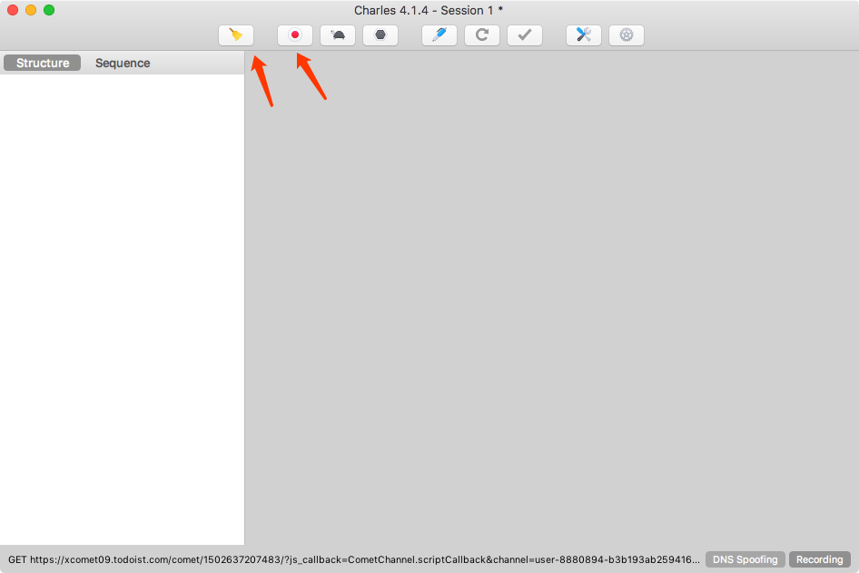
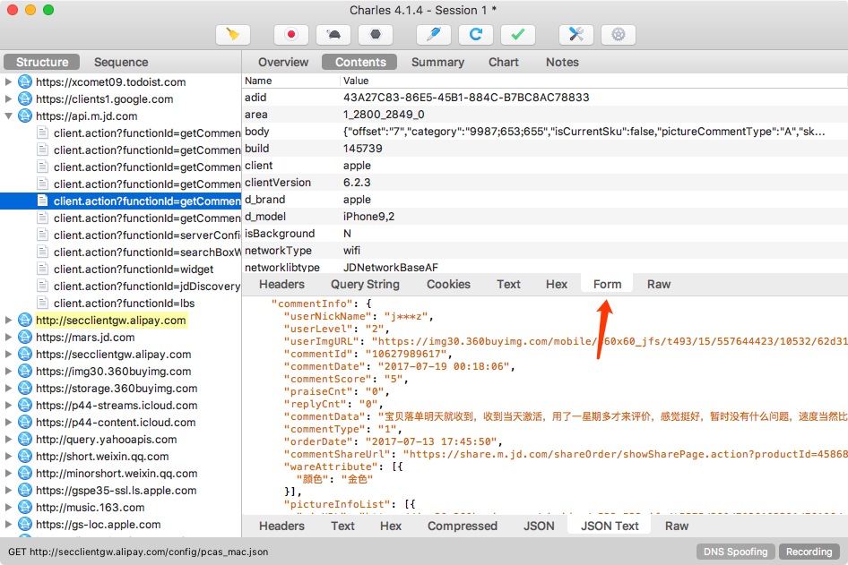
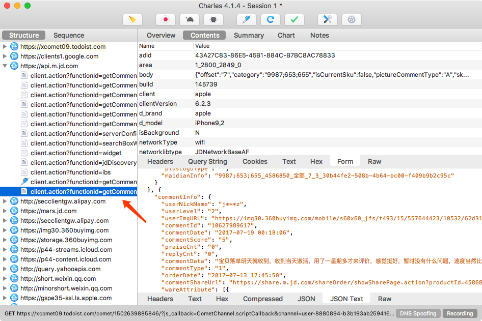

# Charles的使用

本节来讲解一下Charles抓包工具的使用，利用它我们可以方便地在手机浏览网页、浏览APP时的各种HTTP请求和响应都抓取下来。

在本节开始之前请确保已经正确安装好了Charles并开启了代理服务，并且手机和Charles处于同一个局域网下并设置好了Charles代理而且配置好了Charles的CA证书。

初始状态下Charles的运行界面如图所示：

它会一直在监听PC和手机上的发生的网络请求，捕获到请求之后就会显示在左侧，随着时间的推移，捕获的请求越来越多，左侧的列表的内容也会越来越多。

可以看到在左侧显示了Charles抓取到的请求站点，我们点击任意一个条目便可以查看对应请求的详细信息，包括Request、Response的所有内容。

既然Charles可以抓取到所有的HTTP请求，那么APP内的网络请求必然也可以抓取到了。

本节我们以京东APP为例，通过Charles来抓取一下APP内发生的网络请求是怎样的，以此来了解Charles的用法。

首先我们清空一下Charles的抓取结果，点击左侧的扫帚按钮即可清空当前捕获到的所有请求，然后确保右侧的监听按钮是打开的，这表示Charles正在监听HTTP请求。

这时我们打开手机京东，打开任意一个商品，如iPhone，然后打开它的商品评论页面，一直不断下拉，这时我们就可以看到在Charles中捕获到了这个过程中APP内发生的网络请求。

这时我们会发现在左侧列表中会出现一个api.m.jd.com的链接，而且它在不停的闪动，这个很可能就是当前APP发出的获取评论数据的请求被Charles捕获到了，我们点击将其展开，继续下拉刷新评论，我们发现随着下拉的进行，此处会出现一个个的请求记录，这基本可以确定新出现的请求就是获取评论的请求了。

为了验证其正确性，我们点击查看这个请求的详情信息，切换到Contents选项卡，这时我们可以发现一些Json数据，核对一下结果，可以看到其内有commentData字段，正是在APP中出现的评论内容：

这时我们就确定此接口就是获取商品评论的接口，这样APP中的请求就被成功捕获到了。

我们首先可以回到Overview选项卡，可以看到在上方显示了请求的接口链接，接着显示了响应状态，请求方式等等，如图所示：

这基本上和我们原本在Chrome浏览器中开发者工具内捕获到的结果形式是类似的。

接下来我们可以点击Contents选项卡来查看该请求和响应的详情信息。

这时上半部分显示的是Request的信息，下半部分显示的是Response的信息，比如对于Reqeust，我们切换到Headers选项卡即可看到该Request的Headers信息，对于Response，我们切换到JSON TEXT选项卡即可看到该Response的Body信息，并且已经将Json字符串格式化，如图所示：

由于这个请求是POST请求，所以我们还需要关心的就是POST的表单信息，切换到Form选项卡即可查看，如图所示：

这样我们就成功抓取到了APP中的评论接口的请求和响应，并且可以拿到原始的Json数据了。

另外Charles还具有一个强大的功能，它可以将捕获到的请求加以修改然后重新修改后的请求，我们可以点击上方的修改按钮，然后可以发现在左侧列表就多了一个以编辑图标为开头的链接，这就代表此链接对应的请求正在被我们修改，如图所示：

比如我们可以修改Form表单的数据，例如将Form中的某个字段移除掉，在这里我们将partner字段移除，然后点击Remove即可，这时我们就已经对原来的请求做了修改，然后再点击下方的Execute按钮即可执行修改后的请求，如图所示：

点击了Execute按钮之后，修改后的请求会被重新执行，可以发现左侧列表再次出现了接口的请求结果，内容完全一致，如图所示：

可见删除了Form表单中的partner字段并没有什么影响，所以这个字段是无关紧要的。

有了这个功能，我们就可以方便地使用Charles来做调试，我们可以通过修改参数、接口等来测试不同请求的响应状态，最后我们就可以知道哪些参数是必要的哪些是不必要的以及参数分别有着什么规律，最后得到一个最简单的接口和参数形式，供程序模拟调用使用就好了。

以上便是通过Charles抓包分析APP请求的过程，通过Charles我们成功抓取到了APP中发生的网络请求，并可以捕获到原始的数据，同时我们还可以修改原始请求和重新发起修改后的请求进行接口测试，使用还是非常方便的。

