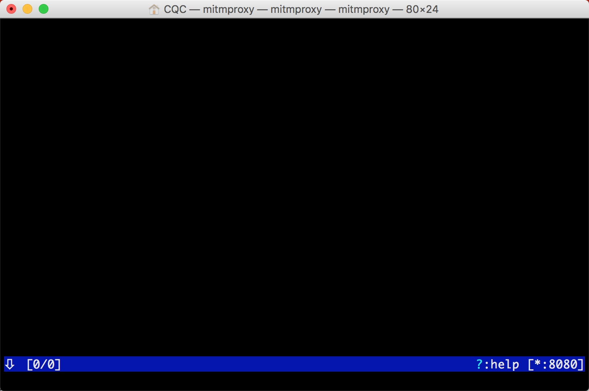
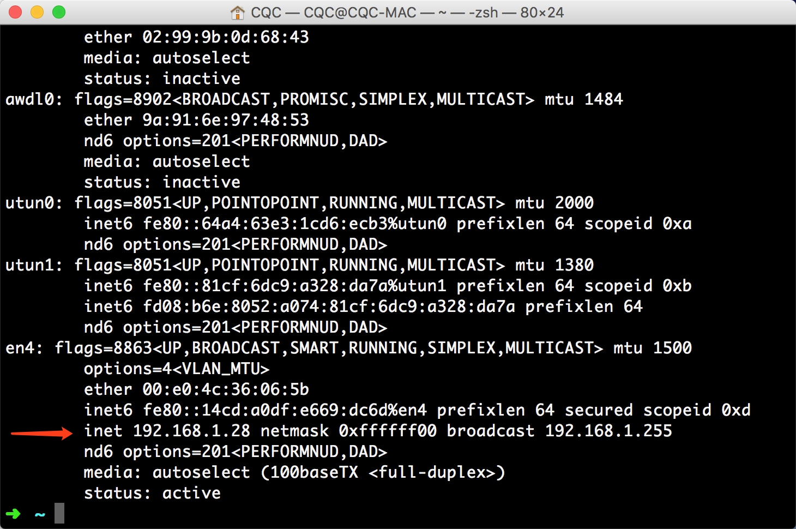
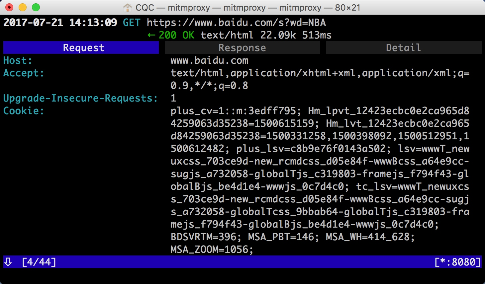
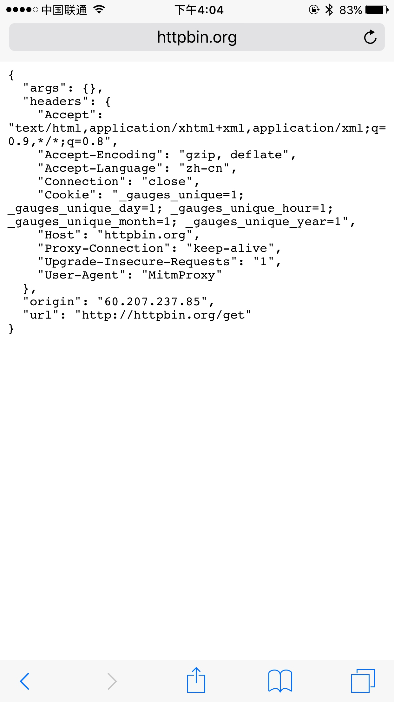
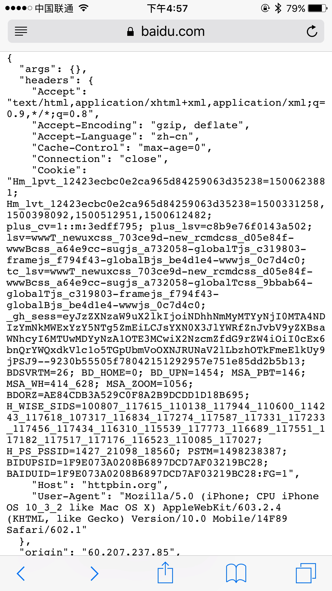

# MitmProxy的使用

MitmProxy是一个支持HTTP和HTTPS的抓包程序，类似Fiddler、Charles的功能，只不过它是一个控制台的形式操作。

同时MitmProxy还有两个关联组件，一个是MitmDump，它是MitmProxy的命令行接口，利用它我们可以对接Python脚本，用Python实现监听后的处理。另一个是MitmWeb，它是一个Web程序，通过它我们可以清楚地观察到MitmProxy捕获的请求。

## MitmProxy的功能

* 拦截HTTP和HTTPS请求和响应
* 保存HTTP会话并进行分析
* 模拟客户端发起请求，模拟服务端返回响应
* 利用反向代理将流量转发给指定的服务器
* 支持Mac OS和Linux上的透明代理
* 利用Python对HTTP请求和响应进行更改

## 抓包原理

我们需要先知道使用的思路，首先MitmProxy肯定是运行在我们自己的PC上的，MitmProxy运行的时候会在PC的8080端口上运行，然后开启一个代理服务，这个实际上是一个HTTP/HTTPS的代理。

接下来手机需要和PC在同一个局域网内，可以考虑使用手机模拟器用虚拟网络连接，也可以使用真机和PC用无线网络连接，总之确保二者在同一个局域网内即可。

接下来手机需要设置代理为MitmProxy的代理地址，这样手机在访问互联网的时候流量数据包就会流经MitmProxy，MitmProxy再去转发这些数据包到真实的服务器，服务器返回数据包时再由MitmProxy转发回手机，这样MitmProxy就相当于起了中间人的作用，所有流量包都可以捕捉到，因此所有HTTP请求和响应就都可以捕获到，同时它还有权力对请求和响应进行修改，一切都在它的掌控之中，所以我们要把它用作爬虫抓包工具也不在话下。

## 配置

首先我们需要运行MitmProxy或MitmDump开启代理，命令如下：

启动MitmProxy的命令如下：

```
mitmproxy
```

运行之后会在8080端口上运行一个代理服务，如图所示：



在右下角会出现当前正在监听的端口。

或者启动MitmDump，它也会监听8080端口，命令如下：

```
mitmdump
```


然后将手机和PC连接在同一局域网下，在手机上设置代理为当前代理，首先看一下PC的当前局域网IP。

Windows上命令为：

```
ipconfig
```

Linux和Mac上的命令为：

```
ifconfig
```

输出结果如下：




一般看到`10.*.*.*`或`192.168.*.*`类似的IP就是当前PC的局域网IP，例如此图中的PC的IP为192.168.1.28，在手机上设置如下：

iOS:


## MitmProxy的使用

设置成功之后我们只需要在手机浏览器上访问任意的网页或浏览任意的APP即可，例如在手机上打开百度，MitmProxy页面便会呈现出手机上的所有请求，如图所示：


这其实就相当于之前我们在浏览器开发者工具监听到的浏览器的请求，在这里我们借助于MitmProxy都抓取到了。

这里其实是刚才手机上打开百度页面时的所有请求列表，在左下角显示了2/38是代表一共发生了38个请求，当前箭头所指的是第二个请求。

每个请求开头都有一个GET或POST，这是各个请求的请求方式，紧接的内容是请求的URL，第二行开头的数字就是请求对应的响应的状态码，后面是响应内容的类型，如text/html代表网页文档，image/gif代表图片，再往后是响应体的大小，最后是响应的时间。

也就是说当前呈现了所有请求和响应的概览，我们可以通过这个页面观察到所有的请求。

如果想查看某个请求的详情，我们可以敲击回车，然后就可以进入到请求的详情页面，如图所示：


在这里又可以看到请求头的详细信息，如Host、Cookies、User-Agent等等。

我们可以看到最上方是一个Request、Response、Detail的列表，而当前是处在Request这个选项上，这时我们再点击TAB键即可查看这个请求对应的响应的详情，如图所示：


在最上面是响应头的信息，下拉之后可以看到响应体的信息，对于当前请求响应体就是网页的源代码。

这时我们再敲击TAB键，切换到最后一个选项卡Detail，即可看到当前请求的详细信息，如服务器的IP、端口、HTTP协议版本、客户端的IP、端口等等。


另外MitmProxy还提供了命令行式的编辑功能，我们可以在此页面中重新编辑请求，敲击e键即可进入编辑功能，这时它会询问你是要编辑哪部分的内容，如Cookies、Query、Url等等，每个选项的第一个字母会高亮显示，再敲击要编辑的内容名称的首字母即可进入该内容的编辑页面，如敲击m即可编辑请求的方式，敲击q即可修改GET请求参数Query。


这时我们敲击q即可编辑GET请求参数，进入到编辑Query的页面，这时由于没有任何参数，我们可以敲击a来增加一行，然后就可以输入参数对应的Key和Value了。


例如这里我们输入Key为wd，Value为NBA

然后再敲击esc键，再敲击q键返回之前的页面，再敲击e和p键修改Path，还是和上面一样，敲击a增加Path的内容，这时我们将Path修改为s。


接下来再敲击esc和q键返回，这时我们就可以看到最上面的请求链接就变成了[https://www.baidu.com/s?wd=NBA](https://www.baidu.com/s?wd=NBA)，这个页面访问之后可以看到百度搜索NBA关键词的搜索结果。



这时我们再敲击a保存修改，再敲击r重新发起修改后的请求，即可看到上方请求方式前面多了一个回旋箭头，这证明重新执行了修改后的请求，这时我们再观察一下响应体内容，即可看到搜索NBA的页面结果的源代码了。


以上便是MitmProxy的简单使用，利用它我们可以观察到手机上的所有请求还可以对请求进行修改并重新发起。

总体来说，这个功能Fiddler、Charles也都有，而且图形界面操作更加方便。那么MitmProxy的优势何在？

其实MitmProxy的强大之处体现在它的另一个工具MitmDump，有了它我们可以直接对接Python来对请求进行处理，下面我们再来看下MitmDump的使用。

## MitmDump的使用

MitmDump是MitmProxy的命令行接口，同时还可以对接Python对请求进行处理，这是相比Fiddler、Charles等工具更加方便的地方，有了它我们可以不用再去手动去截获和分析HTTP请求和响应，只需要写好请求和响应的处理逻辑即可，同时还可以实现数据的解析，存储等工作，直接用Python完成即可。

接下来我们来看下MitmDump的详细使用方法。

### 实例引入

使用如下命令我们可以启动MitmProxy，并把截获的数据保存到文件中：

```
mitmdump -w outfile
```

outfile名称可以任意取，截获的数据都会被保存到此文件中。

另外我们还可以指定一个脚本来处理截获的数据，使用-s参数即可：

```
mitmdump -s script.py
```

在这里我们指定了当前处理脚本为script.py，它需要放置在当前命令执行的目录下。

脚本里我们可以写入如下的代码：

```python
def request(flow):
    flow.request.headers['User-Agent'] = 'MitmProxy'
    print(flow.request.headers)
```

在这里我们定义了一个request函数，参数为flow，它其实是一个HTTPFlow对象，通过request属性即可获取到当前请求对象，然后我们接下来打印输出了请求的请求头，然后又将请求头的User-Agent修改成了MitmProxy。

运行之后我们在手机端访问[http://httpbin.org/get](http://httpbin.org/get)，就可以看到有如下情况发生：

手机端的页面显示如下：



PC端控制台输出如下：


首先手机端我们可以观察到返回的结果的Headers实际上就是我们请求的Headers，可以看到User-Agent被修改成了MitmProxy，PC端控制台输出了修改后的Headers内容，可以看到其User-Agent的内容正是MitmProxy。

所以现在我们就可以知道，通过这三行的代码我们就可以完成对请求的改写，同时print()方法输出的结果都可以呈现在PC端控制台上，可以方便地进行调试。

### 日志输出

MitmDump提供了专门的日志输出功能，可以设定不同的级别以不同的颜色输出结果，我们把脚本修改成如下内容：

```python
from mitmproxy import ctx

def request(flow):
    flow.request.headers['User-Agent'] = 'MitmProxy'
    ctx.log.info(str(flow.request.headers))
    ctx.log.warn(str(flow.request.headers))
    ctx.log.error(str(flow.request.headers))
```


在这里我们调用了ctx模块，它有一个log功能，调用不同的输出方法就可以输出不同颜色的结果，方便我们做调试。

例如info()方法输出的内容是白色，warn()方法输出的内容是黄色，error()方法输出的内容是红色。

运行结果如下：


不同的颜色对应的不同级别的输出，我们可以将不同的结果合理划分级别输出，利用它我们可以直观方便地查看调试信息。

### HTTPRequest

在最开始我们实现了request()方法并且对Headers进行了修改，下面我们来看下针对于Request还有哪些常用的功能。

我们先用一个实例来感受一下：

```python
from mitmproxy import ctx

def request(flow):
    request = flow.request
    info = ctx.log.info
    info(request.url)
    info(str(request.headers))
    info(str(request.cookies))
    info(request.host)
    info(request.method)
    info(str(request.port))
    info(request.scheme)
```

我们修改脚本如上内容，然后在手机上打开百度，即可看到PC端控制台输出了一系列的请求，在这里我们找到第一个请求。可以看到控制台打印输出了Request的一些常见属性，如Url、Headers、Cookies、Host、Method、Scheme等。

其对应的输出结果如下：


可以看到结果中分别输出了请求链接、请求头、请求Cookies、请求Host、请求方法、请求端口、请求协议这些内容。

同时我们还可以对任意的属性进行修改，就像最初修改Headers一样，直接赋值即可。

例如我们在这里将请求的Url修改一下，脚本修改如下：

```python
def request(flow):
    url = 'https://httpbin.org/get'
    flow.request.url = url
```

我们可以看到手机端得到如下结果：



比较有意思的是，在浏览器最上方还是呈现百度的Url，但是可以发现页面已经变成了httpbin.org的页面了，另外还可以观察到Cookies明显还是百度的Cookies。

我们只是通过简单的脚本就成功把请求修改为其他的站点，通过这种方式修改和伪造请求就变得轻而易举。

通过这个实例我们还可以知道，其实有时候我们看到的Url虽然是正确的，但是内容并非是正确的，我们需要进一步提高自己的安全防范意识。

另外Request其实还有很多属性，在此不再一一列举，更多属性可以参考[http://docs.mitmproxy.org/en/latest/scripting/api.html](http://docs.mitmproxy.org/en/latest/scripting/api.html)。

只要我们了解了基本的用法，获取和修改Reqeust的任意内容都不在话下，比如可以修改Cookies、添加代理等方式来规避反爬。

### Response

其实对于爬虫来说，我们更加关心的其实是Response的内容，因为Response Body才是爬取的结果，对于Response来说，MitmDump也提供了对应的处理接口，正是response()方法，下面我们用一个实例感受一下：

```python
from mitmproxy import ctx

def response(flow):
    response = flow.response
    info = ctx.log.info
    info(str(response.status_code))
    info(str(response.headers))
    info(str(response.cookies))
    info(str(response.text))
```

将脚本修改为如上内容，然后手机访问[http://httpbin.org/get](http://httpbin.org/get)。

在这里我们打印输出了Response的status_code、headers、cookies、text这几个属性，其中最主要的text属性就是网页的源代码。

PC端控制台输出如下：


可以看到控制台输出了Response的状态码、响应头、Cookies、响应体这几部分内容。

所以这样我们就可以通过response()方法获取每个请求的响应内容了，接下来再进行响应的信息提取和存储就可以成功完成爬取了。

在下一节我们会利用MItmProxy来实现一个APP的爬取实战。


