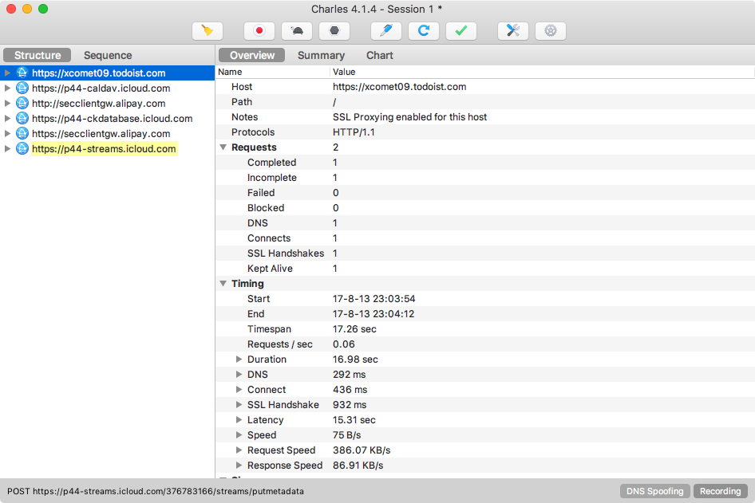
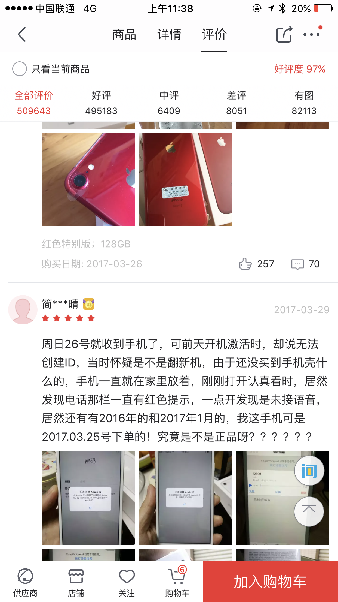
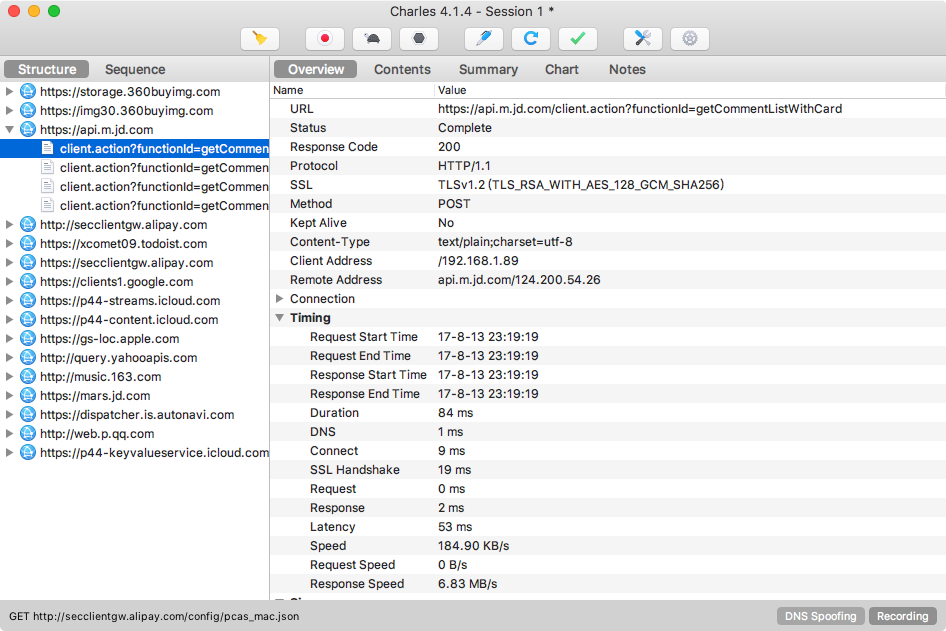
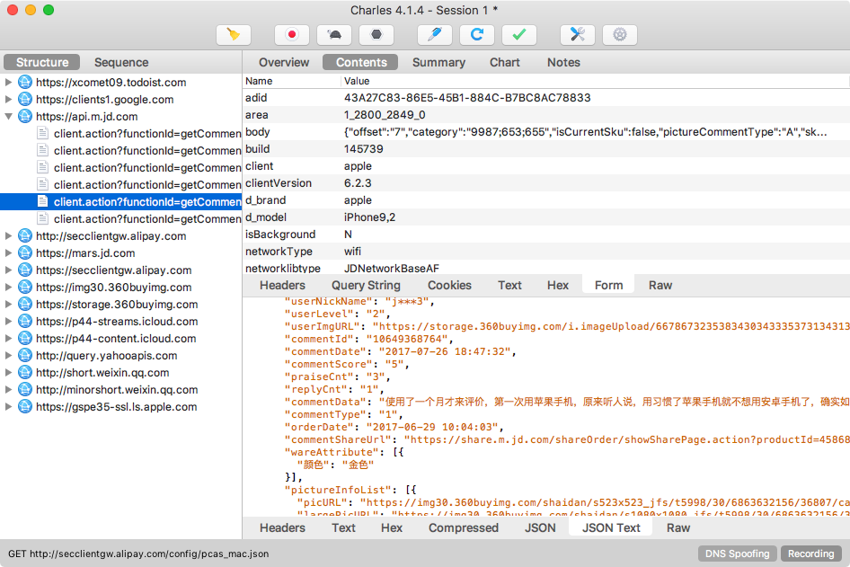
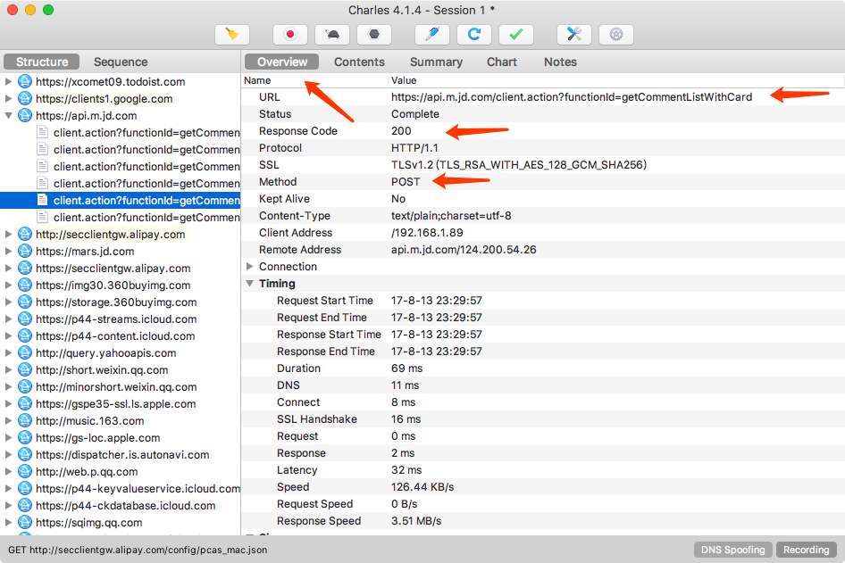
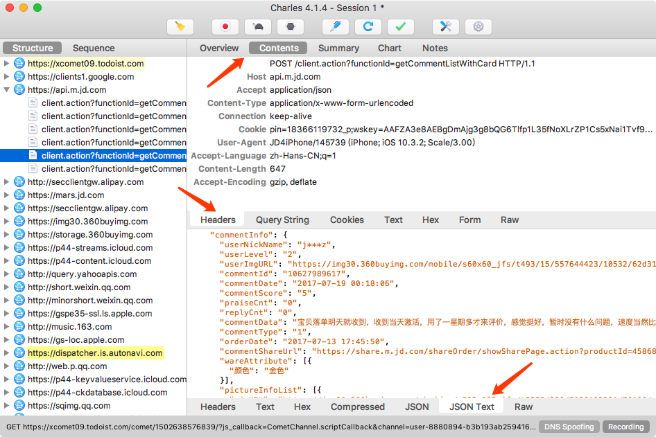
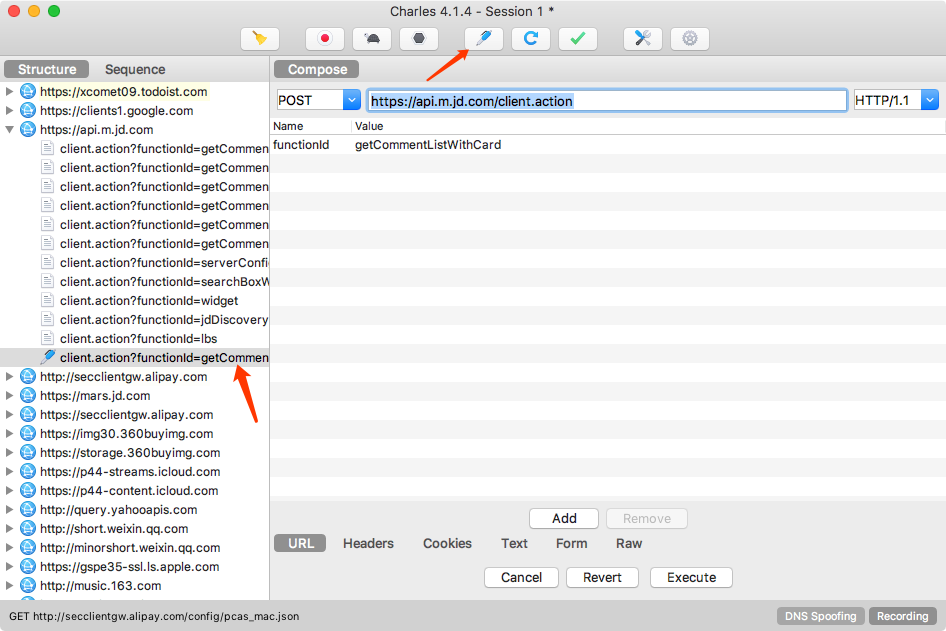
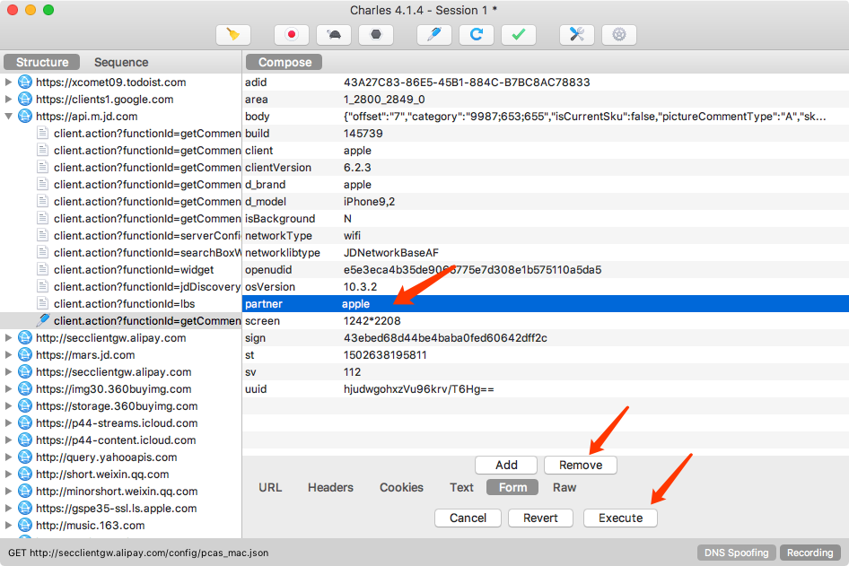

# 11.1 Charles的使用

Charles是一个网络抓包工具，我们可以用它来做App的抓包分析，得到App运行过程中发生的所有网络请求和响应内容，这就和Web端浏览器的开发者工具Network部分看到的结果一致。

相比Fiddler来说，Charles的功能更强大，而且跨平台支持更好。所以我们选用Charles作为主要的移动端抓包工具，用于分析移动App的数据包，辅助完成App数据抓取工作。

### 1. 本节目标

本节我们以京东App为例，通过Charles抓取App运行过程中的网络数据包，然后查看具体的Request和Response内容，以此来了解Charles的用法。

### 2. 准备工作

请确保已经正确安装Charles并开启了代理服务，手机和Charles处于同一个局域网下，Charles代理和CharlesCA证书设置好，另外需要开启SSL监听，具体的配置可以参考第1章的说明。

### 3. 原理

首先Charles运行在自己的PC上，Charles运行的时候会在PC的8888端口开启一个代理服务，这个服务实际上是一个HTTP/HTTPS的代理。

确保手机和PC在同一个局域网内，我们可以使用手机模拟器通过虚拟网络连接，也可以使用手机真机和PC通过无线网络连接。

设置手机代理为Charles的代理地址，这样手机访问互联网的数据包就会流经Charles，Charles再转发这些数据包到真实的服务器，服务器返回的数据包再由Charles转发回手机，Charles就起到中间人的作用，所有流量包都可以捕捉到，因此所有HTTP请求和响应都可以捕获到。同时Charles还有权力对请求和响应进行修改。

### 4. 抓包

初始状态下 Charles 的运行界面如图 11-1 所示：

图 11-1 Charles 运行界面

Charles会一直监听PC和手机发生的网络数据包，捕获到的数据包就会显示在左侧，随着时间的推移，捕获的数据包越来越多，左侧列表的内容也会越来越多。

可以看到，图中左侧显示了Charles抓取到的请求站点，我们点击任意一个条目便可以查看对应请求的详细信息，其中包括Request、Response等内容。

接下来清空Charles的抓取结果，点击左侧的扫帚按钮即可清空当前捕获到的所有请求。然后点击第二个监听按钮，确保监听按钮是打开的，这表示Charles正在监听App的网络数据流，如图11-2所示。

图 11-2 监听过程

这时打开手机京东，注意一定要提前设置好Charles的代理并配置好CA证书，否则没有效果。

打开任意一个商品，如iPhone，然后打开它的商品评论页面，如图11-3所示。

图 11-3 评论页面

不断上拉加载评论，可以看到Charles捕获到这个过程中京东App内发生的所有网络请求，如图11-4所示。

图 11-4 监听结果

左侧列表中会出现一个api.m.jd.com链接，而且它在不停闪动，很可能就是当前App发出的获取评论数据的请求被Charles捕获到了。我们点击将其展开，继续上拉刷新评论。随着上拉的进行，此处又会出现一个个网络请求记录，这时新出现的数据包请求确定就是获取评论的请求。

为了验证其正确性，我们点击查看其中一个条目的详情信息。切换到Contents选项卡，这时我们发现一些JSON数据，核对一下结果，结果有commentData字段，其内容和我们在App中看到的评论内容一致，如图11-5所示。

图 11-5 Json 数据结果

这时可以确定，此请求对应的接口就是获取商品评论的接口。这样我们就成功捕获到了在上拉刷新的过程中发生的请求和响应内容。

### 5. 分析

现在分析一下这个请求和响应的详细信息。首先可以回到Overview选项卡，上方显示了请求的接口URL，接着是响应状态Status Code、请求方式Method等，如图11-6所示。

图 11-6 监听结果

这个结果和原本在Web端用浏览器开发者工具内捕获到的结果形式是类似的。

接下来点击Contents选项卡，查看该请求和响应的详情信息。

上半部分显示的是Request的信息，下半部分显示的是Response的信息。比如针对Reqeust，我们切换到Headers选项卡即可看到该Request的Headers信息，针对Response，我们切换到JSON TEXT选项卡即可看到该Response的Body信息，并且该内容已经被格式化，如图11-7所示。

图 11-7 监听结果

由于这个请求是 POST 请求，所以我们还需要关心的就是 POST 的表单信息，切换到 Form 选项卡即可查看，如图 11-8 所示。

图 11-8 监听结果

这样我们就成功抓取App中的评论接口的请求和响应，并且可以查看Response返回的JSON数据。

至于其他App，我们同样可以使用这样的方式来分析。如果我们可以直接分析得到请求的URL和参数的规律，直接用程序模拟即可批量抓取。

### 6. 重发

Charles还有一个强大功能，它可以将捕获到的请求加以修改并发送修改后的请求。点击上方的修改按钮，左侧列表就多了一个以编辑图标为开头的链接，这就代表此链接对应的请求正在被我们修改，如图11-9所示。

图 11-9 编辑页面

我们可以将Form中的某个字段移除，比如这里将partner字段移除，然后点击Remove。这时我们已经对原来请求携带的Form Data做了修改，然后点击下方的Execute按钮即可执行修改后的请求，如图11-10所示。

图 11-10 编辑页面

可以发现左侧列表再次出现了接口的请求结果，内容仍然不变，如图11-11所示。

图 11-11 重新请求后结果

删除Form表单中的partner字段并没有带来什么影响，所以这个字段是无关紧要的。

有了这个功能，我们就可以方便地使用Charles来做调试，可以通过修改参数、接口等来测试不同请求的响应状态，就可以知道哪些参数是必要的哪些是不必要的，以及参数分别有什么规律，最后得到一个最简单的接口和参数形式以供程序模拟调用使用。

### 7. 结语

以上内容便是通过Charles抓包分析App请求的过程。通过Charles，我们成功抓取App中流经的网络数据包，捕获原始的数据，还可以修改原始请求和重新发起修改后的请求进行接口测试。

知道了请求和响应的具体信息，如果我们可以分析得到请求的URL和参数的规律，直接用程序模拟即可批量抓取，这当然最好不过了。

但是随着技术的发展，App接口往往会带有密钥，我们并不能直接找到这些规律，那么怎么办呢？接下来，我们将了解利用Charles和mitmdump直接对接Python脚本实时处理抓取到的Response的过程。

