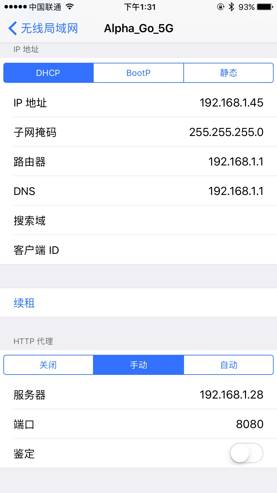
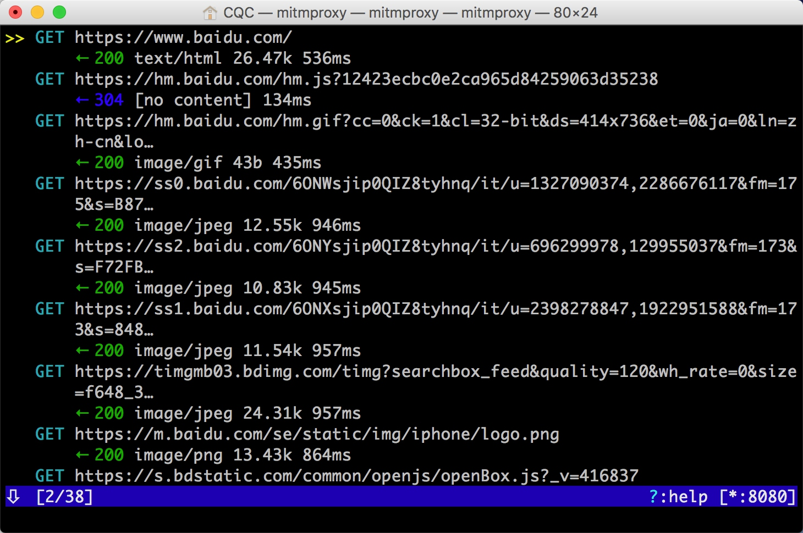
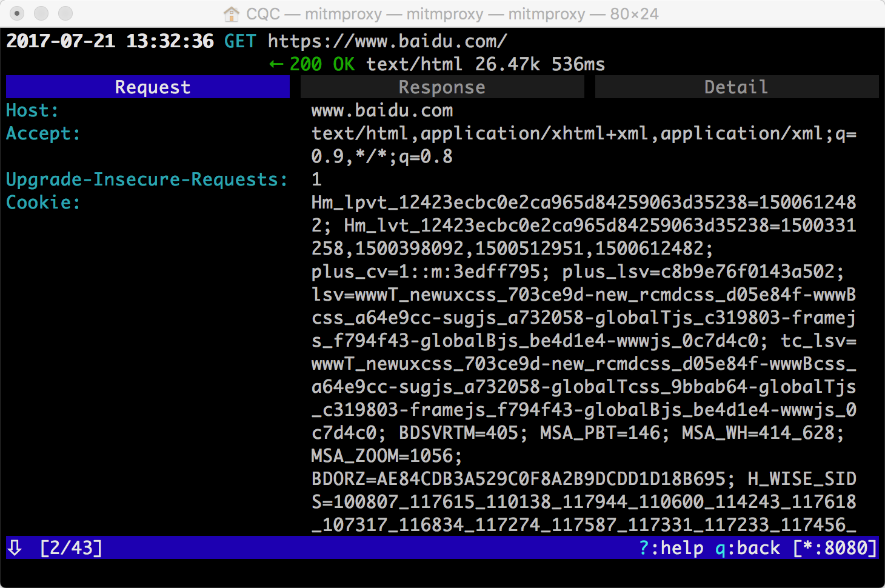
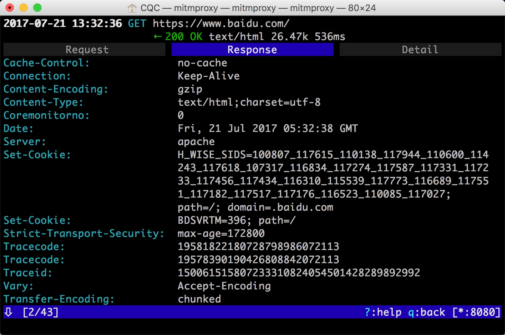
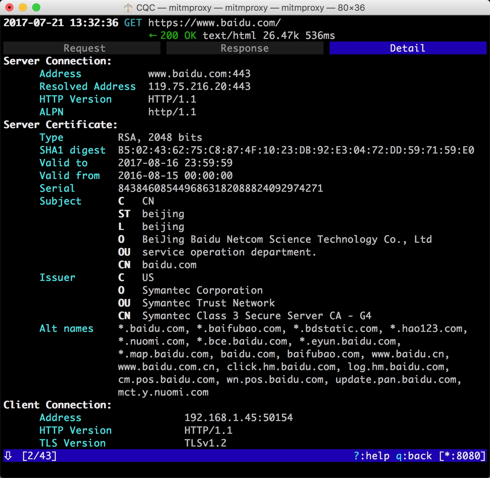
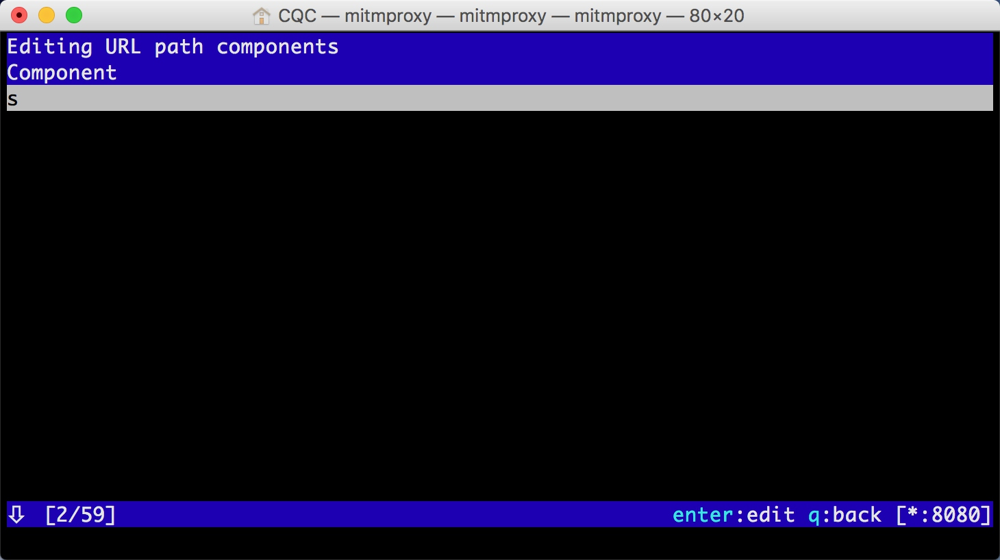
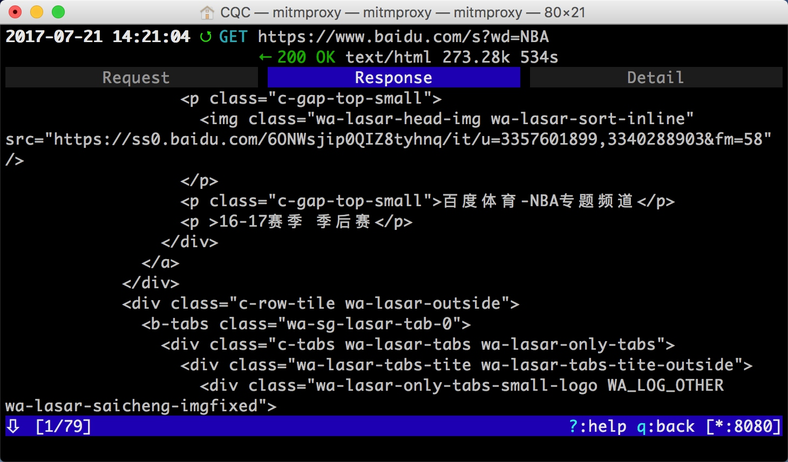
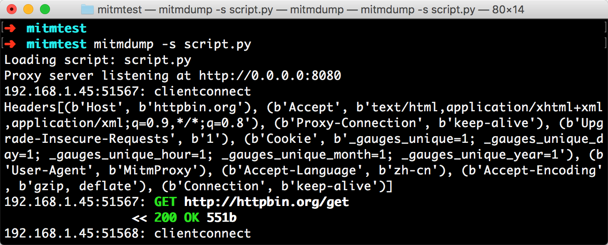
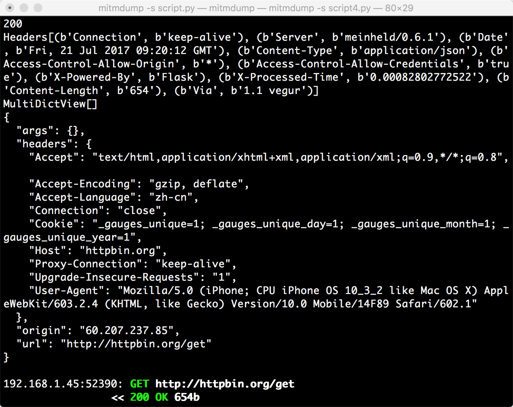

# 11.2 MitmProxy的使用

MitmProxy 是一个支持 HTTP 和 HTTPS 的抓包程序，类似 Fiddler、Charles 的功能，只不过它是一个控制台的形式操作。

同时 MitmProxy 还有两个关联组件，一个是 MitmDump，它是 MitmProxy 的命令行接口，利用它我们可以对接Python 脚本，用 Python 实现监听后的处理。另一个是 MitmWeb，它是一个 Web 程序，通过它我们可以清楚地观察到 MitmProxy 捕获的请求。

本节我们来了解一下它们的用法。

### 1. 准备工作

在本节开始之前请确保已经正确安装好了 MitmProxy，并且手机和 PC 处于同一个局域网下，同时配置好了 MitmProxy 的 CA 证书，具体的配置可以参考第一章的说明。

### 2. MitmProxy的功能

* 拦截 HTTP 和 HTTPS 请求和响应
* 保存 HTTP 会话并进行分析
* 模拟客户端发起请求，模拟服务端返回响应
* 利用反向代理将流量转发给指定的服务器
* 支持 Mac 和 Linux 上的透明代理
* 利用 Python 对 HTTP 请求和响应进行实时处理

### 3. 抓包原理

我们需要先知道使用的思路，和 Charles 一样，首先 MitmProxy 肯定是运行在我们自己的 PC 上的，MitmProxy 运行的时候会在PC的 8080 端口上运行，然后开启一个代理服务，这个实际上是一个 HTTP/HTTPS 的代理。

接下来手机需要和 PC 在同一个局域网内，然后设置代理为 MitmProxy 的代理地址，这样手机在访问互联网的时候流量数据包就会流经 MitmProxy，MitmProxy 再去转发这些数据包到真实的服务器，服务器返回数据包时再由 MitmProxy 转发回手机，这样 MitmProxy 就相当于起了中间人的作用，抓取到所有 Request 和 Response，另外这个过程还可以对接 MitmDump，抓取到的 Request 和 Response 的具体内容都可以直接用 Python 来处理，比如得到 Response 之后我们可以直接进行解析，然后存入数据库，这样就完成了数据的解析和存储过程。

### 4. 设置代理

首先我们需要运行 MitmProxy，命令如下：

启动 MitmProxy 的命令如下：

```
mitmproxy
```

运行之后会在 8080 端口上运行一个代理服务，如图 11-12 所示：


图 11-12 MitmProxy 运行结果

在右下角会出现当前正在监听的端口。

或者启动 MitmDump，它也会监听 8080 端口，命令如下：

```
mitmdump
```

运行结果如图 11-13 所示：


图 11-13 MitmDump 运行结果

然后将手机和 PC 连接在同一局域网下，在手机上设置代理为当前代理，首先看一下 PC 的当前局域网 IP。

Windows 上命令为：

```
ipconfig
```

Linux 和 Mac 上的命令为：

```
ifconfig
```

输出结果如图 11-14 所示：


图 11-14 查看局域网 IP

一般看到 10\.\*\.\*\.\* 或 172\.16\.\*\.\* 或 192\.168\.1\.\* 类似的 IP 就是当前 PC 的局域网 IP，例如此图中的 PC 的 IP 为192.168.1.28，在手机上代理设置类似如图 11-15 所示：



图 11-15 代理设置

这样我们就配置好了 MitmProxy 的的代理了。

### 5. MitmProxy的使用

我们首先看下 MitmProxy 的使用，在这里请确保MitmProxy 正常运行，并且手机和 PC 处于同一个局域网内并且设置了 MitmProxy 的代理，否则以下操作无效，具体的配置方法可以参考第一章。

运行 MitmProxy，命令如下：

```
mitmproxy
```

设置成功之后我们只需要在手机浏览器上访问任意的网页或浏览任意的 APP 即可，例如在手机上打开百度，MitmProxy 页面便会呈现出手机上的所有请求，如图 11-16 所示：



图 11-16 所有请求

这其实就相当于之前我们在浏览器开发者工具监听到的浏览器的请求，在这里我们借助于 MitmProxy 都抓取到了，这个过程 Charles 也完全可以做到。

这里其实是刚才手机上打开百度页面时的所有请求列表，在左下角显示了 2/38 是代表一共发生了 38 个请求，当前箭头所指的是第二个请求。

每个请求开头都有一个 GET 或 POST，这是各个请求的请求方式，紧接的内容是请求的 URL，第二行开头的数字就是请求对应的响应的状态码，后面是响应内容的类型，如 text/html 代表网页文档，image/gif 代表图片，再往后是响应体的大小，最后是响应的时间。

也就是说当前呈现了所有请求和响应的概览，我们可以通过这个页面观察到所有的请求。

如果想查看某个请求的详情，我们可以敲击回车，然后就可以进入到请求的详情页面，如图 11-17 所示：



图 11-17 详情页面

在这里又可以看到 Headers 的详细信息，如 Host、Cookies、User-Agent 等等。

我们可以看到最上方是一个 Request、Response、Detail 的列表，而当前是处在 Request 这个选项上，这时我们再点击 TAB 键即可查看这个请求对应的响应的详情，如图 11-18 所示：



图 11-18 响应详情

在最上面是响应头的信息，下拉之后可以看到响应体的信息，对于当前请求响应体就是网页的源代码。

这时我们再敲击 TAB 键，切换到最后一个选项卡 Detail，即可看到当前请求的详细信息，如服务器的 IP、端口、HTTP 协议版本、客户端的 IP、端口等等，如图 11-19 所示：



图 11-19 详细信息

另外 MitmProxy 还提供了命令行式的编辑功能，我们可以在此页面中重新编辑请求，敲击 e 键即可进入编辑功能，这时它会询问你是要编辑哪部分的内容，如 Cookies、Query、URL 等等，每个选项的第一个字母会高亮显示，再敲击要编辑的内容名称的首字母即可进入该内容的编辑页面，如敲击 m 即可编辑请求的方式，敲击 q 即可修改 GET 请求参数 Query。

这时我们敲击 q 即可编辑 GET 请求参数，进入到编辑 Query 的页面，这时由于没有任何参数，我们可以敲击 a 来增加一行，然后就可以输入参数对应的 Key 和 Value 了，如图 11-20 所示：


图 11-20 编辑页面

例如这里我们输入 Key 为 wd，Value 为 NBA。

然后再敲击 esc 键，再敲击 q 键返回之前的页面，再敲击 e 和 p 键修改 Path，还是和上面一样，敲击 a 增加 Path 的内容，这时我们将 Path 修改为 s，如图 11-21 所示：



图 11-21 编辑页面

接下来再敲击 esc 和 q 键返回，这时我们就可以看到最上面的请求链接就变成了：[https://www.baidu.com/s?wd=NBA](https://www.baidu.com/s?wd=NBA)，这个页面访问之后可以看到百度搜索 NBA 关键词的搜索结果，如图 11-22 所示：


图 11-22 请求详情

这时我们再敲击 a 保存修改，再敲击 r 重新发起修改后的请求，即可看到上方请求方式前面多了一个回旋箭头，这证明重新执行了修改后的请求，这时我们再观察一下响应体内容，即可看到搜索 NBA 的页面结果的源代码了，如图 11-23 所示：



图 11-23 响应结果

以上便是 MitmProxy 的简单使用，利用它我们可以观察到手机上的所有请求还可以对请求进行修改并重新发起。

总体来说，这个功能 Fiddler、Charles 也都有，而且图形界面操作更加方便。那么 MitmProxy 的优势何在？

其实 MitmProxy 的强大之处体现在它的另一个工具MitmDump，有了它我们可以直接对接 Python 来对请求进行处理，下面我们再来看下 MitmDump 的使用。

### 6. MitmDump的使用

MitmDump 是 MitmProxy 的命令行接口，同时还可以对接 Python 对请求进行处理，这是相比 Fiddler、Charles 等工具更加方便的地方，有了它我们可以不用再去手动去截获和分析 HTTP 请求和响应，只需要写好请求和响应的处理逻辑即可，同时还可以实现数据的解析，存储等工作，直接用Python 完成即可。

接下来我们来看下MitmDump的详细使用方法。

#### 实例引入

使用如下命令我们可以启动 MitmProxy，并把截获的数据保存到文件中：

```
mitmdump -w outfile
```

outfile 名称可以任意取，截获的数据都会被保存到此文件中。

另外我们还可以指定一个脚本来处理截获的数据，使用 -s 参数即可：

```
mitmdump -s script.py
```

在这里我们指定了当前处理脚本为 script.py，它需要放置在当前命令执行的目录下。

脚本里我们可以写入如下的代码：

```python
def request(flow):
    flow.request.headers['User-Agent'] = 'MitmProxy'
    print(flow.request.headers)
```

在这里我们定义了一个 request() 方法，参数为 flow，它其实是一个 HTTPFlow 对象，通过 request 属性即可获取到当前请求对象，然后我们接下来打印输出了请求的请求头，然后又将请求头的 User-Agent 修改成了 MitmProxy。

运行之后我们在手机端访问：[http://httpbin.org/get](http://httpbin.org/get)，就可以看到有如下情况发生：

手机端的页面显示如图 11-24 所示：


图 11-24 手机端页面

PC 端控制台输出如图 11-25 所示：



图 11-25 PC 端控制台

首先手机端我们可以观察到返回的结果的 Headers 实际上就是我们请求的 Headers，可以看到 User-Agent 被修改成了 MitmProxy，PC 端控制台输出了修改后的 Headers内容，可以看到其 User-Agent 的内容正是 MitmProxy。

所以现在我们就可以知道，通过这三行的代码我们就可以完成对请求的改写，同时 print() 方法输出的结果都可以呈现在 PC 端控制台上，可以方便地进行调试。

#### 日志输出

MitmDump 提供了专门的日志输出功能，可以设定不同的级别以不同的颜色输出结果，我们把脚本修改成如下内容：

```python
from mitmproxy import ctx

def request(flow):
    flow.request.headers['User-Agent'] = 'MitmProxy'
    ctx.log.info(str(flow.request.headers))
    ctx.log.warn(str(flow.request.headers))
    ctx.log.error(str(flow.request.headers))
```

在这里我们调用了 ctx 模块，它有一个 log 功能，调用不同的输出方法就可以输出不同颜色的结果，方便我们做调试。

例如 info() 方法输出的内容是白色，warn() 方法输出的内容是黄色，error() 方法输出的内容是红色。

运行结果如图 11-26 所示：


 图 11-26 运行结果

不同的颜色对应的不同级别的输出，我们可以将不同的结果合理划分级别输出，利用它我们可以直观方便地查看调试信息。

#### Request

在最开始我们实现了 request() 方法并且对 Headers 进行了修改，下面我们来看下针对于 Request 还有哪些常用的功能。

我们先用一个实例来感受一下：

```python
from mitmproxy import ctx

def request(flow):
    request = flow.request
    info = ctx.log.info
    info(request.url)
    info(str(request.headers))
    info(str(request.cookies))
    info(request.host)
    info(request.method)
    info(str(request.port))
    info(request.scheme)
```

我们修改脚本如上内容，然后在手机上打开百度，即可看到 PC 端控制台输出了一系列的请求，在这里我们找到第一个请求。可以看到控制台打印输出了 Request 的一些常见属性，如 URL、Headers、Cookies、Host、Method、Scheme 等。

其对应的输出结果如图 11-27 所示：


图 11-27 输出结果

可以看到结果中分别输出了请求链接、请求头、请求 Cookies、请求 Host、请求方法、请求端口、请求协议这些内容。

同时我们还可以对任意的属性进行修改，就像最初修改 Headers 一样，直接赋值即可。

例如我们在这里将请求的 URL 修改一下，脚本修改如下：

```python
def request(flow):
    url = 'https://httpbin.org/get'
    flow.request.url = url
```

我们可以看到手机端得到如下结果，如图 11-28 所示：


图 11-28 手机端页面

比较有意思的是，在浏览器最上方还是呈现百度的 URL，但是可以发现页面已经变成了 httpbin.org 的页面了，另外还可以观察到 Cookies 明显还是百度的 Cookies。

我们只是通过简单的脚本就成功把请求修改为其他的站点，通过这种方式修改和伪造请求就变得轻而易举。

通过这个实例我们还可以知道，其实有时候我们看到的 URL 虽然是正确的，但是内容并非是正确的，我们需要进一步提高自己的安全防范意识。

另外 Request 其实还有很多属性，在此不再一一列举，更多属性可以参考：[http://docs.mitmproxy.org/en/latest/scripting/api.html](http://docs.mitmproxy.org/en/latest/scripting/api.html)。

只要我们了解了基本的用法，获取和修改 Reqeust 的任意内容都不在话下，比如可以修改 Cookies、添加代理等方式来规避反爬。

#### Response

其实对于爬虫来说，我们更加关心的其实是 Response 的内容，因为 Response Body 才是爬取的结果，对于 Response 来说，MitmDump 也提供了对应的处理接口，正是 response() 方法，下面我们用一个实例感受一下：

```python
from mitmproxy import ctx

def response(flow):
    response = flow.response
    info = ctx.log.info
    info(str(response.status_code))
    info(str(response.headers))
    info(str(response.cookies))
    info(str(response.text))
```

将脚本修改为如上内容，然后手机访问：[http://httpbin.org/get](http://httpbin.org/get)。

在这里我们打印输出了 Response 的 status_code、headers、cookies、text 这几个属性，其中最主要的 text 属性就是网页的源代码。

PC 端控制台输出如图 11-29 所示：



图 11-29 PC 端控制台

可以看到控制台输出了 Response 的状态码、响应头、Cookies、响应体这几部分内容。

所以这样我们就可以通过 response() 方法获取每个请求的响应内容了，接下来再进行响应的信息提取和存储就可以成功完成爬取了。

### 7. 结语

本节我们介绍了 MitmProxy 和 MitmDump 的用法，在下一节我们会利用它们来实现一个APP的爬取实战。

