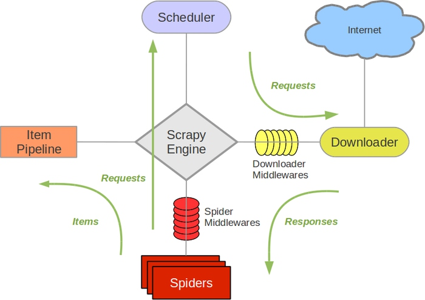

# 13.1 Scrapy 框架介绍

Scrapy是一个基于Twisted的异步处理框架，是纯Python实现的爬虫框架，其架构清晰，模块之间的耦合程度低，可扩展性极强，可以灵活完成各种需求。我们只需要定制开发几个模块就可以轻松实现一个爬虫。

### 1. 架构介绍

首先我们来看下 Scrapy 框架的架构，如图 13-1 所示：



图 13-1 Scrapy 架构

它可以分为如下的几个部分。

* Engine，引擎，用来处理整个系统的数据流处理，触发事务，是整个框架的核心。
* Item，项目，它定义了爬取结果的数据结构，爬取的数据会被赋值成该对象。
* Scheduler， 调度器，用来接受引擎发过来的请求并加入队列中，并在引擎再次请求的时候提供给引擎。
* Downloader，下载器，用于下载网页内容，并将网页内容返回给蜘蛛。
* Spiders，蜘蛛，其内定义了爬取的逻辑和网页的解析规则，它主要负责解析响应并生成提取结果和新的请求。
* Item Pipeline，项目管道，负责处理由蜘蛛从网页中抽取的项目，它的主要任务是清洗、验证和存储数据。
* Downloader Middlewares，下载器中间件，位于引擎和下载器之间的钩子框架，主要是处理引擎与下载器之间的请求及响应。
* Spider Middlewares， 蜘蛛中间件，位于引擎和蜘蛛之间的钩子框架，主要工作是处理蜘蛛输入的响应和输出的结果及新的请求。

### 2. 数据流

Scrapy 中的数据流由引擎控制，其过程如下:

* Engine 首先打开一个网站，找到处理该网站的 Spider 并向该 Spider请求第一个要爬取的URL。
* Engine 从 Spider 中获取到第一个要爬取的 URL 并通过 Scheduler 以 Request 的形式调度。
* Engine 向 Scheduler 请求下一个要爬取的 URL。
* Scheduler 返回下一个要爬取的 URL 给 Engine，Engine 将 URL 通过 Downloader Middlewares 转发给 Downloader 下载。
* 一旦页面下载完毕， Downloader 生成一个该页面的 Response，并将其通过Downloader Middlewares 发送给 Engine。
* Engine 从下载器中接收到 Response 并通过 Spider Middlewares 发送给 Spider 处理。
* Spider 处理 Response 并返回爬取到的 Item 及新的 Request 给 Engine。
* Engine 将 Spider返回的 Item 给 Item Pipeline，将新的 Request 给 Scheduler。
* 重复第二步到最后一步，直到  Scheduler 中没有更多的 Request，Engine 关闭该网站，爬取结束。

通过多个组件的相互协作、不同组件完成工作的不同、组件对异步处理的支持，Scrapy最大限度地利用了网络带宽，大大提高了数据爬取和处理的效率。

### 3. 项目结构

Scrapy框架和pyspider不同，它是通过命令行来创建项目的，代码的编写还是需要IDE。项目创建之后，项目文件结构如下所示：

```
scrapy.cfg
project/
    __init__.py
    items.py
    pipelines.py
    settings.py
    middlewares.py
    spiders/
        __init__.py
        spider1.py
        spider2.py
        ...
```

在此要将各个文件的功能描述如下：

- scrapy.cfg：它是Scrapy项目的配置文件，其内定义了项目的配置文件路径、部署相关信息等内容。

- items.py：它定义Item数据结构，所有的Item的定义都可以放这里。

- pipelines.py：它定义Item Pipeline的实现，所有的Item Pipeline的实现都可以放这里。

- settings.py：它定义项目的全局配置。

- middlewares.py：它定义Spider Middlewares和Downloader Middlewares的实现。

- spiders：其内包含一个个Spider的实现，每个Spider都有一个文件。

### 4. 结语

本节介绍了Scrapy框架的基本架构、数据流过程以及项目结构。后面我们会详细了解Scrapy的用法，感受它的强大。

