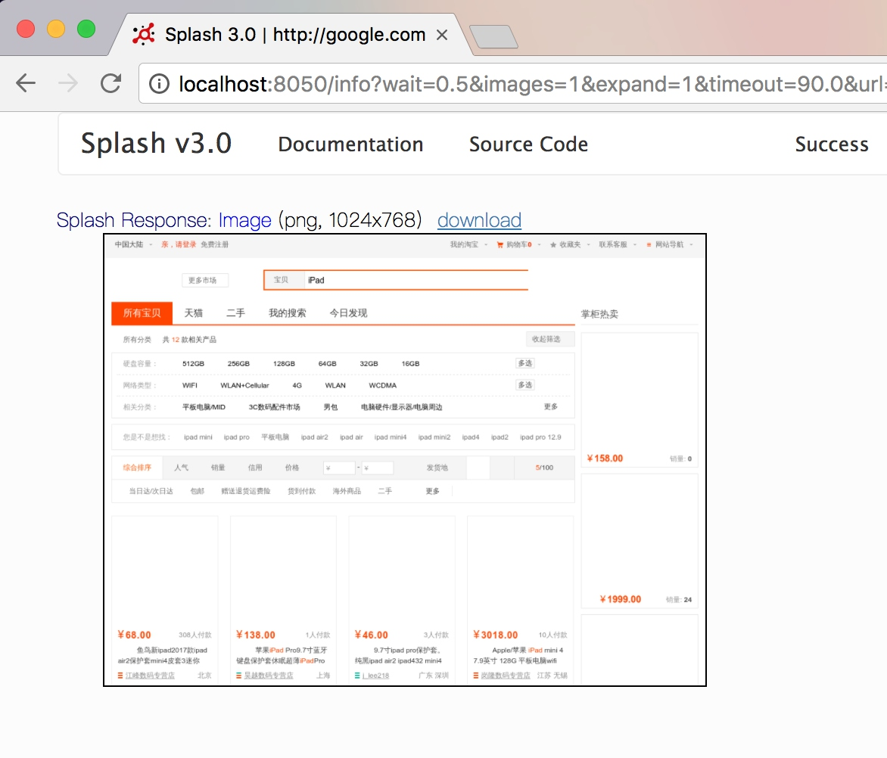
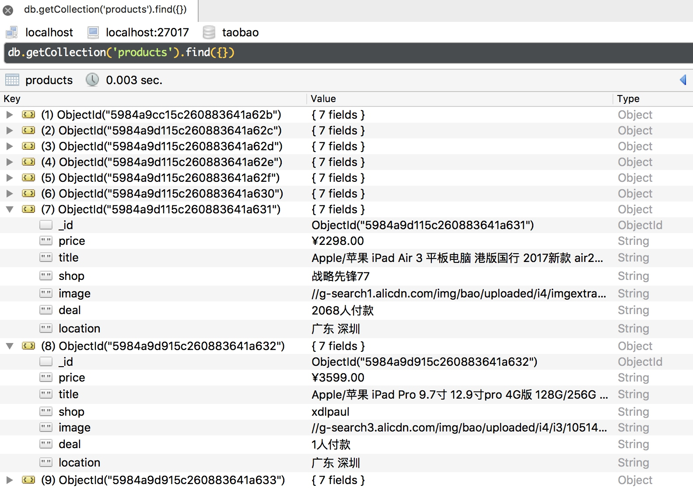

# Scrapy对接Splash

在上一节我们实现了Scrapy对接Selenium抓取淘宝商品的过程，这是一种抓取JavaScript渲染页面的方式，除了使用Selenium还有Splash同样可以达到同样的功能，本节我们来了解下Scrapy对接Splash来进行页面抓取的方式。

## 环境准备

首先在这之前请确保已经正确安装好了Splash并正常运行，同时安装好了ScrapySplash库，如果没有安装好可以参考第一章的安装说明。

## 开始

接下来我们首先新建一个项目，名称叫做scrapysplashtest，命令如下：

```
scrapy startproject scrapysplashtest
```

随后新建一个Spider，命令如下：

```
scrapy genspider taobao www.taobao.com
```

随后我们可以参考ScrapySplash的配置说明进行一步步的配置，链接如下：[https://github.com/scrapy-plugins/scrapy-splash#configuration](https://github.com/scrapy-plugins/scrapy-splash#configuration)。

修改settings.py，首先将SPLASH_URL配置一下，在这里我们的Splash是在本地运行的，所以可以直接配置本地的地址：

```python
SPLASH_URL = 'http://localhost:8050'
```

如果Splash是在远程服务器运行的，那此处就应该配置为远程的地址，例如如果运行在IP为120.27.34.25的服务器上，则此处应该配置为：

```python
SPLASH_URL = 'http://120.27.34.25:8050'
```

接下来我们还需要配置几个Middleware，代码如下：

```python
DOWNLOADER_MIDDLEWARES = {
    'scrapy_splash.SplashCookiesMiddleware': 723,
    'scrapy_splash.SplashMiddleware': 725,
    'scrapy.downloadermiddlewares.httpcompression.HttpCompressionMiddleware': 810,
}
SPIDER_MIDDLEWARES = {
    'scrapy_splash.SplashDeduplicateArgsMiddleware': 100,
}
```

在这里配置了三个Downloader Middleware和一个Spider Middleware，这是ScrapySplash的核心部分，配置了它们我们就可以对接Splash进行页面抓取，在这里我们不再需要像对接Selenium那样实现一个Downloader Middleware，ScrapySplash库都为我们准备好了，直接配置即可。

接着还需要配置一个去重的类DUPEFILTER_CLASS，代码如下：

```python
DUPEFILTER_CLASS = 'scrapy_splash.SplashAwareDupeFilter'
```

最后还需要配置一个Cache存储HTTPCACHE_STORAGE，代码如下：

```python
HTTPCACHE_STORAGE = 'scrapy_splash.SplashAwareFSCacheStorage'
```

配置完成之后我们就可以利用Splash来抓取页面了，例如我们可以直接生成一个SplashRequest对象并传递相应的参数，Scrapy会将此请求转发给Splash，Splash对页面进行渲染加载，然后再将渲染结果传递回来，此时Response的内容就是渲染完成的页面结果了，最后交给Spider解析即可。

示例用法如下：

```python
yield SplashRequest(url, self.parse_result,
    args={
        # optional; parameters passed to Splash HTTP API
        'wait': 0.5,
        # 'url' is prefilled from request url
        # 'http_method' is set to 'POST' for POST requests
        # 'body' is set to request body for POST requests
    },
    endpoint='render.json', # optional; default is render.html
    splash_url='<url>',     # optional; overrides SPLASH_URL
)
```
在这里构造了一个SplashRequest对象，前两个参数依然是请求的URL和回调函数，另外还可以通过args传递一些渲染参数，例如等待时间wait等，还可以根据endpoint参数指定渲染接口，另外还有更多的参数可以参考文档的说明：[https://github.com/scrapy-plugins/scrapy-splash#requests](https://github.com/scrapy-plugins/scrapy-splash#requests)。

另外我们也可以生成Request对象，关于Splash的配置通过meta属性配置即可，代码如下：

```python
yield scrapy.Request(url, self.parse_result, meta={
    'splash': {
        'args': {
            # set rendering arguments here
            'html': 1,
            'png': 1,
            # 'url' is prefilled from request url
            # 'http_method' is set to 'POST' for POST requests
            # 'body' is set to request body for POST requests
        },
        # optional parameters
        'endpoint': 'render.json',  # optional; default is render.json
        'splash_url': '<url>',      # optional; overrides SPLASH_URL
        'slot_policy': scrapy_splash.SlotPolicy.PER_DOMAIN,
        'splash_headers': {},       # optional; a dict with headers sent to Splash
        'dont_process_response': True, # optional, default is False
        'dont_send_headers': True,  # optional, default is False
        'magic_response': False,    # optional, default is True
    }
})
```

两种方式达到的效果是相同的。

本节我们要做的抓取是淘宝商品信息，涉及到页面加载等待、模拟点击翻页等操作，所以这里就需要Lua脚本来实现了，所以我们在这里可以首先定义一个Lua脚本，来实现页面加载、模拟点击翻页的功能，代码如下：

```lua
function main(splash, args)
  args = {
    url="https://s.taobao.com/search?q=iPad",
    wait=5,
    page=5
  }
  splash.images_enabled = false
  assert(splash:go(args.url))
  assert(splash:wait(args.wait))
  js = string.format("document.querySelector('#mainsrp-pager div.form > input').value=%d;document.querySelector('#mainsrp-pager div.form > span.btn.J_Submit').click()", args.page)
  splash:evaljs(js)
  assert(splash:wait(args.wait))
  return splash:png()
end
```

在这里我们定义了三个参数，请求的链接url、等待时间wait、分页页码page，然后将图片加载禁用，随后请求淘宝的商品列表页面，然后通过evaljs()方法调用了JavaScript代码实现了页码填充和翻页点击，最后将页面截图返回。我们将脚本放到Splash中运行一下，正常获取到了页面截图：



可以看到翻页操作也成功实现，如图所示即为当前页码，和我们传入的页码page参数是相同的：


所以在这里我们只需要在Spider里面用SplashRequest对接这个Lua脚本就好了，实现如下：

```python
from scrapy import Spider
from urllib.parse import quote
from scrapysplashtest.items import ProductItem
from scrapy_splash import SplashRequest

script = """
function main(splash, args)
  splash.images_enabled = false
  assert(splash:go(args.url))
  assert(splash:wait(args.wait))
  js = string.format("document.querySelector('#mainsrp-pager div.form > input').value=%d;document.querySelector('#mainsrp-pager div.form > span.btn.J_Submit').click()", args.page)
  splash:evaljs(js)
  assert(splash:wait(args.wait))
  return splash:html()
end
"""

class TaobaoSpider(Spider):
    name = 'taobao'
    allowed_domains = ['www.taobao.com']
    base_url = 'https://s.taobao.com/search?q='
    
    def start_requests(self):
        for keyword in self.settings.get('KEYWORDS'):
            for page in range(1, self.settings.get('MAX_PAGE') + 1):
                url = self.base_url + quote(keyword)
                yield SplashRequest(url, callback=self.parse, endpoint='execute', args={'lua_source': script, 'page': page, 'wait': 7})
```

在这里我们把Lua脚本定义成长字符串，通过SplashRequest的args来传递参数，同时接口修改为execute，另外args参数里还有一个lua_source字段用于指定Lua脚本内容，这样我们就成功构造了一个SplashRequest，对接Splash的工作就完成了。

其他的配置不需要更改，Item、Item Pipeline等设置同上节对接Selenium的方式，同时parse回调函数也是完全一致的。

接下来我们通过如下命令运行爬虫：

```
scrapy crawl taobao
```

运行结果如下：


由于Splash和Scrapy都支持异步处理，我们可以看到同时会有多个抓取成功的结果，而Selenium的对接过程中每个页面渲染下载过程是在Downloader Middleware里面完成的，所以整个过程是堵塞式的，Scrapy会等待这个过程完成后再继续处理和调度其他请求，影响了爬取效率，因此使用Splash爬取效率上比Selenium高出很多。

最后我们再看下MongoDB的结果：



结果同样正常保存到了MongoDB中。

因此，在Scrapy中要处理JavaScript渲染的页面建议使用Splash，这样不会破坏Scrapy中的异步处理过程，会大大提高爬取效率，而且Splash的安装和配置比较简单，通过API调用的方式也实现了模块分离，大规模爬取时部署起来也更加方便。

本节源代码：[https://github.com/Python3WebSpider/ScrapySplashTest](https://github.com/Python3WebSpider/ScrapySplashTest)