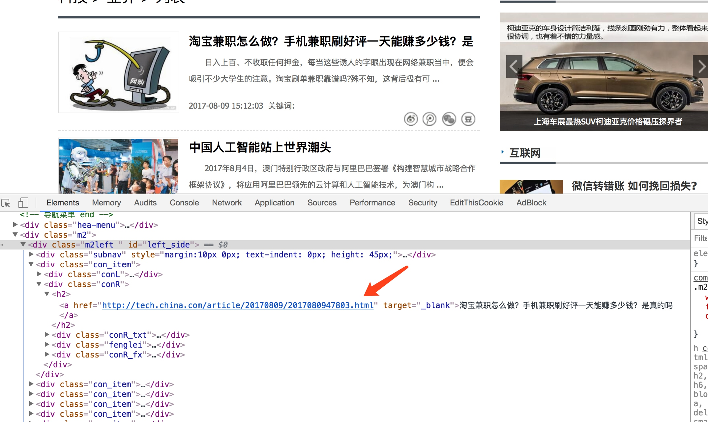
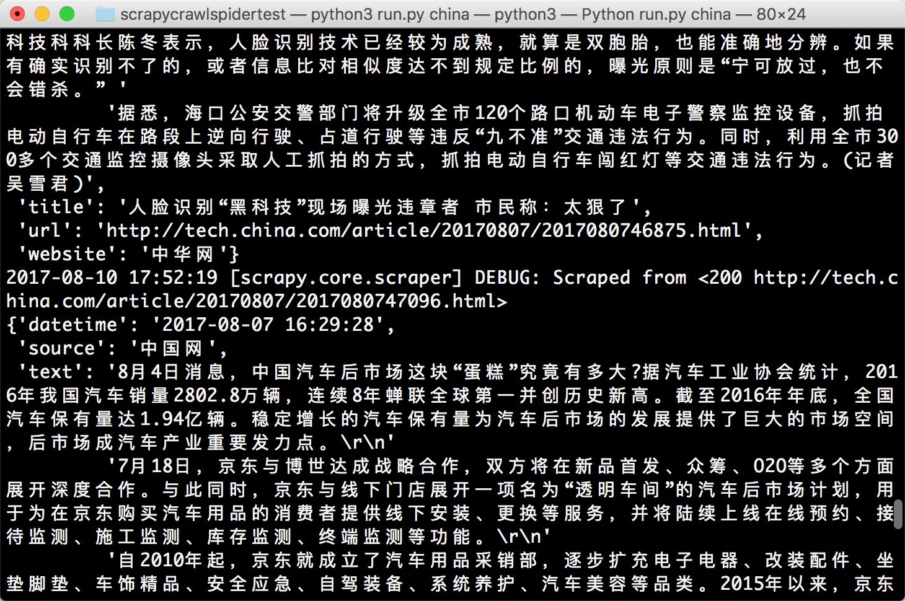

# 13.10 Scrapy通用爬虫

通过Scrapy，我们可以轻松地完成一个站点爬虫的编写。但如果抓取的站点量非常大，比如爬取各大媒体的新闻信息，多个Spider则可能包含很多重复代码。

如果我们将各个站点的Spider的公共部分保留下来，不同的部分提取出来作为单独的配置，如爬取规则、页面解析方式等抽离出来做成一个配置文件，那么我们在新增一个爬虫的时候，只需要实现这些网站的爬取规则和提取规则即可。

本节我们就来探究一下Scrapy通用爬虫的实现方法。

### 1. CrawlSpider

在实现通用爬虫之前我们需要先了解一下 CrawlSpider，其官方文档链接为：[http://scrapy.readthedocs.io/en/latest/topics/spiders.html#crawlspider](http://scrapy.readthedocs.io/en/latest/topics/spiders.html#crawlspider)。

CrawlSpider是Scrapy提供的一个通用Spider。在Spider里，我们可以指定一些爬取规则来实现页面的提取，这些爬取规则由一个专门的数据结构Rule表示。Rule里包含提取和跟进页面的配置，Spider会根据Rule来确定当前页面中的哪些链接需要继续爬取、哪些页面的爬取结果需要用哪个方法解析等。

CrawlSpider继承自Spider类。除了Spider类的所有方法和属性，它还提供了一个非常重要的属性和方法。

* rules，它是爬取规则属性，是包含一个或多个Rule对象的列表。每个Rule对爬取网站的动作都做了定义，CrawlSpider会读取rules的每一个Rule并进行解析。

* parse_start_url()，它是一个可重写的方法。当start_urls里对应的Request得到Response时，该方法被调用，它会分析Response并必须返回Item对象或者Request对象。

这里最重要的内容莫过于Rule的定义了，它的定义和参数如下所示：

```python
class scrapy.contrib.spiders.Rule(link_extractor, callback=None, cb_kwargs=None, follow=None, process_links=None, process_request=None)
```

下面对其参数依次说明：

* link_extractor，是一个 Link Extractor 对象。通过它，Spider可以知道从爬取的页面中提取哪些链接。提取出的链接会自动生成Request。它又是一个数据结构，一般常用LxmlLinkExtractor对象作为参数，其定义和参数如下所示：

```python
class scrapy.linkextractors.lxmlhtml.LxmlLinkExtractor(allow=(), deny=(), allow_domains=(), deny_domains=(), deny_extensions=None, restrict_xpaths=(), restrict_css=(), tags=('a', 'area'), attrs=('href', ), canonicalize=False, unique=True, process_value=None, strip=True)
```

allow是一个正则表达式或正则表达式列表，它定义了从当前页面提取出的链接哪些是符合要求的，只有符合要求的链接才会被跟进。deny则相反。allow_domains定义了符合要求的域名，只有此域名的链接才会被跟进生成新的Request，它相当于域名白名单。deny_domains则相反，相当于域名黑名单。restrict_xpaths定义了从当前页面中XPath匹配的区域提取链接，其值是XPath表达式或XPath表达式列表。restrict_css定义了从当前页面中CSS选择器匹配的区域提取链接，其值是CSS选择器或CSS选择器列表。还有一些其他参数代表了提取链接的标签、是否去重、链接的处理等内容，使用的频率不高。可以参考文档的参数说明：http://scrapy.readthedocs.io/en/latest/topics/link-extractors.html#module-scrapy.linkextractors.lxmlhtml。

* callback，即回调函数，和之前定义Request的callback有相同的意义。每次从link_extractor中获取到链接时，该函数将会调用。该回调函数接收一个response作为其第一个参数，并返回一个包含Item或Request对象的列表。注意，避免使用parse()作为回调函数。由于CrawlSpider使用parse()方法来实现其逻辑，如果parse()方法覆盖了，CrawlSpider将会运行失败。

* cb_kwargs，字典，它包含传递给回调函数的参数。

* follow，布尔值，即True或False，它指定根据该规则从response提取的链接是否需要跟进。如果callback参数为None，follow默认设置为True，否则默认为False。

* process_links，指定处理函数，从link_extractor中获取到链接列表时，该函数将会调用，它主要用于过滤。

* process_request，同样是指定处理函数，根据该Rule提取到每个Request时，该函数都会调用，对Request进行处理。该函数必须返回Request或者None。

以上内容便是CrawlSpider中的核心Rule的基本用法。但这些内容可能还不足以完成一个CrawlSpider爬虫。下面我们利用CrawlSpider实现新闻网站的爬取实例，来更好地理解Rule的用法。

### 2. Item Loader

我们了解了利用CrawlSpider的Rule来定义页面的爬取逻辑，这是可配置化的一部分内容。但是，Rule并没有对Item的提取方式做规则定义。对于Item的提取，我们需要借助另一个模块Item Loader来实现。

Item Loader提供一种便捷的机制来帮助我们方便地提取Item。它提供的一系列API可以分析原始数据对Item进行赋值。Item提供的是保存抓取数据的容器，而Item Loader提供的是填充容器的机制。有了它，数据的提取会变得更加规则化。

Item Loader的API如下所示：

```python
class scrapy.loader.ItemLoader([item, selector, response, ] **kwargs)
```

Item Loader的API返回一个新的Item Loader来填充给定的Item。如果没有给出Item，则使用default_item_class中的类自动实例化。另外，它传入selector和response参数来使用选择器或响应参数实例化。

下面将依次说明Item Loader的API参数。

* item，Item 对象，可以调用 add_xpath()、add_css() 或 add_value() 等方法来填充 Item 对象。
* selector，Selector 对象，用来提取填充数据的选择器。
* response，Response 对象，用于使用构造选择器的 Response。

一个比较典型的 Item Loader 实例如下：

```python
from scrapy.loader import ItemLoader
from project.items import Product

def parse(self, response):
    loader = ItemLoader(item=Product(), response=response)
    loader.add_xpath('name', '//div[@class="product_name"]')
    loader.add_xpath('name', '//div[@class="product_title"]')
    loader.add_xpath('price', '//p[@id="price"]')
    loader.add_css('stock', 'p#stock]')
    loader.add_value('last_updated', 'today')
    return loader.load_item()
```

这里首先声明一个Product Item，用该Item和Response对象实例化ItemLoader，调用add_xpath()方法把来自两个不同位置的数据提取出来，分配给name属性，再用add_xpath()、add_css()、add_value()等方法对不同属性依次赋值，最后调用load_item()方法实现Item的解析。这种方式比较规则化，我们可以把一些参数和规则单独提取出来做成配置文件或存到数据库，即可实现可配置化。

另外，Item Loader每个字段中都包含了一个Input Processor（输入处理器）和一个Output Processor（输出处理器）。Input Processor收到数据时立刻提取数据，Input Processor的结果被收集起来并且保存在ItemLoader内，但是不分配给Item。收集到所有的数据后，load_item()方法被调用来填充再生成Item对象。在调用时会先调用Output Processor来处理之前收集到的数据，然后再存入Item中，这样就生成了Item。

下面将介绍一些内置的Processor。

#### Identity

Identity是最简单的Processor，不进行任何处理，直接返回原来的数据。

#### TakeFirst

TakeFirst返回列表的第一个非空值，类似extract_first()的功能，常用作Output Processor，如下所示：

```python
from scrapy.loader.processors import TakeFirst
processor = TakeFirst()
print(processor(['', 1, 2, 3]))
```

输出结果如下所示：

```
1
```

经过此Processor处理后的结果返回了第一个不为空的值。

#### Join

Join方法相当于字符串的join()方法，可以把列表拼合成字符串，字符串默认使用空格分隔，如下所示：

```python
from scrapy.loader.processors import Join
processor = Join()
print(processor(['one', 'two', 'three']))
```

输出结果如下所示：

```
one two three
```

它也可以通过参数更改默认的分隔符，例如改成逗号：

```python
from scrapy.loader.processors import Join
processor = Join(',')
print(processor(['one', 'two', 'three']))
```

运行结果如下所示：

```
one,two,three
```

#### Compose

Compose是用给定的多个函数的组合而构造的Processor，每个输入值被传递到第一个函数，其输出再传递到第二个函数，依次类推，直到最后一个函数返回整个处理器的输出，如下所示：

```python
from scrapy.loader.processors import Compose
processor = Compose(str.upper, lambda s: s.strip())
print(processor(' hello world'))
```

运行结果如下所示：

```
HELLO WORLD
```

在这里我们构造了一个Compose Processor，传入一个开头带有空格的字符串。Compose Processor的参数有两个：第一个是str.upper，它可以将字母全部转为大写；第二个是一个匿名函数，它调用strip()方法去除头尾空白字符。Compose会顺次调用两个参数，最后返回结果的字符串全部转化为大写并且去除了开头的空格。

#### MapCompose

与Compose类似，MapCompose可以迭代处理一个列表输入值，如下所示：

```python
from scrapy.loader.processors import MapCompose
processor = MapCompose(str.upper, lambda s: s.strip())
print(processor(['Hello', 'World', 'Python']))
```

运行结果如下所示：

```
['HELLO', 'WORLD', 'PYTHON']
```

被处理的内容是一个可迭代对象，MapCompose会将该对象遍历然后依次处理。

#### SelectJmes

SelectJmes可以查询JSON，传入Key，返回查询所得的Value。不过需要先安装jmespath库才可以使用它，命令如下所示：

```
pip3 install jmespath
```

安装好jmespath之后，便可以使用这个Processor了，如下所示：

```python
from scrapy.loader.processors import SelectJmes
proc = SelectJmes('foo')
processor = SelectJmes('foo')
print(processor({'foo': 'bar'}))
```

运行结果：

```
bar
```

以上内容便是一些常用的Processor，在本节的实例中我们会使用Processor来进行数据的处理。

接下来，我们用一个实例来了解Item Loader的用法。

### 3. 本节目标

我们以中华网科技类新闻为例，来了解CrawlSpider和Item Loader的用法，再提取其可配置信息实现可配置化。官网链接为：http://tech.china.com/。我们需要爬取它的科技类新闻内容，链接为：http://tech.china.com/articles/，页面如图13-19所示。

我们要抓取新闻列表中的所有分页的新闻详情，包括标题、正文、时间、来源等信息。


图 13-19 爬取站点

### 4. 新建项目

首先新建一个Scrapy项目，名为scrapyuniversal，如下所示：

```
scrapy startproject scrapyuniversal
```

创建一个CrawlSpider，需要先制定一个模板。我们可以先看看有哪些可用模板，命令如下所示：

```
scrapy genspider -l
```

运行结果如下所示：

```
Available templates:
  basic
  crawl
  csvfeed
  xmlfeed
```

之前创建Spider的时候，我们默认使用了第一个模板basic。这次要创建CrawlSpider，就需要使用第二个模板crawl，创建命令如下所示：

```
scrapy genspider -t crawl china tech.china.com
```

运行之后便会生成一个CrawlSpider，其内容如下所示：

```python
from scrapy.linkextractors import LinkExtractor
from scrapy.spiders import CrawlSpider, Rule

class ChinaSpider(CrawlSpider):
    name = 'china'
    allowed_domains = ['tech.china.com']
    start_urls = ['http://tech.china.com/']

    rules = (
        Rule(LinkExtractor(allow=r'Items/'), callback='parse_item', follow=True),
    )

    def parse_item(self, response):
        i = {}
        #i['domain_id'] = response.xpath('//input[@id="sid"]/@value').extract()
        #i['name'] = response.xpath('//div[@id="name"]').extract()
        #i['description'] = response.xpath('//div[@id="description"]').extract()
        return i
```

这次生成的Spider内容多了一个rules属性的定义。Rule的第一个参数是LinkExtractor，就是上文所说的LxmlLinkExtractor，只是名称不同。同时，默认的回调函数也不再是parse，而是parse_item。

### 5. 定义Rule

要实现新闻的爬取，我们需要做的就是定义好Rule，然后实现解析函数。下面我们就来一步步实现这个过程。

首先将start_urls修改为起始链接，代码如下所示：

```python
start_urls = ['http://tech.china.com/articles/']
```

之后，Spider爬取start_urls里面的每一个链接。所以这里第一个爬取的页面就是我们刚才所定义的链接。得到Response之后，Spider就会根据每一个Rule来提取这个页面内的超链接，去生成进一步的Request。接下来，我们就需要定义Rule来指定提取哪些链接。

当前页面如图 13-20 所示：


图 12-20 页面内容

这是新闻的列表页，下一步自然就是将列表中的每条新闻详情的链接提取出来。这里直接指定这些链接所在区域即可。查看源代码，所有链接都在ID为left_side的节点内，具体来说是它内部的class为con_item的节点，如图13-21所示。



图 13-21 列表源码

此处我们可以用LinkExtractor的restrict_xpaths属性来指定，之后Spider就会从这个区域提取所有的超链接并生成Request。但是，每篇文章的导航中可能还有一些其他的超链接标签，我们只想把需要的新闻链接提取出来。真正的新闻链接路径都是以article开头的，我们用一个正则表达式将其匹配出来再赋值给allow参数即可。另外，这些链接对应的页面其实就是对应的新闻详情页，而我们需要解析的就是新闻的详情信息，所以此处还需要指定一个回调函数callback。

到现在我们就可以构造出一个Rule了，代码如下所示：

```python
Rule(LinkExtractor(allow='article\/.*\.html', restrict_xpaths='//div[@id="left_side"]//div[@class="con_item"]'), callback='parse_item')
```

接下来，我们还要让当前页面实现分页功能，所以还需要提取下一页的链接。分析网页源码之后可以发现下一页链接是在ID为pageStyle的节点内，如图13-22所示。


图 13-22 分页源码

但是，下一页节点和其他分页链接区分度不高，要取出此链接我们可以直接用XPath的文本匹配方式，所以这里我们直接用LinkExtractor的restrict_xpaths属性来指定提取的链接即可。另外，我们不需要像新闻详情页一样去提取此分页链接对应的页面详情信息，也就是不需要生成Item，所以不需要加callback参数。另外这下一页的页面如果请求成功了就需要继续像上述情况一样分析，所以它还需要加一个follow参数为True，代表继续跟进匹配分析。其实，follow参数也可以不加，因为当callback为空的时候，follow默认为True。此处Rule定义为如下所示：

```python
Rule(LinkExtractor(restrict_xpaths='//div[@id="pageStyle"]//a[contains(., "下一页")]'))
```

所以现在 rules 就变成了：

```python
rules = (
    Rule(LinkExtractor(allow='article\/.*\.html', restrict_xpaths='//div[@id="left_side"]//div[@class="con_item"]'), callback='parse_item'),
    Rule(LinkExtractor(restrict_xpaths='//div[@id="pageStyle"]//a[contains(., "下一页")]'))
)
```

接着我们运行一下代码，命令如下：

```
scrapy crawl china
```

现在已经实现页面的翻页和详情页的抓取了，我们仅仅通过定义了两个Rule即实现了这样的功能，运行效果如图13-23所示。


图 13-23 运行效果

### 6. 解析页面

接下来我们需要做的就是解析页面内容了，将标题、发布时间、正文、来源提取出来即可。首先定义一个Item，如下所示：

```python
from scrapy import Field, Item

class NewsItem(Item):
    title = Field()
    url = Field()
    text = Field()
    datetime = Field()
    source = Field()
    website = Field()
```

这里的字段分别指新闻标题、链接、正文、发布时间、来源、站点名称，其中站点名称直接赋值为中华网。因为既然是通用爬虫，肯定还有很多爬虫也来爬取同样结构的其他站点的新闻内容，所以需要一个字段来区分一下站点名称。

详情页的预览图如图13-24所示。


图 13-24 详情页面

如果像之前一样提取内容，就直接调用response变量的xpath()、css()等方法即可。这里parse_item()方法的实现如下所示：

```python
def parse_item(self, response):
    item = NewsItem()
    item['title'] = response.xpath('//h1[@id="chan_newsTitle"]/text()').extract_first()
    item['url'] = response.url
    item['text'] = ''.join(response.xpath('//div[@id="chan_newsDetail"]//text()').extract()).strip()
    item['datetime'] = response.xpath('//div[@id="chan_newsInfo"]/text()').re_first('(\d+-\d+-\d+\s\d+:\d+:\d+)')
    item['source'] = response.xpath('//div[@id="chan_newsInfo"]/text()').re_first('来源：(.*)').strip()
    item['website'] = '中华网'
    yield item
```

这样我们就把每条新闻的信息提取形成了一个NewsItem对象。

这时实际上我们就已经完成了Item的提取。再运行一下Spider，如下所示：

```
scrapy crawl china
```

输出内容如图 13-25 所示：


图 13-25 输出内容

现在我们就可以成功将每条新闻的信息提取出来。

不过我们发现这种提取方式非常不规整。下面我们再用Item Loader，通过add_xpath()、add_css()、add_value()等方式实现配置化提取。我们可以改写parse_item()，如下所示：

```python
def parse_item(self, response):
    loader = ChinaLoader(item=NewsItem(), response=response)
    loader.add_xpath('title', '//h1[@id="chan_newsTitle"]/text()')
    loader.add_value('url', response.url)
    loader.add_xpath('text', '//div[@id="chan_newsDetail"]//text()')
    loader.add_xpath('datetime', '//div[@id="chan_newsInfo"]/text()', re='(\d+-\d+-\d+\s\d+:\d+:\d+)')
    loader.add_xpath('source', '//div[@id="chan_newsInfo"]/text()', re='来源：(.*)')
    loader.add_value('website', '中华网')
    yield loader.load_item()
```

这里我们定义了一个ItemLoader的子类，名为ChinaLoader，其实现如下所示：

```python
from scrapy.loader import ItemLoader
from scrapy.loader.processors import TakeFirst, Join, Compose

class NewsLoader(ItemLoader):
    default_output_processor = TakeFirst()

class ChinaLoader(NewsLoader):
    text_out = Compose(Join(), lambda s: s.strip())
    source_out = Compose(Join(), lambda s: s.strip())
```

ChinaLoader继承了NewsLoader类，其内定义了一个通用的Out Processor为TakeFirst，这相当于之前所定义的extract_first()方法的功能。我们在ChinaLoader中定义了text_out和source_out字段。这里使用了一个Compose Processor，它有两个参数：第一个参数Join也是一个Processor，它可以把列表拼合成一个字符串；第二个参数是一个匿名函数，可以将字符串的头尾空白字符去掉。经过这一系列处理之后，我们就将列表形式的提取结果转化为去除头尾空白字符的字符串。

代码重新运行，提取效果是完全一样的。

至此，我们已经实现了爬虫的半通用化配置。

### 7. 通用配置抽取

为什么现在只做到了半通用化？如果我们需要扩展其他站点，仍然需要创建一个新的CrawlSpider，定义这个站点的Rule，单独实现parse_item()方法。还有很多代码是重复的，如CrawlSpider的变量、方法名几乎都是一样的。那么我们可不可以把多个类似的几个爬虫的代码共用，把完全不相同的地方抽离出来，做成可配置文件呢？

当然可以。那我们可以抽离出哪些部分？所有的变量都可以抽取，如name、allowed_domains、start_urls、rules等。这些变量在CrawlSpider初始化的时候赋值即可。我们就可以新建一个通用的Spider来实现这个功能，命令如下所示：

```
scrapy genspider -t crawl universal universal
```

这个全新的Spider名为universal。接下来，我们将刚才所写的Spider内的属性抽离出来配置成一个JSON，命名为china.json，放到configs文件夹内，和spiders文件夹并列，代码如下所示：

```json
{
  "spider": "universal",
  "website": "中华网科技",
  "type": "新闻",
  "index": "http://tech.china.com/",
  "settings": {
    "USER_AGENT": "Mozilla/5.0 (Macintosh; Intel Mac OS X 10_12_6) AppleWebKit/537.36 (KHTML, like Gecko) Chrome/60.0.3112.90 Safari/537.36"
  },
  "start_urls": [
    "http://tech.china.com/articles/"
  ],
  "allowed_domains": [
    "tech.china.com"
  ],
  "rules": "china"
}
```

第一个字段spider即Spider的名称，在这里是universal。后面是站点的描述，比如站点名称、类型、首页等。随后的settings是该Spider特有的settings配置，如果要覆盖全局项目，settings.py内的配置可以单独为其配置。随后是Spider的一些属性，如start_urls、allowed_domains、rules等。rules也可以单独定义成一个rules.py文件，做成配置文件，实现Rule的分离，如下所示：

```python
from scrapy.linkextractors import LinkExtractor
from scrapy.spiders import Rule

rules = {
    'china': (
        Rule(LinkExtractor(allow='article\/.*\.html', restrict_xpaths='//div[@id="left_side"]//div[@class="con_item"]'),
             callback='parse_item'),
        Rule(LinkExtractor(restrict_xpaths='//div[@id="pageStyle"]//a[contains(., "下一页")]'))
    )
}
```

这样我们将基本的配置抽取出来。如果要启动爬虫，只需要从该配置文件中读取然后动态加载到Spider中即可。所以我们需要定义一个读取该JSON文件的方法，如下所示：

```python
from os.path import realpath, dirname
import json
def get_config(name):
    path = dirname(realpath(__file__)) + '/configs/' + name + '.json'
    with open(path, 'r', encoding='utf-8') as f:
        return json.loads(f.read())
```

定义了get_config()方法之后，我们只需要向其传入JSON配置文件的名称即可获取此JSON配置信息。随后我们定义入口文件run.py，把它放在项目根目录下，它的作用是启动Spider，如下所示：

```python
import sys
from scrapy.utils.project import get_project_settings
from scrapyuniversal.spiders.universal import UniversalSpider
from scrapyuniversal.utils import get_config
from scrapy.crawler import CrawlerProcess

def run():
    name = sys.argv[1]
    custom_settings = get_config(name)
    # 爬取使用的Spider名称
    spider = custom_settings.get('spider', 'universal')
    project_settings = get_project_settings()
    settings = dict(project_settings.copy())
    # 合并配置
    settings.update(custom_settings.get('settings'))
    process = CrawlerProcess(settings)
    # 启动爬虫
    process.crawl(spider, **{'name': name})
    process.start()

if __name__ == '__main__':
    run()
```

运行入口为run()。首先获取命令行的参数并赋值为name，name就是JSON文件的名称，其实就是要爬取的目标网站的名称。我们首先利用get_config()方法，传入该名称读取刚才定义的配置文件。获取爬取使用的spider的名称、配置文件中的settings配置，然后将获取到的settings配置和项目全局的settings配置做了合并。新建一个CrawlerProcess，传入爬取使用的配置。调用crawl()和start()方法即可启动爬取。

在universal中，我们新建一个__init__()方法，进行初始化配置，实现如下所示：

```python
from scrapy.linkextractors import LinkExtractor
from scrapy.spiders import CrawlSpider, Rule
from scrapyuniversal.utils import get_config
from scrapyuniversal.rules import rules

class UniversalSpider(CrawlSpider):
    name = 'universal'
    def __init__(self, name, *args, **kwargs):
        config = get_config(name)
        self.config = config
        self.rules = rules.get(config.get('rules'))
        self.start_urls = config.get('start_urls')
        self.allowed_domains = config.get('allowed_domains')
        super(UniversalSpider, self).__init__(*args, **kwargs)
    
    def parse_item(self, response):
        i = {}
        return i
```

在\_\_init\_\_()方法中，start_urls、allowed_domains、rules等属性被赋值。其中，rules属性另外读取了rules.py的配置，这样就成功实现爬虫的基础配置。

接下来，执行如下命令运行爬虫：

```
python3 run.py china
```

程序会首先读取JSON配置文件，将配置中的一些属性赋值给Spider，然后启动爬取。运行效果完全相同，运行结果如图13-26所示。


图 13-26 运行结果

现在我们已经对Spider的基础属性实现了可配置化。剩下的解析部分同样需要实现可配置化，原来的解析函数如下所示：

```python
def parse_item(self, response):
    loader = ChinaLoader(item=NewsItem(), response=response)
    loader.add_xpath('title', '//h1[@id="chan_newsTitle"]/text()')
    loader.add_value('url', response.url)
    loader.add_xpath('text', '//div[@id="chan_newsDetail"]//text()')
    loader.add_xpath('datetime', '//div[@id="chan_newsInfo"]/text()', re='(\d+-\d+-\d+\s\d+:\d+:\d+)')
    loader.add_xpath('source', '//div[@id="chan_newsInfo"]/text()', re='来源：(.*)')
    loader.add_value('website', '中华网')
    yield loader.load_item()
```

我们需要将这些配置也抽离出来。这里的变量主要有Item Loader类的选用、Item类的选用、Item Loader方法参数的定义，我们可以在JSON文件中添加如下item的配置：

```json
"item": {
  "class": "NewsItem",
  "loader": "ChinaLoader",
  "attrs": {
    "title": [
      {
        "method": "xpath",
        "args": [
          "//h1[@id='chan_newsTitle']/text()"
        ]
      }
    ],
    "url": [
      {
        "method": "attr",
        "args": [
          "url"
        ]
      }
    ],
    "text": [
      {
        "method": "xpath",
        "args": [
          "//div[@id='chan_newsDetail']//text()"
        ]
      }
    ],
    "datetime": [
      {
        "method": "xpath",
        "args": [
          "//div[@id='chan_newsInfo']/text()"
        ],
        "re": "(\\d+-\\d+-\\d+\\s\\d+:\\d+:\\d+)"
      }
    ],
    "source": [
      {
        "method": "xpath",
        "args": [
          "//div[@id='chan_newsInfo']/text()"
        ],
        "re": "来源：(.*)"
      }
    ],
    "website": [
      {
        "method": "value",
        "args": [
          "中华网"
        ]
      }
    ]
  }
}
```

这里定义了class和loader属性，它们分别代表Item和Item Loader所使用的类。定义了attrs属性来定义每个字段的提取规则，例如，title定义的每一项都包含一个method属性，它代表使用的提取方法，如xpath即代表调用Item Loader的add_xpath()方法。args即参数，就是add_xpath()的第二个参数，即XPath表达式。针对datetime字段，我们还用了一次正则提取，所以这里还可以定义一个re参数来传递提取时所使用的正则表达式。

我们还要将这些配置之后动态加载到parse_item()方法里。最后，最重要的就是实现parse_item()方法，如下所示：

```python
 def parse_item(self, response):
    item = self.config.get('item')
    if item:
        cls = eval(item.get('class'))()
        loader = eval(item.get('loader'))(cls, response=response)
        # 动态获取属性配置
        for key, value in item.get('attrs').items():
            for extractor in value:
                if extractor.get('method') == 'xpath':
                    loader.add_xpath(key, *extractor.get('args'), **{'re': extractor.get('re')})
                if extractor.get('method') == 'css':
                    loader.add_css(key, *extractor.get('args'), **{'re': extractor.get('re')})
                if extractor.get('method') == 'value':
                    loader.add_value(key, *extractor.get('args'), **{'re': extractor.get('re')})
                if extractor.get('method') == 'attr':
                    loader.add_value(key, getattr(response, *extractor.get('args')))
        yield loader.load_item()
```

这里首先获取Item的配置信息，然后获取class的配置，将其初始化，初始化Item Loader，遍历Item的各个属性依次进行提取。判断method字段，调用对应的处理方法进行处理。如method为css，就调用Item Loader的add_css()方法进行提取。所有配置动态加载完毕之后，调用load_item()方法将Item提取出来。

重新运行程序，结果如图13-27所示。



图  13-27 运行结果

运行结果是完全相同的。

我们再回过头看一下start_urls的配置。这里start_urls只可以配置具体的链接。如果这些链接有100个、1000个，我们总不能将所有的链接全部列出来吧？在某些情况下，start_urls也需要动态配置。我们将start_urls分成两种，一种是直接配置URL列表，一种是调用方法生成，它们分别定义为static和dynamic类型。

本例中的start_urls很明显是static类型的，所以start_urls配置改写如下所示：

```json
"start_urls": {
  "type": "static",
  "value": [
    "http://tech.china.com/articles/"
  ]
}
```

如果start_urls是动态生成的，我们可以调用方法传参数，如下所示：

```json
"start_urls": {
  "type": "dynamic",
  "method": "china",
  "args": [
    5, 10
  ]
}
```

这里start_urls定义为dynamic类型，指定方法为urls_china()，然后传入参数5和10，来生成第5到10页的链接。这样我们只需要实现该方法即可，统一新建一个urls.py文件，如下所示：

```python
def china(start, end):
    for page in range(start, end + 1):
        yield 'http://tech.china.com/articles/index_' + str(page) + '.html'
```

其他站点可以自行配置。如某些链接需要用到时间戳，加密参数等，均可通过自定义方法实现。

接下来在Spider的\_\_init\_\_()方法中，start_urls的配置改写如下所示：

```python
from scrapyuniversal import urls

start_urls = config.get('start_urls')
if start_urls:
    if start_urls.get('type') == 'static':
        self.start_urls = start_urls.get('value')
    elif start_urls.get('type') == 'dynamic':
        self.start_urls = list(eval('urls.' + start_urls.get('method'))(*start_urls.get('args', [])))
```

这里通过判定start_urls的类型分别进行不同的处理，这样我们就可以实现start_urls的配置了。

至此，Spider的设置、起始链接、属性、提取方法都已经实现了全部的可配置化。

综上所述，整个项目的配置包括如下内容。

* spider，指定所使用的 Spider 的名称。
* settings，可以专门为 Spider 定制配置信息，会覆盖项目级别的配置。
* start_urls，指定爬虫爬取的起始链接。
* allowed_domains，允许爬取的站点。
* rules，站点的爬取规则。
* item，数据的提取规则。

我们实现了Scrapy的通用爬虫，每个站点只需要修改JSON文件即可实现自由配置。

### 7. 本节代码

本节代码地址为：[https://github.com/Python3WebSpider/ScrapyUniversal](https://github.com/Python3WebSpider/ScrapyUniversal)。

### 8. 结语

本节介绍了Scrapy通用爬虫的实现。我们将所有配置抽离出来，每增加一个爬虫，就只需要增加一个JSON文件配置。之后我们只需要维护这些配置文件即可。如果要更加方便的管理，可以将规则存入数据库，再对接可视化管理页面即可。

