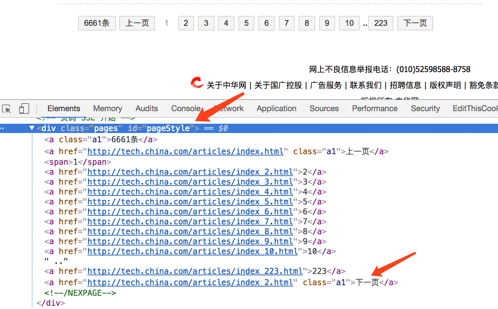
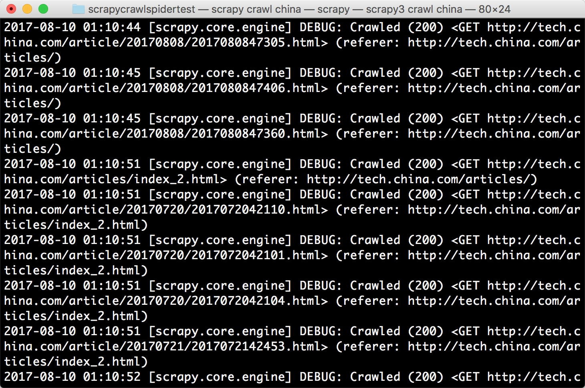

# 13.10 Scrapy通用爬虫

使用 Scrapy 我们可以轻松地完成一个站点爬虫的编写，但如果抓取的站点量非常大的话，比如这里我们需要爬取各大媒体的新闻信息，多个 Spider 可能包含很多重复代码。

如果我们可以将各个站点的 Spider 的公共部分保留下来，不同的部分单独提取出来做成单独的配置，如将爬取规则、页面解析方式等抽离出来做成一个配置文件，那么这样我们在新增一个爬虫的时候只需要实现这些网站的爬取规则和提取规则即可。

本节我们就来探究一下 Scrapy 通用爬虫的实现方法。

### 1. CrawlSpider

在实现通用爬虫之前我们需要先了解一下 CrawlSpider，其官方文档链接为：[http://scrapy.readthedocs.io/en/latest/topics/spiders.html#crawlspider](http://scrapy.readthedocs.io/en/latest/topics/spiders.html#crawlspider)。

它是 Scrapy 提供的一个通用 Spider，在 Spider 里面我们可以通过指定一些爬取规则来实现页面的提取，这些爬取规则有一个专门的数据结构 Rule 来表示，Rule 里面包含了提取和跟进页面的配置，配置好之后，Spider 会根据分析 Rule 来得到当前页面中的哪些链接需要继续爬取，哪些页面的爬取结果需要用哪个方法解析等等。

它是继承自 Spider 类实现的，除了 Spider 类中的所有方法和属性，它还各提供了一个非常重要的属性和方法，如下：

* rules，爬取规则属性，它是一个包含一个(或多个) Rule 对象的列表。 每个 Rule 对爬取网站的动作都做了定义，CrawlSpider 会读取 rules 的每一个 Rule 并进行解析，根据它来对网站进行爬取。

* parse_start_url()，这是一个可重写的方法，当 start_urls 里面对应的 Request 得到 Response 时，该方法被调用，该方法会分析 Response 并必须返回 Item 对象或者 Request 对象。

那么在这里最重要的一点莫过于 Rule 的定义了，它的定义和参数如下：

```python
class scrapy.contrib.spiders.Rule(link_extractor, callback=None, cb_kwargs=None, follow=None, process_links=None, process_request=None)
```

下面对其参数依次说明：

* link_extractor，是一个 Link Extractor 对象。 利用它 Spider 可以知道从爬取的页面中提取哪些链接，提取出的链接会自动生成 Request，它又是一个数据结构，一般常用 LxmlLinkExtractor 对象作为参数，其定义和参数如下：

```python
class scrapy.linkextractors.lxmlhtml.LxmlLinkExtractor(allow=(), deny=(), allow_domains=(), deny_domains=(), deny_extensions=None, restrict_xpaths=(), restrict_css=(), tags=('a', 'area'), attrs=('href', ), canonicalize=False, unique=True, process_value=None, strip=True)
```

这里 allow，是一个正则表达式或正则表达式列表，它定义了从当前页面提取出的链接哪些是符合要求的，只有符合要求的链接才会被跟进，deny 则相反。allow_domains 则会是定义了符合要求的域名，只有此域名的链接才会被跟进生成新的 Request，相当于域名白名单，deny_domains 则相反，相当于域名黑名单。restrict_xpaths 定义了从当前页面中 XPath 匹配的区域提取链接，其值是 XPath 表达式或 XPath 表达式列表，restrict_css 定义了从当前页面中 CSS 选择器匹配的区域提取链接，其值是 CSS 选择器或 CSS 选择器列表。另外还有一些其他的参数代表了提取链接的标签、是否去重、链接的处理等内容，使用的频率不高，如果需要使用可以参考文档的参数说明，链接为：[http://scrapy.readthedocs.io/en/latest/topics/link-extractors.html#module-scrapy.linkextractors.lxmlhtml](http://scrapy.readthedocs.io/en/latest/topics/link-extractors.html#module-scrapy.linkextractors.lxmlhtml)。

* callback，即回调函数，和之前定义 Request 的 callback 相同的意义。 从 link_extractor 中每获取到链接时将会调用该函数。该回调函数接收一个 response 作为其第一个参数， 并返回一个包含 Item 或 Request 对象的列表。值得注意的是避免使用 parse() 作为回调函数。 由于 CrawlSpider 使用 parse() 方法来实现其逻辑，如果覆盖了 parse() 方法，CrawlSpider 将会运行失败。

* cb_kwargs，是一个字典，它包含了传递给回调函数的参数。

* follow，是一个布尔值，即True或False，它指定了根据该规则从response提取的链接是否需要跟进。 如果 callback 参数为None， follow 默认设置为 True ，否则默认为 False 。

* process_links，指定一个处理函数，从link_extractor中获取到链接列表时将会调用该函数。该方法主要用来过滤。

* process_request，同样是指定一个处理函数，根据该Rule提取到每个Request时都会调用该函数，用来对Request进行处理。该函数必须返回一个 Request 或者None。

以上便是 CrawlSpider 中的核心 Rule 的基本用法，但只看它的定义可能还不足以利用它来完成一个 CrawlSpider爬虫，下面我们用一个实例来利用 CrawlSpider 实现一个新闻网站的爬取，以此来更好地理解它的用法。

### 2. 本节目标

这里我们以中华网科技类新闻为例来了解一下 CrawlSpider 的用法，官网链接为：[http://tech.china.com/](http://tech.china.com/)，我们需要爬取它的科技类新闻内容，链接为：[http://tech.china.com/articles/](http://tech.china.com/articles/)，页面如图所示：


我们需要将新闻列表中的所有分页的新闻详情抓取下来，主要目的是为了了解 CrawlSpider 的基本用法。

### 3. 新建项目

首先我们新建一个 Scrapy 项目，名称叫做  scrapycrawlspidertest，命令如下：

```
scrapy startproject scrapycrawlspidertest
```

接下来我们创建一个 CrawlSpider，创建 CrawlSpider 需要制定一个模板，在这里我们可以先看下有哪些可用模板，命令如下：

```
scrapy genspider -l
```

运行结果：

```
Available templates:
  basic
  crawl
  csvfeed
  xmlfeed
```

在之前我们创建 Spider 的时候实际上是默认使用了第一个模板 basic，这次如果我们要创建 CrawlSpider，就需要使用第二个模板 crawl，创建命令如下：

```
scrapy genspider -t crawl china tech.china.com
```

运行之后便会生成一个 CrawlSpider，其内容如下：

```python
from scrapy.linkextractors import LinkExtractor
from scrapy.spiders import CrawlSpider, Rule

class ChinaSpider(CrawlSpider):
    name = 'china'
    allowed_domains = ['tech.china.com']
    start_urls = ['http://tech.china.com/']

    rules = (
        Rule(LinkExtractor(allow=r'Items/'), callback='parse_item', follow=True),
    )

    def parse_item(self, response):
        i = {}
        #i['domain_id'] = response.xpath('//input[@id="sid"]/@value').extract()
        #i['name'] = response.xpath('//div[@id="name"]').extract()
        #i['description'] = response.xpath('//div[@id="description"]').extract()
        return i
```

可以发现这次生成的 Spider 内容就有所不同了，多了一个 rules 属性的定义，Rule 的第一个参数是 LinkExtractor，其实就是上文所说的 LxmlLinkExtractor，只是名称不同。同时默认的回调函数也不再是 parse，而是 parse_item。

### 4. 定义Rule

要实现新闻的爬取我们需要做的就是定义好 Rule，然后实现解析函数就好了，下面我们就来一步步实现这个过程。

首先我们需要先将 start_urls 修改为起始链接，代码如下：

```python
start_urls = ['http://tech.china.com/articles/']
```

定义好了之后 Spider 就会爬取 start_urls 里面的每一个链接，所以这里第一个爬取的页面就是我们刚才所定义的链接，得到 Response 之后 Spider 就会根据每一个 Rule 来去提取这个页面内的超链接去生成进一步的Request，所以我们接下来就需要定义 Rule 来指定提取哪些链接。

当前页面如图所示：


这是新闻的列表页，所以很自然地下一步必然是将列表中的每条新闻详情的链接提取出来，我们这里直接指定这些链接所在区域即可，审查源代码可以发现这所有链接都在 id 为 left_side 的节点内，具体来说是其内的 class 为 con_item 的节点，如图所示：


所以此处我们可以用 LinkExtractor 的 restrict_xpaths 属性来指定，指定了之后 Spider 就会从这个区域提取所有的超链接并生成 Request，但是同时注意到每篇文章的导航中可能还有一些其他的超链接标签，但是我们只想把需要的新闻链接提取出来，查看源码后可以观察到真正的新闻链接路径都是以 article 开头的，我们用一个正则表达式将其匹配出来再赋值给 allow 参数即可。另外这些链接对应的页面其实就是对应的新闻详情页，而我们需要解析的就是新闻的详情信息，所以此处还需要指定一个回调函数 callback。

到现在我们分析了如上页面就可以构造出一个 Rule 了，代码如下：

```python
Rule(LinkExtractor(allow='article\/.*\.html', restrict_xpaths='//div[@id="left_side"]//div[@class="con_item"]'), callback='parse_item')
```

接下来当前页面我们还需要让它做到分页功能，所以还需要提取下一页的链接，分析网页源码之后可以发现它是在 id 为 pageStyle 的节点内，如图所示：



但是这里可以发现我们所需要的下一页节点和其他的分页链接区分度不高，要取出此链接我们可以直接用 XPath 的文本匹配方式，所以这里我们直接用 LinkExtractor 的 restrict_xpaths 属性来指定提取的链接即可。另外此分页链接对应的页面我们不需要像新闻详情页一样去提取详情信息，也就是不需要生成 Item，所以不需要加 callback 参数。另外这下一页的页面如果请求成功了就需要继续像上述情况一样分析，所以它还需要加一个 follow 参数为 True，代表继续跟进匹配分析。其实这个 follow 参数可以加可不加，因为当 callback 为空的时候，follow 默认为 True，所以此处 Rule 可以定义为：

```python
Rule(LinkExtractor(restrict_xpaths='//div[@id="pageStyle"]//a[contains(., "下一页")]'))
```

所以现在 rules 就变成了：

```python
rules = (
    Rule(LinkExtractor(allow='article\/.*\.html', restrict_xpaths='//div[@id="left_side"]//div[@class="con_item"]'), callback='parse_item'),
    Rule(LinkExtractor(restrict_xpaths='//div[@id="pageStyle"]//a[contains(., "下一页")]'))
)
```

接着我们运行一下代码，命令如下：

```
scrapy crawl china
```

即可发现现在已经可以实现页面的翻页和详情页的抓取了，我们仅仅通过定义了两个 Rule 即实现了这样的功能，运行效果如图所示：



### 5. 解析页面

接下来我们需要做的就是解析页面内容了，在这里我们将标题、发布时间、正文、来源提取出来即可，所以这里我们首先定义一个 Item 如下：

```python
from scrapy import Field, Item

class NewsItem(Item):
    title = Field()
    url = Field()
    text = Field()
    datetime = Field()
    source = Field()
    website = Field()
```

在这里的字段分别指新闻标题、链接、正文、发布时间、来源、站点名称，其中站点名称就直接赋值为中华网即可，因为既然是通用爬虫，肯定还有很多爬虫来爬取也来爬取同样结构的新闻内容，所以需要一个字段来区分一下站点名称。

详情页的预览图如下：


这里 parse_item() 方法的实现如下：

```python
def parse_item(self, response):
    item = NewsItem()
    item['title'] = response.xpath('//h1[@id="chan_newsTitle"]/text()').extract_first()
    item['url'] = response.url
    item['text'] = ''.join(response.xpath('//div[@id="chan_newsDetail"]//text()').extract()).strip()
    item['datetime'] = response.xpath('//div[@id="chan_newsInfo"]/text()').re_first('(\d+\-\d+\-\d+\s\d+\:\d+\:\d+)')
    item['source'] = response.xpath('//div[@id="chan_newsInfo"]/text()').re_first('来源：(.*)').strip()
    item['website'] = '中华网'
    yield item
```

提取的具体方法在此不再赘述，这样我们就把每条新闻的信息提取形成了一个 NewsItem 对象。

此时再运行一下，输出内容如下：


可以看到现在我们就可以成功将每条新闻的信息提取出来了，解析完毕。

最后关于存储在此不再赘述，可以自行定义 Pipeline 实现。

到此为止我们便通过实现 CrawlSpider 中的两个 Rule 和一个 parse_item() 方法就实现了中华网新闻的爬取，实现非常简洁。

如果我们想要扩展其他新闻站点，只需要配置站点的爬取规则 Rule 和最终的解析方法即可，Item 都是通用的，Spider 的结构都是相同的。

至此，我们可以说已经实现了爬虫的半通用化配置。

### 6. 通用配置抽取

为什么说现在做到的这一步是半通用化呢？因为如果我们需要扩展其他站点的话仍然需要创建一个新的 CrawlSpider，定义这个站点的 Rule，而且还需要单独去实现 parse_item() 方法，实际上还有很多的代码是重复的，如 CrawlSpider 的变量、方法名几乎都是一样的，那么我们可不可以把它们共用一份代码，把完全不相同的地方抽离出来，做成可配置文件呢？

当然可以。那我们可以抽离出哪些部分呢？所有的变量均可以抽取，如 name、allowed_domains、start_urls、rules 等等，我们将这些变量在 CrawlSpider 初始化的时候赋值即可，所以这时我们就可以新建一个通用的 Spider 来实现一下，命令如下：

```
scrapy genspider -t crawl universal universal
```

这样我们就新建了一个全新的 Spider，名称为 universal，接下来我们将刚才所写的 Spider 内的属性全都抽离出来放到一个配置文件内，配置成一个 Json，命名为 china.json，放到一个 configs 文件夹，和 spiders 文件夹并列，代码如下：

```json
{
  "spider": "universal",
  "website": "中华网科技",
  "type": "新闻",
  "index": "http://tech.china.com/",
  "settings": {
    "USER_AGENT": "Mozilla/5.0 (Macintosh; Intel Mac OS X 10_12_6) AppleWebKit/537.36 (KHTML, like Gecko) Chrome/60.0.3112.90 Safari/537.36"
  },
  "start_urls": [
    "http://tech.china.com/articles/"
  ],
  "allowed_domains": [
    "tech.china.com"
  ],
  "rules": "(Rule(LinkExtractor(allow='article\/.*\\.html', restrict_xpaths='//div[@id=\"left_side\"]//div[@class=\"con_item\"]'),callback='parse_item'),Rule(LinkExtractor(restrict_xpaths='//div[@id=\"pageStyle\"]//a[contains(., \"下一页\")]')))"
}
```

在这里第一个字段 spider 即使用的 Spider 的名称，在这里使用 universal，然后是站点的描述比如站点名称、类型、首页等等。随后的 settings 是该 Spider 特有的 settings 配置，如果要覆盖全局项目 settings.py 内的配置可以单独为其配置，随后是 Spider 的一些属性，如 start_urls、allowed_domains、rules 等，在这里 rules 因为其内涉及一些数据结构，所以在此我们直接定义成字符串的形式，注意将一些特殊字符加上转义符号。

这样我们就算把基本的配置抽取出来了，如果要启动爬虫只需要从该配置文件中读取然后动态加载到 Spider 中即可，所以我们需要定义一个读取该 Json 文件的方法，定义如下：

```python
from os.path import realpath, dirname
import json
def get_config(name):
    path = dirname(realpath(__file__)) + '/configs/' + name + '.json'
    with open(path, 'r', encoding='utf-8') as f:
        return json.loads(f.read())
```

定义了 get_config() 方法之后我们只需要向其传入 Json配置文件的名称即可获取此 Json 配置信息，随后我们定义一个入口文件 run.py，放在项目根目录下，它的作用是启动 Spider，定义如下：

```python
import sys
from scrapy.utils.project import get_project_settings
from scrapycrawlspidertest.spiders.universal import UniversalSpider
from scrapycrawlspidertest.utils import get_config
from scrapy.crawler import CrawlerProcess

def run():
    name = sys.argv[1]
    custom_settings = get_config(name)
    # 爬取使用的Spider名称
    spider = custom_settings.get('spider', 'universal')
    project_settings = get_project_settings()
    settings = dict(project_settings.copy())
    # 合并配置
    settings.update(custom_settings.get('settings'))
    process = CrawlerProcess(settings)
    # 启动爬虫
    process.crawl(spider, **{'name': name})
    process.start()

if __name__ == '__main__':
    run()
```

运行入口为 run()，首先获取了命令行的参数并赋值为 name，name 就是 Json 文件的名称，其实也就相当于要爬取的目标网站的名称，在这里首先利用 get_config() 方法并传入该名称读取我们刚才定义的配置文件，然后获取爬取使用的 spider 的名称，随后获取了配置文件中的 settings 配置，然后和项目全局的 settings 做了合并，随后新建一个 CrawlerProcess，传入爬取使用的配置，随后调用 crawl() 和 start() 方法即可启动爬取。

在 universal 这个 Spider 中我们新建一个 __init__() 方法，进行初始化配置，实现如下：

```python
from scrapy.linkextractors import LinkExtractor
from scrapy.spiders import CrawlSpider, Rule
from scrapycrawlspidertest.utils import get_config

class UniversalSpider(CrawlSpider):
    name = 'universal'
    def __init__(self, name, *args, **kwargs):
        config = get_config(name)
        self.config = config
        self.rules = eval(config.get('rules'))
        self.start_urls = config.get('start_urls')
        self.allowed_domains = config.get('allowed_domains')
        super(UniversalSpider, self).__init__(*args, **kwargs)
    
    def parse_item(self, response):
        i = {}
        return i
```

在 __init__() 方法中赋值了 start_urls、allowed_domains、rules 等属性，其中 rules 属性使用 eval() 方法将字符串转化为对象，这样就成功实现爬虫的基础配置了。

接下来我们可以执行如下命令运行爬虫：

```
python3 run.py china
```

运行此命令后，程序会首先读取 Json 配置文件，然后将配置中的一些属性赋值给 Spider，然后启动爬取，运行效果完全相同，运行结果如下：


现在我们已经把 Spider 的基础属性实现了可配置化了，剩下的解析部分我们同样需要实现可配置化，原来的解析函数为：

```python
def parse_item(self, response):
    item = NewsItem()
    item['title'] = response.xpath('//h1[@id="chan_newsTitle"]/text()').extract_first()
    item['url'] = response.url
    item['text'] = ''.join(response.xpath('//div[@id="chan_newsDetail"]//text()').extract()).strip()
    item['datetime'] = response.xpath('//div[@id="chan_newsInfo"]/text()').re_first('(\d+\-\d+\-\d+\s\d+\:\d+\:\d+)')
    item['source'] = response.xpath('//div[@id="chan_newsInfo"]/text()').re_first('来源：(.*)').strip()
    item['website'] = '中华网'
    yield item
```

可以观察到解析的每一个字段都是以 response 为起点的，以 title 为例：

```python
item['title'] = response.xpath('//h1[@id="chan_newsTitle"]/text()').extract_first()
```

response 对象首先调用了 xpath() 方法，传入 XPath 表达式，随后调用了 extract_first() 方法，参数为空，要实现其可配置化我们可以将方法名和方法参数顺次抽离出来，然后链式调用即可。

但是再看 text 的提取方式：

```python
item['text'] = ''.join(response.xpath('//div[@id="chan_newsDetail"]//text()').extract()).strip()
```

在调用完 extract() 方法之后会生成一个列表，随后我们调用了字符串的 join() 方法实现了列表的合并，但此时的调用方式就不同了，它不再是链式调用的方式，而是将解析的结果当做参数传递给 join() 方法再得到返回结果，相当于外层包一个函数，我们在此简称为外包调用。join() 方法调用完毕后最后还调用了 strip() 方法去除头尾空白字符，这又变成了链式调用的方式。

所以在抽离配置的时候我们需要兼顾这两种调用方式，在这里我们将链式调用和外包调用命名为 chain 和 wrap，另外我们再将函数名称和参数抽离出来，这样提取配置就会变成如下内容：

```json
"item": {
    "class": "NewsItem",
    "attrs": {
      "title": [
        {
          "method": "xpath",
          "args": [
            "//h1[@id='chan_newsTitle']/text()"
          ]
        },
        {
          "method": "extract_first"
        }
      ],
      "url": [
        {
          "method": "get_attr",
          "args": [
            "url"
          ],
          "type": "wrap"
        }
      ],
      "text": [
        {
          "method": "xpath",
          "args": [
            "//div[@id='chan_newsDetail']//text()"
          ]
        },
        {
          "method": "extract"
        },
        {
          "method": "list2str",
          "type": "wrap"
        },
        {
          "method": "strip"
        }
      ],
      "datetime": [
        {
          "method": "xpath",
          "args": [
            "//div[@id='chan_newsInfo']/text()"
          ]
        },
        {
          "method": "re_first",
          "args": [
            "(\\d+\\-\\d+\\-\\d+\\s\\d+\\:\\d+\\:\\d+)"
          ]
        }
      ],
      "source": [
        {
          "method": "xpath",
          "args": [
            "//div[@id='chan_newsInfo']/text()"
          ]
        },
        {
          "method": "re_first",
          "args": [
            "来源：(.*)"
          ]
        },
        {
          "method": "strip"
        }
      ],
      "website": [
        {
          "method": "set_value",
          "args": [
            "中华网"
          ],
          "type": "wrap"
        }
      ]
    }
  }
```

将此配置加入到 Json 文件配置内即可，其中这里定义了 class 属性就是指定了生成 Item 的类型，attrs 即为 Item 各个属性的提取方式配置。

以 title 为例，它的配置是一个列表，然后列表的每一个元素都是一个配置字典，如：

```json
{
  "method": "xpath",
  "args": [
    "//h1[@id='chan_newsTitle']/text()"
  ]
},
```

method 代表方法名称，args 是方法的参数，这样就相当于调用了 xpath() 方法并传递了 args 对应的参数，随后还有一个配置为：

```json
{
  "method": "extract_first"
}
```

这里只指定了 method，而没有 args，即代表没有参数，这样就会直接调用 extract_first() 方法。

所以如上的配置我们就可以利用某种逻辑将其动态转换为如下代码：

```python
item['title'] = response.xpath('//h1[@id="chan_newsTitle"]/text()').extract_first()
```

再以 text 的配置为例，我们在前文中提到过了，它有一个 join() 方法是将列表转为字符串，而且是外包调用的方法，所以在这里我们可以作如下处理，将其配置为：

```json
{
  "method": "list2str",
  "type": "wrap"
}
```

在这里我们指定了一个参数 method，其值为 list2str，这个方法就是将列表转为字符串的方法，我们可以自行定义，同时 args() 没有指定，代表没有额外的参数，就是当前对象本身，同时指定了 type 为 wrap，代表是外包类型的调用。

所以最后 text 的配置我们就可以利用某种逻辑将其动态转换为如下代码：

```python
item['text'] = list2str(response.xpath('//div[@id="chan_newsDetail"]//text()').extract()).strip()
```

这些 wrap 类型的方法我们可以单独定义一个 wraps.py 文件，同时可以自行扩展：

```python
def list2str(list):
    """
    列表拼合成字符串
    :param result: 列表
    :return: 字符串
    """
    return ''.join(list)

def set_value(obj, value):
    """
    设置固定数值
    :param value: 数值
    :return: 数值
    """
    return value

def get_attr(obj, attr):
    """
    获取属性
    :param obj: 对象
    :param attr: 属性
    :return: 属性值
    """
    return getattr(obj, attr)
```

接下来基本的配置就完成了，最后最重要的就是实现 parse_item() 方法，实现如下：

```python
def parse_item(self, response):
    # 获取item配置
    item = self.config.get('item')
    if item:
        data = eval(item.get('class') + '()')
        # 动态获取属性配置
        for key, value in item.get('attrs').items():
            data[key] = response
            for process in value:
                type = process.get('type', 'chain')
                if type == 'chain':
                    # 动态调用函数和属性
                    if process.get('method'):
                        data[key] = getattr(data[key], process.get('method'))(*process.get('args', []))
                elif type == 'wrap':
                    args = [data[key]] + process.get('args', [])
                    data[key] = eval(process.get('method'))(*args)
        yield data
```

在这里首先获取了 Item 的配置信息，然后获取了 class 的配置，将其初始化，随后遍历了 Item 的各个属性依次进行提取。提取开始时首先将其赋值为 response 对象，然后依次调用配置的方法并传入配置的参数，方法的类型默认会设置为 chain 类型，即链式调用，通过 getattr() 方法实现，如果指定为 wrap 类型则进行外包形式调用，通过 eval() 方法实现。

循环完毕之后 Item 的所有属性都会被成功赋值，达到同样的提取效果。

重新运行，结果如下：


另外最后我们再回过头看一下 start_urls 的配置，在这里 start_urls 我们只可以配置具体的链接，但如果这些链接是 100 个，1000 个呢？我们总不能将所有的链接全部列出来吧，所以在某些情况下 start_urls 也需要动态配置，所以这里我们也需要将其分成两类，一种是直接配置 URL列表，一种是调用方法生成，我们分别定义为 static 和 dynamic 类型。

本例中的 start_urls 很明显是 static 类型的，所以将 start_urls 配置改写如下：

```json
"start_urls": {
  "type": "static",
  "value": [
    "http://tech.china.com/articles/"
  ]
}
```

如果是动态生成的我们可以调用方法传参数，例如：

```json
"start_urls": {
  "type": "dynamic",
  "method": "china",
  "args": [
    5, 10
  ]
}
```

例如这里我们定义为 dynamic 类型，指定方法为 urls_china()，然后传入参数 5 和 10，来生成第 5 到 10 页的链接，然后这样我们只需要实现该方法即可，可以统一新建一个 urls.py 文件，方法实现如下：

```python
def china(start, end):
    for page in range(start, end + 1):
        yield 'http://tech.china.com/articles/index_' + str(page) + '.html'
```

如有新增的可以自行配置，如某些链接需要用到时间戳，加密参数等等，均可通过方法实现。

接下来在 Spider 的 __init__() 方法中，start_urls 的配置可以改写如下：

```python
from scrapycrawlspidertest import urls

start_urls = config.get('start_urls')
if start_urls:
    if start_urls.get('type') == 'static':
        self.start_urls = start_urls.get('value')
    elif start_urls.get('type') == 'dynamic':
        self.start_urls = list(eval('urls.' + start_urls.get('method'))(*start_urls.get('args', [])))
```

在这里通过判定 start_urls 的类型分别进行不同的处理，这样我们就可以实现 start_urls 的配置了。

至此，Spider 的设置、起始链接、属性、提取方法都已经实现了全部的可配置化。

综上，整个项目的配置总结如下：
* spider，指定所使用的 Spider 的名称。
* settings，可以专门为 Spider 定制配置信息，会覆盖项目级别的配置。
* start_urls，指定爬虫爬取的起始链接。
* allowed_domains，允许爬取的站点。
* rules，站点的爬取规则。
* item，数据的提取规则。

以上我们就实现了 Scrapy 的通用爬虫，每个站点只需要修改 Json 文件即可实现自由配置。

### 7. 本节代码

本节代码地址为：[https://github.com/Python3WebSpider/ScrapyCrawlSpiderTest](https://github.com/Python3WebSpider/ScrapyCrawlSpiderTest)。

### 8. 结语

本节介绍了一下 Scrapy 通用爬虫的实现，我们将所有的配置全部抽离了出来，每增加一个爬虫，就只需要增加一个 Json 文件配置即可，后面我们只需要维护这些配置文件即可。

