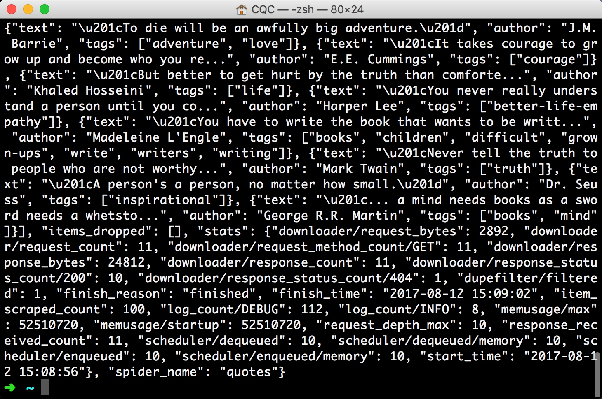

# Scrapyrt的使用

在本节开始之前请确保已经正确安装好了Scrapyrt并正常运行。

比如我们当前监听的项目为前文中quotes项目，项目源代码为：[https://github.com/Python3WebSpider/ScrapyTutorial](https://github.com/Python3WebSpider/ScrapyTutorial)，Scrapyrt服务运行在9080端口上，下面来简单介绍它的使用方式。

## GET请求

目前GET请求方式支持如下的参数：
* spider_name，Spider名称，字符串类型，必传参数，如果传递的Spider名称不存在则会返回404错误。
* url，爬取链接，字符串类型，如果起始链接没有定义的话就必须要传递，如果传递了该参数，Scrapy会直接用该URL生成Request，而直接忽略start_requests()方法和start_urls属性的定义。
* callback，回调函数名称，字符串类型，可选参数，如果传递了就会使用此回调函数处理，否则会默认使用Spider内定义的回调函数。
* max_requests，最大请求数量，数值类型，可选参数，它定义了Scrapy执行请求的Request的最大限制，如定义为5，则最多只执行5次Request请求，其余的则会被忽略。
* start_requests，是否要执行start_request()函数，布尔类型，可选参数，在Scrapy项目中如果定义了start_requests()方法，那么在项目启动时会默认调用该方法，但是在Scrapyrt就不一样了，它默认不执行start_requests()方法，如果要执行，需要将它设置为true。

例如我们

```
curl http://localhost:9080/crawl.json?spider_name=quotes&url=http://quotes.toscrape.com/
```

我们会得到类似如下结果：



返回的是一个Json格式的字符串，我们将其解析一下看下结构：

```json
{
  "status": "ok",
  "items": [
    {
      "text": "“The world as we have created it is a process of o...",
      "author": "Albert Einstein",
      "tags": [
        "change",
        "deep-thoughts",
        "thinking",
        "world"
      ]
    },
    ...
    {
      "text": "“... a mind needs books as a sword needs a whetsto...",
      "author": "George R.R. Martin",
      "tags": [
        "books",
        "mind"
      ]
    }
  ],
  "items_dropped": [],
  "stats": {
    "downloader/request_bytes": 2892,
    "downloader/request_count": 11,
    "downloader/request_method_count/GET": 11,
    "downloader/response_bytes": 24812,
    "downloader/response_count": 11,
    "downloader/response_status_count/200": 10,
    "downloader/response_status_count/404": 1,
    "dupefilter/filtered": 1,
    "finish_reason": "finished",
    "finish_time": "2017-07-12 15:09:02",
    "item_scraped_count": 100,
    "log_count/DEBUG": 112,
    "log_count/INFO": 8,
    "memusage/max": 52510720,
    "memusage/startup": 52510720,
    "request_depth_max": 10,
    "response_received_count": 11,
    "scheduler/dequeued": 10,
    "scheduler/dequeued/memory": 10,
    "scheduler/enqueued": 10,
    "scheduler/enqueued/memory": 10,
    "start_time": "2017-07-12 15:08:56"
  },
  "spider_name": "quotes"
}
```

由于内容太长在这里将items绝大部分省略，可以看到status显示了爬取的状态，items部分则是Scrapy项目的爬取结果，items_dropped是被忽略的Item列表，stats则是爬取结果的统计情况，此结果和直接运行Scrapy项目得到的统计是相同的。

这样一来我们就通过HTTP接口调度了Scrapy项目并获取了爬取结果，如果Scrapy项目部署在服务器上，我们可以通过开启一个Scrapyrt服务实现任务的调度并直接取到爬取结果，还是很方便的。

## POST请求

另外除了GET请求，我们还可以通过POST请求来请求Scrapyrt，但是此处Request Body必须是一个合法的Json配置，在这里面可以配置相应的参数，支持的配置参数更多。

目前在Json配置中支持如下的参数：
* spider_name，Spider名称，字符串类型，必传参数，如果传递的Spider名称不存在则会返回404错误。
* max_requests，最大请求数量，数值类型，可选参数，它定义了Scrapy执行请求的Request的最大限制，如定义为5，则最多只执行5次Request请求，其余的则会被忽略。
* request，Request配置，Json对象，必传参数，通过该参数可以定义Request的各个参数，必须指定url字段，代表爬取链接，其他字段可选。

例如一个实例Json配置如下：

```json
{
    "request": {
        "url": "http://quotes.toscrape.com/",
        "callback": "parse",
        "dont_filter": "True",
        "cookies": {
            "foo": "bar"
        }
    },
    "max_requests": 2,
    "spider_name": "quotes"
}
```

我们执行如下命令传递该Json配置并发起POST请求：

```
curl http://localhost:9080/crawl.json -d '{"request": {"url": "http://quotes.toscrape.com/", "dont_filter": "True", "callback": "parse", "cookies": {"foo": "bar"}}, "max_requests": 2, "spider_name": "quotes"}'
```

运行结果和上文类似，同样是输出了爬取状态、结果、统计信息等内容。

以上便是Scrapyrt的相关用法介绍，利用它我们方便地调度Scrapy项目的运行并获取爬取结果，更多的使用方法可以参考官方文档：[http://scrapyrt.readthedocs.io](http://scrapyrt.readthedocs.io)。


