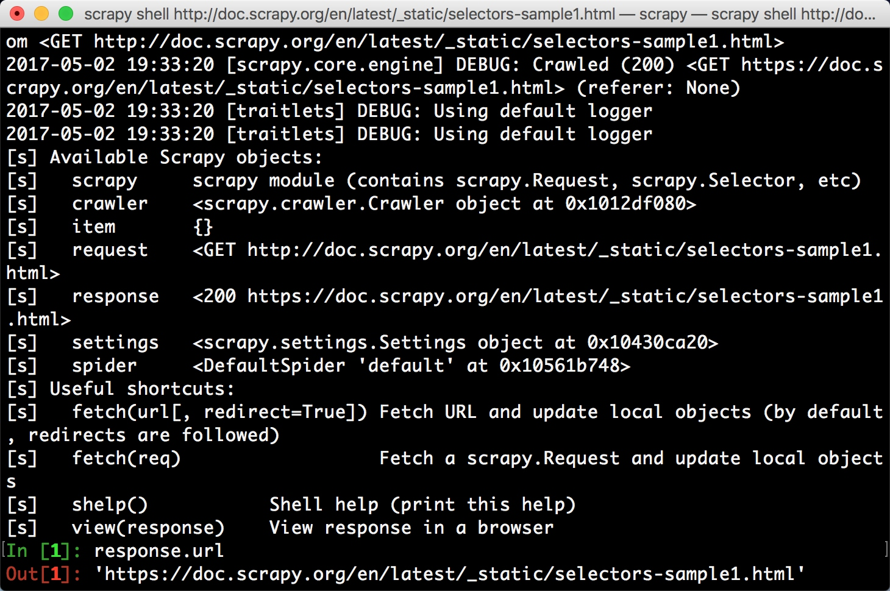

# 13.3 Selector的用法

我们之前介绍了利用Beautiful Soup、pyquery以及正则表达式来提取网页数据，这确实非常方便。而Scrapy还提供了自己的数据提取方法，即Selector（选择器）。Selector是基于lxml来构建的，支持XPath选择器、CSS选择器以及正则表达式，功能全面，解析速度和准确度非常高。

本节将介绍Selector的用法。

### 1. 直接使用

Selector是一个可以独立使用的模块。我们可以直接利用Selector这个类来构建一个选择器对象，然后调用它的相关方法如xpath()、css()等来提取数据。

例如，针对一段HTML代码，我们可以用如下方式构建Selector对象来提取数据：

```python
from scrapy import Selector

body = '<html><head><title>Hello World</title></head><body></body></html>'
selector = Selector(text=body)
title = selector.xpath('//title/text()').extract_first()
print(title)
```

运行结果：

```
Hello World
```

我们在这里没有在Scrapy框架中运行，而是把Scrapy中的Selector单独拿出来使用了，构建的时候传入text参数，就生成了一个Selector选择器对象，然后就可以像前面我们所用的Scrapy中的解析方式一样，调用xpath()、css()等方法来提取了。

在这里我们查找的是源代码中的title中的文本，在XPath选择器最后加text()方法就可以实现文本的提取了。

以上内容就是Selector的直接使用方式。同Beautiful Soup等库类似，Selector其实也是强大的网页解析库。如果方便的话，我们也可以在其他项目中直接使用Selector来提取数据。

接下来，我们用实例来详细讲解Selector的用法。

### 2. Scrapy Shell

由于Selector主要是与Scrapy结合使用，如Scrapy的回调函数中的参数response直接调用xpath()或者css()方法来提取数据，所以在这里我们借助Scrapy shell来模拟Scrapy请求的过程，来讲解相关的提取方法。

我们用官方文档的一个样例页面来做演示：http://doc.scrapy.org/en/latest/_static/selectors-sample1.html。

开启Scrapy shell，在命令行输入如下命令：

```
scrapy shell http://doc.scrapy.org/en/latest/_static/selectors-sample1.html
```

我们就进入到Scrapy shell模式。这个过程其实是，Scrapy发起了一次请求，请求的URL就是刚才命令行下输入的URL，然后把一些可操作的变量传递给我们，如request、response等，如图13-5所示。



图 13-5 Scrapy Shell

我们可以在命令行模式下输入命令调用对象的一些操作方法，回车之后实时显示结果。这与Python的命令行交互模式是类似的。

接下来，演示的实例都将页面的源码作为分析目标，页面源码如下所示：

```html
<html>
 <head>
  <base href='http://example.com/' />
  <title>Example website</title>
 </head>
 <body>
  <div id='images'>
   <a href='image1.html'>Name: My image 1 <br /></a>
   <a href='image2.html'>Name: My image 2 <br /></a>
   <a href='image3.html'>Name: My image 3 <br /></a>
   <a href='image4.html'>Name: My image 4 <br /></a>
   <a href='image5.html'>Name: My image 5 <br /></a>
  </div>
 </body>
</html>
```

### 3. XPath选择器

进入Scrapy shell之后，我们将主要操作response这个变量来进行解析。因为我们解析的是HTML代码，Selector将自动使用HTML语法来分析。

response有一个属性selector，我们调用response.selector返回的内容就相当于用response的text构造了一个Selector对象。通过这个Selector对象我们可以调用解析方法如xpath()、css()等，通过向方法传入XPath或CSS选择器参数就可以实现信息的提取。

我们用一个实例感受一下，如下所示：

```python
>>> result = response.selector.xpath('//a')
>>> result
[<Selector xpath='//a' data='<a href="image1.html">Name: My image 1 <'>,
 <Selector xpath='//a' data='<a href="image2.html">Name: My image 2 <'>,
 <Selector xpath='//a' data='<a href="image3.html">Name: My image 3 <'>,
 <Selector xpath='//a' data='<a href="image4.html">Name: My image 4 <'>,
 <Selector xpath='//a' data='<a href="image5.html">Name: My image 5 <'>]
>>> type(result)
scrapy.selector.unified.SelectorList
```

打印结果的形式是Selector组成的列表，其实它是SelectorList类型，SelectorList和Selector都可以继续调用xpath()和css()等方法来进一步提取数据。

在上面的例子中，我们提取了a节点。接下来，我们尝试继续调用xpath()方法来提取a节点内包含的img节点，如下所示：

```python
>>> result.xpath('./img')
[<Selector xpath='./img' data=''>,
 <Selector xpath='./img' data=''>,
 <Selector xpath='./img' data=''>,
 <Selector xpath='./img' data=''>,
 <Selector xpath='./img' data=''>]
```

我们获得了a节点里面的所有img节点，结果为5。

值得注意的是，选择器的最前方加 .（点），这代表提取元素内部的数据，如果没有加点，则代表从根节点开始提取。此处我们用了./img的提取方式，则代表从a节点里进行提取。如果此处我们用//img，则还是从html节点里进行提取。

我们刚才使用了response.selector.xpath()方法对数据进行了提取。Scrapy提供了两个实用的快捷方法，response.xpath()和response.css()，它们二者的功能完全等同于response.selector.xpath()和response.selector.css()。方便起见，后面我们统一直接调用response的xpath()和css()方法进行选择。

现在我们得到的是SelectorList类型的变量，该变量是由Selector对象组成的列表。我们可以用索引单独取出其中某个Selector元素，如下所示：

```python
>>> result[0]
<Selector xpath='//a' data='<a href="image1.html">Name: My image 1 <'>
```

我们可以像操作列表一样操作这个SelectorList。

但是现在获取的内容是Selector或者SelectorList类型，并不是真正的文本内容。那么具体的内容怎么提取呢？

比如我们现在想提取出a节点元素，就可以利用extract()方法，如下所示：

```python
>>> result.extract()
['<a href="image1.html">Name: My image 1 <br></a>', '<a href="image2.html">Name: My image 2 <br></a>', '<a href="image3.html">Name: My image 3 <br></a>', '<a href="image4.html">Name: My image 4 <br></a>', '<a href="image5.html">Name: My image 5 <br></a>']
```

这里使用了extract()方法，我们就可以把真实需要的内容获取下来。

我们还可以改写XPath表达式，来选取节点的内部文本和属性，如下所示：

```python
>>> response.xpath('//a/text()').extract()
['Name: My image 1 ', 'Name: My image 2 ', 'Name: My image 3 ', 'Name: My image 4 ', 'Name: My image 5 ']
>>> response.xpath('//a/@href').extract()
['image1.html', 'image2.html', 'image3.html', 'image4.html', 'image5.html']
```

我们只需要再加一层/text()就可以获取节点的内部文本，或者加一层/@href就可以获取节点的href属性。其中，@符号后面内容就是要获取的属性名称。

现在我们可以用一个规则把所有符合要求的节点都获取下来，返回的类型是列表类型。

但是这里有一个问题：如果符合要求的节点只有一个，那么返回的结果会是什么呢？我们再用一个实例来感受一下，如下所示：

```python
>>> response.xpath('//a[@href="image1.html"]/text()').extract()
['Name: My image 1 ']
```

我们用属性限制了匹配的范围，使XPath只可以匹配到一个元素。然后用extract()方法提取结果，其结果还是一个列表形式，其文本是列表的第一个元素。但很多情况下，我们其实想要的数据就是第一个元素内容，这里我们通过加一个索引来获取，如下所示：

```python
>>> response.xpath('//a[@href="image1.html"]/text()').extract()[0]
'Name: My image 1 '
```

但是，这个写法很明显是有风险的。一旦XPath有问题，那么extract()后的结果可能是一个空列表。如果我们再用索引来获取，那不就会可能导致数组越界吗？

所以，另外一个方法可以专门提取单个元素，它叫作extract_first()。我们可以改写上面的例子如下所示：

```python
>>> response.xpath('//a[@href="image1.html"]/text()').extract_first()
'Name: My image 1 '
```

这样，我们直接利用extract_first()方法将匹配的第一个结果提取出来，同时我们也不用担心数组越界的问题。

另外我们也可以为extract_first()方法设置一个默认值参数，这样当XPath规则提取不到内容时会直接使用默认值。例如将XPath改成一个不存在的规则，重新执行代码，如下所示：

```python
>>> response.xpath('//a[@href="image1"]/text()').extract_first()
>>> response.xpath('//a[@href="image1"]/text()').extract_first('Default Image')
'Default Image'
```

这里，如果XPath匹配不到任何元素，调用extract_first()会返回空，也不会报错。

在第二行代码中，我们还传递了一个参数当作默认值，如Default Image。这样如果XPath匹配不到结果的话，返回值会使用这个参数来代替，可以看到输出正是如此。

现在为止，我们了解了Scrapy中的XPath的相关用法，包括嵌套查询、提取内容、提取单个内容、获取文本和属性等。

### 4. CSS选择器

接下来，我们看看CSS选择器的用法。

Scrapy的选择器同时还对接了CSS选择器，使用response.css()方法可以使用CSS选择器来选择对应的元素。

例如在上文我们选取了所有的a节点，那么CSS选择器同样可以做到，如下所示：

```python
>>> response.css('a')
[<Selector xpath='descendant-or-self::a' data='<a href="image1.html">Name: My image 1 <'>, 
<Selector xpath='descendant-or-self::a' data='<a href="image2.html">Name: My image 2 <'>, 
<Selector xpath='descendant-or-self::a' data='<a href="image3.html">Name: My image 3 <'>, 
<Selector xpath='descendant-or-self::a' data='<a href="image4.html">Name: My image 4 <'>, 
<Selector xpath='descendant-or-self::a' data='<a href="image5.html">Name: My image 5 <'>]
```

同样，调用extract()方法就可以提取出节点，如下所示：

```python
>>> response.css('a').extract()
['<a href="image1.html">Name: My image 1 <br></a>', '<a href="image2.html">Name: My image 2 <br></a>', '<a href="image3.html">Name: My image 3 <br></a>', '<a href="image4.html">Name: My image 4 <br></a>', '<a href="image5.html">Name: My image 5 <br></a>']
```

用法和XPath选择是完全一样的。

另外，我们也可以进行属性选择和嵌套选择，如下所示：

```python
>>> response.css('a[href="image1.html"]').extract()
['<a href="image1.html">Name: My image 1 <br></a>']
>>> response.css('a[href="image1.html"] img').extract()
['']
```

这里用[href="image.html"]限定了href属性，可以看到匹配结果就只有一个了。另外如果想查找a节点内的img节点，只需要再加一个空格和img即可。选择器的写法和标准CSS选择器写法如出一辙。

我们也可以使用extract_first()方法提取列表的第一个元素，如下所示：

```python
>>> response.css('a[href="image1.html"] img').extract_first()
''
```

接下来的两个用法不太一样。节点的内部文本和属性的获取是这样实现的，如下所示：

```python
>>> response.css('a[href="image1.html"]::text').extract_first()
'Name: My image 1 '
>>> response.css('a[href="image1.html"] img::attr(src)').extract_first()
'image1_thumb.jpg'
```

获取文本和属性需要用::text和::attr()的写法。而其他库如Beautiful Soup或pyquery都有单独的方法。

另外，CSS选择器和XPath选择器一样可以嵌套选择。我们可以先用XPath选择器选中所有a节点，再利用CSS选择器选中img节点，再用XPath选择器获取属性。我们用一个实例来感受一下，如下所示：

```python
>>> response.xpath('//a').css('img').xpath('@src').extract()
['image1_thumb.jpg', 'image2_thumb.jpg', 'image3_thumb.jpg', 'image4_thumb.jpg', 'image5_thumb.jpg']
```

我们成功获取了所有img节点的src属性。

因此，我们可以随意使用xpath()和css()方法二者自由组合实现嵌套查询，二者是完全兼容的。

### 5. 正则匹配

Scrapy的选择器还支持正则匹配。比如，在示例的a节点中的文本类似于Name: My image 1，现在我们只想把Name:后面的内容提取出来，这时就可以借助re()方法，实现如下：

```python
>>> response.xpath('//a/text()').re('Name:\s(.*)')
['My image 1 ', 'My image 2 ', 'My image 3 ', 'My image 4 ', 'My image 5 ']
```

我们给re()方法传了一个正则表达式，其中(.*)就是要匹配的内容，输出的结果就是正则表达式匹配的分组，结果会依次输出。

如果同时存在两个分组，那么结果依然会被按序输出，如下所示：

```python
>>> response.xpath('//a/text()').re('(.*?):\s(.*)')
['Name', 'My image 1 ', 'Name', 'My image 2 ', 'Name', 'My image 3 ', 'Name', 'My image 4 ', 'Name', 'My image 5 ']
```

类似extract_first()方法，re_first()方法可以选取列表的第一个元素，用法如下：

```python
>>> response.xpath('//a/text()').re_first('(.*?):\s(.*)')
'Name'
>>> response.xpath('//a/text()').re_first('Name:\s(.*)')
'My image 1 '
```

不论正则匹配了几个分组，结果都会等于列表的第一个元素。

值得注意的是，response对象不能直接调用re()和re_first()方法。如果想要对全文进行正则匹配，可以先调用xpath()方法再正则匹配，如下所示：

```python
>>> response.re('Name:\s(.*)')
Traceback (most recent call last):
  File "<console>", line 1, in <module>
AttributeError: 'HtmlResponse' object has no attribute 're'
>>> response.xpath('.').re('Name:\s(.*)<br>')
['My image 1 ', 'My image 2 ', 'My image 3 ', 'My image 4 ', 'My image 5 ']
>>> response.xpath('.').re_first('Name:\s(.*)<br>')
'My image 1 '
```

通过上面的例子，我们可以看到，直接调用re()方法会提示没有re属性。但是这里首先调用了xpath('.')选中全文，然后调用re()和re_first()方法，就可以进行正则匹配了。

### 6. 结语

以上内容便是Scrapy选择器的用法，它包括两个常用选择器和正则匹配功能。熟练掌握XPath语法、CSS选择器语法、正则表达式语法可以大大提高数据提取效率。


