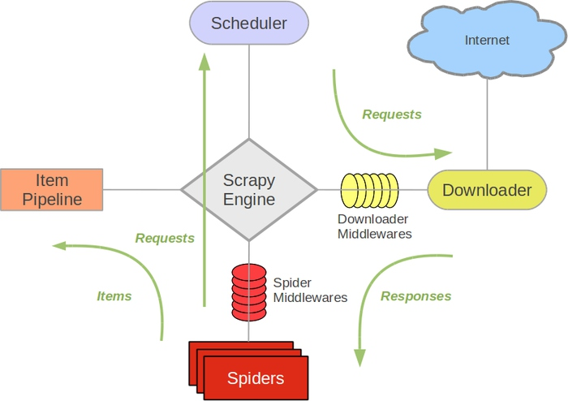

# 13.5 Downloader Middleware的用法

Downloader Middleware，即下载中间件，它是处于 Scrapy 的 Request 和 Response 之间的处理模块，我们首先来看下它的架构，如图 13-6 所示：



图 13-6 Scrapy 架构

可以发现 Scheduler 在从队列中拿出一个 Request 发送给 Downloader 去执行下载的时候，在这个过程会经过 Downloader Middleware 的处理，另外当 Downloader 将 Request 下载完成得到 Response 返回给 Spider 时会再次经过 Downloader Middleware处理。

那也就是说 Downloader Middleware 作用的位置就是以下两个：
* 在 Scheduler 调度出队列的 Request 然后发送给 Doanloader 下载之前，也就是我们可以在 Request 执行下载之前对其进行修改。
* 在下载后生成的 Response 被发送给 Spider 之前，也就是我们可以在生成 Resposne 被 Spider 解析之前对其进行修改。

Downloader Middleware 的功能十分强大，修改 User-Agent、处理重定向、设置代理、失败重试、设置 Cookies 等等各种功能都需要借助于它来实现，下面我们来了解一下 Downloader Middleware 的详细用法。

### 1. 使用说明

首先需要说明的是在 Scrapy 里其实已经提供了许多 Downloader Middleware，比如负责失败重试、自动重定向等功能的 Middleware，它们被DOWNLOADER_MIDDLEWARES_BASE 这个变量所定义，

这个变量的内容如下：

```python
{
    'scrapy.downloadermiddlewares.robotstxt.RobotsTxtMiddleware': 100,
    'scrapy.downloadermiddlewares.httpauth.HttpAuthMiddleware': 300,
    'scrapy.downloadermiddlewares.downloadtimeout.DownloadTimeoutMiddleware': 350,
    'scrapy.downloadermiddlewares.defaultheaders.DefaultHeadersMiddleware': 400,
    'scrapy.downloadermiddlewares.useragent.UserAgentMiddleware': 500,
    'scrapy.downloadermiddlewares.retry.RetryMiddleware': 550,
    'scrapy.downloadermiddlewares.ajaxcrawl.AjaxCrawlMiddleware': 560,
    'scrapy.downloadermiddlewares.redirect.MetaRefreshMiddleware': 580,
    'scrapy.downloadermiddlewares.httpcompression.HttpCompressionMiddleware': 590,
    'scrapy.downloadermiddlewares.redirect.RedirectMiddleware': 600,
    'scrapy.downloadermiddlewares.cookies.CookiesMiddleware': 700,
    'scrapy.downloadermiddlewares.httpproxy.HttpProxyMiddleware': 750,
    'scrapy.downloadermiddlewares.stats.DownloaderStats': 850,
    'scrapy.downloadermiddlewares.httpcache.HttpCacheMiddleware': 900,
}
```

这是一个字典格式，字典的键名是 Scrapy 内置的 Downloader Middleware 的名称，键值代表了调用的优先级，数字越小代表越靠近 Scrapy 引擎，数字越大代表越靠近 Downloader，数字小的会被优先调用。

如果我们自己定义了 Downloader Middleware 想要添加到项目里面，记得不能去直接修改 DOWNLOADER_MIDDLEWARES_BASE 这个变量，Scrapy 还提供了另外的一个设置变量叫做 DOWNLOADER_MIDDLEWARES，我们直接修改这个变量就可以添加自己定义的 Downloader Middleware 和禁用 DOWNLOADER_MIDDLEWARES_BASE 里面定义的 Downloader Middleware。下面我们具体来看一下 Downloader Middleware 的使用方法。

### 2. 核心方法

Scrapy 内置的 Downloader Middleware 为 Scrapy 提供了基础的功能，但在项目实战中我们往往需要再单独定义 Downloader Middleware 才可以满足需求，不过不用担心，这个过程非常简单，我们只需要实现某几个方法即可。

每个 Downloader Middleware 都是定义了以下一个或多个方法的类，核心的三个方法是：
* process_request(request, spider)
* process_response(request, response, spider)
* process_exception(request, exception, spider)

我们只需要实现其中的至少一个方法就可以定义一个 Downloader Middleware，下面我们来看下这三个方法的详细用法。

#### process_request(request, spider)

当 Request 被 Scrapy 引擎调度给 Downloader 之前，这个方法就会被调用，也就是在 Request 被从队列里面调度出来到 Downloader 下载执行之前，我们都可以用 process_request() 方法来对 Request 进行处理，方法的返回值必须为 None、Response 对象、Request 对象中的一个或者抛出 IgnoreRequest 异常。

方法的参数有两个，分别是：
* request，即 Request 对象，即被处理的 Request
* spider，即 Spdier 对象，即此 Request 对应的 Spider

当返回类型不同时，产生的效果也不同，下面对不同的返回情况做一下归纳：
* 当返回 None 时，Scrapy 将继续处理该 Request，接着去执行其他 Downloader Middleware 的 process_request() 方法，一直到 Downloader 把 Request 执行下载得到 Response 才结束，这个过程其实就是修改 Request 的一个过程，不同的 Downloader Middleware 按照设置的优先级顺序依次对 Request 进行相应修改，最后送至 Downloader 执行。
* 当返回为 Response 对象的时候，接下来更低优先级的 Downloader Middleware 的 process_request() 和 process_exception() 方法就不会被继续调用了，转而依次开始执行每个 Downloader Middleware 的 process_response() 方法，调用完毕之后直接将 Response 对象发送给 Spider 来处理。
* 当返回 Request 对象时，接下来更低优先级的 Downloader Middleware 的 process_request() 方法会停止执行，这个 Request 会被重新放到调度队列里面，其实就是一个全新的 Request，然后等待被调度，如果被 Scheduler 调度了，那么会重新按照顺序执行一遍所有的 Downloader Middleware 的 process_request() 方法。
* 如果抛出 IgnoreRequest 异常，则所有的 Downloader Middleware 的 process_exception() 方法会被依次执行，如果没有任何一个方法处理这个异常，那么就会回调 Request 的errorback() 方法，如果还没有被处理，那么这个异常便会被忽略。

#### process_response(request, response, spider)

当 Downloader 执行 Request 下载之后，会得到对应的 Response，随后 Scrapy 引擎便会将 Response 发送给 Spider 进行解析，在发送之前我们都可以用 process_response() 方法来对 Response 进行处理，方法的返回值必须为 Request 对象、Response 对象中的一个或抛出 IgnoreRequest 异常。

方法的参数有三个，分别是：
* request，即 Request 对象，即此 Response 对应的 Request
* response，即 Response 对象，即此被处理的 Response
* spider，即 Spider 对象，即此 Response 对应的 Spider

下面对不同的返回情况做一下归纳：
* 当返回 Request 对象时，接下来更低优先级的 Downloader Middleware 的 process_response() 方法不会被继续调用，该 Request 对象会被重新放到调度队列里面等待被调度，相当于一个全新的 Request，接下来该 Request 又会被 process_request() 方法顺次处理。
* 当返回 Response 对象时，接下来更低优先级的 Downloader Middleware 的 process_response() 方法会被继续调用，继续对该 Response 对象进行处理。
* 如果抛出 IgnoreRequest 异常，则会回调 Request 的 errorback() 方法，如果还没有被处理，那么这个异常便会被忽略。

#### process_exception(request, exception, spider)

当 Downloader 或 process_request() 方法抛出异常时，例如抛出 IgnoreRequest 异常时，process_exception() 方法就会被调用，方法的返回值必须为 None、Response 对象、Request 对象其中之一。

方法的参数有三个，分别是：
* request，即 Request 对象，即产生异常的 Request
* exception，即 Exception 对象，即抛出的异常
* spdier，即 Spider 对象，即 Request 对应的 Spider

下面对不同的返回值做一下归纳：
* 当返回 None 时，接下来更低优先级的 Downloader Middleware 的 process_exception() 会被继续顺次调用，直到所有的方法都被调度完毕。
* 当返回 Response 对象时，则接下来更低优先级的 Downloader Middleware 的 process_exception() 方法不再被继续调用，转而去顺次调用每个 Downloader Middleware 的 process_response() 方法。
* 当返回 Request 对象时，则接下来更低优先级的 Downloader Middleware 的 process_exception() 也不再被继续调用，该 Request 对象会被重新放到调度队列里面等待被调度，相当于一个全新的 Request，接下来该 Request 又会被 process_request() 方法顺次处理。

以上便是这三个方法的详细使用逻辑，在使用之前请先对这三个方法的返回值的处理情况有一个清晰的认识，在自定义 Downloader Middleware 的时候也一定要注意每个方法的返回类型，这点非常重要。

了解了这几个方法的用法之后，下面我们用一个案例实战来加深一下对 Downloader Middleware 用法的理解。

### 3. 项目实战

让我们首先新建一个新的项目，命令如下：

```
scrapy startproject scrapydownloadertest
```

这样我们就成功新建了一个 Scrapy 项目，名称为scrapydownloadertest，随后进入项目，新建一个 Spider，命令如下：

```
scrapy genspider httpbin httpbin.org 
```

这样我们就新建了一个 Spider，名字叫做 httpbin，源代码如下：

```python
import scrapy
class HttpbinSpider(scrapy.Spider):
    name = 'httpbin'
    allowed_domains = ['httpbin.org']
    start_urls = ['http://httpbin.org/']

    def parse(self, response):
        pass
```

接下来我们修改一下 start_urls，修改为：[http://httpbin.org/](http://httpbin.org/)，随后将 parse() 方法添加一行日志输出，将 response 变量的 text 属性输出出来，这样我们便可以看到 Scrapy 发送的 Request 信息了。

修改 Spider 内容如下：

```python
import scrapy

class HttpbinSpider(scrapy.Spider):
    name = 'httpbin'
    allowed_domains = ['httpbin.org']
    start_urls = ['http://httpbin.org/get']

    def parse(self, response):
        self.logger.debug(response.text)
```

接下来我们运行此 Spider，执行如下命令：

```
scrapy crawl httpbin
```

即可看到 Scrapy 运行结果中便会包含 Scrapy 发送的 Request 信息，内容如下：

```json
{
  "args": {}, 
  "headers": {
    "Accept": "text/html,application/xhtml+xml,application/xml;q=0.9,*/*;q=0.8", 
    "Accept-Encoding": "gzip,deflate,br", 
    "Accept-Language": "en", 
    "Connection": "close", 
    "Host": "httpbin.org", 
    "User-Agent": "Scrapy/1.4.0 (+http://scrapy.org)"
  }, 
  "origin": "60.207.237.85", 
  "url": "http://httpbin.org/get"
}
```

我们观察一下 Headers 可以发现 Scrapy 发送的 Request 使用的 User-Agent 是 Scrapy/1.4.0 (+http://scrapy.org)，这其实是由 Scrapy 内置的 UserAgentMiddleware 设置的，它的源码如下：

```python
from scrapy import signals

class UserAgentMiddleware(object):
    def __init__(self, user_agent='Scrapy'):
        self.user_agent = user_agent

    @classmethod
    def from_crawler(cls, crawler):
        o = cls(crawler.settings['USER_AGENT'])
        crawler.signals.connect(o.spider_opened, signal=signals.spider_opened)
        return o

    def spider_opened(self, spider):
        self.user_agent = getattr(spider, 'user_agent', self.user_agent)

    def process_request(self, request, spider):
        if self.user_agent:
            request.headers.setdefault(b'User-Agent', self.user_agent)
```

可以看到在 from_crawler() 方法中，它首先尝试获取 settings 里面 USER_AGENT，然后传递给 __init__()  方法进行初始化，其参数就是 user_agent，如果没有就设置为 Scrapy，那么很明显我们新建的项目没有设置 USER_AGENT，所以这里的 user_agent 变量就是 Scrapy，接下来在 process_request() 方法中将 user-agent 变量设置到 headers 属性，这样就成功设置了 User-Agent，因此 User-Agent 的设置就是通过此 Downloader Middleware 的 process_request() 方法设置的。

了解了源码之后我们如果想要修改请求时的 User-Agent 就可以有两种方式了，一是修改 settings 里面的 USER_AGENT 变量，二是自己实现一个 Downloader Middleware 通过 process_request() 方法来修改。

第一种方法非常简单，我们只需要在 setting.py 里面加一行 USER_AGENT 的定义即可：

```
USER_AGENT = 'Mozilla/5.0 (Macintosh; Intel Mac OS X 10_12_6) AppleWebKit/537.36 (KHTML, like Gecko) Chrome/59.0.3071.115 Safari/537.36'
```

这种写法最简单，一般也推荐使用此方法来设置，但是如果想设置得更灵活，比如设置随机的 User-Agent，那就需要借助于 Downloader Middleware 了，所以接下来我们再用 Downloader Middleware 实现一个随机 User-Agent 的设置。

在 middlewares.py 里面添加一个 RandomUserAgentMiddleware 的类，实现如下：

```python
import random

class RandomUserAgentMiddleware():
    def __init__(self):
        self.user_agents = [
            'Mozilla/5.0 (Windows; U; MSIE 9.0; Windows NT 9.0; en-US)',
            'Mozilla/5.0 (Windows NT 6.1) AppleWebKit/537.2 (KHTML, like Gecko) Chrome/22.0.1216.0 Safari/537.2',
            'Mozilla/5.0 (X11; Ubuntu; Linux i686; rv:15.0) Gecko/20100101 Firefox/15.0.1'
        ]
    
    def process_request(self, request, spider):
        request.headers['User-Agent'] = random.choice(self.user_agents)
```

在这里我们首先在类的 __init__() 方法中定义了三个不同的 User-Agent，用一个列表来表示，接下来实现了 process_request() 方法，它有一个参数 request，在方法里面我们直接修改 request 的属性即可，所以在这里我们直接设置了 request 变量的 headers 属性的 User-Agent，设置内容是随机选择的 User-Agent，这样我们就可以实现 User-Agent 的随机修改了，这样一个 Downloader Middleware 就写好了。

不过现在还没完，要使之生效我们还需要再去调用一下这个 Downloader Middleware，在 settings.py 将 DOWNLOADER_MIDDLEWARES 取消注释，并设置成如下内容：

```python
DOWNLOADER_MIDDLEWARES = {
   'scrapydownloadertest.middlewares.RandomUserAgentMiddleware': 543,
}
```

接下来我们重新运行一下 Spider，就可以看到 User-Agent 被成功修改为列表中所定义的随机的一个 User-Agent 了：

```json
{
  "args": {}, 
  "headers": {
    "Accept": "text/html,application/xhtml+xml,application/xml;q=0.9,*/*;q=0.8", 
    "Accept-Encoding": "gzip,deflate,br", 
    "Accept-Language": "en", 
    "Connection": "close", 
    "Host": "httpbin.org", 
    "User-Agent": "Mozilla/5.0 (Windows; U; MSIE 9.0; Windows NT 9.0; en-US)"
  }, 
  "origin": "60.207.237.85", 
  "url": "http://httpbin.org/get"
}
```

这样我们就通过实现 Downloader Middleware 并利用 process_request() 方法成功设置了随机的 User-Agent。

另外 Downloader Middleware 还有 process_response() 方法，当 Downloader 对 Request 执行下载之后会得到 Response，随后 Scrapy 引擎会将 Response 发送回 Spider 进行处理，但是在这之前同样可以使用 process_response() 方法进行处理，比如我们这里将 Response 的状态码来修改一下，在 RandomUserAgentMiddleware 添加如下代码：

```python
def process_response(self, request, response, spider):
    response.status = 201
    return response
```

在这里我们将 response 变量的 status 属性修改为 201，随后将 response 返回，这样这个被修改后的 Response 就会被发送到 Spider。

我们再在 Spider 里面输出一下修改后的状态码，在 parse() 方法中添加如下的输出语句：

```python
self.logger.debug('Status Code: ' + str(response.status))
```

重新运行之后会发现控制台输出了如下内容：

```python
[httpbin] DEBUG: Status Code: 201
```

可以发现我们就成功把 Response 的状态码修改了。

因此如果我们要想对 Response 进行后处理的话，就可以借助于 process_response() 方法。

另外还有一个 process_exception() 方法，它是用来处理异常的方法，如果需要异常处理的话可以调用此方法，不过这个方法的使用频率相对低一些，在此也不再用实例演示。

### 4. 本节代码

本节源代码为：[https://github.com/Python3WebSpider/ScrapyDownloaderTest](https://github.com/Python3WebSpider/ScrapyDownloaderTest)。

### 5. 结语

本节讲解了 Downloader Middleware 的基本用法，此组件非常重要，是做异常处理和反爬处理的核心，需要好好掌握，在后文我们会在实战中应用此组件处理代理、Cookies 等内容来处理反爬。
