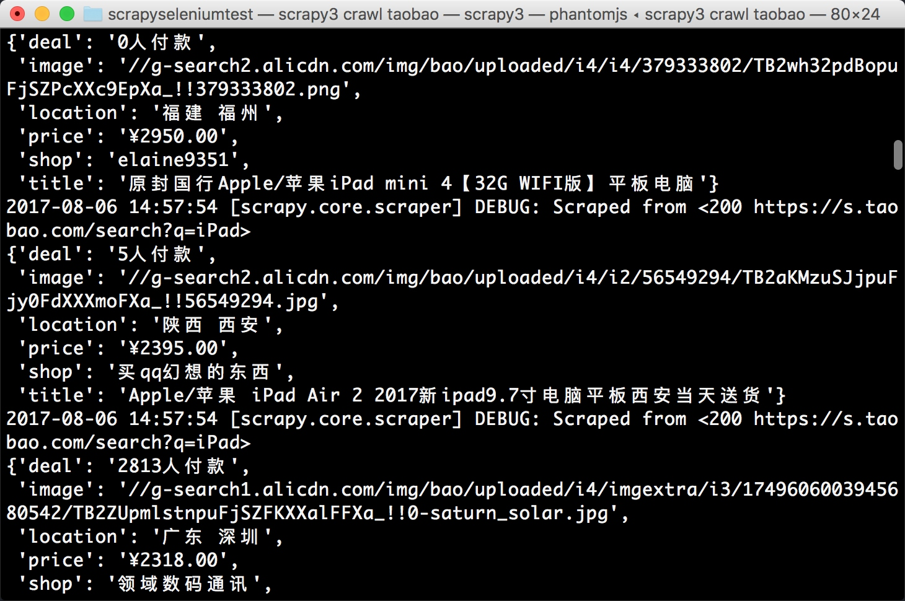
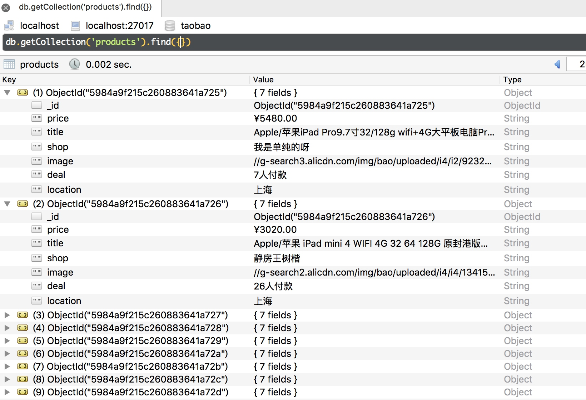

# 13.9 Scrapy对接Selenium

Scrapy 抓取页面的方式和 Requests 库类似，都是直接模拟HTTP 请求，因此如果遇到 JavaScript 动态渲染的页面 Scrapy同样是无法抓取的，而在前文中我们抓取 JavaScript 渲染的页面有两种方式，一种是分析 Ajax 请求，找到其对应的接口抓取，Scrapy 中同样可以用此种方式抓取。另一种是直接用Selenium 或 Splash 模拟浏览器进行抓取，这种方式我们不需要关心页面后台发生了怎样的请求，也不需要分析渲染过程，我们只需要关心页面最终结果即可，可见即可爬，所以如果在 Scrapy 中可以对接 Selenium 话就可以处理任何网站的抓取了。

### 1. 本节目标

本节我们来看一下 Scrapy 框架中如何对接 Selenium，以 PhantomJS 进行演示，这次我们依然是抓取淘宝商品信息，抓取逻辑和前文中用 Selenium 抓取淘宝商品一节完全相同。

### 2. 准备工作

在本节开始之前请确保已经安装好了 PhantomJS 和 MongoDB 并可以正常运行，并且安装好了 Scrapy、Selenium、PyMongo 库，安装方式可以参考第一章的安装说明。

### 3. 新建项目

首先新建项目，名称叫做 scrapyseleniumtest，命令如下：

```
scrapy startproject scrapyseleniumtest
```

随后新建一个 Spider，命令如下：

```
scrapy genspider taobao www.taobao.com
```

接下来把 ROBOTSTXT_OBEY 修改一下，修改为 False。

```python
ROBOTSTXT_OBEY = False
```

### 4. 定义Item

接下来首先定义 Item 对象，叫做 ProductItem，代码如下：

```python
from scrapy import Item, Field

class ProductItem(Item):
    
    collection = 'products'
    image = Field()
    price = Field()
    deal = Field()
    title = Field()
    shop = Field()
    location = Field()
```

在这里我们定义了 6 个 Field，也就是 6 个字段，跟之前的案例完全相同，然后定义了一个 collection 属性，即此 Item 保存的MongoDB 的 Collection 名称。

接下来我们初步实现 Spider 的  start_requests()方法，实现如下：

```python
from scrapy import Request, Spider
from urllib.parse import quote
from scrapyseleniumtest.items import ProductItem

class TaobaoSpider(Spider):
    name = 'taobao'
    allowed_domains = ['www.taobao.com']
    base_url = 'https://s.taobao.com/search?q='

    def start_requests(self):
        for keyword in self.settings.get('KEYWORDS'):
            for page in range(1, self.settings.get('MAX_PAGE') + 1):
                url = self.base_url + quote(keyword)
                yield Request(url=url, callback=self.parse, meta={'page': page}, dont_filter=True)
```

首先我们定义了一个 base_url，即商品列表的 URL，其后拼接一个搜索关键字就是该关键字在淘宝的搜索结果商品列表页面。

在这里关键字我们用 KEYWORDS 标识，定义为一个列表，最大翻页页码用 MAX_PAGE 表示，统一定义在  setttings.py 里面，定义如下：

```python
KEYWORDS = ['iPad']
MAX_PAGE = 100
```

在 start_requests() 方法里我们首先遍历了关键字，随后遍历了分页页码，构造 Request 并生成，由于每次搜索的 URL 是相同的，所以在这里分页页码我们用 meta 参数来传递，同时设置 dont_filter 不去重，这样爬虫启动的时候就会生成每个关键字对应的商品列表的每一页的请求了。

### 5. 对接Selenium

接下来我们就需要处理这些请求的抓取了，这次抓取不同，我们要对接 Selenium 进行抓取，在这里采用 Downloader Middleware 来实现，在 Middleware 里面的 process_request() 方法里面对每个抓取请求进行处理，启动浏览器并进行页面渲染，再将渲染后的结果构造一个 HtmlResponse 返回即可。

代码实现如下：

```python
from selenium import webdriver
from selenium.common.exceptions import TimeoutException
from selenium.webdriver.common.by import By
from selenium.webdriver.support.ui import WebDriverWait
from selenium.webdriver.support import expected_conditions as EC
from scrapy.http import HtmlResponse
from logging import getLogger

class SeleniumMiddleware():
    def __init__(self, timeout=None, service_args=[]):
        self.logger = getLogger(__name__)
        self.timeout = timeout
        self.browser = webdriver.PhantomJS(service_args=service_args)
        self.browser.set_window_size(1400, 700)
        self.browser.set_page_load_timeout(self.timeout)
        self.wait = WebDriverWait(self.browser, self.timeout)
    
    def __del__(self):
        self.browser.close()
    
    def process_request(self, request, spider):
        """
        用PhantomJS抓取页面
        :param request: Request对象
        :param spider: Spider对象
        :return: HtmlResponse
        """
        self.logger.debug('PhantomJS is Starting')
        page = request.meta.get('page', 1)
        try:
            self.browser.get(request.url)
            if page > 1:
                input = self.wait.until(
                    EC.presence_of_element_located((By.CSS_SELECTOR, '#mainsrp-pager div.form > input')))
                submit = self.wait.until(
                    EC.element_to_be_clickable((By.CSS_SELECTOR, '#mainsrp-pager div.form > span.btn.J_Submit')))
                input.clear()
                input.send_keys(page)
                submit.click()
            self.wait.until(EC.text_to_be_present_in_element((By.CSS_SELECTOR, '#mainsrp-pager li.item.active > span'), str(page)))
            self.wait.until(EC.presence_of_element_located((By.CSS_SELECTOR, '.m-itemlist .items .item')))
            return HtmlResponse(url=request.url, body=self.browser.page_source, request=request, encoding='utf-8', status=200)
        except TimeoutException:
            return HtmlResponse(url=request.url, status=500, request=request)
    
    @classmethod
    def from_crawler(cls, crawler):
        return cls(timeout=crawler.settings.get('SELENIUM_TIMEOUT'),
                   service_args=crawler.settings.get('PHANTOMJS_SERVICE_ARGS'))
```

首先我们在 __init__() 里面对一些对象进行初始化，包括 PhantomJS、WebDriverWait 等对象，同时设置了页面大小和页面加载超时时间，随后在 process_request() 方法中我们首先通过 Request 的 meta 属性获取当前需要爬取的页码，然后调用 PhantomJS 对象的 get() 方法访问 Request 的对应的 URL，这也就相当于从 Request 对象里面获取了请求链接然后再用 PhantomJS 去加载，而不再使用 Scrapy 里的 Downloader。

随后的处理等待和翻页的方法在此不再赘述，和前文的原理完全相同。最后等待页面加载完成之后，我们调用 PhantomJS 的 page_source 属性即可获取当前页面的源代码，然后用它来直接构造了一个 HtmlResponse 对象并返回，构造它的时候需要传入多个参数，如 url、body 等，这些参数实际上就是它的一些基础属性，可以查看官方文档看下它的结构：[https://doc.scrapy.org/en/latest/topics/request-response.html](https://doc.scrapy.org/en/latest/topics/request-response.html)，这样我们就成功利用 PhantomJS 来代替 Scrapy 完成了页面的加载，最后将 Response 即可。

这里可能我们有人可能会纳闷了，为什么通过实现这么一个 Downloader Middleware 就可以了呢？之前的 Request 对象怎么办？Scrapy 不再处理了吗？Response 返回后又传递给了谁来处理？

是的，Request 对象到这里就不会再处理了，也不会再像以前一样交给 Downloader 下载了，Response 会直接传给 Spider 进行解析。

这究竟是为什么？这时我们需要回顾一下 Downloader Middleware 的 process_request() 方法的处理逻辑，在前面我们也提到过，内容如下：

当 process_request() 方法返回 Response 对象的时候，接下来更低优先级的 Downloader Middleware 的 process_request() 和 process_exception() 方法就不会被继续调用了，转而依次开始执行每个 Downloader Middleware 的 process_response() 方法，调用完毕之后直接将 Response 对象发送给 Spider 来处理。

在这里我们直接返回了一个 HtmlResponse 对象，它是 Response 的子类，同样满足此条件，返回之后便会顺次调用每个 Downloader Middleware 的 process_response() 方法，而在 process_response() 中我们没有对其做特殊处理，接着他就会被发送给 Spider，传给 Request 的回调函数进行解析。

到现在我们应该就能了解 Downloader Middleware 实现 Selenium 对接的原理了。

在 settings.py 里面开启它的调用：

```python
DOWNLOADER_MIDDLEWARES = {
    'scrapyseleniumtest.middlewares.SeleniumMiddleware': 543,
}
```

### 6. 解析页面

接下来 Response 对象就会回传给 Spider 内的回调函数进行解析了，所以下一步我们就实现其回调函数，对网页来进行解析，代码如下：

```python
def parse(self, response):
    products = response.xpath(
        '//div[@id="mainsrp-itemlist"]//div[@class="items"][1]//div[contains(@class, "item")]')
    for product in products:
        item = ProductItem()
        item['price'] = ''.join(product.xpath('.//div[contains(@class, "price")]//text()').extract()).strip()
        item['title'] = ''.join(product.xpath('.//div[contains(@class, "title")]//text()').extract()).strip()
        item['shop'] = ''.join(product.xpath('.//div[contains(@class, "shop")]//text()').extract()).strip()
        item['image'] = ''.join(product.xpath('.//div[@class="pic"]//img[contains(@class, "img")]/@data-src').extract()).strip()
        item['deal'] = product.xpath('.//div[contains(@class, "deal-cnt")]//text()').extract_first()
        item['location'] = product.xpath('.//div[contains(@class, "location")]//text()').extract_first()
        yield item
```

在这里我们使用 XPath 进行解析，调用 response 变量的 xpath() 方法即可，首先我们传递了选取所有商品对应的 XPath，可以匹配到所有的商品，随后对结果进行遍历，依次选取每个商品的名称、价格、图片等内容，构造一个 ProductItem 对象，然后返回即可。

### 7. 存储结果

最后我们再实现一个 Item Pipeline，将结果保存到 MongoDB，实现如下：

```python
import pymongo

class MongoPipeline(object):
    def __init__(self, mongo_uri, mongo_db):
        self.mongo_uri = mongo_uri
        self.mongo_db = mongo_db
    
    @classmethod
    def from_crawler(cls, crawler):
        return cls(mongo_uri=crawler.settings.get('MONGO_URI'), mongo_db=crawler.settings.get('MONGO_DB'))
    
    def open_spider(self, spider):
        self.client = pymongo.MongoClient(self.mongo_uri)
        self.db = self.client[self.mongo_db]
    
    def process_item(self, item, spider):
        self.db[item.collection].insert(dict(item))
        return item
    
    def close_spider(self, spider):
        self.client.close()
```

此实现和前文中存储到 MongoDB 的方法完全一致，原理不再赘述，记得在 settings.py 中开启它的调用：

```python
ITEM_PIPELINES = {
    'scrapyseleniumtest.pipelines.MongoPipeline': 300,
}
```

其中 MONGO_URI 和 MONGO_DB 的定义如下：

```python
MONGO_URI = 'localhost'
MONGO_DB = 'taobao'
```

### 8. 运行

这样整个项目就完成了，执行如下命令启动抓取即可：

```
scrapy crawl taobao
```

运行结果如下：



再查看一下 MongoDB，结果如下：



这样我们便成功在Scrapy中对接Selenium并实现了淘宝商品的抓取。

### 9. 本节代码

本节代码：[https://github.com/Python3WebSpider/ScrapySeleniumTest](https://github.com/Python3WebSpider/ScrapySeleniumTest)。

### 10. 结语

本节我们通过实现 Downloader Middleware 的方式实现了 Selenium 的对接，但这种方法其实是阻塞式的，也就是说这样就破坏了 Scrapy 异步处理的逻辑，速度还是比较受影响的，为了不破坏其异步加载逻辑，我们可以使用 Splash 实现，所以在下一节我们再来看下 Scrapy 对接 Splash 的方式。

