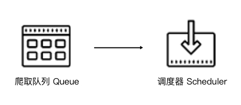
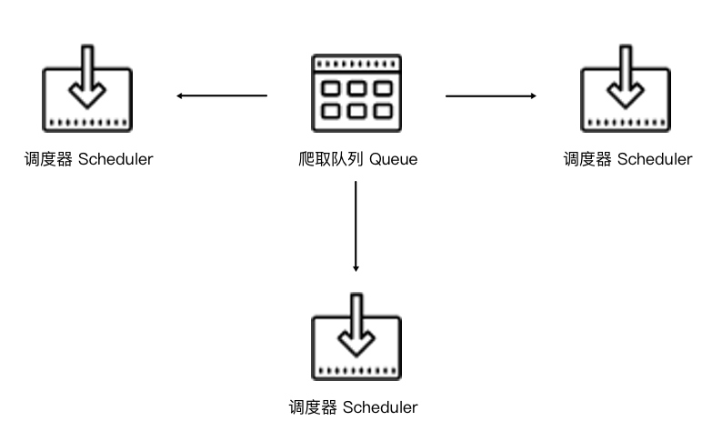
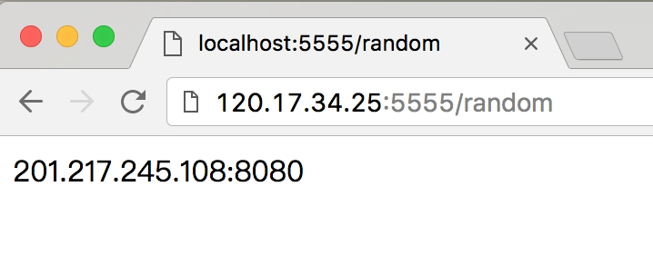

# 14.1 分布式爬虫原理

我们在前面已经实现了 Scrapy 微博爬虫，虽然爬虫是异步加多线程的，但是我们只能在一台主机上运行，所以爬取效率还是有限的，但如果此时有多台主机协同爬取的话，爬取效率会成倍提高，这样就形成了分布式爬虫。

那么接下来我们首先了解一下分布式爬虫的基本原理。

### 1. 分布式爬虫架构

在了解分布式爬虫架构之前，我们首先来回顾一下 Scrapy 的架构，如图 14-1 所示：



图 14-1 Scrapy 架构

在 Scrapy 单机爬虫中，在本地是有一个爬取队列 Queue，它是利用的是 deque 模块实现的，如果有新的 Request 生成就会放到里面，随后被 Scheduler 调度，随后 Request 被交给 Downloader 执行爬取，简单的调度架构如图 14-2 所示：



图 14-2 调度架构

那么此时如果有两个 Scheduler 同时从队列里面取 Request 呢，同时每个 Scheduler 也都有其对应的 Downloader，也就是两个 Downloader，那么在带宽足够且均能正常爬取，而且不考虑队列存取压力的情况下，那么效率会怎样？没错，翻倍。那假如有三个？四个？五个呢？效率肯定会继续增长。

那么这种情况下，我们的 Scheduler 可以扩展多个， Downloader 也可以扩展多个，但是不变的是什么？是爬取队列 Queue。爬取队列 Queue 必须始终为一个，那这也就是所谓的共享爬取队列，这样我们才能保证某个 Scheduer 从队列里面调度出了某个 Request 之后，其他的 Scheduler 不会再重复调度此 Request，这样才可以做到多个 Schduler 同步爬取，那这也就是分布式爬虫的基本雏形，简单调度架构如图 14-3 所示：



图 14-3 调度架构

所以说，要做到分布式，我们需要做的就是在多台主机上同时运行爬虫任务协同爬取，而协同爬取的前提就是共享爬取队列，这样各台主机就不需要再在各自的主机上维护单独的爬取队列了，这时需要把队列独立出来，让每台主机可以共同去从该队列存取 Request，同时各台主机都有各自的 Scheduler 和 Downloader，所以其调度和下载功能还是由各台主机分别完成的，所以在不考虑队列存取性能消耗的话，爬取效率还是会成倍提高的。

### 2. 维护爬取队列

那么这个队列用什么维护来好呢？我们首先需要考虑的就是性能问题，什么数据库存取效率高？我们自然想到基于内存存储的 Redis，而且 Redis 还支持多种数据结构，例如列表 List、集合 Set、有序集合 Sorted Set 等等，存取的操作也非常简单，所以在这里我们采用 Redis 来维护爬取队列。

这几种数据结构存储实际各有千秋，分析如下：
* 列表数据结构有 lpush()、lpop()、rpush()、rpop() 方法，所以我们可以用它来实现一个先进先出式爬取队列，也可以实现一个先进后出栈式爬取队列。
* 集合的元素是无序的且不重复的，这样我们可以非常方便地实现一个随机排序的不重复的爬取队列。
* 有序集合带有分数表示，而 Scrapy 的 Request 也有优先级的控制，所以用有集合我们可以实现一个带优先级调度的队列。

这些不同的队列我们需要根据具体爬虫的需求灵活选择。

### 3. 怎样来去重

我们知道 Scrapy 中是有自动去重的，它的去重是使用了 Python 中的集合，这个集合记录了 Scrapy 中每个 Request 的指纹，那么这个指纹实际上就是 Request 的哈希值，查看 Scrapy 的源代码可以发现它的实现是这样的：

```python
import hashlib
def request_fingerprint(request, include_headers=None):
    if include_headers:
        include_headers = tuple(to_bytes(h.lower())
                                 for h in sorted(include_headers))
    cache = _fingerprint_cache.setdefault(request, {})
    if include_headers not in cache:
        fp = hashlib.sha1()
        fp.update(to_bytes(request.method))
        fp.update(to_bytes(canonicalize_url(request.url)))
        fp.update(request.body or b'')
        if include_headers:
            for hdr in include_headers:
                if hdr in request.headers:
                    fp.update(hdr)
                    for v in request.headers.getlist(hdr):
                        fp.update(v)
        cache[include_headers] = fp.hexdigest()
    return cache[include_headers]
```

request_fingerprint() 就是计算 Request 指纹的方法，我们可以发现在计算指纹的时候使用的方法是 hashlib 的 sha1() 方法，在这里计算的字段包括 Request 的 Method、URL、Body、Headers 这几部分内容，这里面只要有一点不同，那么计算后的结果就不同，最后计算得到是是一个加密之后的字符串，也就是指纹，每个 Request 都有其独有的指纹，判定字符串是否重复比判定 Request 对象是否重复容易得多，所以指纹可以作为判定 Request 是否重复的依据。

那么如何判定重复呢？在 Scrapy 中是这样实现的：

```python
def __init__(self):
    self.fingerprints = set()
    
def request_seen(self, request):
    fp = self.request_fingerprint(request)
    if fp in self.fingerprints:
        return True
    self.fingerprints.add(fp)
```

在去重的类 RFPDupeFilter 中，有一个 request_seen() 方法，这个方法有一个参数 request，这个方法的作用就是检测该 Request 对象是否是重复的，那么怎么判定呢？首先它调用了 request_fingerprint() 方法获取了该 Request 的指纹，随后检测这个指纹是否存在于 fingerprints 这个变量中，而 fingerprints 是一个集合，集合的元素都是不重复的。判定指纹是否存在于该集合中，如果存在，那么就返回 True，证明该 Request 是重复的，否则就将这个指纹加入到集合中。那么下次如果还有相同的 Request 传递过来，相同的 Request 指纹也是相同的，那么这时指纹就已经存在于该集合中了，就会直接判定为重复，这时去重的效果就实现了。

所以说，Scrapy 的去重实现就是利用了一个集合，利用集合的元素的不重复特性来实现 Request 的去重。

那么对于分布式爬虫来说，我们肯定不能再用集合这个数据结构来去重了，因为这样还是每个主机单独来维护自己的集合，不能做到共享，多台主机如果生成了相同的 Request，只能各自去重，各个主机之间就无法做到去重了。

那么要实现去重，这个指纹集合也需要是共享的，另外 Redis 正好有集合这种数据结果，那么我们就选择它来作为指纹集合好了。那么这样去重集合也是利用 Redis 共享的，每台主机新生成的 Request 之后，首先拿该 Request 的指纹到该集合中比对，如果已经存在，那么证明该 Request 是重复的，直接丢弃，否则就是不重复的，然后再将 Request 的指纹加入到这个集合中即可，这样利用同样的原理不同的存储结构我们也实现了分布式 Reqeust 的去重。

### 4. 防止中断

我们知道在 Scrapy 中，一旦爬虫运行中断，再次重新运行就会重新开始爬取，因为爬虫运行时的 Request 队列是放在内存中的，爬虫运行中断后这个队列的空间就被释放了，此队列就被销毁了，所以再次运行之后就相当于一次全新的爬取过程。

在 Scrapy 中如果要做到中断后继续爬取，我们可以将队列中的 Request 保存起来，下次爬取直接读取即可获取上次爬取的队列，这样就可以做到继续爬取，在 Scrapy 中指定一个爬取队列的存储路径即可，这个使用 JOB_DIR 变量来标识，我们可以用如下命令来实现：

```
scrapy crawl spider -s JOBDIR=crawls/spider
```

这样在爬虫中断之后如果再次爬取就会接着上次继续爬取了，更加详细的使用方法可以参见官方文档，链接[https://doc.scrapy.org/en/latest/topics/jobs.html](https://doc.scrapy.org/en/latest/topics/jobs.html)。

所以在 Scrapy 中我们实际上是把爬取队列保存到本地了，第二次爬取直接读取并恢复队列即可，那么在分布式架构中还需要担心这个问题吗？不需要。因为我们的爬取队列本身就是用数据库保存的，如果爬虫中断了，数据库中的 Request 依然是存在的，这样下次启动爬虫时，就会接着上次继续爬取了。

所以说，当 Redis 的队列为空时，爬虫会重新爬取，当队列不为空时，爬虫便会接着上次的继续爬取。

### 5. 架构实现

理清了上面的三个问题，我们接下来就需要在程序中实现这个架构了，我们首先需要实现一个共享的爬取队列，另外还要实现去重的功能，另外我们还需要重写一个 Scheduer 的实现使之可以从共享的这个爬取队列去存取 Request。

不过幸运的是，一切都不需要我们来做了，已经有人实现了这些逻辑和架构并发布成 Python 的一个包，包的名称叫做 ScrapyRedis，这里面有刚才所提及的实现，那么接下来就让我们来一探 ScrapyRedis 的究竟，看下它的源码实现，了解一下它的详细工作原理吧。
