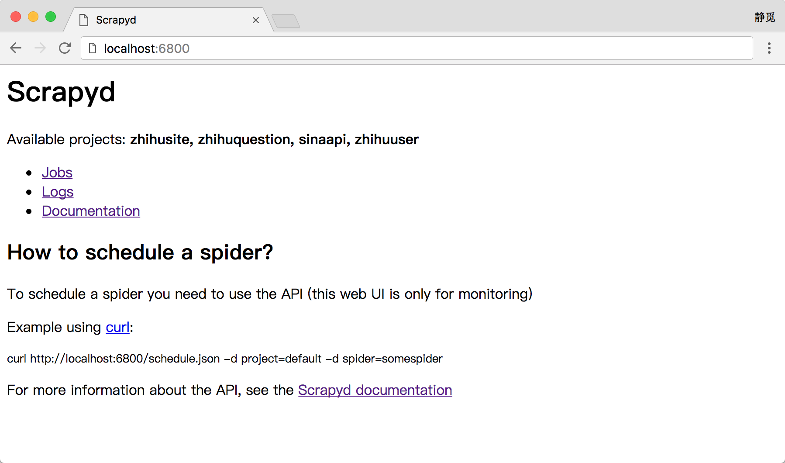

# ScrapydDocker

在前面我们使用了ScrapydClient成功将Scrapy项目部署到Scrapyd运行，但这个的前提是我们需要提前在服务器上安装好Scrapyd并运行Scrapyd服务，那么这个过程又是比较麻烦的。夸张点说，如果我们想同时将一个Scrapy项目部署到100台服务器上，我们总不能每台都去手动去配置Python环境，更改Scrapyd配置，启动运行吧？如果这些服务器上的Python环境又有着不同的版本，上面同时还运行这各种其他的项目，如果配置过程出了版本冲突那又会造成不必要的麻烦。

所以在这里我们需要解决一个痛点，那就是Python环境配置问题和版本冲突解决问题，那么很自然地我们就想到了Docker，如果我们将Scrapyd直接打包成一个Docker镜像，那么在服务器上我们只需要执行Docker命令就可以启动Scrapyd服务了，就不用再去关心Python环境问题，也不需要担心版本冲突问题了。

所以本节我们就来将Scrapyd打包制作成一个Docker镜像。

## 环境

首先需要保证本机已经正确安装好了Docker，如没有，可以参考第一章。

## 实战

接下来我们首先新建一个项目，新建一个scrapyd.conf，内容如下：

```ini
[scrapyd]
eggs_dir    = eggs
logs_dir    = logs
items_dir   =
jobs_to_keep = 5
dbs_dir     = dbs
max_proc    = 0
max_proc_per_cpu = 10
finished_to_keep = 100
poll_interval = 5.0
bind_address = 0.0.0.0
http_port   = 6800
debug       = off
runner      = scrapyd.runner
application = scrapyd.app.application
launcher    = scrapyd.launcher.Launcher
webroot     = scrapyd.website.Root

[services]
schedule.json     = scrapyd.webservice.Schedule
cancel.json       = scrapyd.webservice.Cancel
addversion.json   = scrapyd.webservice.AddVersion
listprojects.json = scrapyd.webservice.ListProjects
listversions.json = scrapyd.webservice.ListVersions
listspiders.json  = scrapyd.webservice.ListSpiders
delproject.json   = scrapyd.webservice.DeleteProject
delversion.json   = scrapyd.webservice.DeleteVersion
listjobs.json     = scrapyd.webservice.ListJobs
daemonstatus.json = scrapyd.webservice.DaemonStatus
```

在这里实际上是修改自官方文档的配置文件：[https://scrapyd.readthedocs.io/en/stable/config.html#example-configuration-file](https://scrapyd.readthedocs.io/en/stable/config.html#example-configuration-file)，其中修改的地方有两个：
* max_proc_per_cpu = 10，原本是4，即CPU单核最多运行4个Scrapy任务，也就是说1核的主机最多同时只能运行4个Scrapy任务，在这里设置上限为10，也可以自行设置。
* bind_address = 0.0.0.0，原本是127.0.0.1，不能公开访问，在这里修改为0.0.0.0即可解除此限制。

接下来新建一个requirements.txt，将一些Scrapy项目常用的库都列进去，内容如下：

```
requests
selenium
aiohttp
beautifulsoup4
pyquery
pymysql
redis
pymongo
flask
django
scrapy
scrapyd
scrapyd-client
scrapy-redis
scrapy-splash
```

如果我们运行的Scrapy项目还有其他的库需要用到可以自行添加到此文件中。

最后我们新建一个Dockerfile，内容如下：

```Dockerfile
FROM python:3.6
ADD . /code
WORKDIR /code
COPY ./scrapyd.conf /etc/scrapyd/
EXPOSE 6800
RUN pip3 install -r requirements.txt
CMD scrapyd
```

第一行FROM是指在 python:3.6 这个镜像上构建，也就是说在构建时就已经有了Python 3.6的环境。

第二行ADD是将本地的代码放置到虚拟容器中，它有两个参数，第一个参数是 . ，即代表本地当前路径，/code 代表虚拟容器中的路径，也就是将本地项目所有内容放置到虚拟容器的 /code 目录下。

第三行WORKDIR是指定工作目录，在这里将刚才我们添加的代码路径设成工作路径，在这个路径下的目录结构和我们当前本地目录结构是相同的，所以可以直接执行库安装命令等。

第四行CODY是将当前目录下的scrapyd.conf文件拷贝到虚拟容器的/etc/scrapyd/ 目录下，Scrapyd在运行的时候会默认读取这个配置。

第五行EXPOSE是声明运行时容器提供服务端口，注意这里只是一个声明，在运行时不一定就会在此端口开启服务。这样的声明一是告诉使用者这个镜像服务的运行端口，以方便配置映射；另一个用处则是在运行时使用随机端口映射时，会自动随机映射 EXPOSE 的端口。

第六行RUN是执行某些命令，一般做一些环境准备工作，由于Docker虚拟容器内只有Python3环境，而没有我们所需要的一些Python库，所以在这里我们运行此命令来在虚拟容器中安装相应的Python库，这样项目部署到Scrapyd中便可以正常运行了。

第七行CMD是容器启动命令，在容器运行时，会直接执行此命令，在这里我们直接用scrapyd来启动Scrapyd服务。

到现在基本的工作就完成了，运行如下命令进行构建：

```
docker build -t scrapyd:latest .
```

构建成功后即可运行测试：

```
docker run -d -p 6800:6800 scrapyd
```

运行之后我们打开[http://localhost:6800](http://localhost:6800)即可观察到Scrapyd服务，如图：



然后我们可以将此镜像上传到Docker Hub，首先打一个标签：

```
docker tag scrapyd:latest germey/scrapyd:latest
```

然后Push即可：

```
docker push germey/scrapyd:latest
```

之后我们在其他主机运行此命令即可启动Scrapyd服务：

```
docker run -d -p 6800:6800 germey/scrapyd
```
