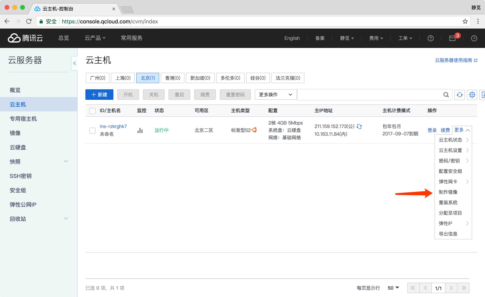
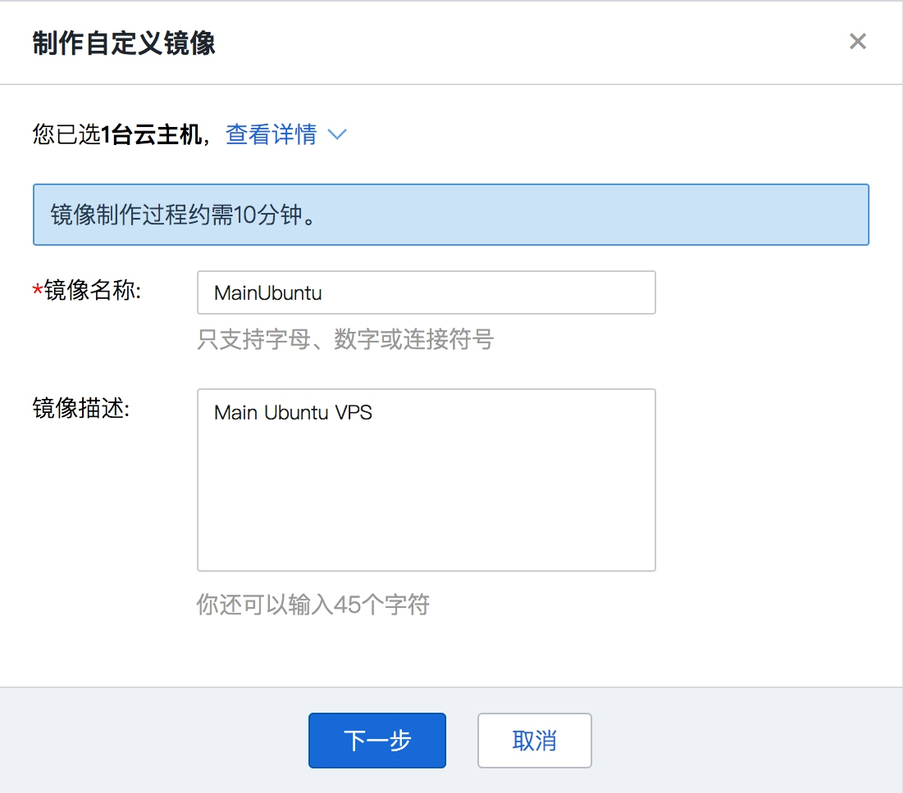
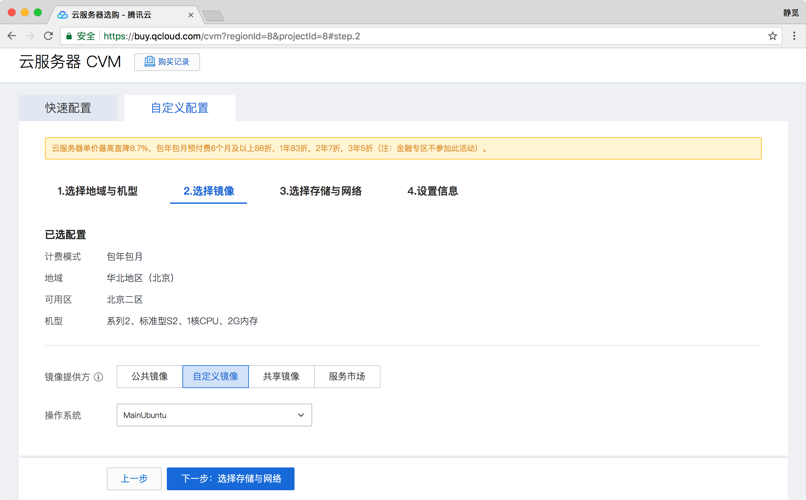

# 15.4 Scrapyd批量部署

我们在上一节实现了 Scrapyd 和 Docker 的对接，这样我们就不用再去每台主机安装 Python 环境和安装 Scrapyd 了，直接执行一句 Docker 命令运行 Scrapyd 服务即可，但是这有个前提，那就是需要每台主机都安装Docker，然后再去运行 Scrapyd 服务，如果我们需要部署 10 台主机的话，工作量还是确实不小的。

但这种情况下我们可以怎样来解呢？

如果我们现在已经有了一台主机，该台主机上已经安装好了各种开发环境，如果我们可以取到它的镜像，然后用镜像来批量复制多台主机，批量部署就可以轻松实现了。

还有另一种方案，如果我们在新建主机的时候可以直接指定一个运行脚本，脚本里写好配置各种环境的命令，指定其在新建主机的时候自动执行，那么等主机创建完成之后所有的环境就按照我们自定义的命令配置好了，这样也可以很方便地实现批量部署。

目前很多服务商都提供云主机服务，如阿里云、腾讯云、Azure、Amazon 等等，不同的服务商提供了不同的批量部署云主机的方式。例如腾讯云提供了创建自定义镜像的服务，在新建主机的时候使用自定义镜像创建新的主机即可，这样就可以批量生成多个相同的环境了。而在Azure中它提供了模板部署的服务，我们可以在模板中指定新建主机时执行的配置环境的命令，这样在主机创建完成之后环境就配置完成了。

本节我们就来看一下这两种批量部署的方式，实现 Docker 和 Scrapyd 服务的批量部署。

### 1. 镜像部署

在这里以腾讯云为例进行说明，首先我们需要有一台已经安装好环境的云主机，Docker 和 Scrapyd  镜像均已经正确安装，同时 Scrapyd 镜像启动加到开机启动脚本中，可以在开机时自动启动。

接下来我们来看下腾讯云下批量部署相同云服务的方法。

首先进入到腾讯云后台，可以点击更多选项制作镜像，如图所示：



然后输入镜像的一些配置信息：



最后确认制作镜像即可，稍等片刻即可制作成功。

接下来我们可以创建新的主机，在新建主机时选择已经制作好的镜像即可，如图所示：



后续配置过程按照提示进行即可。

配置完成之后登录新到云主机即可看到当前主机 Docker 和 Scrapyd 镜像都已经安装好了，同时 Scrapyd 服务也已经正常运行。

这样我们就通过自定义镜像的方式实现了相同环境的云主机的批量部署。

### 2. 模板部署

Azure 的云主机在部署时都会使用一个部署模板进行部署，这个模板实际上是一个 Json 文件，里面包含了很多部署时的配置选项，如主机名称、用户名、密码、主机型号等等，另外在模板中我们也可以指定新建完云主机之后执行的命令行脚本，例如安装 Docker、运行镜像等等，这样等部署工作全部完成之后，新创建的云主机就已经完成了环境配置同时运行了相关服务，非常便捷。

在这里提供一个部署 Linux 主机时自动安装 Docker 和运行 Scrapyd 镜像的模板，由于模板内容太多，源文件可以查看：[https://github.com/Python3WebSpider/ScrapydDeploy/blob/master/azuredeploy.json](https://github.com/Python3WebSpider/ScrapydDeploy/blob/master/azuredeploy.json)，在模板中 Microsoft.Compute/virtualMachines/extensions 部分可以发现有一个 commandToExecute 字段，它可以指定建立主机后时自动执行的命令，这里的命令完成的是安装 Docker 并运行 Scrapyd 镜像服务的过程，这样在完成主机部署后就可以直接使用 Scrapyd 服务了。

在部署之前首先需要安装一个 Azure 组件，安装过程可以参考：[https://docs.azure.cn/zh-cn/xplat-cli-install](https://docs.azure.cn/zh-cn/xplat-cli-install)，安装完毕之后就可以使用 azure 命令行进行部署。

首先需要登录 Azure，在这里登录的是中国区，命令如下：

```
azure login -e AzureChinaCloud
```

如果没有资源组的话需要新建一个资源组，命令如下：

```
azure group create myResourceGroup chinanorth
```

其中 myResourceGroup 就是资源组的名称，可以自行定义。

接下来就可以使用该模板进行部署了，命令如下：

```
azure group deployment create --template-file azuredeploy.json myResourceGroup myDeploymentName
```

这里 myResourceGroup 就是资源组的名称，myDeploymentName 是部署任务的名称。

例如，部署一台 Linux 主机的过程如下：

```
azure group deployment create --template-file azuredeploy.json MyResourceGroup SingleVMDeploy
info:    Executing command group deployment create
info:    Supply values for the following parameters
adminUsername:  datacrawl
adminPassword:  DataCrawl123
vmSize:  Standard_D2_v2
vmName:  datacrawl-vm
dnsLabelPrefix:  datacrawlvm
storageAccountName:  datacrawlstorage
```

运行命令后会提示输入各个配置参数，如主机用户名、密码等等，输入完成之后等待整个部署工作完成即可，命令行会自动退出，部署完成之后我们登录云主机即可查看到 Docker 已经成功安装并且 Scrapyd 服务正常运行，直接使用 Scrapyd 服务即可。

### 3. 结语

以上便是批量部署的两种方法，在大规模分布式爬虫架构中，如果需要批量部署多个爬虫环境，使用如上方法可以快速批量完成环境的搭建工作，而不用再去逐个主机配置环境，省时省力。

到此为止，我们就解决了批量部署的问题了，可以做到创建主机完毕之后即可直接使用 Scrapyd 服务。

