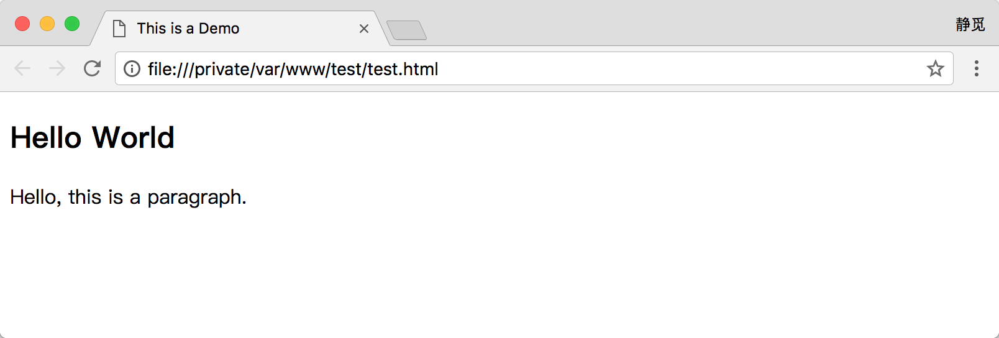

# 网页结构解析

我们平时用浏览器访问网站的时候，一个个站点形形色色，页面也各不相同，但有没有想过它是为何才能呈现出这个样子的？

那么本节我们就来了解一下网页的基本组成和结构。

## 网页的组成

网页可以分为三大部分，HTML、CSS、JS。

### HTML

HTML是用来描述网页的一种语言，其全称叫做Hyper Text Markup Language，即超文本标记语言。网页包括文字、按钮、图片、视频等各种复杂的元素，其基础架构就是HTML。不同类型的文字通过不同类型的标签来表示，如图片用``标签表示，视频用`<video>`标签来表示，段落用`<p>`标签来表示，它们之间的布局又常通过布局标签`<div>`嵌套组合而成，各种标签通过不同的排列和嵌套才形成了网页的框架。

我们在Chrome浏览器中打开百度，右键单击审查元素或按F12打开开发者模式，切换到Elements选项卡即可看到网页的源代码，这就是HTML，整个网页就是由各种不同的标签嵌套组合而成的。


 
 ### CSS
 
HTML定义了网页的元素及其结构，但是只有HTML页面的布局会不美观，可能只是简单的元素的排列，那么为了让网页看起来更好看一点，在这里就借助于CSS。

CSS，全称叫做Cascading Style Sheets，即层叠样式表。“层叠”是指当在HTML中引用了数个样式文件，并且样式发生冲突时，浏览器能依据层叠顺序处理。“样式”指网页中文字大小、颜色、元素间距、排列等格式。

CSS是目前唯一的网页页面排版样式标准，有了它的帮助，页面才会变得更为美观。

在上图的右侧即为CSS，例如：

```css
#head_wrapper.s-ps-islite .s-p-top {
    position: absolute;
    bottom: 40px;
    width: 100%;
    height: 181px;
}
```

这就是一个CSS样式，在大括号前面是一个CSS选择器，此选择器的意思是选中id为head_wrapper且class为s-ps-islite内部的class为s-p-top的元素。大括号内部写的就是一条条样式规则，例如position指定了这个元素的布局方式为绝对布局，bottom指定元素的下边距为40像素，width指定了宽度为100%占满父元素，height则指定了元素的高度。也就是说我们将一些位置、宽度、高度等样式配置统一写成这样的形式，大括号括起来，然后开头再加上一个CSS选择器，就代表这一个样式对CSS选择器选中的元素生效，这样元素就会根据此样式来展示了。

所以在网页中，一般会统一定义整个网页的样式规则，写入到CSS文件，其后缀名为css，在HTML中只需要用`<link>`标签即可引入写好的CSS文件，这样整个页面就会变得美观优雅。


### JS
   
JS，全称为JavaScript，是一种脚本语言，HTML和CSS配合使用，提供给用户的只是一种静态的信息，缺少交互性。我们在网页里可能会看到一些交互和动画效果，如下载进度条、提示框、轮播图等，这通常就是JavaScript的功劳。它的出现使得用户与信息之间不只是一种浏览与显示的关系，而是实现了一种实时、动态、交互的页面功能。

JS通常也是以单独的文件形式加载的，后缀名为js，在HTML中通过`<script>`标签即可引入。

因此综上所属，HTML 定义了网页的内容和结构，CSS 描述了网页的布局，JavaScript定义了网页的行为。

这就是网页的三大基本组成。

## 网页的结构

我们首先用一个例子来感受一下HTML的基本结构。新建一个文本文件，名称可以自取，后缀名为html，内容如下：

```html
<!DOCTYPE html>
<html>
    <head>
        <meta charset="UTF-8">
        <title>This is a Demo</title>
    </head>
    <body>
        <div id="container">
            <div class="wrapper">
                <h2 class="title">Hello World</h2>
                <p class="text">Hello, this is a paragraph.</p>
            </div>
        </div>
    </body>
</html>
```

这就是一个最简单的HTML实例，开头是`<!DOCTYPE html>`定义了文档类型，其次最外层是`<html>`标签，最后由`</html>`结尾代表标签闭合，其内部是`<head>`标签和`<body>`标签，分别代表网页头和网页体，它们也分别需要`</head>`和`</body>`表示标签闭合。`<head>`标签内定义了一些页面的配置和引用，如`<meta charset="UTF-8">`指定了网页的编码为UTF-8，`<title>`标签则定义了网页的标题。`<body>`标签内则是在网页正文中显示的内容，`<div>`标签定义了网页中的区块，首先最外层`<div id="container">`定义了一个区块，它的id是container，这是一个非常常用的属性，且id的内容在网页中是唯一的，我们可以通过id来取到这个区块。然后在此区块内又有一个`<div>`标签，它的class为wrapper，这也是一个非常常用的属性，经常与CSS配合使用。然后此区块内部又有一个`<h2>`标签，这代表一个二级标题，另外还有一个`<p>`标签，这代表一个段落。标题和段落标签也有各自的class属性。

我们将代码保存之后在浏览器中打开该文件，可以看到如下内容：



可以看到在选项卡上显示了This is a Demo字样，这是我们在`<head>`里面的`<title>`里定义的文字，它不会显示在网页正文，而是显示在网页选项卡里。而网页正文是`<body>`标签内部定义的各个元素生成的，图中可以看到网页中显示了二级标题和段落。

如上实例便是网页的一般结构，一个网页标准形式都是`<html>`内嵌套`<head>`和`<body>`标签，`<head>`内定义网页的配置和引用，`<body>`内定义网页的正文。

## 选择器

我们知道网页由一个个元素组成，CSS选择器会根据不同的元素设置不同的样式规则，那么我们怎样来定义是哪些元素呢？

在CSS中是使用了CSS选择器来定位元素的，例如上例中有个`<div>`的id为container，那么我们就可以用CSS选择器表示为`#container`，`#`开头代表选择id，其后紧跟id的名称。另外如果我们想选择class为wrapper的元素，便可以使用`.wrapper`，`.`开头代表选择class，其后紧跟class的名称。另外还有一种选择方式是根据标签名筛选，例如我们想选择二级标题，直接用`<h2>`即可选择。如上是最常用的三种选择表示，分别是根据id、class、标签名筛选，请牢记它们的写法。

另外CSS选择器还支持嵌套选择，各个选择器之间加上空格分隔开便可以代表嵌套关系，如`#container .wrapper p`则代表选择id为container内部的class为wrapper内部的p标签元素。另外如果不加空格则代表并列关系，如`div#container .wrapper p.text`代表选择id为container的div标签元素内部的class为wrapper元素内部的class为text的p标签元素。这就是CSS选择器，其筛选功能还是非常强大的。

另外CSS选择器还有一些其他的语法规则，可以参考[http://www.w3school.com.cn/cssref/css_selectors.asp](http://www.w3school.com.cn/cssref/css_selectors.asp)。

另外还有一种比较常用的选择器是XPath，此种选择方式在后文会详细介绍。


 