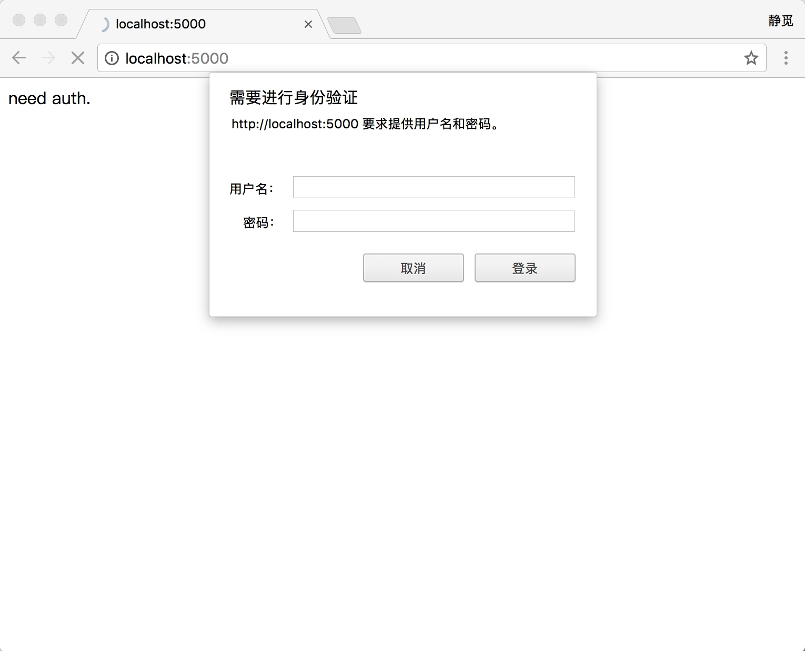

## 3.1.1 发送请求

使用 Urllib 的 request 模块我们可以方便地实现Request 的发送并得到 Response，我们本节来看下它的具体用法。

### 1. urlopen()

urllib.request 模块提供了最基本的构造HTTP请求的方法，利用它可以模拟浏览器的一个请求发起过程，同时它还带有处理authenticaton（授权验证），redirections（重定向)，cookies（浏览器Cookies）以及其它内容。

我们来感受一下它的强大之处，以Python官网为例，我们来把这个网页抓下来。

```python
import urllib.request

response = urllib.request.urlopen('https://www.python.org')
print(response.read().decode('utf-8'))
```

看一下运行结果。


真正的代码只有两行，我们便完成了Python官网的抓取，输出了网页的源代码，得到了源代码之后呢？你想要的链接、图片地址、文本信息不就都可以提取出来了吗？

接下来我们看下它返回的到底是什么，利用type()函数输出Response的类型。

```python
import urllib.request

response = urllib.request.urlopen('https://www.python.org')
print(type(response))
```

输出结果如下：

```python
<class 'http.client.HTTPResponse'>
```

通过输出结果可以发现它是一个 HTTPResposne 类型的对象，它主要包含的方法有read()、readinto()、getheader(name)、getheaders()、fileno()等函数和msg、version、status、reason、debuglevel、closed等属性。

得到这个对象之后，我们把它赋值为response变量，然后就可以调用这些方法和属性，得到返回结果的一系列信息了。

例如调用 read() 方法可以得到返回的网页内容，调用 status属性就可以得到返回结果的状态码，如200代表请求成功，404代表网页未找到等。

下面再来一个实例感受一下：

```python
import urllib.request

response = urllib.request.urlopen('https://www.python.org')
print(response.status)
print(response.getheaders())
print(response.getheader('Server'))
```

运行结果如下：

```
200
[('Server', 'nginx'), ('Content-Type', 'text/html; charset=utf-8'), ('X-Frame-Options', 'SAMEORIGIN'), ('X-Clacks-Overhead', 'GNU Terry Pratchett'), ('Content-Length', '47397'), ('Accept-Ranges', 'bytes'), ('Date', 'Mon, 01 Aug 2016 09:57:31 GMT'), ('Via', '1.1 varnish'), ('Age', '2473'), ('Connection', 'close'), ('X-Served-By', 'cache-lcy1125-LCY'), ('X-Cache', 'HIT'), ('X-Cache-Hits', '23'), ('Vary', 'Cookie'), ('Strict-Transport-Security', 'max-age=63072000; includeSubDomains')]
nginx
```

可见，三个输出分别输出了响应的状态码，响应的头信息，以及通过调用getheader()方法并传递一个参数Server获取了headers中的Server值，结果是nginx，意思就是服务器是nginx搭建的。

利用以上最基本的urlopen()方法，我们可以完成最基本的简单网页的GET请求抓取。

如果我们想给链接传递一些参数该怎么实现呢？我们首先看一下urlopen()函数的API：

```python
urllib.request.urlopen(url, data=None, [timeout, ]*, cafile=None, capath=None, cadefault=False, context=None)
```

可以发现除了第一个参数可以传递URL之外，我们还可以传递其它的内容，比如 data（附加数据）、timeout（超时时间）等等。

下面我们详细说明下这几个参数的用法。

#### data参数

data参数是可选的，如果要添加data，它要是字节流编码格式的内容，即bytes类型，通过bytes()方法可以进行转化，另外如果传递了这个data参数，它的请求方式就不再是GET方式请求，而是POST。

下面用一个实例来感受一下：

```python
import urllib.parse
import urllib.request

data = bytes(urllib.parse.urlencode({'word': 'hello'}), encoding='utf8')
response = urllib.request.urlopen('http://httpbin.org/post', data=data)
print(response.read())
```

在这里我们传递了一个参数word，值是hello。它需要被转码成bytes（字节流）类型。其中转字节流采用了bytes()方法，第一个参数需要是str(字符串)类型，需要用urllib.parse模块里的urlencode()方法来将参数字典转化为字符串。第二个参数指定编码格式，在这里指定为utf8。

在这里请求的网址是httpbin.org，它可以提供HTTP请求测试，本次我们请求的URL为：[http://httpbin.org/post](http://httpbin.org/post)，这个链接可以用来测试POST请求，它可以输出Request的一些信息，其中就包含我们传递的data参数。

运行结果如下：

```json
{
 "args": {},
 "data": "",
 "files": {},
 "form": {
 "word": "hello"
 },
 "headers": {
 "Accept-Encoding": "identity",
 "Content-Length": "10",
 "Content-Type": "application/x-www-form-urlencoded",
 "Host": "httpbin.org",
 "User-Agent": "Python-urllib/3.5"
 },
 "json": null,
 "origin": "123.124.23.253",
 "url": "http://httpbin.org/post"
}
```

我们传递的参数出现在了form字段中，这表明是模拟了表单提交的方式，以POST方式传输数据。

#### timeout参数

timeout参数可以设置超时时间，单位为秒，意思就是如果请求超出了设置的这个时间还没有得到响应，就会抛出异常，如果不指定，就会使用全局默认时间。它支持HTTP、HTTPS、FTP请求。

下面来用一个实例感受一下：

```python
import urllib.request

response = urllib.request.urlopen('http://httpbin.org/get', timeout=1)
print(response.read())
```

运行结果如下：

```
During handling of the above exception, another exception occurred:

Traceback (most recent call last): File "/var/py/python/urllibtest.py", line 4, in <module> response = urllib.request.urlopen('http://httpbin.org/get', timeout=1)
...
urllib.error.URLError: <urlopen error timed out>
```

在这里我们设置了超时时间是1秒，程序1秒过后服务器依然没有响应，于是抛出了URLError异常，它属于urllib.error模块，错误原因是超时。

因此我们可以通过设置这个超时时间来控制一个网页如果长时间未响应就跳过它的抓取，利用 try except语句就可以实现这样的操作，代码如下：

```python
import socket
import urllib.request
import urllib.error

try:
    response = urllib.request.urlopen('http://httpbin.org/get', timeout=0.1)
except urllib.error.URLError as e:
    if isinstance(e.reason, socket.timeout):
        print('TIME OUT')
```

在这里我们请求了 [http://httpbin.org/get](http://httpbin.org/get) 这个测试链接，设置了超时时间是0.1秒，然后捕获了URLError 这个异常，然后判断异常原因是 socket.timeout 类型，意思就是超时异常，就得出它确实是因为超时而报错，打印输出了 TIME OUT。

运行结果如下：

```
TIME OUT
```

常理来说，0.1秒内基本不可能得到服务器响应，因此输出了 TIME OUT 的提示。

这样，我们可以通过设置 timeout 这个参数来实现超时处理，有时还是很有用的。

#### 其他参数

还有context参数，它必须是 ssl.SSLContext 类型，用来指定 SSL 设置。

cafile和 capath 两个参数是指定CA证书和它的路径，这个在请求 HTTPS 链接时会有用。

cadefault 参数现在已经弃用了，默认为 False。

以上讲解了 urlopen() 方法的用法，通过这个最基本的函数可以完成简单的请求和网页抓取，如需更加详细了解，可以参见官方文档：[https://docs.python.org/3/library/urllib.request.html](https://docs.python.org/3/library/urllib.request.html)。

### 2. Request

由上我们知道利用urlopen()方法可以实现最基本请求的发起，但这几个简单的参数并不足以构建一个完整的请求，如果请求中需要加入Headers等信息，我们就可以利用更强大的Request类来构建一个请求。

首先我们用一个实例来感受一下Request的用法：

```python
import urllib.request

request = urllib.request.Request('https://python.org')
response = urllib.request.urlopen(request)
print(response.read().decode('utf-8'))
```

可以发现，我们依然是用urlopen()方法来发送这个请求，只不过这次urlopen()方法的参数不再是一个URL，而是一个Request类型的对象，通过构造这个这个数据结构，一方面我们可以将请求独立成一个对象，另一方面可配置参数更加丰富和灵活。

下面我们看一下Request都可以通过怎样的参数来构造，它的构造方法如下：

```python
class urllib.request.Request(url, data=None, headers={}, origin_req_host=None, unverifiable=False, method=None)
```

第一个参数是请求URL，这个是必传参数，其他的都是可选参数。

第二个data参数如果要传必须传bytes（字节流）类型的，如果是一个字典，可以先用 urllib.parse模块里的urlencode()编码。

第三个headers参数是一个字典，这个就是Request Headers了，你可以在构造Request时通过headers参数直接构造，也可以通过调用Request实例的add_header()方法来添加。

添加 Request Headers 最常用的用法就是通过修改User-Agent来伪装浏览器，默认的User-Agent是Python-urllib，我们可以通过修改它来伪装浏览器，比如要伪装火狐浏览器，你可以把它设置为：

```
Mozilla/5.0 (X11; U; Linux i686) Gecko/20071127 Firefox/2.0.0.11
```

第四个 origin_req_host 参数指的是请求方的host名称或者IP地址。

第五个 unverifiable 参数指的是这个请求是否是无法验证的，默认是False。意思就是说用户没有足够权限来选择接收这个请求的结果。例如我们请求一个HTML文档中的图片，但是我们没有自动抓取图像的权限，这时unverifiable的值就是True。

第六个 method参数是一个字符串，它用来指示请求使用的方法，比如GET，POST，PUT等等。

下面我们传入多个参数构建一个Request来感受一下：

```python
from urllib import request, parse

url = 'http://httpbin.org/post'
headers = {
    'User-Agent': 'Mozilla/4.0 (compatible; MSIE 5.5; Windows NT)',
    'Host': 'httpbin.org'
}
dict = {
    'name': 'Germey'
}
data = bytes(parse.urlencode(dict), encoding='utf8')
req = request.Request(url=url, data=data, headers=headers, method='POST')
response = request.urlopen(req)
print(response.read().decode('utf-8'))
```

在这里我们通过四个参数构造了一个Request，url即请求URL，在headers中指定了User-Agent和Host，传递的参数data用了urlencode()和bytes()方法来转成字节流，另外指定了请求方式为POST。

运行结果如下：

```json
{
  "args": {}, 
  "data": "", 
  "files": {}, 
  "form": {
    "name": "Germey"
  }, 
  "headers": {
    "Accept-Encoding": "identity", 
    "Content-Length": "11", 
    "Content-Type": "application/x-www-form-urlencoded", 
    "Host": "httpbin.org", 
    "User-Agent": "Mozilla/4.0 (compatible; MSIE 5.5; Windows NT)"
  }, 
  "json": null, 
  "origin": "219.224.169.11", 
  "url": "http://httpbin.org/post"
}

```

通过观察结果可以发现，我们成功设置了data，headers以及method。

另外headers也可以用add_header()方法来添加。

```python
req = request.Request(url=url, data=data, method='POST')
req.add_header('User-Agent', 'Mozilla/4.0 (compatible; MSIE 5.5; Windows NT)')
```

如此一来，我们就可以更加方便地构造一个Request，实现请求的发送啦。

### 3. 高级用法

有没有发现，在上面的过程中，我们虽然可以构造Request，但是一些更高级的操作，比如Cookies处理，代理设置等操作我们该怎么办？

接下来就需要更强大的工具Handler登场了。

简而言之我们可以把它理解为各种处理器，有专门处理登录验证的，有处理Cookies的，有处理代理设置的，利用它们我们几乎可以做到任何HTTP请求中所有的事情。

首先介绍下 urllib.request 模块里的 BaseHandler类，它是所有其他Handler的父类，它提供了最基本的Handler的方法，例如default_open()、protocol_request()方法等。

接下来就有各种Handler子类继承这个BaseHandler类，举例几个如下：

* HTTPDefaultErrorHandler用于处理HTTP响应错误，错误都会抛出HTTPError类型的异常。
* HTTPRedirectHandler用于处理重定向。
* HTTPCookieProcessor用于处理Cookie。
* ProxyHandler用于设置代理，默认代理为空。
* HTTPPasswordMgr用于管理密码，它维护了用户名密码的表。
* HTTPBasicAuthHandler用于管理认证，如果一个链接打开时需要认证，那么可以用它来解决认证问题。
* 
另外还有其他的Handler类，在这不一一列举了，详情可以参考官方文档： [https://docs.python.org/3/library/urllib.request.html#urllib.request.BaseHandler](https://docs.python.org/3/library/urllib.request.html#urllib.request.BaseHandler)

它们怎么来使用，不用着急，下面会有实例为你演示。

另外一个比较重要的类就是OpenerDirector，我们可以称之为Opener，我们之前用过urlopen()这个方法，实际上它就是urllib为我们提供的一个Opener。 

那么为什么要引入Opener呢？因为我们需要实现更高级的功能，之前我们使用的Request、urlopen()相当于类库为你封装好了极其常用的请求方法，利用它们两个我们就可以完成基本的请求，但是现在不一样了，我们需要实现更高级的功能，所以我们需要深入一层进行配置，使用更底层的实例来完成我们的操作。

所以，在这里我们就用到了比调用urlopen()的对象的更普遍的对象，也就是Opener。

Opener可以使用open()方法，返回的类型和urlopen()如出一辙。那么它和Handler有什么关系？简而言之，就是利用Handler来构建Opener。

下面我们用几个实例来感受一下他们的用法：

#### 认证

有些网站在打开时它就弹出了一个框，直接提示你输入用户名和密码，认证成功之后才能查看页面，如图所示：



那么我们如果要请求这样的页面怎么办呢？

借助于HTTPBasicAuthHandler就可以完成，代码如下：

```python
from urllib.request import HTTPPasswordMgrWithDefaultRealm, HTTPBasicAuthHandler, build_opener
from urllib.error import URLError

username = 'username'
password = 'password'
url = 'http://localhost:5000/'

p = HTTPPasswordMgrWithDefaultRealm()
p.add_password(None, url, username, password)
auth_handler = HTTPBasicAuthHandler(p)
opener = build_opener(auth_handler)

try:
    result = opener.open(url)
    html = result.read().decode('utf-8')
    print(html)
except URLError as e:
    print(e.reason)
```

在这里，首先实例化了一个HTTPBasicAuthHandler对象，参数是HTTPPasswordMgrWithDefaultRealm对象，它利用add_password()添加进去用户名和密码，这样我们就建立了一个处理认证的Handler。

接下来利用build_opener()方法来利用这个Handler构建一个Opener，那么这个Opener在发送请求的时候就相当于已经认证成功了。

接下来利用Opener的open()方法打开链接，就可以完成认证了。在这里获取到的结果就是认证后的页面源码内容。

#### 代理

在做爬虫的时候免不了要使用代理，如果要添加代理，可以这样做：

```python
from urllib.error import URLError
from urllib.request import ProxyHandler, build_opener

proxy_handler = ProxyHandler({
    'http': 'http://127.0.0.1:9743',
    'https': 'https://127.0.0.1:9743'
})
opener = build_opener(proxy_handler)
try:
    response = opener.open('https://www.baidu.com')
    print(response.read().decode('utf-8'))
except URLError as e:
    print(e.reason)
```

在此本地搭建了一个代理，运行在9743端口上。

在这里使用了ProxyHandler，ProxyHandler的参数是一个字典，键名是协议类型，比如HTTP还是HTTPS等，键值是代理链接，可以添加多个代理。

然后利用build_opener()方法利用这个Handler构造一个Opener，然后发送请求即可。

#### Cookies

Cookies的处理就需要Cookies相关的Handler了。

我们先用一个实例来感受一下怎样将网站的Cookies获取下来，代码如下：

```python
import http.cookiejar, urllib.request

cookie = http.cookiejar.CookieJar()
handler = urllib.request.HTTPCookieProcessor(cookie)
opener = urllib.request.build_opener(handler)
response = opener.open('http://www.baidu.com')
for item in cookie:
    print(item.name+"="+item.value)
```

首先我们必须声明一个CookieJar对象，接下来我们就需要利用HTTPCookieProcessor来构建一个handler，最后利用build_opener()方法构建出opener，执行open()函数即可。

运行结果如下：

```
BAIDUID=2E65A683F8A8BA3DF521469DF8EFF1E1:FG=1
BIDUPSID=2E65A683F8A8BA3DF521469DF8EFF1E1
H_PS_PSSID=20987_1421_18282_17949_21122_17001_21227_21189_21161_20927
PSTM=1474900615
BDSVRTM=0
BD_HOME=0
```

可以看到输出了每一条Cookie的名称还有值。

不过既然能输出，那可不可以输出成文件格式呢？我们知道Cookies实际也是以文本形式保存的。

答案当然是肯定的，我们用下面的实例来感受一下：

```python
filename = 'cookie.txt'
cookie = http.cookiejar.MozillaCookieJar(filename)
handler = urllib.request.HTTPCookieProcessor(cookie)
opener = urllib.request.build_opener(handler)
response = opener.open('http://www.baidu.com')
cookie.save(ignore_discard=True, ignore_expires=True)
```

这时的CookieJar就需要换成MozillaCookieJar，生成文件时需要用到它，它是CookieJar的子类，可以用来处理Cookies和文件相关的事件，读取和保存Cookies，它可以将Cookies保存成Mozilla型浏览器的Cookies的格式。

运行之后可以发现生成了一个cookie.txt文件。

内容如下：

```
# Netscape HTTP Cookie File
# http://curl.haxx.se/rfc/cookie_spec.html
# This is a generated file!  Do not edit.

.baidu.com	TRUE	/	FALSE	3622386254	BAIDUID	05AE39B5F56C1DEC474325CDA522D44F:FG=1
.baidu.com	TRUE	/	FALSE	3622386254	BIDUPSID	05AE39B5F56C1DEC474325CDA522D44F
.baidu.com	TRUE	/	FALSE		H_PS_PSSID	19638_1453_17710_18240_21091_18560_17001_21191_21161
.baidu.com	TRUE	/	FALSE	3622386254	PSTM	1474902606
www.baidu.com	FALSE	/	FALSE		BDSVRTM	0
www.baidu.com	FALSE	/	FALSE		BD_HOME	0
```

另外还有一个LWPCookieJar，同样可以读取和保存Cookies，但是保存的格式和MozillaCookieJar的不一样，它会保存成与libwww-perl(LWP)的Cookies文件格式。

要保存成LWP格式的Cookies文件，可以在声明时就改为：

```python
cookie = http.cookiejar.LWPCookieJar(filename)
```

生成的内容如下：

```
#LWP-Cookies-2.0
Set-Cookie3: BAIDUID="0CE9C56F598E69DB375B7C294AE5C591:FG=1"; path="/"; domain=".baidu.com"; path_spec; domain_dot; expires="2084-10-14 18:25:19Z"; version=0
Set-Cookie3: BIDUPSID=0CE9C56F598E69DB375B7C294AE5C591; path="/"; domain=".baidu.com"; path_spec; domain_dot; expires="2084-10-14 18:25:19Z"; version=0
Set-Cookie3: H_PS_PSSID=20048_1448_18240_17944_21089_21192_21161_20929; path="/"; domain=".baidu.com"; path_spec; domain_dot; discard; version=0
Set-Cookie3: PSTM=1474902671; path="/"; domain=".baidu.com"; path_spec; domain_dot; expires="2084-10-14 18:25:19Z"; version=0
Set-Cookie3: BDSVRTM=0; path="/"; domain="www.baidu.com"; path_spec; discard; version=0
Set-Cookie3: BD_HOME=0; path="/"; domain="www.baidu.com"; path_spec; discard; version=0
```

由此看来生成的格式还是有比较大的差异的。

那么生成了Cookies文件，怎样从文件读取并利用呢？

下面我们以LWPCookieJar格式为例来感受一下：

```python
cookie = http.cookiejar.LWPCookieJar()
cookie.load('cookie.txt', ignore_discard=True, ignore_expires=True)
handler = urllib.request.HTTPCookieProcessor(cookie)
opener = urllib.request.build_opener(handler)
response = opener.open('http://www.baidu.com')
print(response.read().decode('utf-8'))
```

可以看到我们这里调用了load()方法来读取本地的Coookis文件，获取到了Cookies的内容。不过前提是我们首先利用生成了LWPCookieJar格式的Cookies，获取到Cookies之后，后面同样的方法构建Handler和Opener即可。

运行结果正常输出百度网页的源代码。

好，通过如上用法，我们可以实现绝大多数请求功能的设置了。

### 4. 结语

以上便是Urllib库中request模块的基本用法，如果有更多想实现的功能，可以参考官方文档的说明：[https://docs.python.org/3/library/urllib.request.html#basehandler-objects](https://docs.python.org/3/library/urllib.request.html#basehandler-objects)。