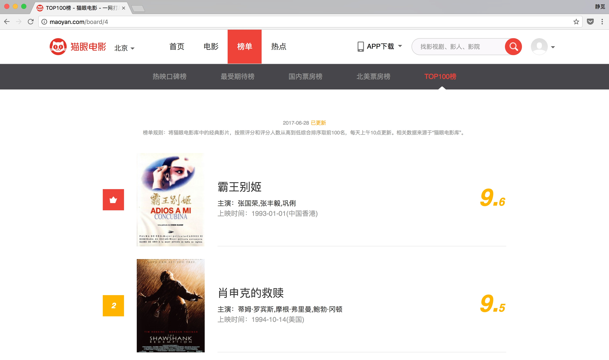
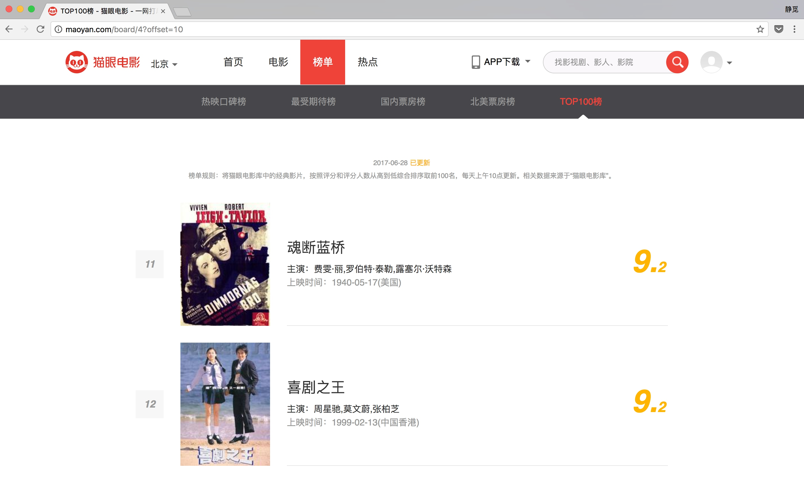
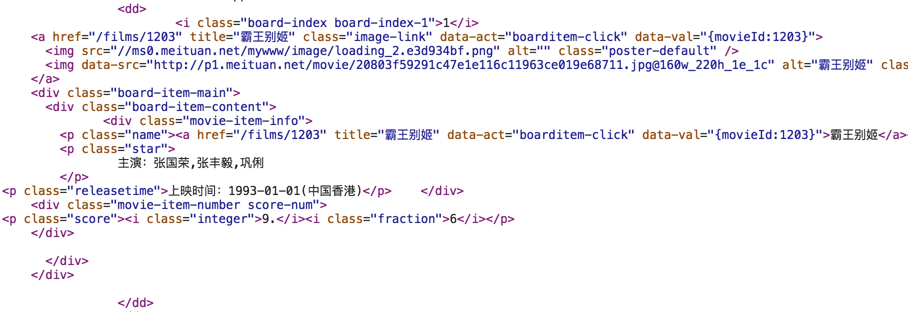
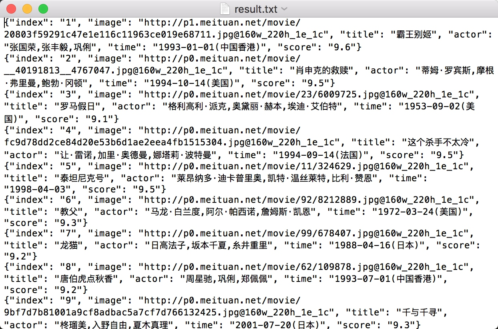

## 3.4　抓取猫眼电影排行

本节中，我们利用 requests 库和正则表达式来抓取猫眼电影 TOP100 的相关内容。requests 比 urllib 使用更加方便，而且目前我们还没有系统学习 HTML 解析库，所以这里就选用正则表达式来作为解析工具。

#### 1. 本节目标

本节中，我们要提取出猫眼电影 TOP100 的电影名称、时间、评分、图片等信息，提取的站点 URL 为 [http://maoyan.com/board/4](http://maoyan.com/board/4)，提取的结果会以文件形式保存下来。

#### 2. 准备工作

在本节开始之前，请确保已经正确安装好了 requests 库。如果没有安装，可以参考第 1 章的安装说明。

#### 3. 抓取分析
我们需要抓取的目标站点为 [http://maoyan.com/board/4](http://maoyan.com/board/4)，打开之后便可以查看到榜单信息，如图 3-11 所示。



图 3-11　榜单信息

排名第一的电影是霸王别姬，页面中显示的有效信息有影片名称、主演、上映时间、上映地区、评分、图片等信息。

将网页滚动到最下方，可以发现有分页的列表，直接点击第 2 页，观察页面的 URL 和内容发生了怎样的变化，如图 3-12 所示。



图 3-12　页面 URL 变化

可以发现页面的 URL 变成 [http://maoyan.com/board/4?offset=10](http://maoyan.com/board/4?offset=10)，比之前的 URL 多了一个参数，那就是 offset=10，而目前显示的结果是排行 11~20 名的电影，初步推断这是一个偏移量的参数。再点击下一页，发现页面的 URL 变成了 [http://maoyan.com/board/4?offset=20](http://maoyan.com/board/4?offset=20)，参数 offset 变成了 20，而显示的结果是排行 21~30 的电影。

由此可以总结出规律，offset 代表偏移量值，如果偏移量为 n，则显示的电影序号就是 n+1 到 n+10，每页显示 10 个。所以，如果想获取 TOP100 电影，只需要分开请求 10 次，而 10 次的 offset 参数分别设置为 0、10、20…90 即可，这样获取不同的页面之后，再用正则表达式提取出相关信息，就可以得到 TOP100 的所有电影信息了。

#### 4. 抓取首页

接下来用代码实现这个过程。首先抓取第一页的内容。我们实现了 get_one_page 方法，并给它传入 url 参数。然后将抓取的页面结果返回，再通过 main 方法调用。初步代码实现如下：

```python
import requests  

def get_one_page(url):  
    headers = {'User-Agent': 'Mozilla/5.0 (Macintosh; Intel Mac OS X 10_13_3) AppleWebKit/537.36 (KHTML, like Gecko)   
            Chrome/65.0.3325.162 Safari/537.36'  
    }

    response = requests.get(url, headers=headers)  
    if response.status_code == 200:  
        return response.text  
    return None  

def main():  
    url = 'http://maoyan.com/board/4'  
    html = get_one_page(url)  
    print(html)  

main()
```

这样运行之后，就可以成功获取首页的源代码了。获取源代码后，就需要解析页面，提取出我们想要的信息。

#### 5. 正则提取

接下来，回到网页看一下页面的真实源码。在开发者模式下的 Network 监听组件中查看源代码，如图 3-13 所示。


图 3-13　源代码

注意，这里不要在 Elements 选项卡中直接查看源码，因为那里的源码可能经过 JavaScript 操作而与原始请求不同，而是需要从 Network 选项卡部分查看原始请求得到的源码。

查看其中一个条目的源代码，如图 3-14 所示。


图 3-14　源代码

可以看到，一部电影信息对应的源代码是一个 dd 节点，我们用正则表达式来提取这里面的一些电影信息。首先，需要提取它的排名信息。而它的排名信息是在 class 为 board-index 的 i 节点内，这里利用非贪婪匹配来提取 i 节点内的信息，正则表达式写为：

```<dd>.*?board-index.*?>(.*?)</i>```

随后需要提取电影的图片。可以看到，后面有 a 节点，其内部有两个 img 节点。经过检查后发现，第二个 img 节点的 data-src 属性是图片的链接。这里提取第二个 img 节点的 data-src 属性，正则表达式可以改写如下：

```<dd>.*?board-index.*?>(.*?)</i>.*?data-src="(.*?)"```

再往后，需要提取电影的名称，它在后面的 p 节点内，class 为 name。所以，可以用 name 做一个标志位，然后进一步提取到其内 a 节点的正文内容，此时正则表达式改写如下：

```<dd>.*?board-index.*?>(.*?)</i>.*?data-src="(.*?)".*?name.*?a.*?>(.*?)</a>```

再提取主演、发布时间、评分等内容时，都是同样的原理。最后，正则表达式写为：

```<dd>.*?board-index.*?>(.*?)</i>.*?data-src="(.*?)".*?name.*?a.*?>(.*?)</a>.*?star.*?>(.*?)</p>.*?releasetime.*?>(.*?)</p>.*?integer.*?>(.*?)</i>.*?fraction.*?>(.*?)</i>.*?</dd>```

这样一个正则表达式可以匹配一个电影的结果，里面匹配了 7 个信息。接下来，通过调用 findall 方法提取出所有的内容。

接下来，我们再定义解析页面的方法 parse_one_page，主要是通过正则表达式来从结果中提取出我们想要的内容，实现代码如下：

```python
def parse_one_page(html):
    pattern = re.compile('<dd>.*?board-index.*?>(.*?)</i>.*?data-src="(.*?)".*?name.*?a.*?>(.*?)</a>.*?star.*?>(.*?)</p>.*?releasetime.*?>(.*?)</p>.*?integer.*?>(.*?)</i>.*?fraction.*?>(.*?)</i>.*?</dd>',
        re.S)
    items = re.findall(pattern, html)
    print(items)
```这样就可以成功地将一页的 10 个电影信息都提取出来，这是一个列表形式，输出结果如下：```
[('1', 'http://p1.meituan.net/movie/20803f59291c47e1e116c11963ce019e68711.jpg@160w_220h_1e_1c', ' 霸王别姬 ', '\n                主演：张国荣，张丰毅，巩俐 \n        ', ' 上映时间：1993-01-01(中国香港)', '9.', '6'), ('2', 'http://p0.meituan.net/movie/__40191813__4767047.jpg@160w_220h_1e_1c', ' 肖申克的救赎 ', '\n                主演：蒂姆・罗宾斯，摩根・弗里曼，鲍勃・冈顿 \n        ', ' 上映时间：1994-10-14(美国)', '9.', '5'), ('3', 'http://p0.meituan.net/movie/fc9d78dd2ce84d20e53b6d1ae2eea4fb1515304.jpg@160w_220h_1e_1c', ' 这个杀手不太冷 ', '\n                主演：让・雷诺，加里・奥德曼，娜塔莉・波特曼 \n        ', ' 上映时间：1994-09-14(法国)', '9.', '5'), ('4', 'http://p0.meituan.net/movie/23/6009725.jpg@160w_220h_1e_1c', ' 罗马假日 ', '\n                主演：格利高利・派克，奥黛丽・赫本，埃迪・艾伯特 \n        ', ' 上映时间：1953-09-02(美国)', '9.', '1'), ('5', 'http://p0.meituan.net/movie/53/1541925.jpg@160w_220h_1e_1c', ' 阿甘正传 ', '\n                主演：汤姆・汉克斯，罗宾・怀特，加里・西尼斯 \n        ', ' 上映时间：1994-07-06(美国)', '9.', '4'), ('6', 'http://p0.meituan.net/movie/11/324629.jpg@160w_220h_1e_1c', ' 泰坦尼克号 ', '\n                主演：莱昂纳多・迪卡普里奥，凯特・温丝莱特，比利・赞恩 \n        ', ' 上映时间：1998-04-03', '9.', '5'), ('7', 'http://p0.meituan.net/movie/99/678407.jpg@160w_220h_1e_1c', ' 龙猫 ', '\n                主演：日高法子，坂本千夏，糸井重里 \n        ', ' 上映时间：1988-04-16(日本)', '9.', '2'), ('8', 'http://p0.meituan.net/movie/92/8212889.jpg@160w_220h_1e_1c', ' 教父 ', '\n                主演：马龙・白兰度，阿尔・帕西诺，詹姆斯・凯恩 \n        ', ' 上映时间：1972-03-24(美国)', '9.', '3'), ('9', 'http://p0.meituan.net/movie/62/109878.jpg@160w_220h_1e_1c', ' 唐伯虎点秋香 ', '\n                主演：周星驰，巩俐，郑佩佩 \n        ', ' 上映时间：1993-07-01(中国香港)', '9.', '2'), ('10', 'http://p0.meituan.net/movie/9bf7d7b81001a9cf8adbac5a7cf7d766132425.jpg@160w_220h_1e_1c', ' 千与千寻 ', '\n                主演：柊瑠美，入野自由，夏木真理 \n        ', ' 上映时间：2001-07-20(日本)', '9.', '3')]
```但这样还不够，数据比较杂乱，我们再将匹配结果处理一下，遍历提取结果并生成字典，此时方法改写如下：```python
def parse_one_page(html):
    pattern = re.compile('<dd>.*?board-index.*?>(.*?)</i>.*?data-src="(.*?)".*?name.*?a.*?>(.*?)</a>.*?star.*?>(.*?)</p>.*?releasetime.*?>(.*?)</p>.*?integer.*?>(.*?)</i>.*?fraction.*?>(.*?)</i>.*?</dd>',
        re.S)
    items = re.findall(pattern, html)
    for item in items:
        yield {'index': item[0],
            'image': item[1],
            'title': item[2].strip(),
            'actor': item[3].strip()[3:] if len(item[3]) > 3 else '',
            'time': item[4].strip()[5:] if len(item[4]) > 5 else '',
            'score': item[5].strip() + item[6].strip()}
```这样就可以成功提取出电影的排名、图片、标题、演员、时间、评分等内容了，并把它赋值为一个个的字典，形成结构化数据。运行结果如下：```
{'image': 'http://p1.meituan.net/movie/20803f59291c47e1e116c11963ce019e68711.jpg@160w_220h_1e_1c', 'actor': ' 张国荣，张丰毅，巩俐 ', 'score': '9.6', 'index': '1', 'title': ' 霸王别姬 ', 'time': '1993-01-01(中国香港)'}
{'image': 'http://p0.meituan.net/movie/__40191813__4767047.jpg@160w_220h_1e_1c', 'actor': ' 蒂姆・罗宾斯，摩根・弗里曼，鲍勃・冈顿 ', 'score': '9.5', 'index': '2', 'title': ' 肖申克的救赎 ', 'time': '1994-10-14(美国)'}
{'image': 'http://p0.meituan.net/movie/fc9d78dd2ce84d20e53b6d1ae2eea4fb1515304.jpg@160w_220h_1e_1c', 'actor': ' 让・雷诺，加里・奥德曼，娜塔莉・波特曼 ', 'score': '9.5', 'index': '3', 'title': ' 这个杀手不太冷 ', 'time': '1994-09-14(法国)'}
{'image': 'http://p0.meituan.net/movie/23/6009725.jpg@160w_220h_1e_1c', 'actor': ' 格利高利・派克，奥黛丽・赫本，埃迪・艾伯特 ', 'score': '9.1', 'index': '4', 'title': ' 罗马假日 ', 'time': '1953-09-02(美国)'}
{'image': 'http://p0.meituan.net/movie/53/1541925.jpg@160w_220h_1e_1c', 'actor': ' 汤姆・汉克斯，罗宾・怀特，加里・西尼斯 ', 'score': '9.4', 'index': '5', 'title': ' 阿甘正传 ', 'time': '1994-07-06(美国)'}
{'image': 'http://p0.meituan.net/movie/11/324629.jpg@160w_220h_1e_1c', 'actor': ' 莱昂纳多・迪卡普里奥，凯特・温丝莱特，比利・赞恩 ', 'score': '9.5', 'index': '6', 'title': ' 泰坦尼克号 ', 'time': '1998-04-03'}
{'image': 'http://p0.meituan.net/movie/99/678407.jpg@160w_220h_1e_1c', 'actor': ' 日高法子，坂本千夏，糸井重里 ', 'score': '9.2', 'index': '7', 'title': ' 龙猫 ', 'time': '1988-04-16(日本)'}
{'image': 'http://p0.meituan.net/movie/92/8212889.jpg@160w_220h_1e_1c', 'actor': ' 马龙・白兰度，阿尔・帕西诺，詹姆斯・凯恩 ', 'score': '9.3', 'index': '8', 'title': ' 教父 ', 'time': '1972-03-24(美国)'}
{'image': 'http://p0.meituan.net/movie/62/109878.jpg@160w_220h_1e_1c', 'actor': ' 周星驰，巩俐，郑佩佩 ', 'score': '9.2', 'index': '9', 'title': ' 唐伯虎点秋香 ', 'time': '1993-07-01(中国香港)'}
{'image': 'http://p0.meituan.net/movie/9bf7d7b81001a9cf8adbac5a7cf7d766132425.jpg@160w_220h_1e_1c', 'actor': ' 柊瑠美，入野自由，夏木真理 ', 'score': '9.3', 'index': '10', 'title': ' 千与千寻 ', 'time': '2001-07-20(日本)'}
```

到此为止，我们就成功提取了单页的电影信息。

#### 6. 写入文件

随后，我们将提取的结果写入文件，这里直接写入到一个文本文件中。这里通过 JSON 库的 dumps 方法实现字典的序列化，并指定 ensure_ascii 参数为 False，这样可以保证输出结果是中文形式而不是 Unicode 编码。代码如下：

```python
def write_to_file(content):  
    with open('result.txt', 'a', encoding='utf-8') as f:  
        print(type(json.dumps(content)))  
        f.write(json.dumps(content, ensure_ascii=False)+'\n')
```

通过调用 write_to_file 方法即可实现将字典写入到文本文件的过程，此处的 content 参数就是一部电影的提取结果，是一个字典。

#### 7. 整合代码

最后，实现 main 方法来调用前面实现的方法，将单页的电影结果写入到文件。相关代码如下：

```python
def main():  
    url = 'http://maoyan.com/board/4'  
    html = get_one_page(url)  
    for item in parse_one_page(html):  
        write_to_file(item)
```

到此为止，我们就完成了单页电影的提取，也就是首页的 10 部电影可以成功提取并保存到文本文件中了。

#### 8. 分页爬取

因为我们需要抓取的是 TOP100 的电影，所以还需要遍历一下，给这个链接传入 offset 参数，实现其他 90 部电影的爬取，此时添加如下调用即可：

```python
if __name__ == '__main__':  
    for i in range(10):  
        main(offset=i * 10)
```这里还需要将 main 方法修改一下，接收一个 offset 值作为偏移量，然后构造 URL 进行爬取。实现代码如下：```python
def main(offset):  
    url = 'http://maoyan.com/board/4?offset=' + str(offset)  
    html = get_one_page(url)  
    for item in parse_one_page(html):  
        print(item)  
        write_to_file(item)
```到此为止，我们的猫眼电影 TOP100 的爬虫就全部完成了，再稍微整理一下，完整的代码如下：```python
import json  
import requests  
from requests.exceptions import RequestException  
import re  
import time  

def get_one_page(url):  
    try:  
        headers = {'User-Agent': 'Mozilla/5.0 (Macintosh; Intel Mac OS X 10_13_3) AppleWebKit/537.36 (KHTML, like   
                Gecko) Chrome/65.0.3325.162 Safari/537.36'  
        }

        response = requests.get(url, headers=headers)  
        if response.status_code == 200:  
            return response.text  
        return None  
    except RequestException:  
        return None  

def parse_one_page(html):  
   pattern = re.compile('<dd>.*?board-index.*?>(\d+)</i>.*?data-src="(.*?)".*?name"><a' 
+ '.*?>(.*?)</a>.*?star">(.*?)</p>.*?releasetime">(.*?)</p>' 
+ '.*?integer">(.*?)</i>.*?fraction">(.*?)</i>.*?</dd>', re.S)  
    items = re.findall(pattern, html)  
    for item in items:  
        yield {'index': item[0],  
            'image': item[1],  
            'title': item[2],  
            'actor': item[3].strip()[3:],  
            'time': item[4].strip()[5:],  
            'score': item[5] + item[6]  
        }  

def write_to_file(content):  
    with open('result.txt', 'a', encoding='utf-8') as f:  
        f.write(json.dumps(content, ensure_ascii=False) + '\n')  

def main(offset):  
    url = 'http://maoyan.com/board/4?offset=' + str(offset)  
    html = get_one_page(url)  
    for item in parse_one_page(html):  
        print(item)  
        write_to_file(item)  

if __name__ == '__main__':  
    for i in range(10):  
        main(offset=i * 10)  
        time.sleep(1)
```

现在猫眼多了反爬虫，如果速度过快，则会无响应，所以这里又增加了一个延时等待。

#### 9. 运行结果

最后，我们运行一下代码，输出结果类似如下：

```
{'index': '1', 'image': 'http://p1.meituan.net/movie/20803f59291c47e1e116c11963ce019e68711.jpg@160w_220h_1e_1c',   
    'title': ' 霸王别姬 ', 'actor': ' 张国荣，张丰毅，巩俐 ', 'time': '1993-01-01(中国香港)', 'score': '9.6'}  
{'index': '2', 'image': 'http://p0.meituan.net/movie/__40191813__4767047.jpg@160w_220h_1e_1c', 'title':   
    ' 肖申克的救赎 ', 'actor': ' 蒂姆・罗宾斯，摩根・弗里曼，鲍勃・冈顿 ', 'time': '1994-10-14(美国)', 'score': '9.5'}  
...  
{'index': '98', 'image': 'http://p0.meituan.net/movie/76/7073389.jpg@160w_220h_1e_1c', 'title': ' 东京物语 ',   
    'actor': ' 笠智众，原节子，杉村春子 ', 'time': '1953-11-03(日本)', 'score': '9.1'}  
{'index': '99', 'image': 'http://p0.meituan.net/movie/52/3420293.jpg@160w_220h_1e_1c', 'title': ' 我爱你 ',   
    'actor': ' 宋在河，李彩恩，吉海延 ', 'time': '2011-02-17(韩国)', 'score': '9.0'}  
{'index': '100', 'image': 'http://p1.meituan.net/movie/__44335138__8470779.jpg@160w_220h_1e_1c', 'title':   
    ' 迁徙的鸟 ', 'actor': ' 雅克・贝汉，菲利普・拉波洛，Philippe Labro', 'time': '2001-12-12(法国)', 'score': '9.1'}
```

这里省略了中间的部分输出结果。可以看到，这样就成功地把 TOP100 的电影信息爬取下来了。

这时我们再看下文本文件，结果如图 3-15 所示。



图 3-15　运行结果

可以看到，电影信息也已全部保存到了文本文件中了，大功告成！

#### 10. 本节代码

本节的代码地址为：[https://github.com/Python3WebSpider/MaoYan](https://github.com/Python3WebSpider/MaoYan)。

本节中，我们通过爬取猫眼 TOP100 的电影信息练习了 requests 和正则表达式的用法。这是一个最基础的实例，希望大家可以通过这个实例对爬虫的实现有一个最基本的思路，也对这两个库的用法有更深一步的了解。