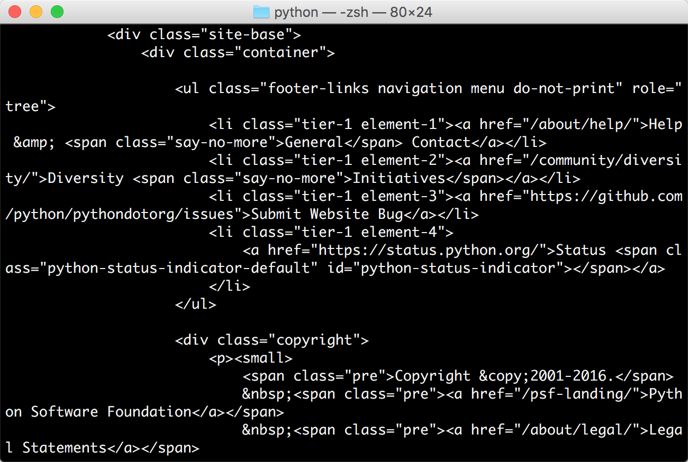

### urllib.request的使用

#### urllib.request.urlopen()基本使用

`urllib.request`模块提供了最基本的构造`HTTP`请求的方法，利用它可以模拟浏览器的一个请求发起过程，同时它还带有处理`authenticaton`（授权验证），`redirections`（重定向)，`cookies`(浏览器Cookies）以及其它内容。

好，那么首先我们来感受一下它的强大之处，以Python官网为例，我们来把这个网页抓下来。

```python
# coding=utf-8
import urllib.request

response = urllib.request.urlopen('https://www.python.org')
print(response.read().decode('utf-8'))
```

看一下运行结果。



真正的代码只有两行，我们便完成了Python官网的抓取，输出了网页的源代码，得到了源代码之后呢？你想要的链接、图片地址、文本信息不就都可以提取出来了吗？

接下来我们看下它返回的到底是什么，利用`type`函数输出`response`的类型。

```python
# coding=utf-8
import urllib.request

response = urllib.request.urlopen('https://www.python.org')
print(type(response))
```

输出结果如下：

```
<class 'http.client.HTTPResponse'>
```

通过输出结果可以发现它是一个`HTTPResposne`类型的对象，它主要包含的方法有`read()`、`readinto()`、`getheader(name)`、`getheaders()`、`fileno()`等函数和`msg`、`version`、`status`、`reason`、`debuglevel`、`closed`等属性。
得到这个对象之后，赋值为`response`，然后就可以用`response`调用这些方法和属性，得到返回结果的一系列信息。

例如`response.read()`就可以得到返回的网页内容，`response.status`就可以得到返回结果的状态码，如200代表请求成功，404代表网页未找到等。

下面再来一个实例感受一下。

```python
# coding=utf-8
import urllib.request

response = urllib.request.urlopen('https://www.python.org')
print(response.status)
print(response.getheaders())
print(response.getheader('Server'))
```

运行结果如下：

```
200
[('Server', 'nginx'), ('Content-Type', 'text/html; charset=utf-8'), ('X-Frame-Options', 'SAMEORIGIN'), ('X-Clacks-Overhead', 'GNU Terry Pratchett'), ('Content-Length', '47397'), ('Accept-Ranges', 'bytes'), ('Date', 'Mon, 01 Aug 2016 09:57:31 GMT'), ('Via', '1.1 varnish'), ('Age', '2473'), ('Connection', 'close'), ('X-Served-By', 'cache-lcy1125-LCY'), ('X-Cache', 'HIT'), ('X-Cache-Hits', '23'), ('Vary', 'Cookie'), ('Public-Key-Pins', 'max-age=600; includeSubDomains; pin-sha256="WoiWRyIOVNa9ihaBciRSC7XHjliYS9VwUGOIud4PB18="; pin-sha256="5C8kvU039KouVrl52D0eZSGf4Onjo4Khs8tmyTlV3nU="; pin-sha256="5C8kvU039KouVrl52D0eZSGf4Onjo4Khs8tmyTlV3nU="; pin-sha256="lCppFqbkrlJ3EcVFAkeip0+44VaoJUymbnOaEUk7tEU="; pin-sha256="TUDnr0MEoJ3of7+YliBMBVFB4/gJsv5zO7IxD9+YoWI="; pin-sha256="x4QzPSC810K5/cMjb05Qm4k3Bw5zBn4lTdO/nEW/Td4=";'), ('Strict-Transport-Security', 'max-age=63072000; includeSubDomains')]
nginx
```

可见，三个输出分别输出了响应的状态码，响应的头信息，以及通过传递一个参数获取了`Server`的类型。


#### urllib.request.urlopen()详解

利用以上最基本的`urlopen()`方法，我们可以完成最基本的简单网页的`GET`请求抓取。

如果我们想给链接传递一些参数该怎么实现呢？我们首先看一下`urlopen()`函数的API。

```python
urllib.request.urlopen(url, data=None, [timeout, ]*, cafile=None, capath=None, cadefault=False, context=None)
```

可以发现除了第一个参数可以传递URL之外，我们还可以传递其它的内容，比如`data`（附加参数），`timeout`（超时时间）等等。

##### data参数

`data`参数是可选的，如果要添加`data`，它要是字节流编码格式的内容，即`bytes`类型，通过`bytes()`函数可以进行转化，另外如果你传递了这个`data`参数，它的请求方式就不再是`GET`方式请求，而是`POST`。

下面用一个实例来感受一下。

```python
# coding=utf-8
import urllib.parse
import urllib.request

data = bytes(urllib.parse.urlencode({'word': 'hello'}), encoding='utf8')
response = urllib.request.urlopen('http://httpbin.org/post', data=data)
print(response.read())
```
在这里我们传递了一个参数`word`，值是`hello`。它需要被转码成`bytes`（字节流）类型。其中转字节流采用了`bytes()`方法，第一个参数需要是`str`(字符串)类型，需要用`urllib.parse.urlencode()`方法来将参数字典转化为字符串。第二个参数指定编码格式，在这里指定为`utf8`。

提交的网址是`httpbin.org`，它可以提供`HTTP`请求测试。`http://httpbin.org/post`这个地址可以用来测试`POST`请求，它可以输出请求和响应信息，其中就包含我们传递的`data`参数。


运行结果如下：

```json
{
 "args": {},
 "data": "",
 "files": {},
 "form": {
 "word": "hello"
 },
 "headers": {
 "Accept-Encoding": "identity",
 "Content-Length": "10",
 "Content-Type": "application/x-www-form-urlencoded",
 "Host": "httpbin.org",
 "User-Agent": "Python-urllib/3.5"
 },
 "json": null,
 "origin": "123.124.23.253",
 "url": "http://httpbin.org/post"
}
```

我们传递的参数出现在了`form`中，这表明是模拟了表单提交的方式，以`POST`方式传输数据。

##### timeout参数

`timeout`参数可以设置超时时间，单位为秒，意思就是如果请求超出了设置的这个时间还没有得到响应，就会抛出异常，如果不指定，就会使用全局默认时间。它支持`HTTP`、`HTTPS`、`FTP`请求。

下面来用一个实例感受一下。

```python
# coding=utf-8
import urllib.request

response = urllib.request.urlopen('http://httpbin.org/get', timeout=1)
print(response.read())
```

运行结果如下：

```
During handling of the above exception, another exception occurred:

Traceback (most recent call last): File "/var/py/python/urllibtest.py", line 4, in <module> response = urllib.request.urlopen('http://httpbin.org/get', timeout=1)
...
urllib.error.URLError: <urlopen error timed out>
```

在这里我们设置了超时时间是1秒，程序1秒过后服务器依然没有响应，于是抛出了`urllib.error.URLError`异常，错误原因是`timed out`。

因此我们可以通过设置这个超时时间来控制一个网页如果长时间未响应就跳过它的抓取，利用`try,except`语句就可以实现这样的操作。

```python
# coding=utf-8
import socket
import urllib.request
import urllib.error

try:
    response = urllib.request.urlopen('http://httpbin.org/get', timeout=0.1)
except urllib.error.URLError as e:
    if isinstance(e.reason, socket.timeout):
        print('TIME OUT')
```

在这里我们请求了`http://httpbin.org/get`这个测试链接，设置了超时时间是0.1秒，然后捕获了
`urllib.error.URLError`这个异常，然后判断异常原因是超时异常，就得出它确实是因为超时而报错，打印输出了`TIME OUT`，当然你也可以在这里做其他的处理。

运行结果如下：

```
TIME OUT
```

常理来说，0.1秒内基本不可能得到服务器响应，因此输出了`TIME OUT`的提示。

这样，我们可以通过设置`timeout`这个参数来实现超时处理，有时还是很有用的。

##### 其他参数

还有`context`参数，它必须是`ssl.SSLContext`类型，用来指定`SSL`设置。

`cafile`和`capath`两个参数是指定CA证书和它的路径，这个在请求`HTTPS`链接时会有用。

`cadefault`参数现在已经弃用了，默认为`False`。

以上讲解了`urlopen()`方法的用法，通过这个最基本的函数可以完成简单的请求和网页抓取，如需详细了解，可以参见官方文档。

> [https://docs.python.org/3/library/urllib.request.html](https://docs.python.org/3/library/urllib.request.html)

#### urllib.request.Request的使用

由上我们知道利用`urlopen()`方法可以实现最基本的请求发起，但这几个简单的参数并不足以构建一个完整的请求，如果请求中需要加入`headers`等信息，我们就可以利用更强大的`Request`类来构建一个请求。

首先我们用一个实例来感受一下`Request`的用法。

```python
# coding=utf-8
import urllib.request

request = urllib.request.Request('https://python.org')
response = urllib.request.urlopen(request)
print(response.read().decode('utf-8'))
```

可以发现，我们依然是用`urlopen()`方法来发送这个请求，只不过这次`urlopen()`方法的参数不再是一个URL，而是一个`Request`，通过构造这个这个数据结构，一方面我们可以将请求独立成一个对象，另一方面可配置参数更加丰富和灵活。

下面我们看一下`Request`都可以通过怎样的参数来构造，它的构造方法如下。

```python
class urllib.request.Request(url, data=None, headers={}, origin_req_host=None, unverifiable=False, method=None)

```
第一个参数是请求链接，这个是必传参数，其他的都是可选参数。

`data`参数如果要传必须传`bytes`（字节流）类型的，如果是一个字典，可以先用`urllib.parse.urlencode()`编码。

`headers`参数是一个字典，你可以在构造`Request`时通过`headers`参数传递，也可以通过调用`Request`对象的`add_header()`方法来添加请求头。请求头最常用的用法就是通过修改`User-Agent`来伪装浏览器，默认的`User-Agent`是`Python-urllib`，你可以通过修改它来伪装浏览器，比如要伪装火狐浏览器，你可以把它设置为`Mozilla/5.0 (X11; U; Linux i686) Gecko/20071127 Firefox/2.0.0.11`

`origin_req_host`指的是请求方的`host`名称或者`IP`地址。

`unverifiable`指的是这个请求是否是无法验证的，默认是`False`。意思就是说用户没有足够权限来选择接收这个请求的结果。例如我们请求一个HTML文档中的图片，但是我们没有自动抓取图像的权限，这时`unverifiable`的值就是`True`。

`method`是一个字符串，它用来指示请求使用的方法，比如`GET`，`POST`，`PUT`等等。

下面我们传入多个参数构建一个`Request`来感受一下。

```python
# coding=utf-8
from urllib import request, parse

url = 'http://httpbin.org/post'
headers = {
    'User-Agent': 'Mozilla/4.0 (compatible; MSIE 5.5; Windows NT)',
    'Host': 'httpbin.org'
}
dict = {
    'name': 'Germey'
}
data = bytes(parse.urlencode(dict), encoding='utf8')
req = request.Request(url=url, data=data, headers=headers, method='POST')
response = request.urlopen(req)
print(response.read().decode('utf-8'))
```

在这里我们通过四个参数构造了一个`Request`，`url`即请求链接，在`headers`中指定了`User-Agent`和`Host`，传递的参数`data`用了`urlencode()`和`bytes()`方法来转成字节流，另外指定了请求方式为`POST`。

运行结果如下：

```json
{
  "args": {}, 
  "data": "", 
  "files": {}, 
  "form": {
    "name": "Germey"
  }, 
  "headers": {
    "Accept-Encoding": "identity", 
    "Content-Length": "11", 
    "Content-Type": "application/x-www-form-urlencoded", 
    "Host": "httpbin.org", 
    "User-Agent": "Mozilla/4.0 (compatible; MSIE 5.5; Windows NT)"
  }, 
  "json": null, 
  "origin": "219.224.169.11", 
  "url": "http://httpbin.org/post"
}

```

通过观察结果可以发现，我们成功设置了`data`，`headers`以及`method`。

另外`headers`也可以用`add_header()`方法来添加。

```python
req = request.Request(url=url, data=data, method='POST')
req.add_header('User-Agent', 'Mozilla/4.0 (compatible; MSIE 5.5; Windows NT)')
```

如此一来，我们就可以更加方便地构造一个`Request`，实现请求的发送。

#### urllib.request高级特性

大家有没有发现，在上面的过程中，我们虽然可以构造`Request`，但是一些更高级的操作，比如`Cookies`处理，代理该怎样来设置？

接下来就需要更强大的工具`Handler`登场了。

简而言之你可以把它理解为各种处理器，有专门处理登录验证的，有处理`Cookies`的，有处理代理设置的，利用它们我们几乎可以做到任何`HTTP`请求中所有的事情。

首先介绍下`urllib.request.BaseHandler`，它是所有其他`Handler`的父类，它提供了最基本的`Handler`的方法，例如`default_open()`、`protocol_request()`等。

接下来就有各种`Handler`类继承这个`BaseHandler`，列举如下：

* `HTTPDefaultErrorHandler`用于处理HTTP响应错误，错误都会抛出`HTTPError`类型的异常。
* `HTTPRedirectHandler`用于处理重定向。
* `HTTPCookieProcessor`用于处理`Cookie`。
* `ProxyHandler`用于设置代理，默认代理为空。
* `HTTPPasswordMgr`用于管理密码，它维护了用户名密码的表。
* `HTTPBasicAuthHandler`用于管理认证，如果一个链接打开时需要认证，那么可以用它来解决认证问题。
另外还有其他的`Handler`，可以参考官方文档。

> [https://docs.python.org/3/library/urllib.request.html#urllib.request.BaseHandler](https://docs.python.org/3/library/urllib.request.html#urllib.request.BaseHandler)

它们怎么来使用，不用着急，下面会有实例为你演示。

另外一个比较重要的就是`OpenerDirector`，我们可以称之为`Opener`，我们之前用过`urllib.request.urlopen()`这个方法，实际上它就是一个`Opener`。 

那么为什么要引入`Opener`呢？因为我们需要实现更高级的功能，之前我们使用的`Request`、`urlopen()`相当于类库为你封装好了极其常用的请求方法，利用它们两个我们就可以完成基本的请求，但是现在不一样了，我们需要实现更高级的功能，所以我们需要深入一层，使用更上层的实例来完成我们的操作。所以，在这里我们就用到了比调用`urlopen()`的对象的更普遍的对象，也就是`Opener`。

`Opener`可以使用`open()`方法，返回的类型和`urlopen()`如出一辙。那么它和`Handler`有什么关系？简而言之，就是利用`Handler`来构建`Opener`。

我们先用一个实例来感受一下。

```python
# coding=utf-8
import urllib.request

auth_handler = urllib.request.HTTPBasicAuthHandler()
auth_handler.add_password(realm='PDQ Application',
                          uri='https://mahler:8092/site-updates.py',
                          user='klem',
                          passwd='kadidd!ehopper')
opener = urllib.request.build_opener(auth_handler)
urllib.request.install_opener(opener)
urllib.request.urlopen('http://www.example.com/login.html')
```

此处代码为实例代码，用于说明`Handler`和`Opener`的使用方法。

在这里，首先实例化了一个`HTTPBasicAuthHandler`对象，然后利用`add_password()`添加进去用户名和密码，相当于建立了一个处理认证的处理器。

接下来利用`urllib.request.build_opener()`方法来利用这个处理器构建一个`Opener`，那么这个`Opener`在发送请求的时候就具备了认证功能了。接下来利用`Opener`的`open()`方法打开链接，就可以完成认证了。

如果添加代理，可以这样做：

```python
# coding=utf-8
import urllib.request

proxy_handler = urllib.request.ProxyHandler({
    'http': 'http://218.202.111.10:80',
    'https': 'https://180.250.163.34:8888'
})
opener = urllib.request.build_opener(proxy_handler)
response = opener.open('https://www.baidu.com')
print(response.read())
```

此处代码为实例代码，用于说明代理的设置方法，代理可能已经失效。

在这里使用了`ProxyHandler`，`ProxyHandler`的参数是一个字典，key是协议类型，比如`http`还是`https`等，value是代理链接，可以添加多个代理。

然后利用`build_opener()`方法利用这个`Handler`构造一个`Opener`，然后发送请求即可。

好，通过如上用法，我们可以实现绝大多数请求功能的设置了。

发出请求之后，如果遇到异常怎么办？在下一节，我们会讲解一下有关异常处理的流程。
