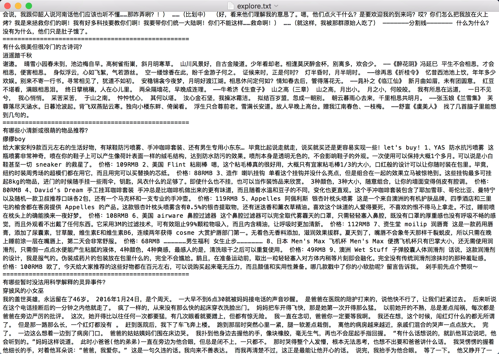
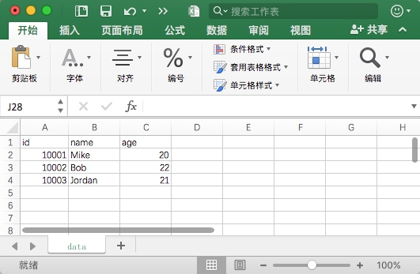

## 5.1　文件存储
文件存储形式多种多样，比如可以保存成TXT纯文本形式，也可以保存为JSON格式、CSV格式等，本节就来了解一下文本文件的存储方式。

### 5.1.1　TXT文本存储

将数据保存到TXT文本的操作非常简单，而且TXT文本几乎兼容任何平台，但是这有个缺点，那就是不利于检索。所以如果对检索和数据结构要求不高，追求方便第一的话，可以采用TXT文本存储。本节中，我们就来看下如何利用Python保存TXT文本文件。

#### 1. 本节目标
本节中，我们要保存知乎上“发现”页面的“热门话题”部分，将其问题和答案统一保存成文本形式。

#### 2. 基本实例
首先，可以用requests将网页源代码获取下来，然后使用pyquery解析库解析，接下来将提取的标题、回答者、回答保存到文本，代码如下：

```python
import requests
from pyquery import PyQuery as pq

url = 'https://www.zhihu.com/explore'
headers = {
    'User-Agent': 'Mozilla/5.0 (Macintosh; Intel Mac OS X 10_12_3) AppleWebKit/537.36 (KHTML, like Gecko) Chrome/58.0.3029.110 Safari/537.36'
}
html = requests.get(url, headers=headers).text
doc = pq(html)
items = doc('.explore-tab .feed-item').items()
for item in items:
    question = item.find('h2').text()
    author = item.find('.author-link-line').text()
    answer = pq(item.find('.content').html()).text()
    file = open('explore.txt', 'a', encoding='utf-8')
    file.write('\n'.join([question, author, answer]))
    file.write('\n' + '=' * 50 + '\n')
    file.close()
```

这里主要是为了演示文件保存的方式，因此requests异常处理部分在此省去。首先，用requests提取知乎的“发现”页面，然后将热门话题的问题、回答者、答案全文提取出来，然后利用Python提供的open方法打开一个文本文件，获取一个文件操作对象，这里赋值为file，接着利用file对象的write方法将提取的内容写入文件，最后调用close方法将其关闭，这样抓取的内容即可成功写入文本中了。

运行程序，可以发现在本地生成了一个explore.txt文件，其内容如图5-1所示。


图5-1　文件内容

这样热门问答的内容就被保存成文本形式了。

这里open方法的第一个参数即要保存的目标文件名称，第二个参数为a，代表以追加方式写入到文本。另外，我们还指定了文件的编码为utf-8。最后，写入完成后，还需要调用close方法来关闭文件对象。

#### 3. 打开方式
在刚才的实例中，open方法的第二个参数设置成了a，这样在每次写入文本时不会清空源文件，而是在文件末尾写入新的内容，这是一种文件打开方式。关于文件的打开方式，其实还有其他几种，这里简要介绍一下。

* r：以只读方式打开文件。文件的指针将会放在文件的开头。这是默认模式。
* rb：以二进制只读方式打开一个文件。文件指针将会放在文件的开头。
* r+：以读写方式打开一个文件。文件指针将会放在文件的开头。
* rb+：以二进制读写方式打开一个文件。文件指针将会放在文件的开头。
* w：以写入方式打开一个文件。如果该文件已存在，则将其覆盖。如果该文件不存在，则创建新文件。
* wb：以二进制写入方式打开一个文件。如果该文件已存在，则将其覆盖。如果该文件不存在，则创建新文件。
* w+：以读写方式打开一个文件。如果该文件已存在，则将其覆盖。如果该文件不存在，则创建新文件。
* wb+：以二进制读写格式打开一个文件。如果该文件已存在，则将其覆盖。如果该文件不存在，则创建新文件。
* a：以追加方式打开一个文件。如果该文件已存在，文件指针将会放在文件结尾。也就是说，新的内容将会被写入到已有内容之后。如果该文件不存在，则创建新文件来写入。
* ab：以二进制追加方式打开一个文件。如果该文件已存在，则文件指针将会放在文件结尾。也就是说，新的内容将会被写入到已有内容之后。如果该文件不存在，则创建新文件来写入。
* a+：以读写方式打开一个文件。如果该文件已存在，文件指针将会放在文件的结尾。文件打开时会是追加模式。如果该文件不存在，则创建新文件来读写。
* ab+：以二进制追加方式打开一个文件。如果该文件已存在，则文件指针将会放在文件结尾。如果该文件不存在，则创建新文件用于读写。

#### 4. 简化写法

另外，文件写入还有一种简写方法，那就是使用with as语法。在with控制块结束时，文件会自动关闭，所以就不需要再调用close方法了。这种保存方式可以简写如下：

```python
with open('explore.txt', 'a', encoding='utf-8') as file:
    file.write('\n'.join([question, author, answer]))
    file.write('\n' + '=' * 50 + '\n')
```

如果想保存时将原文清空，那么可以将第二个参数改写为w，代码如下：

```python
with open('explore.txt', 'w', encoding='utf-8') as file:
    file.write('\n'.join([question, author, answer]))
    file.write('\n' + '=' * 50 + '\n')
```

上面便是利用Python将结果保存为TXT文件的方法，这种方法简单易用，操作高效，是一种最基本的保存数据的方法。

### 5.1.2　JSON文件存储

JSON，全称为JavaScript Object Notation, 也就是JavaScript对象标记，它通过对象和数组的组合来表示数据，构造简洁但是结构化程度非常高，是一种轻量级的数据交换格式。本节中，我们就来了解如何利用Python保存数据到JSON文件。

#### 1. 对象和数组

在JavaScript语言中，一切都是对象。因此，任何支持的类型都可以通过JSON来表示，例如字符串、数字、对象、数组等，但是对象和数组是比较特殊且常用的两种类型，下面简要介绍一下它们。

对象：它在JavaScript中是使用花括号{}包裹起来的内容，数据结构为{key1：value1, key2：value2, ...}的键值对结构。在面向对象的语言中，key为对象的属性，value为对应的值。键名可以使用整数和字符串来表示。值的类型可以是任意类型。

数组：数组在JavaScript中是方括号[]包裹起来的内容，数据结构为["java", "javascript", "vb", ...]的索引结构。在JavaScript中，数组是一种比较特殊的数据类型，它也可以像对象那样使用键值对，但还是索引用得多。同样，值的类型可以是任意类型。

所以，一个JSON对象可以写为如下形式：

```json
[{
    "name": "Bob",
    "gender": "male",
    "birthday": "1992-10-18"
}, {
     "name": "Selina",
    "gender": "female",
    "birthday": "1995-10-18"
}]
```

由中括号包围的就相当于列表类型，列表中的每个元素可以是任意类型，这个示例中它是字典类型，由大括号包围。

JSON可以由以上两种形式自由组合而成，可以无限次嵌套，结构清晰，是数据交换的极佳方式。

#### 2. 读取JSON
Python为我们提供了简单易用的JSON库来实现JSON文件的读写操作，我们可以调用JSON库的loads方法将JSON文本字符串转为JSON对象，可以通过dumps()方法将JSON对象转为文本字符串。

例如，这里有一段JSON形式的字符串，它是str类型，我们用Python将其转换为可操作的数据结构，如列表或字典：

```python
import json

str = '''
[{
    "name": "Bob",
    "gender": "male",
    "birthday": "1992-10-18"
}, {
    "name": "Selina",
    "gender": "female",
    "birthday": "1995-10-18"
}]
'''
print(type(str))
data = json.loads(str)
print(data)
print(type(data))
```

运行结果如下：

```python
<class 'str'>
[{'name': 'Bob', 'gender': 'male', 'birthday': '1992-10-18'}, {'name': 'Selina', 'gender': 'female', 'birthday': '1995-10-18'}]
<class 'list'>
```

这里使用loads方法将字符串转为JSON对象。由于最外层是中括号，所以最终的类型是列表类型。

这样一来，我们就可以用索引来获取对应的内容了。例如，如果想取第一个元素里的name属性，就可以使用如下方式：


```python
data[0]['name']
data[0].get('name')
```

得到的结果都是：

```
Bob
```

通过中括号加0索引，可以得到第一个字典元素，然后再调用其键名即可得到相应的键值。获取键值时有两种方式，一种是中括号加键名，另一种是通过get方法传入键名。这里推荐使用get方法，这样如果键名不存在，则不会报错，会返回None。另外，get方法还可以传入第二个参数（即默认值），示例如下：

```python
data[0].get('age')
data[0].get('age', 25)
```

运行结果如下：

```python
None
25
```

这里我们尝试获取年龄age，其实在原字典中该键名不存在，此时默认会返回None。如果传入第二个参数（即默认值），那么在不存在的情况下返回该默认值。

值得注意的是，JSON的数据需要用双引号来包围，不能使用单引号。例如，若使用如下形式表示，则会出现错误：

```python
import json

str = '''
[{
    'name': 'Bob',
    'gender': 'male',
    'birthday': '1992-10-18'
}]
'''
data = json.loads(str)
```

运行结果如下：

```python
json.decoder.JSONDecodeError: Expecting property name enclosed in double quotes: line 3 column 5 (char 8)
```

这里会出现JSON解析错误的提示。这是因为这里数据用单引号来包围，请千万注意JSON字符串的表示需要用双引号，否则loads方法会解析失败。

如果从JSON文本中读取内容，例如这里有一个data.json文本文件，其内容是刚才定义的JSON字符串，我们可以先将文本文件内容读出，然后再利用loads方法转化：

```python
import json

with open('data.json', 'r') as file:
    str = file.read()
    data = json.loads(str)
    print(data)
```

运行结果如下：

```python
[{'name': 'Bob', 'gender': 'male', 'birthday': '1992-10-18'}, {'name': 'Selina', 'gender': 'female', 'birthday': '1995-10-18'}]
```

#### 3. 输出JSON

另外，我们还可以调用dumps方法将JSON对象转化为字符串。例如，将上例中的列表重新写入文本：

```python
import json

data = [{
    'name': 'Bob',
    'gender': 'male',
    'birthday': '1992-10-18'
}]
with open('data.json', 'w') as file:
    file.write(json.dumps(data))
```

利用dumps方法，我们可以将JSON对象转为字符串，然后再调用文件的write方法写入文本，结果如图5-2所示。


图5-2　写入结果

另外，如果想保存JSON的格式，可以再加一个参数indent，代表缩进字符个数。示例如下：

```python
with open('data.json', 'w') as file:
    file.write(json.dumps(data, indent=2))
```

此时写入结果如图5-3所示。


图5-3　写入结果

这样得到的内容会自动带缩进，格式会更加清晰。

另外，如果JSON中包含中文字符，会怎么样呢？例如，我们将之前的JSON的部分值改为中文，再用之前的方法写入到文本：

```python
import json

data = [{
    'name': '王伟',
    'gender': '男',
    'birthday': '1992-10-18'
}]
with open('data.json', 'w') as file:
    file.write(json.dumps(data, indent=2))
```

写入结果如图5-4所示。


图5-4　写入结果

可以看到，中文字符都变成了Unicode字符，这并不是我们想要的结果。

为了输出中文，还需要指定参数ensure_ascii为False，另外还要规定文件输出的编码：

```python
with open('data.json', 'w', encoding='utf-8') as file:
    file.write(json.dumps(data, indent=2, ensure_ascii=False))
```

写入结果如图5-5所示。


图5-5　写入结果

可以发现，这样就可以输出JSON为中文了。

本节中，我们了解了用Python进行JSON文件读写的方法，后面做数据解析时经常会用到，建议熟练掌握。

### 5.1.3　CSV文件存储
CSV，全称为Comma-Separated Values，中文可以叫作逗号分隔值或字符分隔值，其文件以纯文本形式存储表格数据。该文件是一个字符序列，可以由任意数目的记录组成，记录间以某种换行符分隔。每条记录由字段组成，字段间的分隔符是其他字符或字符串，最常见的是逗号或制表符。不过所有记录都有完全相同的字段序列，相当于一个结构化表的纯文本形式。它比Excel文件更加简洁，XLS文本是电子表格，它包含了文本、数值、公式和格式等内容，而CSV中不包含这些内容，就是特定字符分隔的纯文本，结构简单清晰。所以，有时候用CSV来保存数据是比较方便的。本节中，我们来讲解Python读取和写入CSV文件的过程。

#### 1. 写入
这里先看一个最简单的例子：

```python
import csv

with open('data.csv', 'w') as csvfile:
    writer = csv.writer(csvfile)
    writer.writerow(['id', 'name', 'age'])
    writer.writerow(['10001', 'Mike', 20])
    writer.writerow(['10002', 'Bob', 22])
    writer.writerow(['10003', 'Jordan', 21])
```

首先，打开data.csv文件，然后指定打开的模式为w（即写入），获得文件句柄，随后调用csv库的writer方法初始化写入对象，传入该句柄，然后调用writerow方法传入每行的数据即可完成写入。

运行结束后，会生成一个名为data.csv的文件，此时数据就成功写入了。直接以文本形式打开的话，其内容如下：

```
id,name,age
10001,Mike,20
10002,Bob,22
10003,Jordan,21
```

可以看到，写入的文本默认以逗号分隔，调用一次writerow方法即可写入一行数据。用Excel打开的结果如图5-6所示。



图5-6　打开结果

如果想修改列与列之间的分隔符，可以传入delimiter参数，其代码如下：

```python
import csv

with open('data.csv', 'w') as csvfile:
    writer = csv.writer(csvfile, delimiter=' ')
    writer.writerow(['id', 'name', 'age'])
    writer.writerow(['10001', 'Mike', 20])
    writer.writerow(['10002', 'Bob', 22])
    writer.writerow(['10003', 'Jordan', 21])
```

这里在初始化写入对象时传入delimiter为空格，此时输出结果的每一列就是以空格分隔了，内容如下：

```
id name age
10001 Mike 20
10002 Bob 22
10003 Jordan 21
```

另外，我们也可以调用writerows方法同时写入多行，此时参数就需要为二维列表，例如：

```python
import csv

with open('data.csv', 'w') as csvfile:
    writer = csv.writer(csvfile)
    writer.writerow(['id', 'name', 'age'])
    writer.writerows([['10001', 'Mike', 20], ['10002', 'Bob', 22], ['10003', 'Jordan', 21]])
```

输出效果是相同的，内容如下：

```
id,name,age
10001,Mike,20
10002,Bob,22
10003,Jordan,21
```

但是一般情况下，爬虫爬取的都是结构化数据，我们一般会用字典来表示。在csv库中也提供了字典的写入方式，示例如下：

```python
import csv

with open('data.csv', 'w') as csvfile:
    fieldnames = ['id', 'name', 'age']
    writer = csv.DictWriter(csvfile, fieldnames=fieldnames)
    writer.writeheader()
    writer.writerow({'id': '10001', 'name': 'Mike', 'age': 20})
    writer.writerow({'id': '10002', 'name': 'Bob', 'age': 22})
    writer.writerow({'id': '10003', 'name': 'Jordan', 'age': 21})
```

这里先定义3个字段，用fieldnames表示，然后将其传给DictWriter来初始化一个字典写入对象，接着可以调用writeheader方法先写入头信息，然后再调用writerow方法传入相应字典即可。最终写入的结果是完全相同的，内容如下：

```
id,name,age  
10001,Mike,20  
10002,Bob,22  
10003,Jordan,21
```

这样就可以完成字典到CSV文件的写入了。

另外，如果想追加写入的话，可以修改文件的打开模式，即将open函数的第二个参数改成a，代码如下：

```python
import csv  

with open('data.csv', 'a') as csvfile:  
    fieldnames = ['id', 'name', 'age']  
    writer = csv.DictWriter(csvfile, fieldnames=fieldnames)  
    writer.writerow({'id': '10004', 'name': 'Durant', 'age': 22})
```

这样在上面的基础上再执行这段代码，文件内容便会变成：

```
id,name,age  
10001,Mike,20  
10002,Bob,22  
10003,Jordan,21  
10004,Durant,22
```

可见，数据被追加写入到文件中。

如果要写入中文内容的话，可能会遇到字符编码的问题，此时需要给open参数指定编码格式。比如，这里再写入一行包含中文的数据，代码需要改写如下：

```python
import csv

with open('data.csv', 'a') as csvfile:
    fieldnames = ['id', 'name', 'age']
    writer = csv.DictWriter(csvfile, fieldnames=fieldnames)
    writer.writerow({'id': '10004', 'name': 'Durant', 'age': 22})
```

这里需要给open函数指定编码，否则可能发生编码错误。

另外，如果接触过pandas等库的话，可以调用DataFrame对象的to_csv方法来将数据写入CSV文件中。

#### 2. 读取
我们同样可以使用csv库来读取CSV文件。例如，将刚才写入的文件内容读取出来，相关代码如下：

```python
import csv  

with open('data.csv', 'r', encoding='utf-8') as csvfile:  
    reader = csv.reader(csvfile)  
    for row in reader:  
        print(row)
```

运行结果如下：

```
['id', 'name', 'age']  
['10001', 'Mike', '20']  
['10002', 'Bob', '22']  
['10003', 'Jordan', '21']  
['10004', 'Durant', '22']  
['10005', '王伟', '22']
```

这里我们构造的是Reader对象，通过遍历输出了每行的内容，每一行都是一个列表形式。注意，如果CSV文件中包含中文的话，还需要指定文件编码。

另外，如果接触过pandas的话，可以利用read_csv方法将数据从CSV中读取出来，例如：

```
import pandas as pd  

df = pd.read_csv('data.csv')  
print(df)
```

运行结果如下：

```
      id    name  age  
0  10001    Mike   20  
1  10002     Bob   22  
2  10003  Jordan   21  
3  10004  Durant   22  
4  10005    王伟   22
```

在做数据分析的时候，此种方法用得比较多，也是一种比较方便地读取CSV文件的方法。

本节中，我们了解了CSV文件的写入和读取方式。这也是一种常用的数据存储方式，需要熟练掌握。