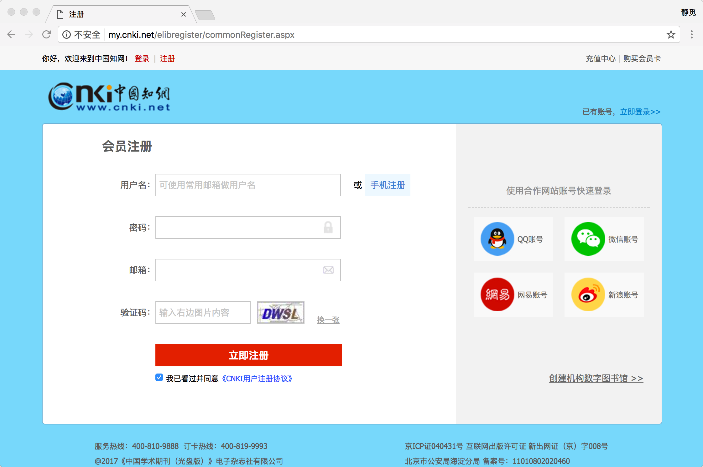

# 图形验证码的识别

本节我们来尝试破解最简单的一种验证码，图形验证码。

这种验证码出现的最早，现在也很常见，一般是四位字母或者数字组成的，例如中国知网的注册页面[http://my.cnki.net/elibregister/commonRegister.aspx](http://my.cnki.net/elibregister/commonRegister.aspx)，页面预览如下：



注册的时候最后一项就是刚才所说的图形验证码，我们必须完全输入正确图中的字符才可以完成注册。

本节我们就以知网的验证码为例，讲解一下此种图形验证码的破解方法。

破解验证码需要的库是Tesserocr，如果没有安装可以参考第一章来安装。

## 保存图片

为了便于实验，我们先将验证码的图片保存到本地，以供测试。

打开开发者工具，找到验证码元素，可以看到这是一张图片，它的src属性是CheckCode.aspx，在这里我们直接将这个链接打开，[http://my.cnki.net/elibregister/CheckCode.aspx](http://my.cnki.net/elibregister/CheckCode.aspx)，就可以看到一个验证码，直接右键保存下来即可，将名称命名为code.jpg。


这样我们就可以得到一张验证码图片供下面测试识别使用了。


## 识别测试

接下来我们新建一个项目，将验证码图片放到项目根目录下，用Tesserocr库来识别一下该验证码试试，代码如下：

```python
import tesserocr
from PIL import Image

image = Image.open('code.jpg')
result = tesserocr.image_to_text(image)
print(result)
```

运行结果：

```
JR42
```

利用这种方式我们就可以成功将验证码识别出来了。

另外Tesserocr还有一个更加简单的方法直接将图片文件转为字符串可以达到同样的效果。

```python
import tesserocr
print(tesserocr.file_to_text('image.png'))
```

不过经测试此种方法的识别率略低。

## 验证码处理

如上的图片识别基本没有难度，只是新建一个Image对象，然后调用image_to_text()方法即可得出图片的识别结果。

接下来我们换一个验证码试一下，命名为code2.jpg。


重新用下面的代码测试一下：

```python
import tesserocr
from PIL import Image

image = Image.open('code2.jpg')
result = tesserocr.image_to_text(image)
print(result)
```

可以看到如下输出结果：

```
FFKT
```

和实际的结果有所偏差，这是因为验证码内的多余线条干扰了图片的识别。

对于这种情况，我们还需要做一下额外的处理，如转灰度，二值化等。

例如利用convert()方法参数传入L即可将图片转化为灰度图像：

```python
image = image.convert('L')
image.show()
```

传入1即可将图片进行二值化处理：

```python
image = image.convert('1')
image.show()
```

另外我们还可以指定二值化的阈值，上面的方法采用的是默认阈值127。

不过我们不能用原图直接转化，可以先转为灰度图像，然后再指定二值化阈值转化：

```python
image = image.convert('L')
threshold = 80
table = []
for i in range(256):
    if i < threshold:
        table.append(0)
    else:
        table.append(1)

image = image.point(table, '1')
image.show()
```

在这里我们指定了一个变量threshold代表二值化阈值，阈值设置为80，我们看一下处理结果：


这时重新识别验证码，代码如下：

```python
import tesserocr
from PIL import Image

image = Image.open('code2.jpg')

image = image.convert('L')
threshold = 127
table = []
for i in range(256):
    if i < threshold:
        table.append(0)
    else:
        table.append(1)

image = image.point(table, '1')
result = tesserocr.image_to_text(image)
print(result)
```

即可发现运行结果变成了：

```python
PFRT
```

识别正确。

可见对于一些有干扰的图片，我们做一些灰度和二值化处理，会提高其识别正确率。

本节讲解了一下基本验证码的识别，源码地址为[https://github.com/Python3WebSpider/CrackImageCode](https://github.com/Python3WebSpider/CrackImageCode)，可以运行测试一下。


