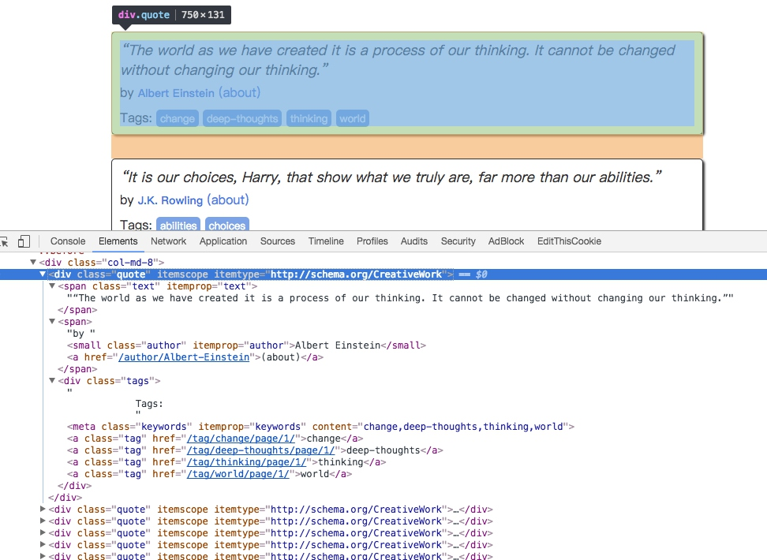

### Scrapy入门

本篇会通过介绍一个简单的项目，走一遍Scrapy抓取流程，通过这个过程，可以对Scrapy对基本用法和原理有大体的了解，作为入门。

在本篇开始之前，假设已经安装成功了Scrapy，如果尚未安装，请参照上一节安装。

本节要完成的任务有：

* 创建一个Scrapy项目
* 创建一个Spider来抓取站点和处理数据
* 通过命令行将抓取的内容导出

#### 创建项目

在抓取之前，你必须要先创建一个Scrapy项目，可以直接用`scrapy`命令生成，命令如下：

```
scrapy startproject tutorial
```

在任意文件夹运行都可以，如果提示权限问题，可以加`sudo`运行。这个命令将会创建一个名字为tutorial的文件夹，文件夹结构如下：

```
|____scrapy.cfg     # Scrapy部署时的配置文件
|____tutorial         # 项目的模块，引入的时候需要从这里引入
| |______init__.py    
| |______pycache__
| |____items.py     # Items的定义，定义爬取的数据结构
| |____middlewares.py   # Middlewares的定义，定义爬取时的中间件
| |____pipelines.py       # Pipelines的定义，定义数据管道
| |____settings.py       # 配置文件
| |____spiders         # 放置Spiders的文件夹
| | |______init__.py
| | |______pycache__
```

#### 创建Spider

Spider是由你来定义的Class，Scrapy用它来从网页里抓取内容，并将抓取的结果解析。不过这个Class必须要继承Scrapy提供的Spider类`scrapy.Spider`，并且你还要定义Spider的名称和起始请求以及怎样处理爬取后的结果的方法。

创建一个Spider也可以用命令生成，比如要生成Quotes这个Spider，可以执行命令。

```
cd tutorial
scrapy genspider quotes quotes.toscrape.com 
```

首先进入到刚才创建的tutorial文件夹，然后执行`genspider`这个命令，第一个参数是Spider的名称，第二个参数是网站域名。执行完毕之后，你会发现在spiders文件夹中多了一个quotes.py，这就是你刚刚创建的Spider，内容如下：

```python
# -*- coding: utf-8 -*-
import scrapy

class QuotesSpider(scrapy.Spider):
    name = "quotes"
    allowed_domains = ["quotes.toscrape.com"]
    start_urls = ['http://quotes.toscrape.com/']

    def parse(self, response):
        pass
```

可以看到有三个属性，name，allowed_domains，start_urls，另外还有一个方法parse

* name，每个项目里名字是唯一的，用来区分不同的Spider。
* allowed_domains 允许爬取的域名，如果初始或后续的请求链接不是这个域名下的，就会被过滤掉。
* start_urls，包含了Spider在启动时爬取的url列表，初始请求是由它来定义的。
* parse，是Spider的一个方法，默认情况下，被调用时start_urls里面的链接构成的请求完成下载后，返回的response就会作为唯一的参数传递给这个函数，该方法负责解析返回的response，提取数据或者进一步生成要处理的请求。

#### 创建Item

Item是保存爬取数据的容器，它的使用方法和字典类似，虽然你可以用字典来表示，不过Item相比字典多了额外的保护机制，可以避免拼写错误或者为定义字段错误。

创建Item需要继承`scrapy.Item`类，并且定义类型为`scrapy.Field`的类属性来定义一个Item。观察目标网站，我们可以获取到到内容有text, author, tags

所以可以定义如下的Item，修改items.py如下：

```python
import scrapy

class QuoteItem(scrapy.Item):

    text = scrapy.Field()
    author = scrapy.Field()
    tags = scrapy.Field()
```

定义了三个Field，接下来爬取时我们会使用它。

#### 解析Response

在上文中说明了parse方法的参数resposne是start_urls里面的链接爬取后的结果。所以在parse方法中，我们可以直接对response包含的内容进行解析，比如看看请求结果的网页源代码，或者进一步分析源代码里面包含什么，或者找出结果中的链接进一步得到下一个请求。

观察网站，我们可以看到网页中既有我们想要的结果，又有下一页的链接，所以两部分我们都要进行处理。

首先看一下网页结构，每一页都有多个class为quote的区块，每个区块内都包含text，author，tags，所以第一部需要找出所有的quote，然后对每一个quote进一步提取其中的内容。



提取的方式可以选用CSS选择器或XPath选择器，在这里我们使用CSS选择器进行选择，parse方法改写如下：

```python
def parse(self, response):
    quotes = response.css('.quote')
    for quote in quotes:
        text = quote.css('.text::text').extract_first()
        author = quote.css('.author::text').extract_first()
        tags = quote.css('.tags .tag::text').extract()
```
在这里使用了CSS选择器的语法，首先利用选择器选取所有的quote赋值为quotes变量。
然后利用for循环对每个quote遍历，解析每个quote的内容。

对text来说，观察到它的class为text，所以可以用`.text`来选取，这个结果实际上是整个带有标签的元素，要获取它的内容，可以加`::text`来得到。这时的结果是大小为1的数组，所以还需要用extract_first方法来获取第一个元素，而对于tags来说，由于我们要获取所有的标签，所以用extract方法获取即可。

以第一个quote的结果为例，各个选择方法及结果归类如下：

* 源码
```html
<div class="quote" itemscope="" itemtype="http://schema.org/CreativeWork">
        <span class="text" itemprop="text">“The world as we have created it is a process of our thinking. It cannot be changed without changing our thinking.”</span>
        <span>by <small class="author" itemprop="author">Albert Einstein</small>
        <a href="/author/Albert-Einstein">(about)</a>
        </span>
        <div class="tags">
            Tags:
            <meta class="keywords" itemprop="keywords" content="change,deep-thoughts,thinking,world"> 
            <a class="tag" href="/tag/change/page/1/">change</a>
            <a class="tag" href="/tag/deep-thoughts/page/1/">deep-thoughts</a>
            <a class="tag" href="/tag/thinking/page/1/">thinking</a>
            <a class="tag" href="/tag/world/page/1/">world</a>
        </div>
    </div>
```
* quote.css('.text')
```
[<Selector xpath="descendant-or-self::*[@class and contains(concat(' ', normalize-space(@class), ' '), ' text ')]" data='<span class="text" itemprop="text">“The '>]
```
* quote.css('.text::text')
```
[<Selector xpath="descendant-or-self::*[@class and contains(concat(' ', normalize-space(@class), ' '), ' text ')]/text()" data='“The world as we have created it is a pr'>]
```
* quote.css('.text').extract()
```
['<span class="text" itemprop="text">“The world as we have created it is a process of our thinking. It cannot be changed without changing our thinking.”</span>']
```
* quote.css('.text::text').extract()
```
['“The world as we have created it is a process of our thinking. It cannot be changed without changing our thinking.”']
```
* quote.css('.text::text').extract_first()
```
“The world as we have created it is a process of our thinking. It cannot be changed without changing our thinking.”
```

所以，对于text，要获取第一个元素即可，所以使用extract_first()方法，对于tags，要获取所有元素，使用extract()方法。

#### 使用Item

刚才定义了Item，接下来就要轮到使用它了，你可以把它理解为一个字典，不过在声明的时候需要实例化。然后依次对刚才解析的结果赋值，返回即可。

接下来QuotesSpider改写如下：

```python
import scrapy
from tutorial.items import QuoteItem

class QuotesSpider(scrapy.Spider):
    name = "quotes"
    allowed_domains = ["quotes.toscrape.com"]
    start_urls = ['http://quotes.toscrape.com/']

    def parse(self, response):
        quotes = response.css('.quote')
        for quote in quotes:
            item = QuoteItem()
            item['text'] = quote.css('.text::text').extract_first()
            item['author'] = quote.css('.author::text').extract_first()
            item['tags'] = quote.css('.tags .tag::text').extract()
            yield item
```
如此一来，首页的所有内容就解析出来了，并赋值成了一个个QuoteItem。


