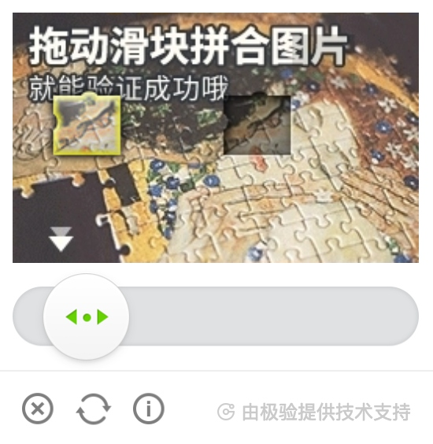
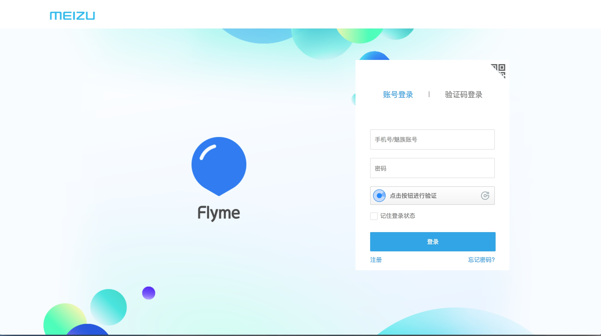

# 极验滑动验证码的识别

上节我们了解了图形验证码的识别，简单的图形验证码我们可以直接利用OCR来识别，不好识别的图形验证码我们可以利用打码平台来识别，但是近几年又出现了一些新型验证码，如滑动验证码，比较有代表性的就是极验验证码。

本节我们就来了解些极验验证码的识别过程。

## 什么是极验验证码

极验验证码其官网为[http://www.geetest.com/](http://www.geetest.com/)，是一个专注于提供验证安全的系统，主要验证方式是拖动滑块拼合图像，若图像完全拼合，则验证成功，即可以成功提交表单，否则需要重新验证。




现在极验验证码已经更新到了3.0版本，截至2017年7月全球已有十六万家企业正在使用极验，每天服务响应超过四亿次，广泛应用于直播视频、金融服务、电子商务、游戏娱乐、政府企业等各大类型网站，如斗鱼、魅族等等。




## 极验验证的特点

这种验证码相较于图形验证码来说识别难度更大，极验验证码首先需要在前台验证通过，对于极验3.0，我们首先需要点击按钮进行智能验证，如果验证不通过，则会弹出滑动验证的窗口，随后需要拖动滑块拼合图像进行验证，验证之后会生成三个加密参数，参数随后通过表单提交到后台，后台还会进行一次验证。

另外极验还增加了机器学习的方法来识别拖动轨迹，官方网站的安全防护说明如下：

* 三角防护之防模拟

恶意程序模仿人类行为轨迹对验证码进行破解。针对模拟，极验拥有超过4000万人机行为样本的海量数据。利用机器学习和神经网络构建线上线下的多重静态、动态防御模型。识别模拟轨迹，界定人机边界。

* 三角防护之防伪造

恶意程序通过伪造设备浏览器环境对验证码进行破解。针对伪造，极验利用设备基因技术。深度分析浏览器的实际性能来辨识伪造信息。同时根据伪造事件不断更新黑名单，大幅提高防伪造能力。

* 三角防护之防暴力

恶意程序短时间内进行密集的攻击，对验证码进行暴力破解
针对暴力，极验拥有多种验证形态，每一种验证形态都有利用神经网络生成的海量图库储备，每一张图片都是独一无二的，且图库不断更新，极大程度提高了暴力破解的成本。

另外极验的验证相对于普通验证方式更加方便，体验更加友好，其官方网站说明如下：

* 点击一下，验证只需要0.4秒

极验始终专注于去验证化实践，让验证环节不再打断产品本身的交互流程，最终达到优化用户体验和提高用户转化率的效果。

* 全平台兼容，适用各种交互场景

极验兼容所有主流浏览器甚至古老的IE6，也可以轻松应用在iOS和Android移动端平台，满足各种业务需求，保护网站资源不被滥用和盗取。

* 面向未来，懂科技，更懂人性

极验在保障安全同时不断致力于提升用户体验，精雕细琢的验证面板，流畅顺滑的验证动画效果，让验证过程不再枯燥乏味。

因此，相较于一般验证码，极验的验证安全性和易用性有了非常大的提高。

## 识别思路

但是对于应用了极验验证码的网站，识别并不是没有办法的。如果我们直接模拟表单提交的话，加密参数的构造是个问题，参数构造有问题服务端就会校验失败，所以在这里我们采用直接模拟浏览器动作的方式来完成验证，在Python中我们就可以使用Selenium来通过完全模拟人的行为的方式来完成验证，此验证成本相对于直接去破解加密算法容易不少。

首先我们找到一个带有极验验证的网站，最合适的当然为极验官方后台了，链接为[https://account.geetest.com/login](https://account.geetest.com/login)，首先可以看到在登录按钮上方有一个极验验证按钮：


此按钮为智能验证按钮，点击一下即可智能验证，一般来说如果是同一个Session，一小段时间内第二次登录便会直接通过验证，如果智能识别不通过，则会弹出滑动验证窗口，我们便需要拖动滑块来拼合图像完成二步验证。


验证成功后验证按钮便会变成如下状态：


接下来我们便可以进行表单提交了。

所以在这里我们要识别验证需要做的有三步：

* 模拟点击验证按钮
* 识别滑动缺口的位置
* 模拟拖动滑块

第一步操作是最简单的，我们可以直接用Selenium模拟点击按钮即可。

第二步操作识别缺口的位置比较关键，需要用到图像的相关处理方法，那缺口怎么找呢？首先来观察一下缺口的样子：


可以看到缺口的四周边缘有明显的断裂边缘，而且边缘和边缘周围有明显的区别，我们可以实现一个边缘检测算法来找出缺口的位置。对于极验来说，我们可以利用和原图对比检测的方式来识别缺口的位置，因为在没有滑动滑块之前，缺口其实是没有呈现的，如下图所示：


所以我们可以同时获取两张图片，设定一个对比阈值，然后遍历两张图片找出相同位置像素RGB差距超过此阈值的像素点位置，那么此位置就是缺口的位置。

第三步操作看似简单，但是其中的坑比较多，极验验证码增加了机器轨迹识别，匀速移动、随机速度移动等方法都是不行的，只有完全模拟人的移动轨迹才可以通过验证，而人的移动轨迹一般是先加速后减速的，这又涉及到物理学中加速度的相关问题，我们需要模拟这个过程才能成功。


## 代码实战

了解了基本的识别思路之后，我们接下来就用代码来实现一下极验验证码的识别过程吧。

首先这次我们选定的链接为[https://account.geetest.com/login](https://account.geetest.com/login)，也就是极验的管理后台登录页面，在这里我们首先初始化一些配置，如Selenium对象的初始化及一些参数的配置：

```python
EMAIL = 'test@test.com'
PASSWORD = '123456'

class CrackGeetest():
    def __init__(self):
        self.url = 'https://account.geetest.com/login'
        self.browser = webdriver.Chrome()
        self.wait = WebDriverWait(self.browser, 20)
        self.email = EMAIL
        self.password = PASSWORD
```

其中EMAIL和PASSWORD就是登录极验需要的用户名和密码，如果没有的话可以先注册一下。

随后我们需要实现第一步的操作，也就是模拟点击初始的验证按钮，所以我们定义一个方法来获取这个按钮，利用显式等待的方法来实现：

```python
def get_geetest_button(self):
    """
    获取初始验证按钮
    :return: 按钮对象
    """
    button = self.wait.until(EC.element_to_be_clickable((By.CLASS_NAME, 'geetest_radar_tip')))
    return button
```

获取之后就会获取一个WebElement对象，调用它的click()方法即可模拟点击，代码如下：

```python
# 点击验证按钮
button = self.get_geetest_button()
button.click()
```

到这里我们第一步的工作就完成了。

接下来我们需要识别缺口的位置，首先我们需要将前后的两张比对图片获取下来，然后比对二者的不一致的地方即为缺口。首先我们需要获取不带缺口的图片，利用Selenium选取图片元素，然后得到其所在位置和宽高，随后获取整个网页的截图，再从截图中裁切出来即可，代码实现如下：

```python
def get_position(self):
    """
    获取验证码位置
    :return: 验证码位置元组
    """
    img = self.wait.until(EC.presence_of_element_located((By.CLASS_NAME, 'geetest_canvas_img')))
    time.sleep(2)
    location = img.location
    size = img.size
    top, bottom, left, right = location['y'], location['y'] + size['height'], location['x'], location['x'] + size[
        'width']
    return (top, bottom, left, right)

def get_geetest_image(self, name='captcha.png'):
    """
    获取验证码图片
    :return: 图片对象
    """
    top, bottom, left, right = self.get_position()
    print('验证码位置', top, bottom, left, right)
    screenshot = self.get_screenshot()
    captcha = screenshot.crop((left, top, right, bottom))
    return captcha
```

在这里get_position()函数首先获取了图片对象，然后获取了它的位置和宽高，随后返回了其左上角和右下角的坐标。而get_geetest_image()方法则是获取了网页截图，然后调用了crop()方法将图片再裁切出来，返回的是Image对象。

随后我们需要获取第二张图片，也就是带缺口的图片，要使得图片出现缺口，我们只需要点击一下下方的滑块即可，触发这个动作之后，图片中的缺口就会显现，实现如下：

```python
def get_slider(self):
    """
    获取滑块
    :return: 滑块对象
    """
    slider = self.wait.until(EC.element_to_be_clickable((By.CLASS_NAME, 'geetest_slider_button')))
    return slider
```

利用get_slider()方法获取滑块对象，接下来调用其click()方法即可触发点击，缺口图片即可呈现：

```python
# 点按呼出缺口
slider = self.get_slider()
slider.click()
```

随后还是调用get_geetest_image()方法将第二张图片获取下来即可。

到现在我们就已经得到了两张图片对象了，分别赋值给变量image1和image2，接下来对比图片获取缺口即可。要对比图片的不同之处，我们在这里遍历图片的每个坐标点，获取两张图片对应像素点的RGB数据，然后判断二者的RGB数据差异，如果差距超过在一定范围内，那就代表两个像素相同，继续比对下一个像素点，如果差距超过一定范围，则判断像素点不同，当前位置即为缺口位置。

```python
def is_pixel_equal(self, image1, image2, x, y):
    """
    判断两个像素是否相同
    :param image1: 图片1
    :param image2: 图片2
    :param x: 位置x
    :param y: 位置y
    :return: 像素是否相同
    """
    # 取两个图片的像素点
    pixel1 = image1.load()[x, y]
    pixel2 = image2.load()[x, y]
    threshold = 60
    if abs(pixel1[0] - pixel2[0]) < threshold and abs(pixel1[1] - pixel2[1]) < threshold and abs(
            pixel1[2] - pixel2[2]) < threshold:
        return True
    else:
        return False
        
def get_gap(self, image1, image2):
    """
    获取缺口偏移量
    :param image1: 不带缺口图片
    :param image2: 带缺口图片
    :return:
    """
    left = 60
    for i in range(left, image1.size[0]):
        for j in range(image1.size[1]):
            if not self.is_pixel_equal(image1, image2, i, j):
                left = i
                return left
    return left
```

get_gap()方法即为获取缺口位置的方法，此方法的参数为两张图片，一张为带缺口图片，另一张为不带缺口图片，在这里遍历两张图片的每个像素，然后利用is_pixel_equal()方法判断两张图片同一位置的像素是否相同，比对的时候比较了两张图RGB的绝对值是否均小于定义的阈值threshold，如果均在阈值之内，则像素点相同，继续遍历，否则遇到不相同的像素点就是缺口的位置。

在这里比如两张对比图片如下：


两张图片其实有两处明显不同的地方，一个就是待拼合的滑块，一个就是缺口，但是滑块的位置会出现在左边位置，缺口会出现在与滑块同一水平线的位置，所以缺口一般会在滑块的右侧，所以要寻找缺口的话，我们直接从滑块右侧寻找即可，所以在遍历的时候我们直接设置了遍历的起始横坐标为60，也就是在滑块的右侧开始识别，这样识别出的结果就是缺口的位置了。

到现在为止，我们就可以获取缺口的位置了，剩下最后一步模拟拖动就可以完成验证了。

模拟拖动的这个过程说复杂并不复杂，只是其中的坑比较多。现在我们已经获取到了缺口的位置，接下来只需要调用拖动的相关函数将滑块拖动到对应位置不就好了吗？然而事实很残酷，如果匀速拖动，极验必然会识别出来这是程序的操作，因为人是无法做到完全匀速拖动的，极验利用机器学习模型筛选出此类数据，归类为机器操作，验证码破解失败。

随后我又尝试了分段模拟，将拖动过程划分几段，每段设置一个平均速度，同时速度围绕该平均速度小幅度随机抖动，同样无法完成验证。

最后尝试了完全模拟加速减速的过程通过了验证，在前段滑块需要做匀加速运动，后面需要做匀减速运动，在这里利用物理学的加速度公式即可完成。

设滑块滑动的加速度用a来表示，当前速度用v表示，初速度用v0表示，位移用x表示，所需时间用t表示，则它们之间满足如下关系：

```
x = v0 * t + 0.5 * a * t * t 
v = v0 + a * t
```

接下来我们利用两个公式可以构造一个轨迹移动算法，计算出先加速后减速的运动轨迹，代码实现如下：

```python
def get_track(self, distance):
    """
    根据偏移量获取移动轨迹
    :param distance: 偏移量
    :return: 移动轨迹
    """
    # 移动轨迹
    track = []
    # 当前位移
    current = 0
    # 减速阈值
    mid = distance * 4 / 5
    # 计算间隔
    t = 0.2
    # 初速度
    v = 0
    
    while current < distance:
        if current < mid:
            # 加速度为正2
            a = 2
        else:
            # 加速度为负3
            a = -3
        # 初速度v0
        v0 = v
        # 当前速度v = v0 + at
        v = v0 + a * t
        # 移动距离x = v0t + 1/2 * a * t^2
        move = v0 * t + 1 / 2 * a * t * t
        # 当前位移
        current += move
        # 加入轨迹
        track.append(round(move))
    return track
```

在这里我们定义了get_track()方法，传入的参数为移动的总距离，返回的是运动轨迹，用track表示，它是一个列表，列表的每个元素代表每次移动多少距离。

首先定义了一个变量mid，即减速的阈值，也就是加速到什么位置就开始减速，在这里定义为4/5，即模拟前4/5是加速过程，后1/5是减速过程。

随后定义了当前位移的距离变量current，初始为0，随后进入while循环，循环的条件是当前位移小于总距离。在循环里我们分段定义了加速度，其中加速过程加速度定义为2，减速过程加速度定义为-3，随后再套用位移公式计算出某个时间段内的位移，同时将当前位移更新并记录到轨迹里。

这样直到运动轨迹达到总距离时即终止循环，最后得到的track即包记录了每个时间间隔移动了多少位移，这样滑块的运动轨迹就得到了。

最后我们只需要按照该运动轨迹拖动滑块即可，方法实现如下：

```python
def move_to_gap(self, slider, tracks):
    """
    拖动滑块到缺口处
    :param slider: 滑块
    :param tracks: 轨迹
    :return:
    """
    ActionChains(self.browser).click_and_hold(slider).perform()
    for x in tracks:
        ActionChains(self.browser).move_by_offset(xoffset=x, yoffset=0).perform()
    time.sleep(0.5)
    ActionChains(self.browser).release().perform()
```

在这里传入的参数为滑块对象和运动轨迹，首先调用ActionChains的click_and_hold()方法按住拖动底部滑块，随后遍历运动轨迹获取每小段位移距离，调用move_by_offset()方法移动此位移，最后移动完成之后调用release()方法松开鼠标即可。

这样再经过测试，验证就通过了，破解完成，效果图如下：


最后，我们只需要将表单完善，模拟点击登录按钮即可完成登录，成功登录后即跳转到后台。


至此，极验验证码的破解工作即全部完成，此破解方法同样适用于其他使用极验3.0的网站，原理都是相同的。

完整的源代码在[https://github.com/Python3WebSpider/CrackGeetest](https://github.com/Python3WebSpider/CrackGeetest)，大家可以尝试一下。


