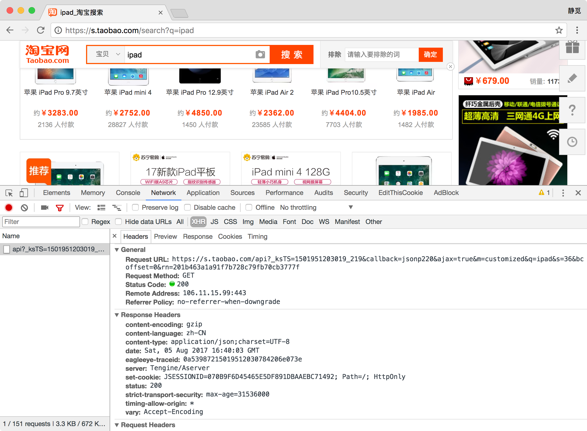
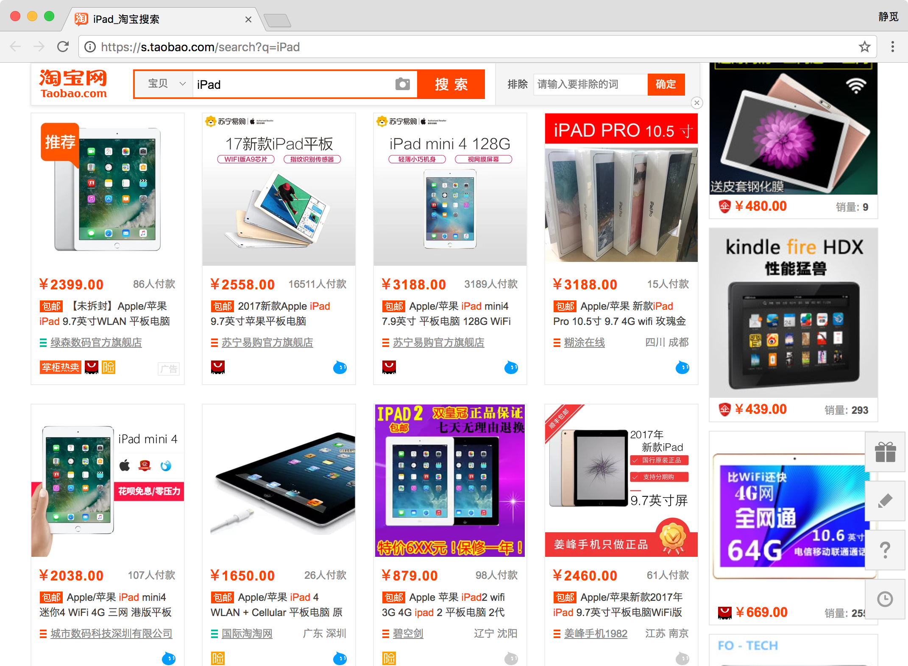
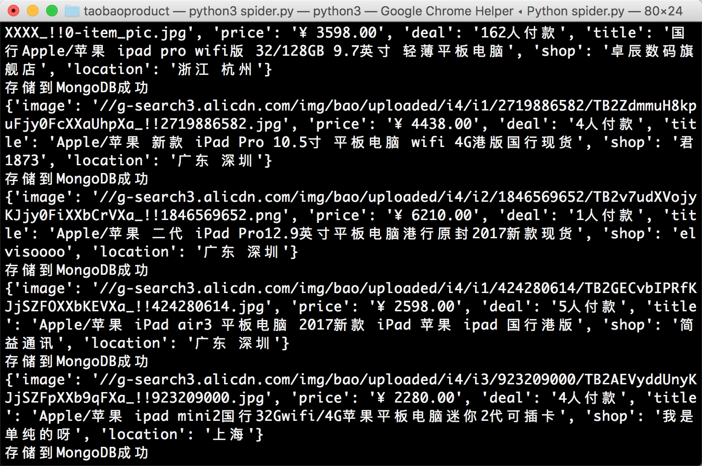

# 7.4 使用Selenium爬取淘宝商品

在前一章中，我们已经成功尝试分析Ajax来抓取相关数据，但是并不是所有页面都可以通过分析Ajax来完成抓取。比如，淘宝，它的整个页面数据确实也是通过Ajax获取的，但是这些Ajax接口参数比较复杂，可能会包含加密密钥等，所以如果想自己构造Ajax参数，还是比较困难的。对于这种页面，最方便快捷的抓取方法就是通过Selenium。本节中，我们就用Selenium来模拟浏览器操作，抓取淘宝的商品信息，并将结果保存到MongoDB。

### 1. 本节目标

本节中，我们要利用Selenium抓取淘宝商品并用pyquery解析得到商品的图片、名称、价格、购买人数、店铺名称和店铺所在地信息，并将其保存到MongoDB。

### 2. 准备工作

本节中，我们首先以Chrome为例来讲解Selenium的用法。在开始之前，请确保已经正确安装好Chrome浏览器并配置好了ChromeDriver；另外，还需要正确安装Python的Selenium库；最后，还对接了PhantomJS和Firefox，请确保安装好PhantomJS和Firefox并配置好了GeckoDriver。如果环境没有配置好，可参考第1章。

### 3. 接口分析

首先，我们来看下淘宝的接口，看看它比一般Ajax多了怎样的内容。

打开淘宝页面，搜索商品，比如iPad，此时打开开发者工具，截获Ajax请求，我们可以发现获取商品列表的接口，如图7-19所示。



图 7-19 列表接口


它的链接包含了几个GET参数，如果要想构造Ajax链接，直接请求再好不过了，它的返回内容是JSON格式，如图7-20所示。


图 7-20 Json 数据

但是这个Ajax接口包含几个参数，其中_ksTS、rn参数不能直接发现其规律，如果要去探寻它的生成规律，也不是做不到，但这样相对会比较烦琐，所以如果直接用Selenium来模拟浏览器的话，就不需要再关注这些接口参数了，只要在浏览器里面可以看到的，都可以爬取。这也是我们选用Selenium爬取淘宝的原因。

### 4. 页面分析

本节的目标是爬取商品信息。图7-21是一个商品条目，其中包含商品的基本信息，包括商品图片、名称、价格、购买人数、店铺名称和店铺所在地，我们要做的就是将这些信息都抓取下来。


图 7-21 商品条目

抓取入口就是淘宝的搜索页面，这个链接可以通过直接构造参数访问。例如，如果搜索iPad，就可以直接访问 [https://s.taobao.com/search?q=iPad](https://s.taobao.com/search?q=iPad)，呈现的就是第一页的搜索结果，如图 7-22 所示：



图 7-22 搜索结果

在页面下方，有一个分页导航，其中既包括前5页的链接，也包括下一页的链接，同时还有一个输入任意页码跳转的链接，如图7-23所示。


图 7-23 分页导航

这里商品的搜索结果一般最大都为100页，要获取每一页的内容，只需要将页码从1到100顺序遍历即可，页码数是确定的。所以，直接在页面跳转文本框中输入要跳转的页码，然后点击“确定”按钮即可跳转到页码对应的页面。

这里不直接点击“下一页”的原因是：一旦爬取过程中出现异常退出，比如到50页退出了，此时点击“下一页”时，就无法快速切换到对应的后续页面了。此外，在爬取过程中，也需要记录当前的页码数，而且一旦点击“下一页”之后页面加载失败，还需要做异常检测，检测当前页面是加载到了第几页。整个流程相对比较复杂，所以这里我们直接用跳转的方式来爬取页面。

当我们成功加载出某一页商品列表时，利用Selenium即可获取页面源代码，然后再用相应的解析库解析即可。这里我们选用pyquery进行解析。下面我们用代码来实现整个抓取过程。

### 5. 获取商品列表

首先，需要构造一个抓取的 URL：[https://s.taobao.com/search?q=iPad](https://s.taobao.com/search?q=iPad)。这个URL非常简洁，参数q就是要搜索的关键字。只要改变这个参数，即可获取不同商品的列表。这里我们将商品的关键字定义成一个变量，然后构造出这样的一个URL。

然后，就需要用Selenium进行抓取了。我们实现如下抓取列表页的方法：


```python
from selenium import webdriver
from selenium.common.exceptions import TimeoutException
from selenium.webdriver.common.by import By
from selenium.webdriver.support import expected_conditions as EC
from selenium.webdriver.support.wait import WebDriverWait
from urllib.parse import quote

browser = webdriver.Chrome()
wait = WebDriverWait(browser, 10)
KEYWORD = 'iPad'

def index_page(page):
    """
    抓取索引页
    :param page: 页码
    """
    print('正在爬取第', page, '页')
    try:
        url = 'https://s.taobao.com/search?q=' + quote(KEYWORD)
        browser.get(url)
        if page > 1:
            input = wait.until(
                EC.presence_of_element_located((By.CSS_SELECTOR, '#mainsrp-pager div.form > input')))
            submit = wait.until(
                EC.element_to_be_clickable((By.CSS_SELECTOR, '#mainsrp-pager div.form > span.btn.J_Submit')))
            input.clear()
            input.send_keys(page)
            submit.click()
        wait.until(
            EC.text_to_be_present_in_element((By.CSS_SELECTOR, '#mainsrp-pager li.item.active > span'), str(page)))
        wait.until(EC.presence_of_element_located((By.CSS_SELECTOR, '.m-itemlist .items .item')))
        get_products()
    except TimeoutException:
        index_page(page)
```

这里首先构造了一个WebDriver对象，使用的浏览器是Chrome，然后指定一个关键词，如iPad，接着定义了index_page()方法，用于抓取商品列表页。

在该方法里，我们首先访问了搜索商品的链接，然后判断了当前的页码，如果大于1，就进行跳页操作，否则等待页面加载完成。

等待加载时，我们使用了WebDriverWait对象，它可以指定等待条件，同时指定一个最长等待时间，这里指定为最长10秒。如果在这个时间内成功匹配了等待条件，也就是说页面元素成功加载出来了，就立即返回相应结果并继续向下执行，否则到了最大等待时间还没有加载出来时，就直接抛出超时异常。

比如，我们最终要等待商品信息加载出来，就指定了presence_of_element_located这个条件，然后传入了.m-itemlist .items .item这个选择器，而这个选择器对应的页面内容就是每个商品的信息块，可以到网页里面查看一下。如果加载成功，就会执行后续的get_products()方法，提取商品信息。

关于翻页操作，这里首先获取页码输入框，赋值为input，然后获取“确定”按钮，赋值为submit，分别是图7-24中的两个元素。


图 7-24 跳转选项

首先，我们清空了输入框，此时调用clear()方法即可。随后，调用send_keys()方法将页码填充到输入框中，然后点击“确定”按钮即可。

那么，怎样知道有没有跳转到对应的页码呢？我们可以注意到，成功跳转某一页后，页码都会高亮显示，如图7-25所示。


图 7-25 高亮显示

我们只需要判断当前高亮的页码数是当前的页码数即可，所以这里使用了另一个等待条件text_to_be_present_in_element，它会等待指定的文本出现在某一个节点里面时即返回成功。这里我们将高亮的页码节点对应的CSS选择器和当前要跳转的页码通过参数传递给这个等待条件，这样它就会检测当前高亮的页码节点是不是我们传过来的页码数，如果是，就证明页面成功跳转到了这一页，页面跳转成功。

这样刚才实现的index_page()方法就可以传入对应的页码，待加载出对应页码的商品列表后，再去调用get_products()方法进行页面解析。

### 6. 解析商品列表

接下来，我们就可以实现get_products方法来解析商品列表了。这里我们直接获取页面源代码，然后用pyquery进行解析，实现如下：

```python
from pyquery import PyQuery as pq
def get_products():
    """
    提取商品数据
    """
    html = browser.page_source
    doc = pq(html)
    items = doc('#mainsrp-itemlist .items .item').items()
    for item in items:
        product = {
            'image': item.find('.pic .img').attr('data-src'),
            'price': item.find('.price').text(),
            'deal': item.find('.deal-cnt').text(),
            'title': item.find('.title').text(),
            'shop': item.find('.shop').text(),
            'location': item.find('.location').text()
        }
        print(product)
        save_to_mongo(product)
```

首先，调用page_source属性获取页码的源代码，然后构造了PyQuery解析对象，接着提取了商品列表，此时使用的CSS选择器是#mainsrp-itemlist .items .item，它会匹配整个页面的每个商品。它的匹配结果是多个，所以这里我们又对它进行了一次遍历，用for循环将每个结果分别进行解析，每次循环把它赋值为item变量，每个item变量都是一个PyQuery对象，然后再调用它的find()方法，传入CSS选择器，就可以获取单个商品的特定内容了。

比如，查看一下商品信息的源码，如图7-26所示。


图 7-26 商品信息源码

可以发现，它是一个img节点，包含id、class、data-src、alt和src等属性。这里之所以可以看到这张图片，是因为它的src属性被赋值为图片的URL。把它的src属性提取出来，就可以获取商品的图片了。不过我们还注意data-src属性，它的内容也是图片的URL，观察后发现此URL是图片的完整大图，而src是压缩后的小图，所以这里抓取data-src属性来作为商品的图片。

因此，我们需要先利用find()方法找到图片的这个节点，然后再调用attr()方法获取商品的data-src属性，这样就成功提取了商品图片链接。然后用同样的方法提取商品的价格、成交量、名称、店铺和店铺所在地等信息，接着将所有提取结果赋值为一个字典product，随后调用save_to_mongo()将其保存到MongoDB即可。

### 7. 保存到MongoDB

接下来，我们再将商品信息保存到 MongoDB，实现如下：

```python
MONGO_URL = 'localhost'
MONGO_DB = 'taobao'
MONGO_COLLECTION = 'products'
client = pymongo.MongoClient(MONGO_URL)
db = client[MONGO_DB]
def save_to_mongo(result):
    """
    保存至MongoDB
    :param result: 结果
    """
    try:
        if db[MONGO_COLLECTION].insert(result):
            print('存储到MongoDB成功')
    except Exception:
        print('存储到MongoDB失败')
```

这里首先创建了一个MongoDB的连接对象，然后指定了数据库，随后指定了Collection的名称，接着直接调用insert方法将数据插入到MongoDB。此处的result变量就是在get_products方法里传来的product，包含单个商品的信息。

### 8. 遍历每页

刚才我们所定义的index_page()方法需要接收参数page，page代表页码。这里我们实现页码遍历即可，代码如下：

```python
MAX_PAGE = 100
def main():
    """
    遍历每一页
    """
    for i in range(1, MAX_PAGE + 1):
        index_page(i)
```


其实现非常简单，只需要调用一个for循环即可。这里定义最大的页码数为100，range()方法的返回结果就是1到100的列表，顺序遍历，调用index_page()方法即可。

这样我们的淘宝商品爬虫就完成了，最后调用main()方法即可运行。

### 9. 运行

运行代码，可以发现首先会弹出一个Chrome浏览器，然后会访问淘宝页面，接着控制台便会输出相应的提取结果，如图7-27所示。



图 7-27 运行结果

可以发现，这些商品信息的结果都是字典形式，它们被存储到MongoDB里面。

再看一下MongoDB中的结果，如图7-28所示。


图 7-28 保存结果

可以看到，所有的信息都保存到MongoDB里了，这说明爬取成功。

### 10. Chrome Headless模式

从Chrome 59版本开始，已经开始支持Headless模式，也就是无界面模式，这样爬取的时候就不会弹出浏览器了。如果要使用此模式，请把Chrome升级到59版本及以上。启用Headless模式的方式如下：

```python
chrome_options = webdriver.ChromeOptions()
chrome_options.add_argument('--headless')
browser = webdriver.Chrome(chrome_options=chrome_options)
```

首先，创建ChromeOptions对象，接着添加headless参数，然后在初始化Chrome对象的时候通过chrome_options传递这个ChromeOptions对象，这样我们就可以成功启用Chrome的Headless模式了。

### 11. 对接Firefox

要对接 Firefox 浏览器非常简单，只需要更改一处即可：

```python
browser = webdriver.Firefox()
```

这里更改了browser对象的创建方式，这样爬取的时候就会使用Firefox浏览器了。

### 12. 对接PhantomJS

如果不想使用Chrome的Headless模式，还可以使用PhantomJS（它是一个无界面浏览器）来抓取。抓取时，同样不会弹出窗口，还是只需要将WebDriver的声明修改一下即可：

```python
browser = webdriver.PhantomJS()
```

另外，它还支持命令行配置。比如，可以设置缓存和禁用图片加载的功能，进一步提高爬取效率：

```python
SERVICE_ARGS = ['--load-images=false', '--disk-cache=true']
browser = webdriver.PhantomJS(service_args=SERVICE_ARGS)
```

这样我们就可以禁用 PhantomJS 的图片加载同时开启缓存，可以发现页面爬取速度进一步提升。

最后，给出本节的代码地址：[https://github.com/Python3WebSpider/TaobaoProduct](https://github.com/Python3WebSpider/TaobaoProduct)。

本节中，我们用Selenium演示了淘宝页面的抓取。利用它，我们不用去分析Ajax请求，真正做到可见即可爬。