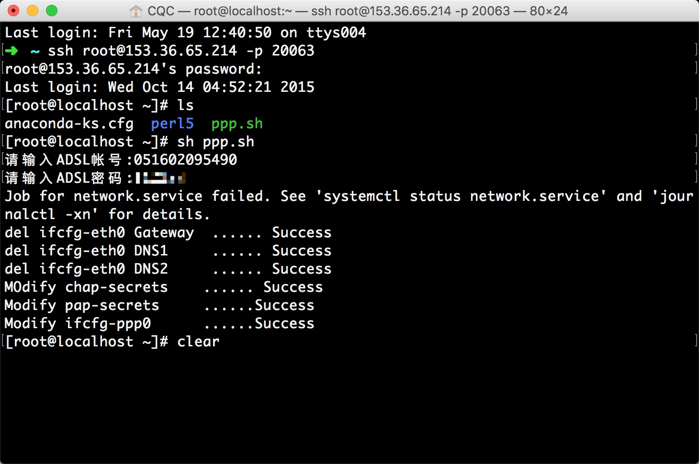
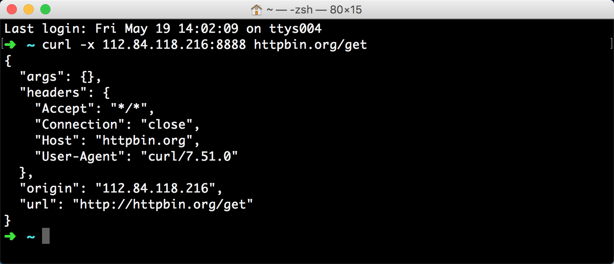

# 9.4 ADSL拨号代理

我们尝试维护过一个代理池。代理池可以挑选出许多可用代理，但是常常其稳定性不高、响应速度慢，而且这些代理通常是公共代理，可能不止一人同时使用，其IP被封的概率很大。另外，这些代理可能有效时间比较短，虽然代理池一直在筛选，但如果没有及时更新状态，也有可能获取到不可用的代理。

如果要追求更加稳定的代理，就需要购买专有代理或者自己搭建代理服务器。但是服务器一般都是固定的IP，我们总不能搭建100个代理就用100台服务器吧，这显然是不现实的。

所以，ADSL动态拨号主机就派上用场了。下面我们来了解一下ADSL拨号代理服务器的相关设置。

### 1. 什么是ADSL

ADSL（Asymmetric Digital Subscriber Line，非对称数字用户环路），它的上行和下行带宽不对称，它采用频分复用技术把普通的电话线分成了电话、上行和下行3个相对独立的信道，从而避免了相互之间的干扰。

ADSL通过拨号的方式上网，需要输入ADSL账号和密码，每次拨号就更换一个IP。IP分布在多个A段，如果IP都能使用，则意味着IP量级可达千万。如果我们将ADSL主机作为代理，每隔一段时间主机拨号就换一个IP，这样可以有效防止IP被封禁。另外，主机的稳定性很好，代理响应速度很快。

### 2. 准备工作

首先需要成功安装Redis数据库并启动服务，另外还需要安装requests、redis-py、Tornado库。如果没有安装，读者可以参考第一章的安装说明。

### 3. 购买主机

我们先购买一台动态拨号VPS主机，这样的主机服务商相当多。在这里使用了云立方，官方网站：http://www.yunlifang.cn/dynamicvps.asp。

建议选择电信线路。可以自行选择主机配置，主要考虑带宽是否满足需求。

然后进入拨号主机的后台，预装一个操作系统，如图9-10所示。


图 9-10 预装操作系统

推荐安装CentOS 7系统。

然后找到远程管理面板远程连接的用户名和密码，也就是SSH远程连接服务器的信息。比如我使用的IP和端口是153.36.65.214:20063，用户名是root。命令行下输入如下内容：

```
ssh root@153.36.65.214 -p 20063
```

输入管理密码，就可以连接上远程服务器了。

进入之后，我们发现一个可用的脚本文件ppp.sh，这是拨号初始化的脚本。运行此脚本会提示输入拨号的用户名和密码，然后它就开始各种拨号配置。一次配置成功，后面拨号就不需要重复输入用户名和密码。

运行ppp.sh脚本，输入用户名、密码等待它的配置完成，如图9-11所示。


图 9-11 配置页面

提示成功之后就可以进行拨号了。注意，在拨号之前测试ping任何网站都是不通的，因为当前网络还没联通。输入如下拨号命令：

```
adsl-start
```

拨号命令成功运行，没有报错信息，耗时约几秒。接下来再去ping外网就可以通了。

如果要停止拨号，可以输入如下命令：

```
adsl-stop
```

之后，可以发现又连不通网络了，如图9-12所示。



图 9-12 拨号建立连接

断线重播的命令就是二者组合起来，先执行adsl-stop，再执行adsl-start。每次拨号，ifconfig命令观察主机的IP，发现主机的IP一直在变化，网卡名称叫作ppp0，如图9-13所示。


图 9-13 网络设备信息

接下来，我们要做两件事：一是怎样将主机设置为代理服务器，二是怎样实时获取拨号主机的IP。

### 4. 设置代理服务器

在Linux下搭建HTTP代理服务器，推荐TinyProxy和Squid，配置都非常简单。在这里我们以TinyProxy为例来讲解一下怎样搭建代理服务器。

#### 安装 TinyProxy

第一步就是安装TinyProxy软件。在这里我使用的系统是CentOS，所以使用yum来安装。如果是其他系统，如Ubuntu，可以选择apt-get等命令安装。

命令行执行 yum 安装指令：

```
yum install -y epel-release
yum update -y
yum install -y tinyproxy
```

运行完成之后就可以完成 tinyproxy 的安装了。

#### 配置TinyProxy

TinyProxy安装完成之后还要配置一下才可以用作代理服务器。我们需要编辑配置文件，此文件一般的路径是/etc/tinyproxy/tinyproxy.conf。

可以看到有一行

```
Port 8888
```

在这里可以设置代理的端口，默认是 8888。

继续向下找到如下代码：

```
Allow 127.0.0.1
```

这行代码表示被允许连接的主机IP。如果希望连接任何主机，那就直接将这行代码注释即可。在这里我们选择直接注释，也就是任何主机都可以使用这台主机作为代理服务器。

修改为如下代码：

```
# Allow 127.0.0.1
```

设置完成之后重启 TinyProxy 即可：

```
systemctl enable tinyproxy.service
systemctl restart tinyproxy.service
```

防火墙开放该端口：

```
iptables -I INPUT -p tcp --dport 8888 -j ACCEPT
```

当然如果想直接关闭防火墙也可以：

```
systemctl stop firewalld.service
```

这样我们就完成了 TinyProxy 的配置了。

#### 验证TinyProxy

首先，用ifconfig查看当前主机的IP。比如，当前我的主机拨号IP为112.84.118.216，在其他的主机运行测试一下。

用curl命令设置代理请求httpbin，检测代理是否生效。

```
curl -x 112.84.118.216:8888 httpbin.org/get
```

运行结果如图 9-14 所示：



图 9-14 运行结果

如果有正常的结果输出，并且origin的值为代理IP的地址，就证明TinyProxy配置成功了。

### 5. 动态获取IP

现在可以执行命令让主机动态切换IP，也在主机上搭建了代理服务器。我们只需要知道拨号后的IP就可以使用代理。

我们考虑到，在一台主机拨号切换IP的间隙代理是不可用的，在这拨号的几秒时间内如果有第二台主机顶替第一台主机，那就可以解决拨号间隙代理无法使用的问题了。所以我们要设计的架构必须要考虑支持多主机的问题。

假如有10台拨号主机同时需要维护，而爬虫需要使用这10台主机的代理，那么在爬虫端维护的开销是非常大的。如果爬虫在不同的机器上运行，那么每个爬虫必须要获得这10台拨号主机的配置，这显然是不理想的。

为了更加方便地使用代理，我们可以像上文的代理池一样定义一个统一的代理接口，爬虫端只需要配置代理接口即可获取可用代理。要搭建一个接口，就势必需要一台服务器，而接口的数据从哪里获得呢，当然最理想的还是选择数据库。

比如我们需要同时维护10台拨号主机，每台拨号主机都会定时拨号，那这样每台主机在某个时刻可用的代理只有一个，所以我们没有必要存储之前的拨号代理，因为重新拨号之后之前的代理已经不能用了，所以只需要将之前的代理更新其内容就好了。数据库要做的就是定时对每台主机的代理进行更新，而更新时又需要拨号主机的唯一标识，根据主机标识查出这条数据，然后将这条数据对应的代理更新。

所以数据库端就需要存储一个主机标识到代理的映射关系。那么很自然地我们就会想到关系型数据库，如MySQL或者Redis的Hash存储，只需存储一个映射关系，不需要很多字段，而且Redis比MySQL效率更高、使用更方便，所以最终选定的存储方式就是Redis的Hash。

### 6. 存储模块

那么接下来我们要做可被远程访问的Redis数据库，各个拨号机器只需要将各自的主机标识和当前IP和端口（也就是代理）发送给数据库就好了。

先定义一个操作Redis数据库的类，示例如下：

```python
import redis
import random

# Redis数据库IP
REDIS_HOST = 'remoteaddress'
# Redis数据库密码, 如无则填None
REDIS_PASSWORD = 'foobared'
# Redis数据库端口
REDIS_PORT = 6379
# 代理池键名
PROXY_KEY = 'adsl'


class RedisClient(object):
    def __init__(self, host=REDIS_HOST, port=REDIS_PORT, password=REDIS_PASSWORD, proxy_key=PROXY_KEY):
        """
        初始化Redis连接
        :param host: Redis 地址
        :param port: Redis 端口
        :param password: Redis 密码
        :param proxy_key: Redis 哈希表名
        """
        self.db = redis.StrictRedis(host=host, port=port, password=password, decode_responses=True)
        self.proxy_key = proxy_key
    
    def set(self, name, proxy):
        """
        设置代理
        :param name: 主机名称
        :param proxy: 代理
        :return: 设置结果
        """
        return self.db.hset(self.proxy_key, name, proxy)
    
    def get(self, name):
        """
        获取代理
        :param name: 主机名称
        :return: 代理
        """
        return self.db.hget(self.proxy_key, name)
    
    def count(self):
        """
        获取代理总数
        :return: 代理总数
        """
        return self.db.hlen(self.proxy_key)
    
    def remove(self, name):
        """
        删除代理
        :param name: 主机名称
        :return: 删除结果
        """
        return self.db.hdel(self.proxy_key, name)
    
    def names(self):
        """
        获取主机名称列表
        :return: 获取主机名称列表
        """
        return self.db.hkeys(self.proxy_key)
    
    def proxies(self):
        """
        获取代理列表
        :return: 代理列表
        """
        return self.db.hvals(self.proxy_key)
    
    def random(self):
        """
        随机获取代理
        :return:
        """
        proxies = self.proxies()
        return random.choice(proxies)
    
    def all(self):
        """
        获取字典
        :return:
        """
        return self.db.hgetall(self.proxy_key)
```

这里定义了一个RedisClient类，在__init__()方法中初始化了Redis连接，其中REDIS_HOST就是远程Redis的地址，REDIS_PASSWORD是密码，REDIS_PORT是端口，PROXY_KEY是存储代理的散列表的键名。

接下来定义了一个set()方法，这个方法用来向散列表添加映射关系。映射是从主机标识到代理的映射，比如一台主机的标识为adsl1，当前的代理为118.119.111.172:8888，那么散列表中就会存储一个key为adsl1、value为118.119.111.172:8888的映射，Hash结构如图9-15所示。


图 9-15 Hash 结构

如果有多台主机，只需要向Hash中添加映射即可。

另外，get()方法就是从散列表中取出某台主机对应的代理。remove()方法则是从散列表中移除对应的主机的代理。还有names()、proxies()、all()方法则是分别获取散列表中的主机列表、代理列表及所有主机代理映射。count()方法则是返回当前散列表的大小，也就是可用代理的数目。

最后还有一个比较重要的方法random()，它随机从散列表中取出一个可用代理，类似前面代理池的思想，确保每个代理都能被取到。

如果要对数据库进行操作，只需要初始化RedisClient对象，然后调用它的set()或者remove()方法，即可对散列表进行设置和删除。

### 7. 拨号模块

接下来要做的就是拨号，并把新的IP保存到Redis散列表里。

首先是拨号定时，它分为定时拨号和非定时拨号两种选择。

非定时拨号：最好的方法就是向该主机发送一个信号，然后主机就启动拨号，但这样做的话，我们首先要搭建一个重新拨号的接口，如搭建一个Web接口，请求该接口即进行拨号，但开始拨号之后，此时主机的状态就从在线转为离线，而此时的Web接口也就相应失效了，拨号过程无法再连接，拨号之后接口的IP也变了，所以我们无法通过接口来方便地控制拨号过程和获取拨号结果，下次拨号还得改变拨号请求接口，所以非定时拨号的开销还是比较大的。

定时拨号：我们只需要在拨号主机上运行定时脚本即可，每隔一段时间拨号一次，更新IP，然后将IP在Redis散列表中更新即可，非常简单易用，另外可以适当将拨号频率调高一点，减少短时间内IP被封的可能性。

在这里选择定时拨号。

接下来就是获取IP。获取拨号后的IP非常简单，只需要调用ifconfig命令，然后解析出对应网卡的IP即可。

获取了IP之后，我们还需要进行有效性检测。拨号主机可以自己检测，比如可以利用requests设置自身的代理请求外网，如果成功，那么证明代理可用，然后再修改Redis散列表，更新代理。

需要注意，由于在拨号的间隙拨号主机是离线状态，而此时Redis散列表中还存留了上次的代理，一旦这个代理被取用了，该代理是无法使用的。为了避免这个情况，每台主机在拨号之前还需要将自身的代理从Redis散列表中移除。

这样基本的流程就理顺了，我们用如下代码实现：

```python
import re
import time
import requests
from requests.exceptions import ConnectionError, ReadTimeout
from db import RedisClient

# 拨号网卡
ADSL_IFNAME = 'ppp0'
# 测试URL
TEST_URL = 'http://www.baidu.com'
# 测试超时时间
TEST_TIMEOUT = 20
# 拨号间隔
ADSL_CYCLE = 100
# 拨号出错重试间隔
ADSL_ERROR_CYCLE = 5
# ADSL命令
ADSL_BASH = 'adsl-stop;adsl-start'
# 代理运行端口
PROXY_PORT = 8888
# 客户端唯一标识
CLIENT_NAME = 'adsl1'

class Sender():
    def get_ip(self, ifname=ADSL_IFNAME):
        """
        获取本机IP
        :param ifname: 网卡名称
        :return:
        """
        (status, output) = subprocess.getstatusoutput('ifconfig')
        if status == 0:
            pattern = re.compile(ifname + '.*?inet.*?(\d+\.\d+\.\d+\.\d+).*?netmask', re.S)
            result = re.search(pattern, output)
            if result:
                ip = result.group(1)
                return ip

    def test_proxy(self, proxy):
        """
        测试代理
        :param proxy: 代理
        :return: 测试结果
        """
        try:
            response = requests.get(TEST_URL, proxies={
                'http': 'http://' + proxy,
                'https': 'https://' + proxy
            }, timeout=TEST_TIMEOUT)
            if response.status_code == 200:
                return True
        except (ConnectionError, ReadTimeout):
            return False

    def remove_proxy(self):
        """
        移除代理
        :return: None
        """
        self.redis = RedisClient()
        self.redis.remove(CLIENT_NAME)
        print('Successfully Removed Proxy')

    def set_proxy(self, proxy):
        """
        设置代理
        :param proxy: 代理
        :return: None
        """
        self.redis = RedisClient()
        if self.redis.set(CLIENT_NAME, proxy):
            print('Successfully Set Proxy', proxy)

    def adsl(self):
        """
        拨号主进程
        :return: None
        """
        while True:
            print('ADSL Start, Remove Proxy, Please wait')
            self.remove_proxy()
            (status, output) = subprocess.getstatusoutput(ADSL_BASH)
            if status == 0:
                print('ADSL Successfully')
                ip = self.get_ip()
                if ip:
                    print('Now IP', ip)
                    print('Testing Proxy, Please Wait')
                    proxy = '{ip}:{port}'.format(ip=ip, port=PROXY_PORT)
                    if self.test_proxy(proxy):
                        print('Valid Proxy')
                        self.set_proxy(proxy)
                        print('Sleeping')
                        time.sleep(ADSL_CYCLE)
                    else:
                        print('Invalid Proxy')
                else:
                    print('Get IP Failed, Re Dialing')
                    time.sleep(ADSL_ERROR_CYCLE)
            else:
                print('ADSL Failed, Please Check')
                time.sleep(ADSL_ERROR_CYCLE)
def run():
    sender = Sender()
    sender.adsl()
```

在这里定义了一个Sender类，它的主要作用是执行定时拨号，并将新的IP测试通过之后更新到远程Redis散列表里。

主方法是adsl()方法，它首先是一个无限循环，循环体内就是拨号的逻辑。

adsl()方法首先调用了remove_proxy()方法，将远程Redis散列表中本机对应的代理移除，避免拨号时本主机的残留代理被取到。

接下来利用subprocess模块来执行拨号脚本，拨号脚本很简单，就是stop之后再start，这里将拨号的命令直接定义成了ADSL_BASH。

随后程序又调用get_ip()方法，通过subprocess模块执行获取IP的命令ifconfig，然后根据网卡名称获取了当前拨号网卡的IP地址，即拨号后的IP。

再接下来就需要测试代理有效性了。程序首先调用了test_proxy()方法，将自身的代理设置好，使用requests库来用代理连接TEST_URL。在此TEST_URL设置为百度，如果请求成功，则证明代理有效。

如果代理有效，再调用set_proxy()方法将Redis散列表中本机对应的代理更新，设置时需要指定本机唯一标识和本机当前代理。本机唯一标识可随意配置，其对应的变量为CLIENT_NAME，保证各台拨号主机不冲突即可。本机当前代理则由拨号后的新IP加端口组合而成。通过调用RedisClient的set()方法，参数name为本机唯一标识，proxy为拨号后的新代理，执行之后便可以更新散列表中的本机代理了。

建议至少配置两台主机，这样在一台主机的拨号间隙还有另一台主机的代理可用。拨号主机的数量不限，越多越好。

在拨号主机上执行拨号脚本，示例输出如图9-16所示。


图 9-16 示例输出

首先移除了代理，再进行拨号，拨号完成之后获取新的IP，代理检测成功之后就设置到Redis散列表中，然后等待一段时间再重新进行拨号。

我们添加了多台拨号主机，这样就有多个稳定的定时更新的代理可用了。Redis散列表会实时更新各台拨号主机的代理，如图9-17所示。


图 9-17 Hash 结构

图中所示是四台ADSL拨号主机配置并运行后的散列表的内容，表中的代理都是可用的。

### 8. 接口模块

目前为止，我们已经成功实时更新拨号主机的代理。不过还缺少一个模块，那就是接口模块。像之前的代理池一样，我们也定义一些接口来获取代理，如random获取随机代理、count获取代理个数等。

我们选用Tornado来实现，利用Tornado的Server模块搭建Web接口服务，示例如下：

```python
import json
import tornado.ioloop
import tornado.web
from tornado.web import RequestHandler, Application

# API端口
API_PORT = 8000

class MainHandler(RequestHandler):
    def initialize(self, redis):
        self.redis = redis
    
    def get(self, api=''):
        if not api:
            links = ['random', 'proxies', 'names', 'all', 'count']
            self.write('<h4>Welcome to ADSL Proxy API</h4>')
            for link in links:
                self.write('<a href=' + link + '>' + link + '</a><br>')
        
        if api == 'random':
            result = self.redis.random()
            if result:
                self.write(result)
        
        if api == 'names':
            result = self.redis.names()
            if result:
                self.write(json.dumps(result))
        
        if api == 'proxies':
            result = self.redis.proxies()
            if result:
                self.write(json.dumps(result))
        
        if api == 'all':
            result = self.redis.all()
            if result:
                self.write(json.dumps(result))
        
        if api == 'count':
            self.write(str(self.redis.count()))


def server(redis, port=API_PORT, address=''):
    application = Application([
        (r'/', MainHandler, dict(redis=redis)),
        (r'/(.*)', MainHandler, dict(redis=redis)),
    ])
    application.listen(port, address=address)
    print('ADSL API Listening on', port)
    tornado.ioloop.IOLoop.instance().start()
```

这里定义了5个接口，random获取随机代理，names获取主机列表，proxies获取代理列表，all获取代理映射，count获取代理数量。

程序启动之后便会在API_PORT端口上运行Web服务，主页面如图9-18所示。


图 9-18 主页面

访问 proxies 接口可以获得所有代理列表，如图 9-19 所示。


图 9-19 代理列表

访问 random 接口可以获取随机可用代理，如图 9-20 所示。


图 9-20 随机代理

我们只需将接口部署到服务器上，即可通过Web接口获取可用代理，获取方式和代理池类似。

### 9. 本节代码

本节代码地址为：[https://github.com/Python3WebSpider/AdslProxy](https://github.com/Python3WebSpider/AdslProxy)。

### 10. 结语

本节介绍了ADSL拨号代理的搭建过程。通过这种代理，我们可以无限次更换IP，而且线路非常稳定，抓取效果好很多。